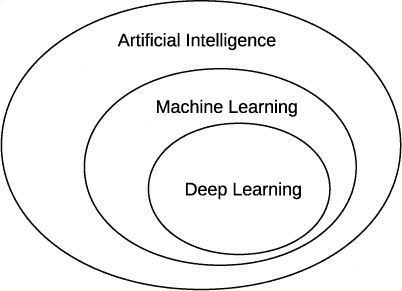
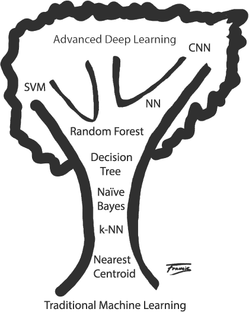

## 序言

当我上高中时，我想编写一个井字游戏程序，让用户与计算机对战。当时，我对计算机科学家如何解决这种问题一无所知。我只有自己的想法，那就是利用未经结构化的 Applesoft BASIC 中支持的简单 if-then 语句和 go to 语句来实现大量规则。这是很多规则——大约几百行。

最终，程序的运行效果还不错，直到我发现了一个我的规则没有涵盖的走法，并能够每次都获胜。我确信，必定有一种方法可以通过展示示例来教计算机做事情，而不是靠暴力编写代码和规则——一种让计算机自主学习的方法。

作为上世纪 80 年代后期的本科生，我很高兴能够报名参加一门人工智能课程。这门课程最终解答了我如何编写一个井字游戏程序的问题，但计算机并没有学习，它仍然只是在使用一个巧妙的算法。顺便提一下，同一门课程曾经向我们保证，虽然人们预计有一天计算机会战胜世界顶级的国际象棋棋手（这一点在 1997 年实现了），但计算机不可能在围棋这样的游戏中击败最强的人类棋手。然而，在 2016 年 3 月，AlphaGo 深度学习程序做到了这一点。

2003 年，在为一家科学计算公司担任顾问时，我被分配到一个与一家大型医疗设备制造商合作的项目中。目标是使用*机器学习*：一种从数据中自主学习的人工智能子领域，实时分类冠状动脉的血管内超声图像，开发出不是由人类显式编程的模型。这正是我一直在等待的！

我模糊地知道机器学习的存在，并且知道有一些叫做神经网络的奇怪生物能够做一些有趣的事情，但大多数时候，机器学习只是一个小范围的研究领域，并不是普通计算机科学工作者关注的重点。然而，在这个项目中，我爱上了通过训练机器来做一些有用的事情，而不是显式地编写大量代码的想法。即使项目结束后，我依然在自学。

大约在 2010 年，我参与了另一个机器学习项目，时机恰到好处。人们刚开始讨论一种叫做*深度学习*的机器学习新方法，它复兴了旧的神经网络。到了 2012 年，局面一发不可收拾。我很幸运能够出席 2012 年在苏格兰爱丁堡举办的 ICML 会议，并在现场亲眼见证了 Google 展示其初步突破性深度学习成果，该成果能够识别 YouTube 视频中的猫。会场人满为患。毕竟，当时会议有多达 800 人参加。

现在是 2020 年，我最近参加的机器学习会议有超过 13,000 名与会者。机器学习已经爆炸式发展：它不是一个会消失的潮流。机器学习已经深刻影响了我们的生活，并将继续影响。了解一些机器学习知识会很有益，能够从那些经常被夸大的展示中走出来，去接触到实质性的核心内容，这本身就足够有趣，不需要任何炒作。这也是本书存在的原因，帮助你学习机器学习的基本要领。具体来说，我们将重点关注被称为深度学习的方法。

### 本书适合谁阅读？

我写这本书是为那些没有机器学习背景，但对机器学习充满好奇并愿意尝试的人准备的。我尽量将数学内容保持在最低限度。我的目标是帮助你理解核心概念，并建立可以在未来使用的直觉。

与此同时，我不想写一本仅仅教你*如何*使用现有工具包的书，而是要让你理解背后的*为什么*。确实，如果你只关心*如何*，你可以构建有用的模型。但没有*为什么*，你只是在模仿，而不是理解，更不要说最终用自己的贡献推动领域的发展。

就我个人的假设而言，我假设你对计算机编程有所了解，无论是哪种语言。机器学习的首选语言，无论你是学生还是大公司，都是 Python，所以我们将使用这种语言。我还假设你熟悉高中数学，但不一定会微积分。虽然有一点微积分的内容会出现，但即使这些技巧对你来说不熟悉，你也应该能够理解这些思想。我还假设你知道一些统计学和基础概率学。如果你从高中以来忘记了这些知识，不用担心——你会在第一章中找到相关内容，帮助你提供足够的背景，跟上叙述。

### 你可以期待学到什么？

如果你完整地学习这本书，你可以期待学到以下内容：

+   如何构建一个良好的训练数据集。这个数据集将使你的模型在实际应用中取得成功。

+   如何使用两个领先的机器学习工具包：scikit-learn 和 Keras。

+   如何评估训练并测试后的模型性能。

+   如何使用几种经典的机器学习模型，如 *k*-最近邻、随机森林或支持向量机。

+   神经网络如何工作并进行训练。

+   如何使用卷积神经网络开发模型。

+   如何从一组给定的数据开始，并从零开发出一个成功的模型。

### 本书简介

本书是关于机器学习的。机器学习是通过构建模型来处理输入数据，并从数据中得出某些结论。这个结论可能是将对象归类到特定类别的标签，比如某种类型的狗，或者是一个连续的输出值，比如根据给定的设施条件，为一栋房子定价。关键在于，模型能够从数据中自主学习。实际上，模型通过示例学习。

你可以将模型看作是一个数学函数，*y* = *f* (*x*)，其中 *y* 是输出，类别标签或连续值，*x* 是代表未知输入的 *特征* 集合。特征是关于输入的测量或信息，模型可以利用这些特征来学习生成什么样的输出。例如，*x* 可能是一个向量，表示一条鱼的长度、宽度和重量，每个测量值都是一个特征。我们的目标是找到 *f*，即一个 *x* 和 *y* 之间的映射，我们可以在新的 *x* 实例上使用这个映射，而我们并不知道 *y*。

学习 *f* 的标准方式是给我们的模型（或算法）提供已知数据，并让模型学习它所需的参数，以使 *f* 成为一个有用的映射。这就是为什么它被称为*机器学习*：机器正在学习模型的参数。我们不是自己思考规则并将其固化在代码中。实际上，对于一些模型类型，如神经网络，甚至不清楚模型学到了*什么*，只知道模型现在的表现达到了一个有用的水平。

机器学习有三个主要分支：*监督学习*、*无监督学习*和*强化学习*。我们刚才描述的过程属于监督学习。我们通过一组已知的 *x* 和 *y* 值来监督模型的训练，这就是*训练集*。我们将这样的数据集称为*标注数据集*，因为我们知道每个 *x* 对应的 *y*。无监督学习试图仅使用 *x* 来学习模型所需的参数。我们在这里不会讨论无监督学习，但如果你想自己以后探索该领域，可以参考我们对监督学习的讨论。

强化学习训练模型执行任务，比如下棋或围棋。模型根据当前世界的状态学习一组动作。这是机器学习中的一个重要领域，最近它在一些曾被认为是人类专属的任务上取得了显著的成功。遗憾的是，为了使本书内容可管理，我们将完全忽略强化学习。

关于术语的一个简短说明。在媒体中，我们书中讨论的许多内容被称为*人工智能*或*AI*。虽然这并不错误，但它有些误导：机器学习是人工智能这一更广泛领域的一个子领域。另一个你经常听到的术语是*深度学习*。这个术语有些模糊，但在我们的讨论中，我们将它用来指代具有神经网络的机器学习，特别是具有多层的神经网络（因此称为*深度*）。图 1 展示了这些术语之间的关系。

*图 1：人工智能、机器学习和深度学习之间的关系*

当然，在机器学习和深度学习领域中，有相当多的变种。我们将在本书中遇到许多模型。我们可以将它们安排在我们所称的“机器学习树”中，如图 2 所示。

*图 2：机器学习树*

这棵树展示了从传统机器学习到现代深度学习的成长过程，根基是传统机器学习，顶端是现代深度学习。可以把它看作是对未来内容的预览：我们将在本书中讨论这些模型。

基于这个思路，我们将以每章的快速概述结束本引言部分。

**第一章：入门** 本章告诉你如何设置我们假定的工作环境。它还包括关于向量、矩阵、概率和统计的内容，你可以用来复习或作为背景知识。

**第二章：使用 Python** 本章将帮助你入门 Python。

**第三章：使用 NumPy** NumPy 是 Python 的一个扩展，它使得 Python 在机器学习中变得非常有用。如果你不熟悉它，可以浏览一下本章内容。

**第四章：数据处理** 不良的数据集会导致糟糕的模型；我们将教你如何区分好的数据集。

**第五章：构建数据集** 我们将构建本书中使用的所有数据集。你还将学习如何增强数据集。

**第六章：经典机器学习** 要理解你要去的地方，有时了解你来自哪里会有所帮助。这里我们将介绍一些原始的机器学习模型。

**第七章：经典模型实验** 本章展示了老派机器学习方法的优缺点。我们将在全书中将这些结果用于比较目的。

**第八章：神经网络简介** 现代深度学习完全围绕神经网络展开；我们将在这里介绍它们。

**第九章：神经网络训练** 本章内容具有挑战性，提供了理解神经网络如何训练所需的知识。一些基础的微积分知识被引入到本章，但别慌——这些内容以高层次的方式讨论，旨在帮助你获得直觉，而且符号表示并不像看起来那么可怕。

**第十章：神经网络实验** 在本章中，我们将进行实验，以建立直觉并感受如何实际操作数据。

**第十一章：评估模型** 要理解机器学习论文、演讲和讲座中呈现的结果，我们需要了解如何评估模型。本章将引导你完成这一过程。

**第十二章：卷积神经网络简介** 本书中我们将重点讨论的深度学习体现在卷积神经网络（CNN）的理念中。本章将讨论这些网络的基本构建模块。

**第十三章：使用 Keras 和 MNIST 的实验** 在这里，我们将通过使用 MNIST 数据集来探索 CNN 的工作原理，MNIST 是深度学习中的常用数据集。

**第十四章：使用 CIFAR-10 的实验** 尽管 MNIST 数据集对 CNN 来说是一个简单的任务，但在这里我们将探索另一个常用数据集 CIFAR-10，它包含真实图像，将挑战我们的模型。

**第十五章：案例研究：音频样本分类** 本章以一个案例研究作为结尾。我们从一个新的数据集开始，这个数据集并不广泛使用，然后一步步建立一个合适的模型。本章涵盖了本书中的所有学习内容，从数据构建和增强，到经典模型、传统神经网络、CNN 和模型集成。

**第十六章：深入探讨** 没有一本书能做到面面俱到，本书也不会尝试做到这一点。本章指出了我们忽略的一些内容，并帮助你筛选周围关于机器学习的大量资源，帮助你集中精力学习下一步该学的内容。

本书中的所有代码，按章节整理，可以在这里找到：*[`nostarch.com/practical-deep-learning-python/`](https://nostarch.com/practical-deep-learning-python/)*。接下来，让我们看看如何设置我们的操作环境。
