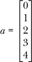
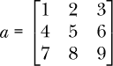
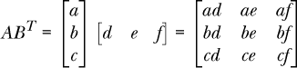
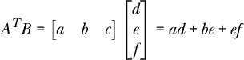
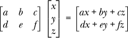
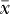
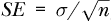
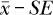
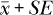
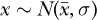

## 第一章：开始使用**


本章介绍了我们的操作环境，并详细说明了如何进行设置。它还包含了我们将遇到的一些数学基础知识。最后，我们简要介绍了图形处理单元（GPU），你可能听说过它们对深度学习至关重要。对于我们的用途来说，GPU 并不是必须的，所以不用担心——这本书不会突然让你花费很多钱。

### 操作环境

在本节中，我们将详细介绍我们将在本书其余部分假定的环境。我们假设的基本环境是使用 64 位 Linux 系统。具体的发行版并不关键，但为了简化演示，我们假设使用的是 Ubuntu 20.04。鉴于 Ubuntu 发行版背后有出色的支持，我们相信任何较新的发行版也会以类似的方式运行。Python 语言是我们的*通用语言*，是机器学习的共同语言。具体来说，我们将使用 Python 3.8.2，这是 Ubuntu 20.04 使用的版本。

让我们快速浏览一下我们将使用的 Python 工具包。

#### NumPy

*NumPy* 是一个 Python 库，它为 Python 增加了数组处理能力。虽然 Python 的列表可以用作一维数组，但在实际应用中，它们太慢且不够灵活。NumPy 库添加了 Python 中缺失的数组功能——这些功能对于许多科学应用来说是必需的。NumPy 是我们将使用的所有其他库的基础库。

#### scikit-learn

本书中我们将探讨的所有传统机器学习模型都可以在出色的`scikit-learn`库中找到，通常当它加载到 Python 中时，被称为*sklearn*。还需要注意的是，我们写的是*scikit-learn*而不是大写的，因为这是作者在其文档中一致使用的方式。这个库使用 NumPy 数组。它实现了许多不同机器学习模型的标准化接口，以及一整套我们没有时间涉及的其他功能。我强烈建议你在逐渐熟悉机器学习和其背后的工具时，查阅官方的 sklearn 文档（[`scikit-learn.org/stable/documentation.html`](https://scikit-learn.org/stable/documentation.html)）。

#### 带 TensorFlow 的 Keras

深度学习已经足够难以理解，更不用说高效且正确地实现了。因此，既然我们不打算从头开始编写卷积神经网络，我们将使用已经在积极开发中的流行工具包。从深度学习诞生之初，社区就支持工具包的开发，以便让深度网络更易于使用，并且这些工具包都是开源的，并且有非常慷慨的许可证。写这本书时，我们可以在 Python 中使用许多流行的工具包。以下是其中的一些：

+   Keras

+   PyTorch

+   Caffe

+   Caffe2

+   Apache MXnet

这些工具包中的一些正在兴起，而另一些似乎正在衰退。但是，目前可能拥有最多活跃用户的工具包是使用 TensorFlow 后端的 Keras，因此我们将在这里使用它。

*Keras* (*[`keras.io/`](https://keras.io/)* ) 是一个 Python 深度学习工具包，底层使用 TensorFlow 工具包 (*[`www.tensorflow.org/`](https://www.tensorflow.org/)* )。*TensorFlow* 是一个开源的 Google 产品，旨在为多种平台实现深度神经网络的核心功能。我们选择 Keras 不仅因为它流行且在积极开发中，还因为它易于使用。我们的目标是熟悉深度学习，直到能够实现模型并以最小的编程开销使用它们。

### 安装工具包

我们无法合理地为所有系统和硬件提供安装工具包的详尽指南。相反，我们将为我们将用作参考系统的特定操作系统提供逐步安装说明。这些步骤以及库的最低版本号应该足以帮助大多数读者搭建一个可用的系统。

请记住，我们假设我们在 Linux 环境下工作，特别是 Ubuntu 20.04。Ubuntu 是一个广泛使用的 Linux 发行版，几乎可以在任何现代计算机系统上运行。其他 Linux 发行版以及 macOS 也可以使用，但这里的说明是特定于 Ubuntu 的。大多数机器学习社区已经离开了 Windows 操作系统，尽管个人已将工具包移植到 Windows，因此，具有冒险精神的读者可以尝试在 Windows 上使用。

新安装的 Ubuntu 20.04 基础桌面系统免费提供 Python 3.8.2。为了安装其余的软件包，我们需要进入终端并按照下面给出的步骤顺序执行：

```py
$ sudo apt - get update

$ sudo apt - get install python3 - pip

$ sudo apt - get install build - essential python3 - dev

$ sudo apt - get install python3 - setuptools python3 - numpy

$ sudo apt - get install python3 - scipy libatlas - base - dev

$ sudo apt - get install python3 - matplotlib

$ pip3 install scikit - learn

$ pip3 install tensorflow

$ pip3 install pillow

$ pip3 install h5py

$ pip3 install keras
```

安装完成后，我们将安装以下版本的库和工具包：

```py
NumPy 1.17.4

sklearn 0.23.2

keras 2.4.3

tensorflow 2.2.0

pillow 7.0.0

h5py 2.10.0

matplotlib 3.1.2
```

`pillow` 库是一个图像处理库，`h5py` 是用于处理 HDF5 格式数据文件的库，`matplotlib` 用于绘图。*HDF5* 是一种通用的、层次化的文件格式，用于存储科学数据。Keras 使用它来存储模型参数。

以下两部分是对一些将在本书中出现的数学概念的简要介绍。

### 基本线性代数

我们将要学习向量和矩阵。涉及这些概念的数学属于*线性代数*（或矩阵理论）的范畴。正如你可以想象的那样，线性代数是一个复杂的领域。对于本书来说，我们需要知道的只是向量是什么，矩阵是什么，以及如何将两个向量、两个矩阵或向量与矩阵相乘。稍后我们将看到，这为我们实现特定的模型，特别是神经网络，提供了一种强大的方法。

让我们从向量开始。

#### 向量

*向量*是一个一维的数字列表。从数学角度来看，向量可能表现为

*a* = [0, 1, 2, 3, 4]

第三个元素是 *a*[2] = 2。注意我们遵循从零开始索引的编程惯例，所以 *a*[2] 给我们的是向量中的第三个元素。

上面的向量是水平书写的，因此它被称为*行向量*。然而，在数学表达式中，通常假设向量是垂直书写的：



当垂直书写时，向量称为*列向量*。这个向量有五个元素，被表示为一个五元素的列向量。在本书中，我们通常使用向量表示一个*样本*：我们将输入模型的一组特征。

从数学上讲，向量用于表示空间中的点。如果我们讨论的是二维（2D）笛卡尔平面，我们用一个由两个数字组成的向量（*x*，*y*）来定位一个点，其中 *x* 是沿 x 轴的距离，*y* 是沿 y 轴的距离。这个向量代表一个二维的点，尽管这个向量本身只有一维。如果我们有三维空间，我们需要一个包含三个元素的向量（*x*，*y*，*z*）。

在机器学习中，由于我们经常使用向量来表示模型的输入，我们将处理几十到上百维的向量。当然，我们不能将它们作为空间中的点来绘制，但是从数学角度来看，它们就是这样。正如我们将看到的那样，一些模型，比如 *k*-最近邻模型，会将特征向量视为——在高维空间中的点。

#### 矩阵

*矩阵*是一个二维的数字数组，我们通过行号和列号来索引特定的条目。例如，这是一个矩阵：



如果我们想引用 6，我们写作 *a*[1,2] = 6。再次说明，我们是从零开始索引的。因为这个矩阵 *a* 有三行三列，所以我们称它为一个 3 × 3 矩阵。

#### 向量和矩阵的乘法

最简单的理解两个向量相乘的方式是将它们对应的元素相乘。例如：

[1, 2, 3] × [4, 5, 6] = [4, 10, 18]

这是使用像 NumPy 这样的工具包进行数组乘法时最常见的方式，在接下来的章节中我们将大量使用这种方式。然而，在数学中，实际上很少这么做。

当数学上进行向量相乘时，我们需要知道它们是行向量还是列向量。我们将使用两个向量，*A* = (*a*,*b*,*c*) 和 *B* = (*d*,*e*,*f*)，根据数学惯例，它们被假定为列向量。加上上标 *T* 会将列向量转为行向量。*A* 和 *B* 的乘法在数学上允许的方式有：



这被称为*外积*，并且



这被称为*内积*，或*点积*。注意，外积会变成一个矩阵，而内积则变成一个单一的数字，即*标量*。

当我们将矩阵和向量相乘时，向量通常位于矩阵的右侧。如果矩阵的列数与向量的元素数匹配（假设向量是列向量），则可以进行乘法运算。结果也是一个向量，元素数量等于矩阵的行数（读取*ax* + *by* + *cz* 作为一个单独的元素）。

例如：



这里我们将一个 2 × 3 矩阵与一个 3 × 1 的列向量相乘，得到了一个 2 × 1 的输出向量。注意，矩阵的列数与向量的行数匹配。如果不匹配，则乘法运算是未定义的。此外，注意输出向量中的值是矩阵和向量乘积的和。这个规则同样适用于两个矩阵的乘法：


这里将一个 2 × 3 矩阵与一个 3 × 2 矩阵相乘，得到了一个 2 × 2 的结果。

当我们研究卷积神经网络时，我们将处理具有三维甚至四维的数组。一般来说，这些被称为*张量*。如果我们想象一堆大小相同的矩阵，我们得到的是一个三维张量，可以使用第一个索引来引用任何一个矩阵，剩下的两个索引来引用该矩阵中的特定元素。类似地，如果我们有一堆三维张量，我们就得到了四维张量，可以使用其第一个索引来引用任何一个三维张量。

本节的主要内容是：向量是单维的，矩阵是二维的，存在将这些对象相乘的规则，最终我们的工具包将处理四维张量。我们将在本书后面遇到这些内容时再做回顾。

### 统计学和概率学

统计学和概率学的主题非常广泛，以至于通常最好要么几乎什么都不说，要么写一本或两本书。因此，我将只提及我们在本书中会使用的关键概念，其他的内容你可以根据需要自行掌握。我假设你已经知道一些关于抛硬币和掷骰子的基本概率知识。

#### 描述性统计

当我们进行实验时，我们需要以某种有意义的方式报告结果。通常，对于我们来说，我们会报告结果为均值（算术平均值）加减一个称为*均值标准误差（SE）*的量。我们通过一个例子来定义均值标准误差。

如果我们有很多测量值*x*，比如说一朵花的一部分的长度，那么我们可以通过将所有值相加并除以我们相加的值的个数来计算均值 ()。然后，一旦得到均值，我们可以通过将每个值与均值相减、将结果平方，并将这些平方值加总起来，再除以我们加总的值的个数减去一，来计算各个值围绕均值的平均分布。这一数值就是*方差*。如果我们取这个值的平方根，就能得到*标准差*（*σ*），我们将在下面再次看到它。通过标准差，我们可以计算均值的标准误差，公式为，其中*n*是我们用来计算均值的值的数量。标准误差越小，表示值越紧密地聚集在均值周围。我们可以把这个值解释为我们对于均值的 uncertainty（不确定性）。这意味着我们预计实际均值（我们并不知道的）会介于和之间。

有时候，我们会讨论中位数而不是均值。*中位数*是中间的值，它将一半的样本值分布在它的下方，另一半分布在它的上方。为了找到一组值的中位数，我们首先按数值对这些值进行排序，然后找出中间的值。如果样本数是奇数，那么这个值就是精确的中间值；如果样本数是偶数，那么中位数是两个中间值的平均值。如果样本在均值周围没有良好、均匀的分布，那么中位数有时比均值更有用。经典的例子是收入。少数非常富有的人会把均收入推高到一个没有多大意义的水平。相反，中位数——即一半人收入低于它，一半人收入高于它——更具代表性。

在后面的章节中，我们将讨论*描述性统计*。这些是从数据集中派生出的值，可以用来理解数据集。我们刚刚提到过其中的三个：均值、中位数和标准差。我们将学习如何使用这些值，并如何将它们绘制出来，帮助我们理解数据集。

#### 概率分布

在本书中，我们将讨论一种被称为*概率分布*的概念。你可以把它看作是一种预言者——一种当被询问时，会给我们一个数字或一组数字的东西。例如，当我们训练一个模型时，我们使用的是我们测量的数字或数字集合；我们可以把这些数字看作是来自一个概率分布。我们将把这种分布称为*母体分布*。把它看作是生成我们输入模型的数据的东西；另一种更具柏拉图式的思维方式是，它是我们数据所逼近的理想数据集。

概率分布有许多不同的形式；其中一些甚至有专门的名称。我们将遇到的两种分布是最常见的两种：均匀分布和正态分布。你已经接触过均匀分布：这就是我们掷骰子时得到的结果。如果骰子有六个面，我们知道得到 1 到 6 中的任何一个数的概率是相同的。如果我们掷 100 次骰子并统计每个数字出现的次数，我们知道每个数字的统计结果大致相同，并且从长远来看，我们可以轻松地证明这些数字最终会趋于平衡。

*均匀分布*是一个神谕，给出的每个响应的可能性是相等的。从数学上讲，我们将均匀分布写作*U*(*a*,*b*)，其中*U*表示均匀分布，*a*和*b*是它用来限定响应范围的值。除非我们特别说明分布只给出整数，否则任何实数都可以作为响应。在符号上，我们写作*x* ~ *U*(0,1)，意味着*x*是由神谕返回的一个值，范围在(0,1)之间，且每个值的出现概率相等。同时，请注意，使用“("和“)”来括起一个范围时，会排除相应的边界，而使用“["和“]”则会包括边界。因此，*U*0,1)返回从 0 到 1 的值，包含 0 但不包含 1。

*正态分布*，也叫做*高斯*分布，形状上是一个钟形曲线——在这种形状中，一个值最为可能，随着与最可能值的距离增大，其他值的可能性逐渐减小。最可能的值是均值，，表示*x*是从一个均值为且标准差为*σ*的正态分布中抽取的。

#### 统计检验

另一个偶尔出现的主题是*统计检验*的概念，这是用来判断某个假设是否可能为真的一种测量方法。通常，假设与两组测量相关，假设是这两组测量来自同一个母体分布。如果通过检验计算得到的统计量超出了某个范围，我们就会拒绝该假设，并宣称我们有证据表明这两组测量数据*不是*来自同一个母体分布。

在这里，我们通常使用* t 检验*，这是一种常见的统计检验，假设我们的数据服从正态分布。由于我们假设数据服从正态分布，虽然这可能为真也可能不为真，因此 t 检验被称为*参数检验*。

有时，我们会使用另一种检验——*Mann–Whitney U 检验*，它类似于 t 检验，帮助我们判断两个样本是否来自相同的母体分布，但它不对样本数据值的分布做任何假设。像这样的检验被称为*非参数检验*。

无论测试是参数化的还是非参数化的，最终从测试中得到的值称为*p 值*。它表示如果假设样本来自相同的母体分布为真，我们计算出的检验统计量值出现的概率。如果*p 值*较低，那么我们有证据表明该假设不成立。

通常的*p 值*临界值是 0.05，表示即使样本来自相同的母体分布，我们测量到该检验统计量值（t 检验或 Mann–Whitney U 检验）的概率为 20 分之一。然而，近年来，已经明确这个临界值过于宽松。当*p 值*接近 0.05，但没有超过时，我们开始认为有一定证据反对假设。如果*p 值*是 0.001 甚至更低，那么我们有强有力的证据表明样本来自不同的母体分布。在这种情况下，我们称这种差异为*统计显著*。

### 图形处理单元

现代深度学习的一个重要推动技术是强大的*图形处理单元（GPU）*的发展。GPU 是实现于显卡上的协处理器。最初为视频游戏设计，GPU 的高度并行特性已被应用于深度神经网络模型的极端计算需求。近年来的许多进展若没有 GPU 为即使是基础台式计算机提供的超级计算机般的能力，是不可能实现的。NVIDIA 是深度学习 GPU 创作的领导者，通过其计算统一设备架构（CUDA），NVIDIA 在深度学习成功中发挥了基础性作用。毫不夸张地说，如果没有 GPU，深度学习可能就不会发生，或者至少不会被如此广泛应用。

话虽如此，我们并不期望在本书中使用的模型需要 GPU。我们将使用足够小的数据集和模型，以便仅使用 CPU 在合理的时间内进行训练。我们在已安装的包中已经强制执行了这一决定，因为我们安装的 TensorFlow 版本是仅支持 CPU 的版本。

如果你有一块支持 CUDA 的 GPU，并且想在本书的深度学习部分使用它，当然可以，但不要认为你需要购买一块 GPU 来运行示例。如果使用 GPU，确保在安装前述包时已经正确安装 CUDA，并且安装支持 GPU 的 TensorFlow 版本。sklearn 工具包仅支持 CPU。

### 总结

在本章中，我们总结了我们的操作环境。接下来，我们描述了本书中将使用的基本 Python 工具包，并假设使用 Ubuntu 20.04 Linux 发行版，给出了详细的安装说明。如前所述，这些工具包在许多其他 Linux 发行版以及 macOS 上也能顺利运行。然后，我们简要回顾了稍后会遇到的一些数学内容，并以解释为什么我们的模型不需要 GPU 作为结尾。

在下一章，我们将回顾 Python 的基础知识。
