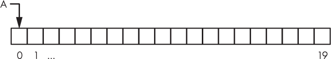
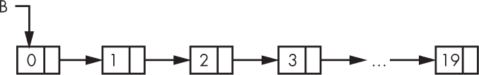
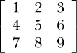

## 第三章：使用 NUMPY**


NumPy 是本书中所有机器学习内容的基础。如果你已经熟悉 NumPy，可以跳过这一章。如果你不熟悉，不用害羞；把这一章当作复习，尽情深入学习吧。

NumPy 的完整教程超出了我们本书的范围，因此，如果你有兴趣，可以进一步查看 *[`docs.scipy.org/doc/numpy/user/quickstart.html`](https://docs.scipy.org/doc/numpy/user/quickstart.html)*。

### 为什么选择 NumPy？

Python 是一种优雅的编程语言，但它缺少一个在科学和数学编程中至关重要的数据结构：数组。是的，你可以使用字典作为数组，或者使用一个相当大的预定义列表，但这会滥用这些数据结构——而且，从实际角度来看，这会非常慢。我们来看看数组和列表在实现上的区别。Python 列表比我们在这里使用的列表概念更为先进，但从本质上讲，它们是相同的。

#### 数组与列表

*数组*只是一个固定大小的*连续*内存块，一块没有间隙的 RAM，用于表示一组 *n* 个元素，每个元素使用 *m* 字节。例如，IEEE 754 双精度浮点数占用 64 位内存，即 8 字节，这是 Python 在底层为其 `float` 数据类型使用的方式。因此，*n* = 100 的 Python 浮点数组至少会占用 *nm* = 100(8) = 800 字节内存。如果 Python 有数组作为数据结构，它将分配 800 字节内存，并将数组变量名 `A` 指向该内存，正如 图 3-1 所示。



*图 3-1：存储在连续内存中的数组*

每当我们想访问数组中的一个元素，比如 `x[3]`，我们可以通过将 3(8) = 24 加到数组基址的内存地址来非常快速地计算出该元素在内存中的确切位置。这就是数组的索引操作。

多维数组也存储在内存中作为连续的块，索引操作仅稍微复杂一些。*多维数组*使用两个或更多的数字来索引元素。想象一个棋盘；确定棋子位置需要两个数字：行号和列号。因此，棋盘是一个二维数组。如果我们增加一个维度，将棋盘变成一堆棋盘，我们就需要三个数字来定位棋子：行号、列号和棋盘号。因此，我们有了一个三维数组。

在本书中，我们将使用一维、二维和三维数组。所有这些都存储在内存中作为一个单一的 RAM 块。关键是，数组的索引速度很快，因此对数组元素的操作可以非常迅速地执行。

将其与列表进行对比。图 3-2 展示了列表 `B` 在内存中的基本结构。在这种情况下，列表中的元素并不是连续存储在内存中的，而是分散在 RAM 中，通过指针将一个元素与下一个元素连接，像链条一样。链条中的每个链接包含我们要存储的数据值和指向下一个链接内存的指针。



*图 3-2：作为一系列链式节点存储在内存中的列表*

我们无法通过简单地对基本内存地址添加偏移量来索引一个列表。相反，如果我们想要列表中的第四个元素，我们需要从列表的头开始，使用那里指向下一个元素的链接，再使用下一个链接，以此类推，直到到达与第四个元素相关的内存，即图 3-2 中的 `3`。这种方式还算可以接受，直到我们要索引第 1,000,000 个元素，而不得不重复这个过程一百万次，而不是一次性将 8 百万加到基本地址上。

大多数机器学习都涉及数组。如果数组是单维的，我们称之为 *向量*；向量是我们模型的输入之一。如果数组是二维的，则它是 *矩阵*。矩阵可以被看作是棋盘或图像，其中图像的每个像素都是棋盘上的一个位置。矩阵也可以作为模型的输入，或在模型内部使用；例如，神经网络的权重矩阵，或卷积神经网络的卷积核和过滤器输出都是矩阵。

因此，能够快速操作数组数据至关重要。这就是 `numpy` 库发挥作用的地方。它为 Python 添加了缺失的数组数据类型，让我们能够快速执行计算。坦率地说，没有它，Python 只适合实现最简单的机器学习算法。然而，有了 NumPy，Python 立刻成为了机器学习研究的首选环境。

#### 数组与列表的速度测试

让我们快速看一下 NumPy 比纯 Python 提供的速度优势。我们将执行的代码在列表 3-1 中。

❶ import numpy as np

import time

import random

n = 1000000

a = [random.random() for i in range(n)]

b = [random.random() for i in range(n)]

s = time.time()

❷ c = [a[i]*b[i] for i in range(n)]

print("列表推导:", time.time()-s)

s = time.time()

c = []

❸ for i in range(n):

c.append(a[i]*b[i])

print("for 循环:", time.time()-s)

s = time.time()

❹ c = [0]*n

for i in range(n):

c[i] = a[i]*b[i]

print("现有列表:", time.time()-s)

❺ x = np.array(a)

y = np.array(b)

s = time.time()

c = x*y

print("NumPy 时间", time.time()-s)

*列表 3-1：将 NumPy 与纯 Python 进行比较。请参阅 `numpy_speed_test.py`。*

在 清单 3-1 中，我们首先导入 `numpy` 库❶，然后使用列表推导式创建两个包含 1,000,000 个元素的随机数列表。我们的目标是尽可能快地将这两个列表逐个元素相乘。

我们可以通过在 `s` 中记录程序开始时间，并在打印时从结束时间中减去它，来衡量程序运行所需的时间。`time` 模块的 `time` 函数返回自设定起始时间（1970 年 1 月 1 日）以来的秒数，包括秒的分数部分。我们在每次运行的操作后打印 `time.time()-s`。

在我们第一次尝试将 `a` 和 `b` 相乘时，我们使用了列表推导式❷。接下来，我们使用一个循环❸来选择 `a` 和 `b` 中的每个元素，并将它们的乘积追加到列表 `c` 中。注意，这种方法从一个空列表开始，并将每个新的乘积添加到其中，因此列表需要在内存中不断增长。

作为第三种方法，我们预分配输出列表，这样我们就不再将每个输出追加到 `c` 中，而是更新 `c` 中相应的元素❹。这种方法可能会稍微快一点——我们来看看。

最后，我们使用 NumPy 进行计算❺。我们排除了将两个列表转换为 NumPy 数组所需的时间（第 25–26 行），因为我们本可以通过调用 NumPy 随机数模块轻松创建这些随机数组（向量，因为它们是 1D）。使用 NumPy 向量的整个操作是 `c = x*y`。请注意，这里没有显式的循环。NumPy 是一个数组处理库，它会自动遍历数组中的所有元素。

如果我们运行 清单 3-1 中的代码十次，以获得每四种方法的平均运行时间，我们会发现以下结果：

| ***方法*** | ***运行时间（秒，平均值* ± *标准误差）*** |
| --- | --- |
| 列表推导式 | 0.158855 ± 0.000426 |
| `for` 循环 | 0.226371 ± 0.000823 |
| `for` 循环与现有列表 | 0.201825 ± 0.000409 |
| NumPy | 0.009253 ± 0.000027 |

这张表显示，NumPy 的平均速度比纯 Python 的初级实现快了接近 25 倍。这就是为什么我们想在 Python 中使用 NumPy 进行机器学习的原因！这里，*SE* 指的是 *均值的标准误差*，它是标准差除以均值中数据个数的平方根，这里是 10。*标准差* 是衡量数值与均值之间差异的指标。标准差较大意味着数值分布在较广泛的范围内。这些标准差很小，意味着每次运行的时间都比较一致。

清单 3-1 向我们展示了 NumPy 的真正强大之处。操作会立即跨兼容维度进行广播，而无需显式的循环。向量和矩阵上的常规线性代数操作也可以执行，但通常情况下，NumPy 数组的操作是自动按元素执行的，无需循环。

现在你已经了解了我们为什么使用 NumPy，让我们来看一下它的一些特性。

### 基本数组

NumPy 完全围绕数组展开，因此我们从这里开始。让我们直接通过一些基本示例来进行探讨，然后解释它们的功能以及它们为何呈现出这样的形式。

#### 使用 np.array 定义数组

让我们从一些基本的数组创建开始：

```py
>>> import numpy as np

>>> a = np.array([1,2,3,4])

>>> a

    array([1, 2, 3, 4])

>>> a.size

    4

>>> a.shape

    (4,)

>>> a.dtype

    dtype('int64')
```

在这里，我们使用 `array` 函数定义了一个数组 `a`。`array` 函数的参数需要是 NumPy 可以转换成数组的对象。列表是 NumPy 可以转换成数组的对象，元组也是如此，因此这些通常是 `array` 函数的参数。

如果我们请求 Python 显示 `a` 中的内容，它会告诉我们这是一个数组，并显示其值。NumPy 会显示数组的内容，但如果数组包含很多元素，它只会显示前几个和最后几个元素。

接下来我们询问 NumPy 数组的三个最常见属性：大小、形状和数据类型（`dtype`）。数组 `a` 包含四个元素，因此其大小为 4。数组的大小是指它包含的元素个数。数组 `a` 是一个向量，这意味着它只有一维，因此它的形状以元组形式返回，始终如此，其中第一个也是唯一的维度为 4，意味着第一维上有四个元素。

数据类型是新的，因为 Python 通常不关心数据类型。但为了内存效率，`numpy` 库必须关心这些数据类型。当我们使用 `array` 创建 `a` 时，我们没有指定数据类型，因此 NumPy 默认使用 64 位整数，因为我们传给 `array` 的列表中的所有值都是整数。如果其中有一个是浮点数，NumPy 会改为默认使用 64 位浮点数，这与 C、C++ 和 Java 等语言中的 `double` 类型相同。

现在让我们明确指定 NumPy 数组应包含的数据类型：

```py
>>> b = np.array([1,2,3,4], dtype="uint8")

>>> b.dtype

    dtype('uint8')

>>> c = np.array([1,2,3,4], dtype="float64")

>>> c.dtype

    dtype('float64')
```

在这里我们定义了两个数组 `b` 和 `c`。两个数组都包含来自列表 `[1,2,3,4]` 的相同元素。然而，注意 `dtype` 关键字参数传递给了 `array`。这告诉 NumPy 使用某种数据类型来创建数组。对于 `b`，我们告诉 NumPy 使用无符号 8 位整数（`uint8`）。这相当于一个字节或单个 ASCII 字符。如果我们请求 `dtype` 属性，NumPy 会告诉我们数组 `b` 的确是无符号 8 位整数类型。

数组 `c` 包含与 `b` 相同的元素，但在这里我们告诉 NumPy 创建一个包含 64 位浮点数的数组。再次询问数据类型会告诉我们数组 `c` 的类型就是我们要求的类型。在使用 NumPy 时，我们必须注意数组所包含的数据类型。

最常用的 NumPy 数据类型及其 C 语言等效类型列在 表 3-1 中。在定义数组时，请通过数据类型名称的字符串来指定 NumPy 数据类型。接下来我们将看到这些示例。

**表 3-1：** NumPy 数据类型名称、C 语言等效类型及范围

| **NumPy 名称** | **C 等效类型** | **范围** |
| --- | --- | --- |
| float64 | 双精度浮点数 | ± [2.225 × 10^(–308), 1.798 × 10³⁰⁸] |
| float32 | 浮点数 | ± [1.175 × 10^(–38), 3.403 × 10³⁸] |
| int64 | 长长整型 | [–2⁶³, 2⁶³–1] |
| uint64 | 无符号长长整型 | [0, 2⁶⁴–1] |
| int32 | 长整型 | [–2³¹, 2³¹–1] |
| uint32 | 无符号长整型 | [0, 2³²–1] |
| uint8 | 无符号字符 | [0, 255 = 2⁸–1] |

到目前为止，我们只用 NumPy 创建了向量。现在我们来看一下如何创建一个矩阵，即一个二维数组：

```py
>>> d = np.array([[1,2,3],[4,5,6],[7,8,9]])

>>> d.shape

    (3, 3)

>>> d.size

    9

>>> d

    array([[1, 2, 3],

           [4, 5, 6],

           [7, 8, 9]])
```

我们像之前一样使用`array`函数，但这次我们传递的是一个列表的列表。提供的列表中的每个元素本身是一个包含三个元素的列表，并且有三个这样的列表。因此，生成的 NumPy 数组将是一个 3×3 的矩阵。矩阵的第一行是第一个包含三个元素的列表（`[1,2,3]`），第二行是第二个列表（`[4,5,6]`），第三行是第三个列表（`[7,8,9]`）。

如果我们查询`d`的形状，会得到`(3, 3)`。这个元组表示数组有两个维度，因为元组中有两个元素，且第一个维度的长度为 3（即三行），第二个维度的长度也为 3（三列）。查询`d`的大小会告诉我们它包含九个元素。NumPy 数组的大小等于`shape`返回的元组中所有值的乘积，这里是 3 × 3 = 9。

查询数组本身会导致 NumPy 输出它。由于数组很小，NumPy 将整个数组显示为一个二维矩阵：



NumPy 不仅限于二维数组。例如，这里有一个三维数组：

```py
>>> d = np.array([[[1,11,111],[2,22,222]],

                 [[3,33,333],[4,44,444]]])

>>> d.shape

    (2, 2, 3)

>>> d

    array([[[  1,  11, 111],

            [  2,  22, 222]],

           [[  3,  33, 333],

            [  4,  44, 444]]])
```

我们知道`d`是三维的，因为`shape`返回了一个包含三个元素的元组。我们也知道`d`是三维的，因为我们传递给`array`的列表包含两个子列表，每个子列表包含两个子列表，每个子列表有三个元素，因此形状为`(2, 2, 3)`。NumPy 使用一个空行来显示`d`，将两个 2×2 的子数组分开。我们可以将三维数组看作是一个向量，其中向量的每个元素都是一个矩阵。我们将使用三维的 NumPy 数组来存储图像集合。在这个例子中，`d`可以被看作是包含两张图片的数组，每张图片是由两行三列组成的。

#### 用 0 和 1 定义数组

如果我们想要一个大数组，通过`array`函数定义 NumPy 数组会非常繁琐，因为我们需要提供数组的所有元素。幸运的是，NumPy 并不会那么苛刻。现在我们来看两个在本书中将经常使用的 NumPy 常用函数，第一个函数构建一个所有元素都初始化为 0 的数组：

```py
>>> x = np.zeros((2,3,4))

>>> x.shape

    (2, 3, 4)

>>> x.dtype

    dtype('float64')

>>> b = np.zeros((10,10),dtype="uint32")

>>> b.shape

    (10, 10)

>>> b.dtype

    dtype('uint32')
```

`zeros` 函数返回一个新数组，每个元素都初始化为 0。示例中定义了 `x` 为一个三维数组，因为传递给 `zeros` 的参数是新数组的形状——在这个例子中是元组 `(2,3,4)`。这个数组可以被看作是一对小图片，每张图片是 3×4 像素。注意，使用 `zeros` 创建的数组的默认类型是 64 位浮动数（`dtype`）。这意味着数组的每个元素在内存中使用 8 字节。

数组 `b` 有两个维度，包含 10×10 个元素，我们已经明确声明它是 32 位无符号整数。这意味着每个元素只使用 4 字节的内存。在使用 NumPy 时，我们需要注意数组可能使用的内存量，以避免分配过于庞大或使用大数据类型（如 `float64`）浪费内存的数组。

我们的第二个常用函数与 `zeros` 类似，但它会初始化每个元素为 1：

```py
>>> y = np.ones((3,3))

>>> y

    array([[1., 1., 1.],

           [1., 1., 1.],

           [1., 1., 1.]])

>>> y = 10*np.ones((3,3))

>>> y

    array([[10., 10., 10.],

           [10., 10., 10.],

           [10., 10., 10.]])

>>> y.dtype

    dtype('float64')

>>> y.astype("uint8")

    array([[10, 10, 10],

           [10, 10, 10],

           [10, 10, 10]], dtype=uint8)
```

就像 `zeros` 一样，`ones` 接受一个元组，指定数组每个维度的元素数量，这里是一个 3×3 的矩阵。我们还可以选择性地指定一个 `dtype`，使数组保存除 64 位浮动数以外的其他数据类型。

`ones` 的真正用途是创建初始化为任何值的数组。我们通过将 `ones` 数组乘以我们想要的值来做到这一点，这里是 10。注意，NumPy 会自动识别我们在与标量值相乘，并对数组中的每个元素执行操作——不需要循环。

我们引入了一个新的方法，`astype` 方法。这个方法返回数组的副本，并将每个元素转换为指定的数据类型。注意，将数据类型转换为无法容纳原始值的类型，例如将 64 位浮动数转换为无符号字节，将导致数据丢失。NumPy 会尽力处理，但这是使用 NumPy 时需要注意的事项。

最后，在 Python 中，列表或字典对象是通过引用传递的，因此将其赋值给一个新变量并不会创建副本；它仅仅是创建一个指向原始内存的别名。这节省了时间和空间，但如果我们不小心，可能会导致意想不到的后果。NumPy 数组也有同样的特点。它们可能非常大，因此每次将它们传递给函数时，复制它们是没有意义的。如果你想真正创建一个 NumPy 数组的副本，可以使用 `copy` 方法或表示数组所有元素的数组切片。与 Python 列表不同，NumPy 数组是平坦的：数组中特定位置的值不能是另一个数组。

因此，以下所有语句，除了第二个，都将创建数组 `a` 的副本：

```py
>>> a = np.arange(10)

>>> b = a

>>> c = a.copy()

>>> d = a[:]
```

修改 `a` 的元素会改变 `b` 对应的元素，因为 `b` 指向与 `a` 相同的内存，但 `c` 和 `d` 的元素将不受影响。

### 访问数组中的元素

在本节中，我们将探讨两种不同的访问数组元素的方法。

#### 索引数组

如果我们不能引用数组中的元素并在必要时更新它们，那么数组就没有多大用处。这就是*数组索引*。理解数组索引对于充分利用 NumPy 至关重要。让我们通过一些示例来深入了解：

```py
  >>> b = np.zeros((3,4),dtype='uint8')

  >>> b

      array([[0, 0, 0, 0],

             [0, 0, 0, 0],

             [0, 0, 0, 0]], dtype=uint8)

❶ >>> b[0,1] = 1

  >>> b[1,0] = 2

  >>> b

      array([[0, 1, 0, 0],

             [2, 0, 0, 0],

             [0, 0, 0, 0]], dtype=uint8)
```

我们以与索引列表相同的方式索引数组，使用方括号：`[`表示索引的开始，`]`表示索引的结束。在方括号之间是一个表达式，告诉 NumPy 返回或赋值数组中的哪些元素——这就是*下标*。下标附加在数组名称后面，用来指定一个或多个数组元素。

在上面的示例中，`b`是一个三行四列的矩阵，每个元素都被初始化为 0。当我们计算`b`时，可以看到这一点。

接下来，我们做一些新尝试：我们设置了一个赋值语句 ❶，其中语句的左侧不是单一的变量名，而是带有下标的变量名`[0,1]`。这个下标告诉 NumPy，语句右侧的值，这里是 1，应该被放入`b`中第 0 行第 1 列的元素中。同样，NumPy 应该将 2 放入第 1 行第 0 列的元素中。当我们查看`b`时，我们看到 NumPy 按照我们的要求执行了操作，结果是第 0 行的第二列现在是 1，第 1 行的第一列现在是 2。

如果我们继续使用之前定义的`b`，我们可以看到如何从数组中请求元素：

```py
>>> b[1,0]

    2

>>> b[1]

    array([2, 0, 0, 0], dtype=uint8)

>>> b[1][0]

    2
```

由于`b`是一个矩阵，我们需要使用下标来选择其中的特定元素，一个用于行，另一个用于列。因此，`b[1,0]`应该返回第二行第一列的值，正如我们所看到的那样。

下一行使用了单个下标`b[1]`，并返回了`b`的整个第二行。这是一个非常有用的功能，我们将在本书的代码中看到这一点。

最后，如果`b[1]`返回整个矩阵`b`的第二行，那么我们可以使用`b[1][0]`来请求该行的第一个元素。我们看到它与我们最初使用的`b[1,0]`语法的结果一致。

#### 数组切片

使用单个索引访问数组的单个元素或整个子数组是有用的，但 NumPy 远比这更加灵活。我们可以通过使用*切片*来指定数组的部分内容，切片会像用刀一样从更大的数组中切出子数组。让我们看看它是如何工作的：

```py
>>> a = np.arange(10)

>>> a

    array([0, 1, 2, 3, 4, 5, 6, 7, 8, 9])

>>> a[1:4]

    array([1, 2, 3])

>>> a[3:7]

    array([3, 4, 5, 6])
```

在这里我们使用`arange`，它是 NumPy 的 Python `range`函数的类比，将`a`设置为数字[0,9]的向量。然后，我们请求这个向量的一部分，`a[1:4]`，结果返回了`[1, 2, 3]`。切片是用两个值指定的：第一个是起始索引 1，第二个是结束索引 4。

等等——如果结束索引是 4，那么切片不是应该返回 `[1, 2, 3, 4]` 吗？NumPy 遵循 Python 列表的惯例，所以结束索引从不包含在返回的子数组中。我们可以理解切片为请求从索引 1 开始，直到 *但不包括* 索引 4 的所有元素。在数学上，`a[x:y]` 这样的切片表示所有满足 *x* ≤ *i* < *y* 的元素 *i*。因此，第二个例子 `a[3:7]` 现在是可以理解的，因为它请求从索引 3 开始，到 *但不包括* 索引 7 的所有元素。

这些切片选取了给定范围内的所有元素。NumPy 还允许使用一个可选的第三个切片参数来指定步长。如果没有给出，步长默认为 1。因此，如果 `a` 作为一个包含数字的向量，如之前所示，我们得到如下结果：

```py
>>> a[0:8:2]

    array([0, 2, 4, 6])

>>> a[3:7:2]

    array([3, 5])
```

第一个切片从数组的开始位置（索引 0）开始，直到索引 8（但不包括索引 8），返回每隔一个元素。第二个例子做的是相同的操作，只是从索引 3 开始。

完整切片语法的任何部分 `[x:y:z]` 都可以省略，但至少必须保留一个冒号。如果省略某部分，默认值将是第一个索引（对于 `x`），最后一个索引（对于 `y`），以及步长 1（对于 `z`）。例如：

```py
>>> a[:6]

    array([0, 1, 2, 3, 4, 5])

>>> a[6:]

    array([6, 7, 8, 9])
```

在第一个例子中，起始索引被省略，所以默认值是 0，返回 `a` 的前六个元素。在第二个例子中，结束索引被省略，所以默认值是最后一个索引，意味着“返回从索引 6 到结尾的所有元素。”在这两个例子中，步长省略了，默认值为 1。

数组切片提供了一些便捷的快捷方式。这里给出两个例子：

```py
>>> a[-1]

    9

>>> a[::-1]

    array([9, 8, 7, 6, 5, 4, 3, 2, 1, 0])
```

第一个例子向我们展示了，像 Python 列表一样，NumPy 数组可以通过负数索引从轴的末尾开始计数。因此，索引 -1 总是返回最后一个元素。

第二个例子一开始有点神秘。我们知道 `a` 是一个包含数字 0 到 9 的向量。这个例子返回了该向量的逆序。怎么做到的呢？我们来解析一下 `::-1` 的含义。我们说过，数组切片的任何部分都可以省略，如果省略了，默认值将是第一个索引、最后一个索引或步长。在这种情况下，第一个索引被省略，所以它默认是 0。需要的冒号（`:`）存在，然后最后一个索引被省略，所以它默认是最后一个索引。接着是步长的冒号，步长给定为 -1，用于从结束索引倒数到起始索引。这就是如何反转数组元素的方式。

自然地，数组切片也适用于任何维度的 NumPy 数组。让我们看一下对二维矩阵进行切片的例子：

```py
>>> b = np.arange(20).reshape((4,5))

>>> b

    array([[ 0,  1,  2,  3,  4],

           [ 5,  6,  7,  8,  9],

           [10, 11, 12, 13, 14],

           [15, 16, 17, 18, 19]])

>>> b[1:3,:]

    array([[ 5,  6,  7,  8,  9],

           [10, 11, 12, 13, 14]])

>>> b[2:,2:]

    array([[12, 13, 14],

           [17, 18, 19]])
```

我们将`b`定义为一个包含[0,19]的向量，通过`arange`生成，然后立即使用`reshape`将该向量转变为一个具有四行五列的矩阵。`reshape`的参数是一个元组，指定了数组的新形状。数组中的元素数量必须与新形状一致。向量有 20 个元素，新的形状是 4 × 5 = 20 个元素，因此在这种情况下是可以的。

数组切片按维度应用，因此第二个例子`b[1:3,:]`请求的是第 1 和第 2 行以及这些行中的所有列。这就是单独使用`:`的意思——该轴上所有的元素。

下一个示例请求从第 2 行、第 2 列开始的所有行和列。这是从完整矩阵`b`的右下角提取的子矩阵。

#### 省略号

NumPy 支持一种有时很有用的切片简写符号。我们先展示它，然后讨论它的作用。不过，首先我们需要定义一些数组来操作：

```py
>>> c = np.arange(27).reshape((3,3,3))

>>> c

    array([[[ 0,  1,  2],

            [ 3,  4,  5],

            [ 6,  7,  8]],

           [[ 9, 10, 11],

            [12, 13, 14],

            [15, 16, 17]],

           [[18, 19, 20],

            [21, 22, 23],

            [24, 25, 26]]])

>>> a = np.ones((3,3))

>>> a

    array([[1., 1., 1.],

           [1., 1., 1.],

           [1., 1., 1.]])
```

首先我们定义`c`为一个三维数组，每个维度上有三个元素。我们使用之前的`reshape`技巧，知道它会起作用，因为 3 × 3 × 3 = 27，而通过`arange`生成的初始向量有 27 个元素。我们可以将`c`看作是三个 3×3 的图像堆叠在一起。接下来，我们使用`ones`定义一个简单的 3×3 矩阵，所有值都设置为 1。

从我们目前对数组切片的讨论中，我们知道通过使用冒号符号，可以替换`c`中的任何特定“图像”的 3×3 子数组。例如，我们来用`a`替换`c`中的第二个“图像”：

```py
>>> c[1,:,:] = a

>>> c

array([[[ 0,  1,  2],

        [ 3,  4,  5],

        [ 6,  7,  8]],

       [[ 1,  1,  1],

        [ 1,  1,  1],

        [ 1,  1,  1]],

       [[18, 19, 20],

        [21, 22, 23],

        [24, 25, 26]]])
```

在这里，我们告诉 NumPy 将第二个子数组（一个 3×3 的数组）替换为`a`中的 3×3 数组。之所以是第二个子数组，是因为第一个索引为 1。当我们打印`c`时，会看到第二个 3×3 子数组现在全是 1。

现在来看简写符号。这次，我们希望用`a`替换`c`的第一个 3×3 子数组。我们本可以使用`c[0,:,:]`这样的语法，但我们将使用简写符号：

```py
>>> c[0,...] = a

>>> c

    array([[[ 1,  1,  1],

            [ 1,  1,  1],

            [ 1,  1,  1]],

           [[ 1,  1,  1],

            [ 1,  1,  1],

            [ 1,  1,  1]],

           [[18, 19, 20],

            [21, 22, 23],

            [24, 25, 26]]])
```

请注意，与`c[0,:,:]`（我们指定了`c`的所有剩余维度的索引）不同，我们使用了`c[0,...]`，NumPy 将其解释为“用尽可能多的冒号来覆盖所有剩余维度”。当然，`a`的形状必须与所有剩余维度指定的子数组形状匹配。在这个例子中，剩余维度有两个，`a`是一个二维数组，因此它们是匹配的。省略号符号（`...`）在与机器学习相关的 Python 代码中常常被使用，所以我在这里提到它。你可以说，从可读性的角度来看，使用`...`并不是一个好主意，因为它要求代码的读者记住特定数组的维度数量。

### 运算符和广播

NumPy 使用所有标准数学运算符，以及大量其他方法和函数来实现更高级的操作。NumPy 还使用一个叫做*广播*的概念来决定如何将操作符应用于数组。让我们看一些简单的运算符和广播的例子：

```py
>>> a = np.arange(5)

>>> a

    array([ 0, 1, 2, 3, 4])

>>> c = np.arange(5)[::-1]

>>> c

    array([ 4, 3, 2, 1, 0])

>>> a*3.14

    array([ 0., 3.14, 6.28, 9.42, 12.56])

>>> a*a

    array([ 0,  1,  4,  9, 16])

>>> a*c

    array([0, 3, 4, 3, 0])

>>> a//(c+1)

    array([0, 0, 0, 1, 4])
```

从之前的例子中，我们知道`a`是一个包含数字 0 到 4 的向量。而且，通过我们对数组切片的讨论，我们知道`c`是一个从 4 到 0 的数字向量，实际上是`a`的反向。

考虑到这一点，我们可以看到，将`a`乘以 3.14 会将每个元素乘以 3.14。NumPy 将标量 3.14 广播到数组`a`的所有元素上。无论`a`的形状如何，NumPy 都会这么做。对数组进行标量操作时，会对数组的所有元素执行该操作，无论数组的形状如何。

表达式`a*a`将`a`与其自身相乘。在这种情况下，NumPy 发现这两个数组具有相同的形状，因此它会逐个元素相乘，从而对`a`中的每个元素进行平方。将`a`与`c`相乘也很简单，因为`c`与`a`的形状相同。

最后一个例子使用了两次广播。首先，它通过广播标量 1 到`c`上，使`c`的每个元素都加 1。这个操作并不会改变`c`的形状，因此通过整数除法（`//`而不是`/`）使用表达式`(c+1)`对`a`进行除法操作是可行的，因为它们的形状相同。

让我们看一些更多的例子。我们可以给出无数个例子，但再举一个小例子应该可以帮助我们巩固这些概念。首先是一个更复杂的广播例子：

```py
>>> a

    array([0, 1, 2, 3, 4])

>>> b=np.arange(25).reshape((5,5))

>>> b

    array([[ 0,  1,  2,  3,  4],

           [ 5,  6,  7,  8,  9],

           [10, 11, 12, 13, 14],

           [15, 16, 17, 18, 19],

           [20, 21, 22, 23, 24]])

>>> a*b

    array([[ 0,  1,  4,  9, 16],

           [ 0,  6, 14, 24, 36],

           [ 0, 11, 24, 39, 56],

           [ 0, 16, 34, 54, 76],

           [ 0, 21, 44, 69, 96]])
```

记住，`a`是一个包含数字的向量。然后我们定义`b`为一个 5×5 的矩阵，包含数字 0 到 24。接下来，我们将`a`和`b`相乘。

到这个时候，你应该提出疑问。我们怎么能在两个数组的形状不匹配的情况下相乘呢？数组`a`只有 5 个元素，而`b`有 25 个元素。这就是广播发挥作用的地方。NumPy 识别到`a`中的 5 个元素向量与`b`的每一*行*的大小匹配，因此它将`a`与`b`的每一行相乘，返回一个新的 5×5 矩阵。这种广播实际上非常方便。我们将主要以二维 NumPy 数组的形式存储数据集，其中每一行是一个样本，每一列对应该样本的输入值。

NumPy 还支持矩阵数学操作。这些是我们在线性代数中遇到的向量和矩阵操作。例如：

```py
>>> x = np.arange(5)

>>> x

    array([0, 1, 2, 3, 4])

>>> np.dot(x,x)

    30
```

这里我们定义`x`为一个简单的包含五个元素的向量。然后我们引入 NumPy 的主要向量和矩阵乘积函数`dot`，用它来将`x`与自身相乘。我们已经知道，如果按照标准方法将`x`与自身相乘，使用`x*x`，我们将得到每个元素自乘的结果，得到`[0,1,4,9,16]`，但这里得到的却不是这个结果，而是标量值 30。为什么？

这个问题与`dot`的作用有关。它并不执行元素级的乘法，而是实现了线性代数的乘法。具体来说，由于`dot`的两个参数都是向量，它实现了向量与向量的乘法，这就是所谓的*点积*，因此 NumPy 函数得名`dot`。向量的点积是将第一个向量的每个元素与第二个向量的相应元素相乘，然后将所有这些积相加。所以，对于`dot(x,x)`，NumPy 是这样计算的：

[0, 1, 2, 3, 4] × [0, 1, 2, 3, 4] = [0, 1, 4, 9, 16]; 0 + 1 + 4 + 9 + 16 = 30

`dot`函数可以用于两个向量、一个向量与一个矩阵，或者两个矩阵的乘法，所有这些都遵循线性代数的规则，这些规则超出了本书的讨论范围。话虽如此，`dot`函数对我们来说非常重要，因为它是 NumPy 中机器学习的主要计算函数。最终，现代机器学习大多数都归结为向量和矩阵的数学运算。

让我们来看一个使用`dot`进行两个矩阵运算的例子：

```py
>>> a = np.arange(9).reshape((3,3))

>>> b = np.arange(9).reshape((3,3))

>>> a

    array([[0, 1, 2],

           [3, 4, 5],

           [6, 7, 8]])

>>> np.dot(a,b)

    array([[ 15,  18,  21],

           [ 42,  54,  66],

           [ 69,  90, 111]])

>>> a*b

    array([[ 0,  1,  4],

           [ 9, 16, 25],

           [36, 49, 64]])
```

这里我们将`a`和`b`都定义为相同的 3×3 矩阵，包含数字 0 到 9。然后，我们使用`dot`函数对这两个矩阵进行运算。为了对比，我们还展示了这两个矩阵的普通乘法。

这两个结果并不相同。第一个结果使用线性代数规则来乘法运算两个 3×3 矩阵，规则是 3×3 输出的第一个元素将是矩阵`b`的第一列[0, 3, 6]与矩阵`a`的第一行[0, 1, 2]逐元素相乘，并将每个积相加：

[0, 3, 6] × [0, 1, 2] = [0, 3, 12]; 0 + 3 + 12 = 15

类似的过程也会创建其他每个条目的值。对于简单的乘法，3×3 输出的第一个元素就是 0 × 0 = 0。

如果`dot`的输入是矩阵，那么`dot`会按我们预期的方式执行：它是矩阵乘法。问题出现在一个输入是向量，另一个是矩阵时，事情就有点混乱。NumPy 在是否将向量视为行向量或列向量时有些不太严格——它会正确计算结果，尽管结果的形状可能不完全符合线性代数规则。

我们艰难地走过了这些线性代数例子，因为当你继续探索机器学习时，会经常遇到使用`dot`的代码。了解它的作用是好的，但由于它对输入形状的宽容，你可能需要仔细查看代码，特别注意数组的实际形状，以免迷失。

### 数组输入和输出

如果没有提供在磁盘上存储数组和从磁盘读取数组的功能，NumPy 将很难使用。当然，我们可以使用像`pickle`这样的标准 Python 模块，但那样效率低下，并且会使不同软件包之间的交换变得困难。幸运的是，NumPy 的创建者考虑周全，包含了输入/输出函数。

接下来，我们将涉及几个磁盘文件。第一个是*abc.txt*，看起来是这样的：

```py
1 2 3

4 5 6

7 8 9
```

这是一个三行文件，每行有三个数字，用空格分隔。第二个是*abc_tab.txt*，与*abc.txt*相同，但空格被制表符`\t`替换。在 Python 中，制表符分隔的文件通常用于存储文件中的数据。最后一个文件是*abc.csv*，是逗号分隔值（CSV）文件，常用于电子表格程序。它与*abc.txt*相同，但空格被逗号替换。现在，让我们看看 NumPy 的基本输入/输出能力。

```py
  >>> a = np.loadtxt("abc.txt")

  >>> a

      array([[1., 2., 3.],

             [4., 5., 6.],

             [7., 8., 9.]])

  >>> a = np.loadtxt("abc_tab.txt")

  >>> a

      array([[1., 2., 3.],

             [4., 5., 6.],

             [7., 8., 9.]])

❶ >>> a = np.loadtxt("abc.csv", delimiter=",")

   >>> a

      array([[1., 2., 3.],

             [4., 5., 6.],

             [7., 8., 9.]])

❷ >>> np.save("abc.npy", a)

❸ >>> b = np.load("abc.npy")

   >>> b

      array([[1., 2., 3.],

             [4., 5., 6.],

             [7., 8., 9.]])

❹ >>> np.savetxt("ABC.txt", b)

   >>> np.savetxt("ABC.csv", b, delimiter=",")
```

前三个示例使用`loadtxt`从文本文件中读取数据，并生成 NumPy 数组。前两个示例显示了`loadtxt`如何解析使用空格和制表符分隔值的文件。该函数将文本文件的行用作矩阵的行，并将每行的值用作每行的元素。

第三个例子明确说明了文本文件中值之间的分隔符是逗号字符（`,`）❶。这是在 NumPy 中读取*.csv*文件的方法。

NumPy 使用`save`函数将数组写入磁盘 ❷。此函数将单个数组写入指定的文件名。NumPy 使用*.npy*文件扩展名标识包含 NumPy 数组的文件。我们将在本书中广泛使用*.npy*文件。

要从磁盘中读取数组到内存中，请使用`load` ❸。注意，数组中的数据被加载，但必须将其分配给一个新的变量名。*.npy*文件不会存储数组的原始名称。

有时我们希望以其他程序或人类可读的格式写入数组。在这些场合，我们将使用`savetxt`函数 ❹。这些示例写入文本文件，首先使用值之间的空格，然后使用逗号。

如果我们想要将多个数组写入磁盘，应该使用单个文件吗？幸运的是，不用，我们可以使用`savez`保存它们，并用`load`读取。

例如：

```py
  >>> a

      array([[1., 2., 3.],

             [4., 5., 6.],

             [7., 8., 9.]])

  >>> b

      array([[1., 2., 3.],

             [4., 5., 6.],

             [7., 8., 9.]])

❶ >>> np.savez("arrays.npz", a=a, b=b)

   >>> q = np.load("arrays.npz")

❷ >>> list(q.keys())

      ['a', 'b']

   >>> q['a']

      array([[1., 2., 3.],

             [4., 5., 6.],

             [7., 8., 9.]])

  >>> q['b']

      array([[1., 2., 3.],

             [4., 5., 6.],

             [7., 8., 9.]])
```

在这里，我们将数组`a`和`b`存储到单个文件*arrays.npz* ❶中。我们仍然使用`load`读取文件，但是`q`更像一个字典，因此如果我们请求键作为列表 ❷，我们将得到从文件中读取的数组名称列表。通过其名称引用数组会返回它。

再次查看对`savez`的调用 ❶。注意我们如何指定数组？这是关键字方法，它给数组分配了关键字名称，我们使其与变量名相同，以便在打开文件后请求键时，我们得到预期的名称。我们本可以省略关键字名称，只需使用以下内容：

```py
>>> np.savez("arrays.npz", a, b)
```

这将使用默认名称`arr_0`和`arr_1`将数组写入文件。最后，由于数组可能相当大，我们可能希望对其进行压缩（无损！），为此，我们将使用`savez_compressed`替代`savez`。

压缩可能是值得的，但会减慢读写速度。例如，一个包含 1000 万个元素的 64 位浮点数数组至少需要 80,000,000 字节的内存。使用 `savez` 将这样的数组写入磁盘需要使用 80,000,244 字节，并且只需不到一秒钟的时间。额外的 244 字节是字典结构的开销。将压缩文件写入磁盘需要一两秒钟，但结果是一个大小为 11,960,115 字节的文件，远比原始文件小。由于这个例子是使用 `arange` 生成的，因此输出数组的每个元素都是唯一的，所以压缩并非是存储 1000 万个零的结果。好奇的人可以了解，存储 1000 万个零的未压缩文件仍然需要 80,000,244 字节，但压缩后在磁盘上仅使用了 77,959 字节。因此，数组越是冗余，压缩时节省的空间就越多。

### 随机数

NumPy 在伪随机数生成方面有着广泛的支持。我们会简单地称它们为 *随机数*，理解到计算机通过任何算法过程都不可能生成真正的随机数——如果你对伪随机数生成感兴趣，可以阅读我的书籍 *Random Numbers and Computers*（Springer 2018）。NumPy 随机数库位于 `random` 下，可以从许多不同的分布中生成样本，其中最常见的是均匀分布 [0,1)。这意味着该范围内的任何（可表示的）浮点数具有相等的可能性。通常这是我们想要的。其他时候，我们可能希望使用类似于经典钟形曲线的正态分布。许多物理过程遵循这种曲线。NumPy 也可以生成这样的样本。

在本书中我们将使用的随机数函数有 `random.random` 用于生成区间 [0,1) 内的随机数，`random.normal` 用于生成服从钟形曲线分布的随机数，以及 `random.seed` 用于设置生成器的种子，使我们能够反复生成相同的随机数序列。关于这样的序列是否依然应该被称为 *随机*，或者说它曾经是否应该，我们将这些问题留给哲学家来决定，无论种子值如何。

### NumPy 和图像

我们将使用的一些数据集是基于图像的。我们希望在 NumPy 中处理这些数据集，因此需要了解如何在 Python 中处理图像以及如何将图像导入和导出 NumPy 数组。幸运的是，这是相当直接的。除了 NumPy 外，我们还需要使用 Pillow 模块（`PIL`）来读取和写入图像。我们已经安装了 Pillow ——它随我们主要工具包的安装而来。我们也有一些样本图像作为 `sklearn` 的一部分。

当处理图像时，我们需要从两个世界的角度来思考。一个是“NumPy”世界，在这里图像已被转换成 NumPy 数组，另一个是`PIL`世界，它读取和写入常见图形格式的图像，如 JPEG 和 PNG。这个区分其实并不是那么绝对——我们也可以在`PIL`中进行图像处理，有时这样会更方便；但目前，我们只将`PIL`用作读取和写入图像文件的工具。

图像是二维的数字数组，但如果图像是彩色的，每个像素将有三个或甚至四个数字，每个数字是表示图像红、绿、蓝和有时是 alpha 通道强度的字节值。我们假设所有图像要么是单通道的灰度图像，要么是三通道的 RGB 图像。如果遇到 alpha 通道，我们将忽略它。alpha 通道决定了像素的透明度。

首先，让我们看看如何获取`sklearn`提供的示例图像，并将它们转换为`PIL`图像、存储到磁盘，并显示它们：

```py
❶ >>> from PIL import Image

   >>> from sklearn.datasets import load_sample_images

❷ >>> china = load_sample_images().images[0]

   >>> flower = load_sample_images().images[1]

   >>> china.shape, china.dtype

       ((427, 640, 3), dtype('uint8'))

   >>> flower.shape, flower.dtype

       ((427, 640, 3), dtype('uint8'))

❸ >>> imChina = Image.fromarray(china)

   >>> imFlower = Image.fromarray(flower)

   >>> imChina.show()

   >>> imFlower.show()

❹ >>> imChina.save("china.png")

   >>> imFlower.save("flower.png")

❺ >>> im = Image.open("china.png")

   >>> im.show()
```

首先，我们需要导入`PIL` ❶和来自`sklearn`的示例图像函数。得到这些后，我们可以将实际的图像作为 NumPy 数组 ❷。我们看到，*china*和*flower*图像是三维数组，意味着它们是 RGB 图像。这些图像的大小是 427×640 像素。第三维是 3，代表红、绿、蓝三个通道。如果图像是灰度图像，它们将只有两个维度。

我们可以通过使用`fromarray`函数将 NumPy 数组转换为`PIL`图像对象 ❸。该函数的参数假设是一个适合转换的 NumPy 数组，通常这意味着数组的数据类型必须是`uint8`。一旦得到`PIL`图像对象，我们可以使用`show`方法来查看图像。

为了将图像作为实际的图形文件而非 NumPy 数组保存到磁盘，我们使用`PIL`对象的`save`方法 ❹。输出文件的格式由文件扩展名决定。这里我们使用的是 PNG 格式。

为了从磁盘读取图像文件，我们使用`open`函数 ❺。请注意，`open`返回的是一个`PIL`图像对象，而不是 NumPy 数组。

让我们看看如何将`PIL`图像对象转换为 NumPy 数组。还让我们看看如何使用`PIL`将彩色图像转换为灰度图像，然后再将其转换为 NumPy 数组。我们将在本书后面的章节中使用这些步骤：

```py
   >>> im = Image.open("china.png")

❶ >>> img = np.array(im)

   >>> img.shape, img.dtype

       ((427, 640, 3), dtype('uint8'))

❷ >>> gray = im.convert("L")

   >>> gray.show()

   >>> g = np.array(gray)

   >>> g.shape, g.dtype

       ((427, 640), dtype('uint8'))
```

我们首先从磁盘加载图像到一个`PIL`图像对象`im`中。然后，我们通过`array`函数 ❶将图像对象传递给 NumPy。这个函数足够聪明，可以识别`PIL`图像对象，并进行适当的转换为 NumPy 数组。

我们还可以使用`convert`方法将`PIL` RGB 图像转换为灰度图像。请注意，`PIL`使用`L`表示*亮度*来指代灰度图像 ❷。同样，`array`将现在的灰度图像转换为 NumPy 数组。我们看到，图像只有两个维度，这正是灰度图像的预期表现，其中每个像素值只是一个灰度值，而不是颜色。

`PIL`模块还有许多其他功能。最好去看看 Pillow 官网，*([`pillow.readthedocs.io/en/5.1.x/`](https://pillow.readthedocs.io/en/5.1.x/))*，了解你可以用 PIL 做的其他事情。

### 总结

在本章中，我们回顾了如何使用 NumPy，这是`sklearn`和 Keras 都使用的基础工具包。这为我们后续理解书中的代码示例提供了背景知识。理解如何使用 NumPy，至少在基础层面上，是至关重要的。本章中的示例应该能帮助你掌握这一点。

现在我们已经熟悉了 NumPy，准备好开始处理数据了。
