## 第四章：数据处理**


开发一个合适的数据集是构建成功机器学习模型最重要的部分。机器学习模型的成败往往取决于“垃圾进，垃圾出”这一原则。正如你在第一章中看到的，模型通过使用训练数据来配置自己以应对问题。如果训练数据不能很好地代表模型在实际使用时将会接收到的数据，我们就不能指望模型表现良好。在本章中，我们将学习如何创建一个良好的数据集，代表模型在实际环境中会遇到的数据。

### 类别与标签

在本书中，我们正在探索*分类*：我们正在构建将事物分到不同类别或*类*中的模型，例如狗的品种、花的种类、数字等。为了表示这些类别，我们为训练集中的每个输入赋予一个叫做*标签*的标识符。标签可以是“边境牧羊犬”这样的字符串，或者更好的是像 0 或 1 这样的数字。

模型并不知道它们的输入代表什么。它们并不关心输入是边境牧羊犬的图片，还是谷歌股票的值。对模型而言，这些全都是数字。标签也是如此。因为输入的标签对模型来说没有内在意义，我们可以按照任何方式来表示类别。实际上，类标签通常是从 0 开始的整数。因此，如果有 10 个类别，类标签是 0、1、2、……、9。在第五章中，我们将处理一个包含 10 个类别的 数据集，这些类别代表不同的真实世界物品的图像。我们将简单地将它们映射到整数，如表 4-1 所示。

**表 4-1：** 使用整数标记类别：0、1、2、……

| **标签** | **实际类别** |
| --- | --- |
| 0 | 飞机 |
| 1 | 汽车 |
| 2 | 鸟 |
| 3 | 猫 |
| 4 | 鹿 |
| 5 | 狗 |
| 6 | 蛙 |
| 7 | 马 |
| 8 | 船 |
| 9 | 卡车 |

通过这样的标签，每个训练输入如果是狗，则标签为 5，而如果是卡车，则标签为 9。那么我们究竟在标注什么呢？在下一部分，我们将讨论特征与特征向量，机器学习的命脉。

### 特征与特征向量

机器学习模型以*特征*作为输入，并输出，若为分类器，则输出一个标签。那么这些特征是什么，它们从何而来呢？

对于大多数模型，特征是数字。数字代表什么取决于当前的任务。如果我们对根据花卉的物理属性来识别它们感兴趣，那么我们的特征就是这些测量值。如果我们对使用医学样本中细胞的尺寸来预测肿瘤是否为乳腺癌感兴趣，那么特征就是这些尺寸。通过现代技术，特征可能是图像的像素（数字），或者声音的频率（数字），甚至是相机陷阱在两周内拍到的狐狸数量（数字）。

特征是我们想用作输入的任何数字。训练模型的目标是让它学习输入特征与输出标签之间的关系。我们假设在训练模型之前，输入特征和输出标签之间存在某种关系。如果模型训练失败，可能是因为没有可以学习的关系。

训练后，带有未知类别标签的特征向量被提供给模型，模型根据在训练过程中发现的关系预测类别标签。如果模型反复做出错误预测，一种可能性是所选择的特征不足以捕捉到这些关系。在我们深入探讨什么是好的特征之前，先仔细看看特征本身。

#### 特征的类型

总结一下，特征是代表某些已测量或已知事物的数字，*特征向量*是这些数字的集合，用作模型的输入。你可以使用不同种类的数字作为特征，正如你将看到的，并非所有特征都一样。有时候，你需要在将它们输入模型之前对其进行处理。

##### 浮点数

在第五章中，我们将构建一个历史花卉数据集。该数据集的特征是实际的测量值，比如花朵的萼片宽度和高度（以厘米为单位）。一个典型的测量值可能是 2.33 厘米。这是一个*浮点数*——一个有小数点的数字，或者，如果你记得高中数学课程的话，这是一个*实数*。大多数模型希望使用浮点数，因此你可以直接使用这些测量值。浮点数是*连续的*，意味着在两个整数之间有无限多个值，所以它们之间有平滑的过渡。正如我们稍后会看到的，一些模型需要连续值。

##### 间隔值

然而，浮点数并不适用于所有情况。显然，花朵不可能有 10.14 片花瓣，尽管它们可能有 9、10 或 11 片。这些数字是*整数*：没有小数部分或小数点的整数。与浮点数不同，整数是*离散的*，意味着它们只能取特定的值，中间留有间隔。幸运的是，整数只是特殊的实数，因此模型可以直接使用它们。

在我们的花瓣示例中，9、10 和 11 之间的差异是有意义的，因为 11 大于 10，10 大于 9\. 不仅如此，11 大于 10 的方式与 10 大于 9 的方式完全相同。它们之间的差异或间隔是相同的：1\. 这个值被称为*间隔*值。

图像中的像素是区间值，因为它们代表了某些测量设备（如相机或 MRI 机）对一些物理过程（如可见光的强度和颜色，或组织中自由水中的氢质子数量）的（假定的线性）响应。关键点是，如果值 *x* 是值 *y* 之后的下一个数字，且值 *z* 是值 *y* 之前的数字，那么 *x* 和 *y* 之间的差异与 *y* 和 *z* 之间的差异是相同的。

##### 顺序值

有时候，值之间的间隔是不相等的。例如，一些模型包括某人的教育水平来预测他们是否会违约。如果我们通过计算某人受教育的年数来编码他们的教育水平，我们可以安全地使用这种方式，因为 10 年学识与 8 年学识之间的差异，与 8 年学识与 6 年学识之间的差异是相同的。然而，如果我们简单地将“完成高中”标记为 1，“拥有本科学位”标记为 2，“拥有博士或其他专业学位”标记为 3，我们可能会遇到问题；虽然 3 > 2 > 1 是成立的，但对于我们的模型而言，这些值之间的差异并不总是相同。像这样的特征被称为*顺序*特征，因为它们表达了排序关系，但不同值之间的差异不一定总是相同的。

##### 类别值

有时候我们使用数字作为代码。例如，我们可能将性别编码为男性为 0，女性为 1。在这种情况下，1 并不被理解为大于 0 或小于 0，因此这些并不是区间值或顺序值。相反，这些是*类别*值。它们表示一个类别，但没有表达类别之间的任何关系。

另一个常见的例子，可能与分类花卉相关，是颜色。我们可能用 0 表示红色，1 表示绿色，2 表示蓝色。同样，0、1 和 2 之间不存在任何关系。这并不意味着我们不能将类别特征用于我们的模型，但它确实意味着我们通常不能直接使用它们，因为大多数机器学习模型期望至少是顺序的，甚至是区间数值。

我们可以通过以下方法将类别值至少转化为顺序值。如果我们想使用一个人的性别作为输入，而不是将男性标记为 0，女性标记为 1，我们可以创建一个二元素向量，每个元素表示一种可能性。向量中的第一个数字将通过信号 0（表示不是男性）或 1（表示是男性）来指示输入是否为男性。第二个数字将指示其是否为女性。我们将类别值映射到二进制向量，如表 4-2 所示。

**表 4-2：** 将类别表示为向量

| **类别值** |  | **向量表示** |
| --- | --- | --- |
| 0 | → | 1 0 |
| 1 | → | 0 1 |

在这里，“是否为男性”特征中的 0 在意义上小于 1，这符合有序值的定义。我们为此付出的代价是扩展特征向量的维度，因为我们需要为每个可能的类别值提供一个特征。例如，如果有五种颜色，我们就需要一个五维向量；如果有五千种颜色，就需要一个五千维的向量。

使用这种方案时，类别必须是互斥的，这意味着每行中只能有一个 1。由于每行中总是只有一个非零值，这种方法有时被称为*独热编码*。

#### 特征选择与维度灾难

本节讨论的是*特征选择*，即选择哪些特征用于特征向量的过程，以及为什么不应该包括不需要的特征。这里有一个好的经验法则：特征向量应仅包含那些捕捉数据中能够让模型推广到新数据的方面的特征。

换句话说，特征应该捕捉数据中有助于模型区分类别的方面。无法更明确地说明这一点，因为最佳特征的集合始终是特定于数据集的，无法事先知道。但这并不意味着我们不能说出一些可能有助于指导我们选择适合当前数据集的特征。

像机器学习中的许多事情一样，选择特征也存在权衡。我们需要足够的特征来捕捉数据中的所有相关部分，以便模型能够从中学习，但如果特征过多，我们就会陷入*维度灾难*。

为了说明这意味着什么，假设我们的特征都限制在区间 0,1)内。这不是打字错误；我们使用的是区间表示法，其中方括号表示包含边界，圆括号表示不包含边界。所以这里允许 0，但不允许 1。我们还假设我们的特征向量是二维或三维的。这样，我们就可以将每个特征向量绘制为二维或三维空间中的一个点。最后，我们将通过从区间[0,1)内均匀随机选择特征向量来模拟数据集，确保向量的每个元素都在[0,1)区间内。

假设我们将样本数量固定为 100。如果我们有两个特征，或者是二维空间，我们可以像[图 4-1 的顶部那样表示 100 个随机选择的二维向量。现在，如果我们有三个特征，或者是三维空间，那这 100 个特征就像图 4-1 的底部那样。

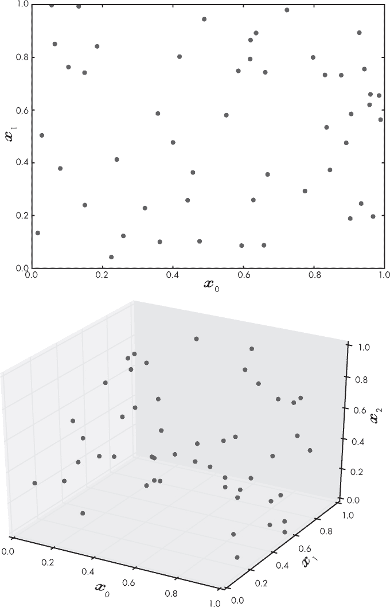

*图 4-1：100 个随机样本在二维空间（顶部）和三维空间（底部）中的分布*

由于我们假设我们的特征向量可以来自 2D 或 3D 空间中的任何地方，我们希望我们的数据集能够尽可能地采样这些空间，以便能够很好地代表这些空间。我们可以通过将每个轴分成 10 个相等的部分来衡量 100 个点填充空间的效果。我们称这些部分为*箱子*。在 2D 空间中，我们会有 100 个箱子，因为它有两个轴（10 × 10），而在 3D 空间中，我们会有 1,000 个箱子，因为它有三个轴（10 × 10 × 10）。现在，如果我们计算至少有一个点占据的箱子数量，并将其除以箱子的总数，我们就能得到被占据的箱子的比例。

这样做后，我们得到了 2D 空间的 0.410（最大为 1.0）和 3D 空间的 0.048。这意味着 100 个样本能够覆盖约一半的 2D 特征空间。还不错！但 100 个样本在 3D 特征空间中只覆盖了大约 5%的空间。为了使 3D 空间的采样与 2D 空间相同的比例，我们需要大约 1,000 个样本——也就是我们当前样本数的 10 倍。随着维度的增加，这一普遍规则适用：一个 4D 特征空间需要大约 10,000 个样本，而一个 10D 特征空间则需要约 10,000,000,000 个样本！随着特征数量的增加，我们需要的训练数据量以 10^(*d*)的指数增长，其中*d*是维度的数量。这就是*维度诅咒*，多年来一直是机器学习的噩梦。幸运的是，现代深度学习已经克服了这个诅咒，但在使用传统模型时，像我们在第六章中探讨的那样，它仍然是一个重要的问题。

例如，你电脑上的典型彩色图像可能每边有 1,024 个像素，每个像素需要 3 个字节来指定颜色，表示红、绿、蓝三种颜色的混合。如果我们想把这张图片作为模型的输入，我们需要一个特征向量，*d* = 1024 × 1024 × 3 = 3,145,728 个元素。这意味着我们需要大约 10^(3,145,728)个样本来填充我们的特征空间。显然，这是不可能的。我们将在第十二章中看到，如何通过使用卷积神经网络来克服这个诅咒。

现在我们了解了类别、特征和特征向量，让我们来描述一个好的数据集意味着什么。

### 一个好的数据集的特征

数据集就是一切。这并不是夸张，因为我们是从数据集中构建模型的。模型有参数——无论是神经网络中的权重和偏差，还是朴素贝叶斯模型中每个特征发生的概率，或是在最近邻方法中训练数据本身。参数是我们用训练数据来找出的内容：它们编码了模型的知识，并通过训练算法进行学习。

让我们稍微回顾一下，并定义一下本书中使用的*数据集*这个术语。直观上，我们理解什么是数据集，但让我们更加科学地定义它：数据集是值对的集合，{*X,Y*}，其中*X*是模型的*输入*，*Y*是标签。这里的*X*是一组我们测量并聚集在一起的值，比如花卉部位的长度和宽度，*Y*则是我们希望模型告诉我们的东西，比如数据最好代表哪种花或哪种动物。

对于*监督学习*，我们充当老师，而模型充当学生。我们通过不断提供示例来教学生，比如“这是一只猫”和“这是一只狗”，就像我们用图画书教小孩子一样。在这种情况下，*数据集*是一个示例集合，*训练*则是不断地向模型展示这些示例，直到模型“明白”为止——也就是说，直到模型的参数被调整以最小化该数据集中的误差。这就是机器学习中的学习部分。

#### 插值与外推

*插值*是指在某个已知范围内进行估算的过程。而*外推*则是在已知数据的基础上估算超出已知范围的值。一般来说，当我们的模型进行插值时，它的准确度较高，这意味着我们需要一个数据集，这个数据集能够全面代表可能作为模型输入值的范围。

作为一个例子，我们来看一下从 1910 年到 1960 年（见表 4-3）的世界人口数据，以十亿为单位。我们拥有 1910 年到 1960 年每 10 年的数据。

**表 4-3：** 按十年划分的世界人口

| **年份** | **人口（十亿）** |
| --- | --- |
| 1910 | 1.750 |
| 1920 | 1.860 |
| 1930 | 2.070 |
| 1940 | 2.300 |
| 1950 | 2.557 |
| 1960 | 3.042 |

如果我们找到一条“最佳拟合”直线来绘制这些数据，我们可以将其作为模型来预测值。这就是所谓的*线性回归*，它允许我们估算任何我们选择年份的人口。我们将跳过实际的拟合过程，您可以通过在线工具轻松完成此过程，直接进入模型：

*p* = 0.02509*y* – 46.28

对于任何年份*y*，我们都可以估算出人口*p*。1952 年世界人口是多少？我们在表格中没有 1952 年的实际数据，但通过使用模型，我们可以这样估算：

*p* = 0.02509(1952) – 46.28 = 2.696 十亿

通过查看 1952 年实际的世界人口数据，我们知道它是 26.37 亿，因此我们的估算值 2.696 亿仅差了大约 6000 万。模型看起来还挺不错的！

在使用该模型估算 1952 年世界人口时，我们进行了插值。我们为介于已知数据点之间的值进行了估算，模型给出了一个不错的结果。另一方面，外推是指测量超出已知范围的值，超出了我们数据的范围。

让我们用我们的模型来估计 2000 年世界人口，即在我们用来构建模型的数据结束后的 40 年：

*p* = 0.02509(2000) – 46.28 = 39.00 亿

根据该模型，结果应该接近 39 亿，但我们从实际数据中知道，2000 年世界人口为 60.89 亿。我们的模型偏差超过了 20 亿人。发生的情况是我们将模型应用于了不适合的输入。如果我们保持在模型“训练”过的输入范围内，即 1910 年到 1960 年之间的日期，模型表现得还不错。然而，一旦超出了模型的训练范围，它就会崩溃，因为它假设了我们没有的知识。

当我们进行插值时，模型将看到与训练时所见示例相似的例子。也许不足为奇的是，在这些例子上它表现得比在外推时更好，外推要求模型超出它的训练范围。

在分类问题中，确保有全面的训练数据至关重要。假设我们正在训练一个模型来识别狗的品种。在我们的数据集中，我们有成百上千张经典的黑白色边境牧羊犬的图片，就像图 4-2 中左边的那只。如果我们接着给模型提供一张经典边境牧羊犬的新图片，我们希望能够得到一个正确的标签：“边境牧羊犬”。这类似于要求模型进行插值：它正在处理它已经见过的东西，因为训练数据中的“边境牧羊犬”标签包括了很多经典边境牧羊犬的例子。

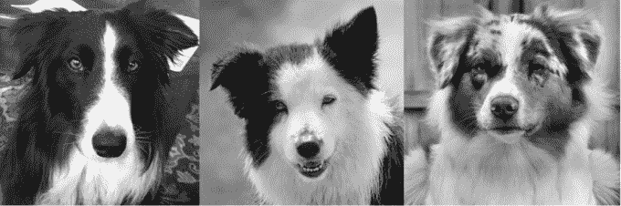

*图 4-2：一只拥有经典标记的边境牧羊犬（左），一只拥有肝色标记的边境牧羊犬（中），一只澳大利亚牧羊犬（右）*

然而，并不是每只边境牧羊犬都有经典的边境牧羊犬标记。一些边境牧羊犬的标记像图 4-2 中间的那只。由于我们没有在训练集中包含这种类型的图片，模型现在必须尝试超出它训练的范围，为它已训练过的类别实例提供正确的输出标签，但这种实例的类型并没有出现在训练中。它很可能会失败，给出一个错误的输出，如“澳大利亚牧羊犬”，这是一种与边境牧羊犬相似的品种，正如图 4-2 右侧所示。

然而，关键概念是，数据集必须覆盖模型在预测未知输入标签时将会看到的类别中的所有变异*范围*。

#### 母体分布

数据集必须能代表它所建模的类别。这一思想中隐含的假设是，我们的数据有一个*母体分布*，即一个未知的数据生成器，它生成了我们正在使用的特定数据集。

请考虑一下哲学中的平行类比。古希腊哲学家柏拉图使用理想概念。在他看来，某个地方“存在”一个理想的椅子，所有现存的椅子都是这个理想椅子的或多或少完美的复制品。这就是我们所说的使用的数据集、复制品和父分布——理想生成器之间的关系。我们希望数据集能够代表这一理想。

我们可以将数据集看作是从某个未知过程中的样本，该过程根据父分布生成数据。它生成的数据类型——特征的值和范围——将遵循某种未知的统计规则。例如，当你掷骰子时，每个六个值在长时间内出现的概率是相等的。我们称这种分布为*均匀父分布*。如果你制作一个柱状图，统计每个值出现的次数，当你掷骰子多次时，你会看到一条（或多或少）水平的线，因为每个值出现的概率是相等的。我们在测量成人身高时看到的则是不同的分布。身高分布呈现出双峰的形状，一峰围绕男性的平均身高，另一峰围绕女性的平均身高。

父分布就是生成这种整体形状的原因。训练数据、测试数据以及你用于让模型做决策的数据必须来自同一个父分布。这是模型做出的基本假设，也是我们不应该感到意外的假设。然而，有时很容易混淆，在使用来自不同父分布的数据进行测试或使用模型时，训练却使用了来自一个父分布的数据。（如何用一个父分布训练模型，并用来自不同分布的数据测试该模型，是当前一个非常活跃的研究领域。可以搜索“领域适应”）

#### 先验类概率

*先验类概率*是数据集中每个类在实际中出现的概率。

通常，我们希望我们的数据集能够匹配各类的先验概率。如果类 A 出现的概率为 85%，而类 B 仅为 15%，那么我们希望类 A 在训练集中出现 85%的时间，类 B 则出现 15%的时间。

然而，也有例外。假设我们希望模型学习的某一类是稀有的，它每出现一次，输入数据中就有 10,000 个样本。如果我们让数据集严格遵循实际的先验概率，模型可能无法看到足够的稀有类样本，从而无法学到任何有用的信息。而更糟糕的是，假设这个稀有类恰恰是我们最感兴趣的类呢？

例如，假设我们正在构建一个能定位四叶草的机器人。我们假设我们已经知道模型的输入是三叶草或四叶草；我们只想知道它是三叶草还是四叶草。我们知道，估计每 5000 株三叶草中有 1 株是四叶草。为每个四叶草实例构建一个包含 5000 株三叶草的数据集似乎是合理的，直到我们意识到，一个简单地将所有输入都认为是三叶草的模型，在 5000 次中平均正确 4999 次！它将是一个非常准确，但完全无用的模型，因为它永远无法找到我们感兴趣的类别。

相反，我们可能使用三叶草和四叶草的比例为 10:1。或者，在训练模型时，我们可能从数量相等的三叶草和四叶草开始，然后，在训练一段时间后，改变为越来越接近实际先验概率的混合比例。这个技巧并不是对所有模型类型都有效，但对于神经网络有效。为什么这个技巧有效尚不完全清楚，但直观上，我们可以想象，网络首先学习三叶草和四叶草之间的视觉差异，然后随着混合比例逐渐接近实际先验概率，学习关于四叶草遇到概率的知识。

实际上，这个技巧之所以被使用，是因为它往往能带来更好的模型性能。对于机器学习，尤其是深度学习来说，经验性的技巧和技术远远领先于任何理论的支持。“它就是更有效；这就是原因”仍然是许多关于某种方法为何有效的问题的一个有效答案，尽管这最终是令人不满意的。

如何处理不平衡数据是研究界仍在积极探讨的问题。有些人选择从更平衡的类别比例开始；还有一些人使用数据增强（参见第五章）来增加来自代表性不足类别的样本数量。

#### 混淆器

我们说过，我们需要在数据集中包含反映我们想要学习的类别所有自然变异的示例。这一点是确实的，但有时特别重要的是包含与我们某个或多个类别相似，但实际上并非该类别的训练样本。

考虑两种模型。第一个模型学习区分狗的图像和猫的图像。第二个模型学习区分狗的图像和不是狗的图像。第一个模型相对容易。输入要么是狗，要么是猫，模型通过狗和猫的图像进行训练。然而，第二个模型的情况就复杂得多。显然，我们需要狗的图像来进行训练。但“不是狗”的图像应该是什么呢？根据前面的讨论，我们应该开始直觉地意识到，我们需要的图像应该涵盖模型在现实中可能遇到的图像空间。

我们可以更进一步。如果我们想区分狗和非狗，我们应该确保在训练时将狼包含在“非狗”类别中。如果不这样做，模型可能无法学会在遇到狼时做出区分，从而错误地将狼分类为“狗”。如果我们通过使用数百张“非狗”的图像（全是企鹅和鹦鹉的图片）来构建数据集，那么如果模型决定把狼叫做狗，难道我们应该感到惊讶吗？

通常情况下，我们需要确保数据集包含*干扰项*，或者*困难负样本*——这些样本与其他类别足够相似，容易被误分类，但实际上不属于该类别。干扰项使模型有机会学习类别的更精确特征。困难负样本在区分某物与其他所有物品时特别有用，例如区分“狗”和“非狗”。

#### 数据集大小

到目前为止，我们讨论了应该在数据集中包含什么样的数据，但我们需要多少数据呢？“全部”是一个引人发笑的回答。为了让我们的模型尽可能精确，我们应该使用尽可能多的样本。但通常情况下，完全获得所有数据是不可能的。

选择数据集的大小意味着在准确性和获取数据所需的时间和精力之间进行权衡。获取数据可能很昂贵或者很慢，或者正如我们在三叶草的例子中看到的那样，有时候数据集中的关键类别很稀有，鲜少遇到。由于标注数据通常很昂贵且获取较慢，因此在开始之前我们应该对自己需要多少数据有所了解。

不幸的是，事实是没有一个公式可以回答多少数据才足够的问题。在某个临界点之后，增加更多数据的效益会递减。从 100 个样本增加到 1,000 个样本可能会大幅提升模型的准确性，但从 1,000 个增加到 10,000 个样本可能只会带来很小的准确度提升。提高的准确度需要与获取额外 9,000 个训练样本的努力和成本进行平衡。

另一个需要考虑的因素是模型本身。模型有一个*容量*，决定了它能支持的复杂度与可用训练数据量之间的关系。模型的容量与其参数数量直接相关。一个具有更多参数的较大模型需要大量的训练数据才能找到合适的参数设置。尽管通常建议训练示例的数量多于模型的参数数量，但当训练数据少于参数时，深度学习也能很好地工作。例如，如果类别之间的差异非常大——比如建筑物与橙子——且我们很容易区分它们，那么模型可能也会迅速学习到这个差异，从而能够用较少的训练示例进行训练。另一方面，如果我们试图区分狼和哈士奇犬，可能需要更多的数据。在第五章中，我们会讨论当数据量不足时该怎么办，但这些技巧并不能替代获取更多数据的做法。

对于“需要多少数据”的问题，唯一正确的答案是“所有的数据”。在考虑问题的限制条件（如费用、时间、稀缺性等）下，尽可能多地获取数据是*可行*的。

### 数据准备

在我们开始构建实际的数据集之前，首先需要讨论两个你在将数据集输入模型之前可能会遇到的情况：如何对特征进行缩放，以及当特征值缺失时该怎么办。

#### 特征缩放

从一组不同特征构建的特征向量可能具有不同的取值范围。一个特征的取值范围可能很广，例如从–1000 到 1000，而另一个特征的取值范围可能被限制在 0 到 1 之间。当发生这种情况时，一些模型可能无法正常工作，因为某个特征由于其取值范围的原因主导了其他特征。此外，一些模型类型在特征的均值接近 0 时表现最好。

解决这些问题的方法是进行缩放。暂时假设特征向量中的每个特征都是连续的。我们将使用一个包含五个特征和 15 个样本的虚拟数据集。这意味着我们的数据集有 15 个样本——特征向量及其标签——每个特征向量包含五个元素。我们假设有三类。该数据集如表 4-4 所示。

**表 4-4：** 一个假设的数据集

| **示例** | ***x*[0]** | ***x*[1]** | ***x*[2]** | ***x*[3]** | ***x*[4]** | **标签** |
| --- | --- | --- | --- | --- | --- | --- |
| *0* | 6998 | 0.1361 | 0.3408 | 0.00007350 | 78596048 | 0 |
| *1* | 6580 | 0.4908 | 3.0150 | 0.00004484 | 38462706 | 1 |
| *2* | 7563 | 0.9349 | 4.3465 | 0.00001003 | 6700340 | 2 |
| *3* | 8355 | 0.6529 | 2.1271 | 0.00002966 | 51430391 | 0 |
| *4* | 2393 | 0.4605 | 2.7561 | 0.00003395 | 27284192 | 0 |
| *5* | 9498 | 0.0244 | 2.7887 | 0.00008880 | 78543394 | 2 |
| *6* | 4030 | 0.6467 | 4.8231 | 0.00000403 | 19101443 | 2 |
| *7* | 5275 | 0.3560 | 0.0705 | 0.00000899 | 96029352 | 0 |
| *8* | 8094 | 0.7979 | 3.9897 | 0.00006691 | 7307156 | 1 |
| *9* | 843 | 0.7892 | 0.9804 | 0.00005798 | 10179751 | 1 |
| *10* | 1221 | 0.9564 | 2.3944 | 0.00007815 | 14241835 | 0 |
| *11* | 5879 | 0.0329 | 2.0085 | 0.00009564 | 34243070 | 2 |
| *12* | 923 | 0.4159 | 1.7821 | 0.00002467 | 52404615 | 1 |
| *13* | 5882 | 0.0002 | 1.5362 | 0.00005066 | 18728752 | 2 |
| *14* | 1796 | 0.7247 | 2.3190 | 0.00001332 | 96703562 | 1 |

由于这是本书中介绍的第一个数据集，我们将详细介绍它，介绍一些符号并看看每项内容。 表 4-4 中的第一列是样本编号。样本是输入，在本例中是表示特征向量的五个特征的集合。注意，编号从 0 开始。由于我们将使用 Python 数组（NumPy 数组）来处理数据，因此我们在所有情况下都会从 0 开始计数。

接下来的五列是每个样本的特征，标记为 *x*[0] 到 *x*[4]，索引从 0 开始。最后一列是类别标签。由于有三类，标签从 0 到 2。类 0、类 1 和类 2 分别有五个样本。因此，这是一个小但平衡的数据集；每个类的先验概率是 33%，这应该接近实际情况下各类出现的先验概率。

如果我们有一个模型，那么每一行将是其自身的输入。写 {*x*[0], *x*[1], *x*[2], *x*[3], *x*[4]} 来表示这些特征向量是繁琐的，因此，当我们提到一个完整的特征向量时，我们将使用大写字母。例如，我们会将样本 2 称为 *X*[2]，表示数据集 *X*。我们还将有时使用矩阵——二维数组——它们也用大写字母标记，以便清晰。当我们想引用单个特征时，我们将使用带下标的小写字母，例如 *x*[3]。

让我们来看一下特征的范围。每个特征的最小值、最大值和范围（最大值与最小值的差）在表 4-5 中展示。

**表 4-5:** 表 4-4 中各特征的最小值、最大值和范围

| **特征** | **最小值** | **最大值** | **范围** |
| --- | --- | --- | --- |
| *x*[0] | 843.0 | 9498.0 | 8655.0 |
| *x*[1] | 0.0002 | 0.9564 | 0.9562 |
| *x*[2] | 0.0705 | 4.8231 | 4.7526 |
| *x*[3] | 4.03e-06 | 9.564e-05 | 9.161e-05 |
| *x*[4] | 6700340.0 | 96703562.0 | 90003222.0 |

请注意使用计算机表示法，如 9.161e-05。这是计算机表示科学计数法的方式：9.161 × 10^(*–*5) = 0.00009161。还要注意，每个特征的范围差异很大。因为这个原因，我们需要对特征进行缩放，使它们的范围更加相似。缩放是在训练模型之前进行的有效操作，只要你以相同的方式缩放所有新的输入。

##### 均值中心化

最简单的缩放形式是 *均值中心化*。这很容易做到：对于每个特征，简单地从每个特征中减去整个数据集的均值。一个值集合 *x*[*i*]，其中 *i* = 0, 1, 2, … 的均值就是每个值的总和除以值的数量：

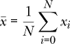

特征 *x*[0] 的均值是 5022，因此为了对 *x*[0] 进行中心化，我们将每个值替换为：

*x[i]* ← *x[i]* – 5022, *i* = 0, 1, 2, . . .

在这种情况下，*i* 索引是针对样本的，而不是特征向量的其他元素。

对所有其他特征的均值重复前述步骤，将会对整个数据集进行均值中心化。结果是，每个特征的均值在数据集上现在为 0，意味着特征值本身都位于 0 的上下。对于深度学习，均值中心化通常通过从每个输入图像中减去均值图像来完成。

##### 将标准差改为 1

均值中心化有助于改善数据，但围绕 0 的值的分布仍然与减去均值之前相同。我们所做的只是将数据向 0 移动。围绕均值的值的分布有一个正式的名称：它被称为 *标准差*，其计算方式是数据值与均值之间的平均差：

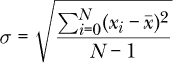

字母 *σ*（sigma）是数学中标准差的常用名称。你不需要记住这个公式。它在这里是为了向我们展示如何计算数据相对于均值的分布或范围的度量。

均值中心化将  变为 0，但不会改变 *σ*。有时我们希望进一步处理，除了进行均值中心化，还要改变数据的分布，使得数据的范围相同，即每个特征的标准差为 1。幸运的是，做到这一点是很直接的。我们将每个特征值 *x* 替换为

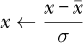

其中  和 *σ* 是数据集中每个特征的均值和标准差。例如，前面的示例数据集可以存储为一个 2D NumPy 数组

```py
x = [

 [6998, 0.1361, 0.3408, 0.00007350, 78596048],

 [6580, 0.4908, 3.0150, 0.00004484, 38462706],

 [7563, 0.9349, 4.3465, 0.00001003,  6700340],

 [8355, 0.6529, 2.1271, 0.00002966, 51430391],

 [2393, 0.4605, 2.7561, 0.00003395, 27284192],

 [9498, 0.0244, 2.7887, 0.00008880, 78543394],

 [4030, 0.6467, 4.8231, 0.00000403, 19101443],

[5275, 0.3560, 0.0705, 0.00000899, 96029352],

 [8094, 0.7979, 3.9897, 0.00006691,  7307156],

 [ 843, 0.7892, 0.9804, 0.00005798, 10179751],

 [1221, 0.9564, 2.3944, 0.00007815, 14241835],

 [5879, 0.0329, 2.0085, 0.00009564, 34243070],

 [ 923, 0.4159, 1.7821, 0.00002467, 52404615],

 [5882, 0.0002, 1.5362, 0.00005066, 18728752],

 [1796, 0.7247, 2.3190, 0.00001332, 96703562],

] 
```

这样整个数据集就可以通过一行代码进行处理：

```py
x = (x - x.mean(axis=0)) / x.std(axis=0)
```

这种方法叫做 *标准化* 或 *归一化*，你应该对大多数数据集执行此操作，特别是在使用第六章中讨论的传统模型时。只要可能，应该标准化你的数据集，使得特征具有 0 的均值和 1 的标准差。

如果我们标准化前述数据集，它会是什么样子？每个特征减去该特征的均值并除以标准差，将给我们一个新的数据集（表 4-6）。在这里，我们将数字显示精度缩短为四位小数并省略了标签。

**表 4-6：** 表 4-4 中的数据已标准化

| **样本** | ***x*[0]** | ***x*[1]** | ***x*[2]** | ***x*[3]** | ***x*[4]** |
| --- | --- | --- | --- | --- | --- |
| *0* | 0.6930 | –1.1259 | –1.5318 | 0.9525 | 1.1824 |
| *1* | 0.5464 | –0.0120 | 0.5051 | –0.0192 | –0.1141 |
| *2* | 0.8912 | 1.3826 | 1.5193 | –1.1996 | –1.1403 |
| *3* | 1.1690 | 0.4970 | –0.1712 | –0.5340 | 0.3047 |
| *4* | –0.9221 | –0.1071 | 0.3079 | –0.3885 | –0.4753 |
| *5* | 1.5699 | –1.4767 | 0.3327 | 1.4714 | 1.1807 |
| *6* | –0.3479 | 0.4775 | 1.8823 | –1.4031 | –0.7396 |
| *7* | 0.0887 | –0.4353 | –1.7377 | –1.2349 | 1.7456 |
| *8* | 1.0775 | 0.9524 | 1.2475 | 0.7291 | –1.1207 |
| *9* | –1.4657 | 0.9250 | –1.0446 | 0.4262 | –1.0279 |
| *10* | –1.3332 | 1.4501 | 0.0323 | 1.1102 | –0.8966 |
| *11* | 0.3005 | –1.4500 | –0.2615 | 1.7033 | –0.2505 |
| *12* | –1.4377 | –0.2472 | –0.4340 | –0.7032 | 0.3362 |
| *13* | 0.3016 | –1.5527 | –0.6213 | 0.1780 | –0.7517 |
| *14* | –1.1315 | 0.7225 | –0.0250 | –1.0881 | 1.7674 |

如果你对比这两个表格，你会发现经过我们的处理后，特征比原始数据集中的更加相似。如果我们看一下 *x*[3]，我们会看到这些值的均值是 *–* 1.33*e –* 16 = *–*1.33 × 10^(*–*16) = *–*0.000000000000000133，几乎是 0。很好！这正是我们想要的。如果你做一下计算，你会发现其他特征的均值也非常接近 0。那么标准差呢？对于 *x*[3]，它是 0.99999999，几乎是 1—同样，这正是我们希望的。我们将使用这个新的、变换后的数据集来训练模型。

因此，我们必须将训练集上测量的每个特征的均值和标准差应用到任何我们输入到模型的新数据中：

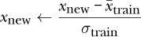

这里，*x*[new]是我们想要应用到模型的新特征向量，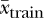和 *σ*[train] 是从训练集获得的每个特征的均值和标准差。

#### 缺失特征

有时候我们没有一个样本所需的所有特征。比如我们可能忘记了进行某个测量。这些是*缺失特征*，我们需要找到一种方法来修正它们，因为大多数模型无法接受缺失数据。

一种解决方案是用超出特征范围的值填补缺失值，期望模型能够学会忽略这些值或更多地利用其他特征。事实上，一些更先进的深度学习模型故意将某些输入值置为零，作为正则化的一种形式（我们将在后面的章节中了解这是什么意思）。

现在，我们将学习第二个最明显的解决方案：用数据集中的特征均值替代缺失的特征。让我们再次看看我们之前的练习数据集。这一次，我们将需要处理一些缺失数据（表 4-7）。

**表 4-7：** 我们的样本数据集（表 4-4）包含一些缺失值

| **样本** | ***x*[0]** | ***x*[1]** | ***x*[2]** | ***x*[3]** | ***x*[4]** | **标签** |
| --- | --- | --- | --- | --- | --- | --- |
| *0* | 6998 | 0.1361 | 0.3408 | 0.00007350 | 78596048 | 0 |
| *1* |  | 0.4908 |  | 0.00004484 | 38462706 | 1 |
| *2* | 7563 | 0.9349 | 4.3465 |  | 6700340 | 2 |
| *3* | 8355 | 0.6529 | 2.1271 | 0.00002966 | 51430391 | 0 |
| *4* | 2393 | 0.4605 | 2.7561 | 0.00003395 | 27284192 | 0 |
| *5* | 9498 |  | 2.7887 | 0.00008880 | 78543394 | 2 |
| *6* | 4030 | 0.6467 | 4.8231 | 0.00000403 |  | 2 |
| *7* | 5275 | 0.3560 | 0.0705 | 0.00000899 | 96029352 | 0 |
| *8* | 8094 | 0.7979 | 3.9897 | 0.00006691 | 7307156 | 1 |
| *9* |  |  | 0.9804 |  | 10179751 | 1 |
| *10* | 1221 | 0.9564 | 2.3944 | 0.00007815 | 14241835 | 0 |
| *11* | 5879 | 0.0329 | 2.0085 | 0.00009564 | 34243070 | 2 |
| *12* | 923 |  |  | 0.00002467 |  | 1 |
| *13* | 5882 | 0.0002 | 1.5362 | 0.00005066 | 18728752 | 2 |
| *14* | 1796 | 0.7247 | 2.3190 | 0.00001332 | 96703562 | 1 |

空白区域表示缺失值。每个特征的均值（忽略缺失值）见表 4-8。

**表 4-8：** 表 4-7 中各特征的均值

| ***x*[0]** | ***x*[1]** | ***x*[2]** | ***x*[3]** | ***x*[4]** |
| --- | --- | --- | --- | --- |
| 5223.6 | 0.5158 | 2.345 | 4.71e-05 | 42957735.0 |

如果我们用均值替换每个缺失值，我们就能得到一个可以标准化并用于训练模型的数据集。

当然，真实数据更好，但均值是我们可以合理使用的最简单替代方法。如果数据集足够大，我们可以生成每个特征值的直方图，并选择众数——最常见的值——但使用均值应该没问题，特别是当数据集样本量大且缺失特征的数量较少时。

### 训练、验证和测试数据

现在我们已经有了一个数据集——一个特征向量的集合——我们准备开始训练模型，对吧？其实，答案是否定的。因为我们并不想用整个数据集来训练模型。我们需要将数据集分割成至少两个子集，理想情况下应该有三个。我们将这三个子集称为训练数据、验证数据和测试数据。

#### 三个子集

*训练数据*是我们用来训练模型的子集。这里重要的是选择能够很好地代表数据母体分布的特征向量。

*测试数据*是用来评估训练后的模型表现的子集。在训练模型时，我们*绝不会*使用测试数据；那样做是作弊，因为我们会在模型已经见过的数据上进行测试。将测试数据集放在一边，直到模型完成后再使用它来评估模型。

第三个数据集是*验证数据*。并非每个模型都需要验证数据集，但对于深度学习模型，拥有一个验证集是很有帮助的。在训练过程中，我们将验证数据集当作测试数据使用，目的是了解训练效果如何。它有助于我们决定什么时候停止训练，以及是否使用了合适的模型。

例如，一个神经网络有若干层，每层包含一定数量的节点。我们称之为模型的*架构*。在训练过程中，我们可以使用验证数据来测试神经网络的性能，以判断是否应该继续训练，或者停止并尝试不同的架构。我们不会使用验证集来训练模型，也不会用验证集来修改模型参数。我们在报告实际模型性能时也不能使用验证数据，因为我们最初选择模型时是基于验证数据的结果。再说一遍，这样会让模型看起来比实际情况更好。

图 4-3 展示了三个子集及其相互关系。左边是整个数据集，包含所有特征向量及相关标签。右边是三个子集。训练数据和验证数据共同用于训练和开发模型，而测试数据则在模型准备好之前被保留。圆柱体的大小反映了应该分配给每个子集的相对数据量，尽管在实际应用中，验证集和测试集可能会更小。


*图 4-3：训练集、验证集和测试集之间的关系*

总结一下：使用训练集和验证集来构建模型，使用测试集来评估模型。

#### 数据集划分

每个数据集应该包含多少数据？

一个典型的划分是，90%用于训练，5%用于验证，5%用于测试。对于深度学习模型，这个比例是相当标准的。如果你处理的是一个非常大的数据集，验证集和测试集的比例可以低至各自 1%。对于经典模型，由于可能不太擅长学习，我们可能希望将测试数据集做得更大，以确保能够对各种输入进行广泛的泛化。在这种情况下，你可能会尝试 80%用于训练，10%用于验证和测试。如果你不使用验证数据，全部 20%可能用于测试。这些较大的测试集可能适用于多类别模型，特别是当类别的先验概率较低时。或者，因为测试集不用于定义模型，你可以增加测试集中稀有类别的数量。如果漏掉稀有类别会带来高成本（例如在医学影像中漏掉肿瘤），这种做法可能特别有价值。

现在我们已经确定了每个数据集应该包含多少数据，让我们使用`sklearn`生成一个虚拟数据集，进行划分：

```py
>>> import numpy as np

>>> from sklearn.datasets import make_classification

>>> x,y = make_classification(n_samples=10000, weights=(0.9,0.1))

>>> x.shape

    (10000, 20)

>>> len(np.where(y == 0)[0])

    8969

>>> len(np.where(y == 1)[0])

    1031
```

这里我们使用了两个类别和 20 个特征生成了 10,000 个样本。数据集是不平衡的，类 0 占 90%，类 1 占 10%。输出是一个二维数组的样本（`x`）和相应的 0 或 1 标签（`y`）。数据集是由多维高斯分布生成的，类似于正态分布的钟形曲线，但这对我们现在来说并不重要。对我们有用的部分是我们有一组特征向量和标签，因此我们可以查看如何将数据集划分成子集。

上述代码的关键是调用了 `make_classification`，该函数接受请求的样本数以及每个类别的比例。`np.where` 调用只是用来找到所有类 0 和类 1 的实例，以便 `len` 可以计算它们的数量。

之前我们讨论了保持—或至少接近—数据集中不同类别的真实先验概率的重要性。如果某个类别在现实世界中占比为 10%，那么它在数据集中也应该理想地占据 10%。现在我们需要找到一种方法，在我们为训练、验证和测试所划分的子集中保持这一先验类别概率。主要有两种方法可以做到这一点：按类划分和随机采样。

##### 按类划分

这种方法适用于数据集较小或某一类较为稀有的情况，其具体做法是先确定每个类别的样本数量，然后按类别将一定比例的样本分配到不同的子集，最后再将它们合并。如果类 0 有 9,000 个样本，类 1 有 1,000 个样本，并且我们希望将 90% 的数据用于训练，5% 的数据用于验证和测试，我们会随机从类 0 中选择 8,100 个样本，*随机* 从类 1 中选择 900 个样本来组成训练集。类似地，我们会从剩余的 900 个未使用的类 0 样本中随机选择 450 个用于验证集，同时从剩余的未使用的类 1 数据中选择 50 个。剩下的类 0 和类 1 样本将构成测试集。

列表 4-1 显示了使用 90/5/5 划分原始数据来构造子集的代码。

导入 numpy 作为 np

从 sklearn.datasets 导入 make_classification

❶ a,b = make_classification(n_samples=10000, weights=(0.9,0.1))

idx = np.where(b == 0)[0]

x0 = a[idx,:]

y0 = b[idx]

idx = np.where(b == 1)[0]

x1 = a[idx,:]

y1 = b[idx]

❷ idx = np.argsort(np.random.random(y0.shape))

y0 = y0[idx]

x0 = x0[idx]

idx = np.argsort(np.random.random(y1.shape))

y1 = y1[idx]

x1 = x1[idx]

❸ ntrn0 = int(0.9*x0.shape[0])

ntrn1 = int(0.9*x1.shape[0])

xtrn = np.zeros((int(ntrn0+ntrn1),20))

ytrn = np.zeros(int(ntrn0+ntrn1))

xtrn[:ntrn0] = x0[:ntrn0]

xtrn[ntrn0:] = x1[:ntrn1]

ytrn[:ntrn0] = y0[:ntrn0]

ytrn[ntrn0:] = y1[:ntrn1]

❹ n0 = int(x0.shape[0]-ntrn0)

n1 = int(x1.shape[0]-ntrn1)

xval = np.zeros((int(n0/2+n1/2),20))

yval = np.zeros(int(n0/2+n1/2))

xval[:(n0//2)] = x0[ntrn0:(ntrn0+n0//2)]

xval[(n0//2):] = x1[ntrn1:(ntrn1+n1//2)]

yval[:(n0//2)] = y0[ntrn0:(ntrn0+n0//2)]

yval[(n0//2):] = y1[ntrn1:(ntrn1+n1//2)]

❺ xtst = np.concatenate((x0[(ntrn0+n0//2):],x1[(ntrn1+n1//2):]))

ytst = np.concatenate((y0[(ntrn0+n0//2):],y1[(ntrn1+n1//2):]))

*清单 4-1：精确构建训练集、验证集和测试集*

这段代码中有很多记录。首先，我们创建了虚拟数据集 ❶ 并将其拆分为类别 0 和类别 1 集合，分别存储在`x0,y0`和`x1,y1`中。然后我们随机化数据的顺序 ❷。这样，我们可以从子集中提取前 *n* 个样本，而不必担心因数据的顺序引入偏差。由于`sklearn`生成虚拟数据集的方式，这一步并非必须，但确保样本顺序的随机性始终是一个好主意。

我们使用了一个在重新排序样本时非常有用的小技巧。因为我们将特征向量存储在一个数组中，标签存储在另一个数组中，所以 NumPy 的 shuffle 方法无法直接使用。相反，我们生成一个与样本数相同长度的随机向量，然后使用`argsort`返回一个将该向量按排序顺序排列的索引。由于向量中的值是随机的，用来排序它的索引顺序也会是随机的。这些索引随后会重新排序样本和标签，确保每个标签仍然与正确的特征向量相关联。

接下来，我们提取两类的前 90%的样本，并使用`xtrn`中的样本和`ytrn`中的标签构建训练子集 ❸。我们对 5%的验证集 ❹ 和剩下的 5%的测试集 ❺ 进行相同的操作。

按类别划分是相当繁琐的，但至少我们知道，每个子集中的类别 0 与类别 1 的比例完全相同。

##### 随机抽样

我们必须如此精确吗？一般来说，不必如此。第二种常见的划分完整数据集的方法是通过随机抽样。如果我们有足够的数据——10,000 个样本已经足够——我们可以通过随机化完整数据集来构建我们的子集，然后提取前 90%的样本作为训练集，接下来的 5%作为验证集，最后 5%作为测试集。这就是我们在清单 4-2 中展示的内容。

❶ x,y = make_classification(n_samples=10000, weights=(0.9,0.1))

idx = np.argsort(np.random.random(y.shape[0]))

x = x[idx]

y = y[idx]

❷ ntrn = int(0.9*y.shape[0])

nval = int(0.05*y.shape[0])

❸ xtrn = x[:ntrn]

ytrn = y[:ntrn]

xval = x[ntrn:(ntrn+nval)]

yval = y[ntrn:(ntrn+nval)]

xtst = x[(ntrn+nval):]

ytst = y[(ntrn+nval):]

*清单 4-2：随机构建训练集、验证集和测试集*

我们随机化存储在`x`和`y`中的虚拟数据集❶。我们需要知道每个子集中应该包含多少样本。首先，训练集中的样本数量是数据集中总样本的 90％❷，而验证集中的样本数量是总样本的 5％。剩下的 5％就是测试集❸。

这个方法比在清单 4-1 中展示的方法要简单得多。使用它有什么缺点？可能的缺点是每个子集中的类的混合可能不完全是我们想要的比例。例如，假设我们想要一个包含 9,000 个样本的训练集，或者说占原始 10,000 个样本的 90％，其中 8,100 个样本来自类 0，900 个样本来自类 1。运行清单 4-2 中的代码 10 次，得到的训练集中的类 0 和类 1 的分布如表 4-9 所示。

**表 4-9：** 通过随机抽样生成的十个训练集划分

| **运行** | **类 0** | **类 1** |
| --- | --- | --- |
| 1 | 8058 (89.5) | 942 (10.5) |
| 2 | 8093 (89.9) | 907 (10.1) |
| 3 | 8065 (89.6) | 935 (10.4) |
| 4 | 8081 (89.8) | 919 (10.2) |
| 5 | 8045 (89.4) | 955 (10.6) |
| 6 | 8045 (89.4) | 955 (10.6) |
| 7 | 8066 (89.6) | 934 (10.4) |
| 8 | 8064 (89.6) | 936 (10.4) |
| 9 | 8071 (89.7) | 929 (10.3) |
| 10 | 8063 (89.6) | 937 (10.4) |

类 1 的样本数量从最少 907 个样本到最多 955 个样本不等。随着完整数据集中某个特定类的样本数量减少，子集中的样本数量将开始变化更多。这在较小的子集上尤为明显，比如验证集和测试集。让我们进行一次单独的运行，这次查看*测试*集中的每个类的样本数量（见表 4-10）。

**表 4-10：** 通过随机抽样生成的十个测试集划分

| **运行** | **类 0** | **类 1** |
| --- | --- | --- |
| 1 | 446 (89.2) | 54 (10.8) |
| 2 | 450 (90.0) | 50 (10.0) |
| 3 | 444 (88.8) | 56 (11.2) |
| 4 | 450 (90.0) | 50 (10.0) |
| 5 | 451 (90.2) | 49 (9.8) |
| 6 | 462 (92.4) | 38 (7.6) |
| 7 | 441 (88.2) | 59 (11.8) |
| 8 | 449 (89.8) | 51 (10.2) |
| 9 | 449 (89.8) | 51 (10.2) |
| 10 | 438 (87.6) | 62 (12.4) |

在测试集中，类 1 的样本数量从 38 到 62 不等。

这些差异会影响模型的学习吗？可能不会，但它们可能使测试结果看起来比实际情况要好，因为大多数模型在识别训练集中最少见的类别时都会遇到困难。确实存在某种病态划分的可能性，这种划分会导致某个类别没有任何示例，但在实际应用中，除非你的伪随机数生成器特别差，否则这种情况并不常见。不过，还是值得注意这个可能性。如果担心，可以使用清单 4-1 中的精确划分方法。事实上，最好的解决方法一如既往，是获取更多的数据。

从算法的角度来看，生成训练、验证和测试划分的步骤如下：

1.  随机化完整数据集的顺序，以确保各类别均匀混合。

1.  通过将完整数据集中样本的数量乘以所需的比例，计算训练集（`ntrn`）和验证集（`nval`）中的样本数量。剩余的样本将进入测试集。

1.  将前`ntrn`个样本分配到训练集。

1.  将接下来的`nval`个样本分配到验证集。

1.  最后，将剩余的样本分配到测试集。

始终确保样本的顺序是真正随机的，并且在重新排序特征向量时，确保标签按完全相同的顺序进行重新排序。如果这样做，除非数据集非常小或某些类别非常稀有，否则这个简单的划分过程会给出一个良好的划分。

我们忽略了讨论这种方法的一个后果。如果原始数据集本身很小，那么将其划分后，训练集将会变得更小。在第七章中，我们将看到一种强大的处理小数据集的方法，这种方法在深度学习中被广泛使用。但首先，让我们看一种有原则的处理小数据集的方式，以便了解它在新数据上的表现如何。

#### *k*-折交叉验证

现代深度学习模型通常需要非常大的数据集，因此，你可以像之前描述的那样使用单一的训练/验证/测试划分。然而，像第六章中的那些传统机器学习模型，通常使用的数据集（一般来说）对深度学习模型来说过小。如果我们对这些数据集使用单一的训练/验证/测试划分，我们可能会将太多数据保留用于测试，或者测试集中的样本太少，无法对模型的表现进行有意义的测量。

解决这个问题的一种方法是使用*k*折交叉验证，这是一种确保数据集中每个样本都至少在某个时刻用于训练和测试的技术。对传统机器学习模型的小数据集使用此技术也非常有帮助。它还可以作为不同模型之间选择的辅助工具。

要进行*k*折交叉验证，首先将完整的随机化数据集划分为*k*个不重叠的组，*x*[0]，*x*[1]，*x*[2]，…，*x*[*k–1]。你的*k*值是任意的，通常在 5 到 10 之间。图 4-4a 展示了这种划分，假设整个数据集水平地展开。

我们可以通过将* x*[0] 作为测试数据，使用其他组* x*[1]、*x*[2]、…、*x*[*k–*1] 作为训练数据来训练模型。我们暂时忽略验证数据；在构建当前训练数据后，如果需要，我们可以随时将部分数据保留作为验证数据。将这个训练好的模型称为*m*[0]。然后你可以从头开始，重新进行训练，这次将* x*[1] 作为测试数据，并使用其他所有组进行训练，包括* x*[0]。我们将得到一个新的训练模型，称其为*m*[1]。根据设计，*m*[0]和*m*[1]是相同*类型*的模型。我们在这里关心的是，使用不同数据子集训练的同一类型模型的多个实例。

对每个组重复这个过程，如图 4-4b 所示，我们将拥有* k *个模型，每个模型训练时使用(*k–*1)/*k*的数据，并将 1/*k*的数据保留用于测试。*k*的选择应取决于完整数据集的大小。较大的*k*意味着更多的训练数据，但测试数据较少。如果每个模型的训练时间较短，可以倾向选择较大的*k*，因为这会增加每个模型的训练集大小。

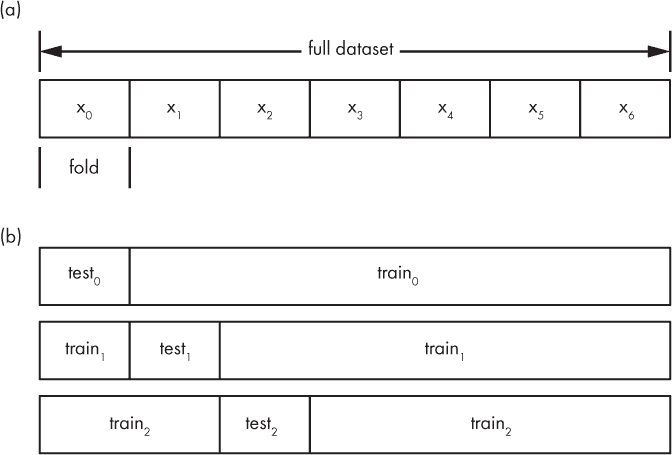

*图 4-4：* k-*折交叉验证。将数据集划分为不重叠的区域*，k=*7(a)。前三次的训练/测试划分使用* x[0] *作为测试集，然后是* x[1] *作为测试集，以此类推 (b)*。

一旦* k *个模型训练完成，你可以单独评估它们并平均它们的评估指标，从而大致了解在整个数据集上训练的模型会表现如何。请参见第十一章，了解如何评估模型。如果使用* k *折交叉验证来选择两种或更多模型（比如，在使用* k *-NN 或支持向量机^(1))之间进行选择，请对每种模型类型重复整个训练和评估过程，并比较它们的结果。

一旦我们了解了模型在平均评估指标上的表现，我们就可以重新开始，使用*所有*数据集来训练选择的模型类型。这就是* k *折交叉验证的优势：它让你既能“吃蛋糕”，又能“享受蛋糕”。

### 查看你的数据

组装特征和特征向量非常容易，然后继续将训练集、验证集和测试集组合在一起，而不暂停去*查看*数据以确认其是否合理。对于使用大量图像或其他多维数据的深度学习模型，这种情况尤为常见。以下是你需要注意的一些问题：

**错误标记的数据** 假设我们正在构建一个大型数据集——一个包含数十万标注样本的数据集。进一步假设我们将使用该数据集构建一个模型，该模型能够区分狗和猫。自然，我们需要给模型提供大量的狗狗图片和大量的猫猫图片。你可能会说，这没问题，我们只需要用类似 Google 图片这样的工具收集很多图片。好吧，这样可以。但如果你只是设置一个脚本，下载匹配“狗”和“猫”的图片搜索结果，你也会得到很多其他的图片，这些图片不是狗或猫的，或者是包含狗和猫以及其他东西的图片。标签就不太完美了。虽然深度学习模型对于这种标签噪声有一定的抵抗力，但尽可能避免它总是更好的。

**缺失或异常数据** 想象一下，你有一组特征向量，但你不知道哪些特征丢失的情况有多常见。如果某个特征的大部分数据缺失，那么这个特征将成为模型的障碍，你应该将其删除。或者，如果数据中有极端的异常值，你可能会希望删除这些样本，特别是如果你打算进行标准化，因为异常值会强烈影响从特征值中减去的均值。

#### 搜索数据中的问题

我们如何在数据中寻找这些问题呢？嗯，对于特征向量，如果数据集不太大，我们通常可以将其加载到电子表格中。或者，我们可以写一个 Python 脚本逐一总结每个特征的数据，或者将数据导入统计程序，通过这种方式进行检查。

通常，在对值进行统计汇总时，我们会查看均值和标准差，这两者在之前已定义，以及最大值和最小值。我们也可以查看中位数，即我们从最小到大排序值后，选取中间的那个值。（如果值的个数是偶数，我们会对两个中间值求平均。）让我们来看一下之前例子中的一个特征。排序后的数据可以这样汇总：

| ***x*[2]** |
| --- |
| 0.0705 |
| 0.3408 |
| 0.9804 |
| 1.5362 |
| 1.7821 |
| 2.0085 |
| 2.1271 |
| **2.3190** |
| 2.3944 |
| 2.7561 |
| 2.7887 |
| 3.0150 |
| 3.9897 |
| 4.3465 |
| 4.8231 |
| 均值 () | = | 2.3519 |
| 标准差 (*σ*) | = | 1.3128 |
| 标准误差（SE） | = | 0.3390 |
| 中位数 | = | 2.3190 |
| 最小值 | = | 0.0705 |
| 最大值 | = | 4.8231 |

我们已经探讨了均值、最小值、最大值和标准差的概念。中位数也在其中；我在左边的特征列表中做了突出显示。注意，排序后，中位数正好位于列表的正中间。它通常被称为 *50th percentile*，因为它上方和下方的数据量相等。

这里还列出了一个新值，*标准误差*，也叫做*均值的标准误差*。这是标准差除以数据集中值的平方根：

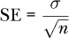

标准误差是衡量我们均值与母体分布均值之间差异的一个指标。基本思想是这样的：如果我们有更多的测量值，我们就能更好地了解生成数据的母体分布，因此测量值的均值会更接近母体分布的均值。

另外请注意，均值和中位数彼此相对接近。术语*相对接近*当然没有严格的数学意义，但我们可以将其作为一个临时指示器，表明数据可能是正态分布的，这意味着我们可以合理地通过均值（或中位数）来替换缺失值，正如我们之前所看到的那样。

前面的值通过 NumPy 轻松计算，如 Listing 4-3 所示。

import numpy as np

❶ f = [0.3408,3.0150,4.3465,2.1271,2.7561,

2.7887,4.8231,0.0705,3.9897,0.9804,

2.3944,2.0085,1.7821,1.5362,2.3190]

f = np.array(f)

print

print("mean  = %0.4f" % f.mean())

print("std   = %0.4f" % f.std())

❷ print("SE    = %0.4f" % (f.std()/np.sqrt(f.shape[0])))

print("median= %0.4f" % np.median(f))

print("min   = %0.4f" % f.min())

print("max   = %0.4f" % f.max())

*Listing 4-3: 计算基本统计信息。请参见* feature_stats.py。

加载 NumPy 后，我们手动定义了*x*[2]特征（`f`），并将其转换为 NumPy 数组❶。一旦数据是 NumPy 数组，计算所需的值就变得简单，因为除标准误差外，所有值都是简单的方法或函数调用。标准误差通过前面的公式❷计算，其中 NumPy 返回的元组的第一个元素是向量中元素的数量。

数字很好，但图片通常更好。你可以用 Python 中的*箱形图*来可视化数据。让我们生成一个来查看我们数据集的标准化值。然后我们将讨论图表展示了什么。创建图表的代码见 Listing 4-4。

import numpy as np

import matplotlib.pyplot as plt

❶ d = [[ 0.6930, -1.1259, -1.5318,  0.9525,  1.1824],

[ 0.5464, -0.0120,  0.5051, -0.0192, -0.1141],

[ 0.8912,  1.3826,  1.5193, -1.1996, -1.1403],

[ 1.1690,  0.4970, -0.1712, -0.5340,  0.3047],

[-0.9221, -0.1071,  0.3079, -0.3885, -0.4753],

[ 1.5699, -1.4767,  0.3327,  1.4714,  1.1807],

[-0.3479,  0.4775,  1.8823, -1.4031, -0.7396],

[ 0.0887, -0.4353, -1.7377, -1.2349,  1.7456],

[ 1.0775,  0.9524,  1.2475,  0.7291, -1.1207],

[-1.4657,  0.9250, -1.0446,  0.4262, -1.0279],

[-1.3332,  1.4501,  0.0323,  1.1102, -0.8966],

[ 0.3005, -1.4500, -0.2615,  1.7033, -0.2505],

[-1.4377, -0.2472, -0.4340, -0.7032,  0.3362],

[ 0.3016, -1.5527, -0.6213,  0.1780, -0.7517],

[-1.1315,  0.7225, -0.0250, -1.0881,  1.7674]]

❷ d = np.array(d)

plt.boxplot(d)

plt.show()

*清单 4-4：标准化玩具数据集的箱型图*。请参见 box_plot.py。

这些值本身在表 4-6 中给出。我们可以将数据存储为二维数组，并通过清单 4-4 来绘制箱型图。我们手动定义数组 ❶，然后绘制它 ❷。这个图形是交互式的，所以可以在提供的环境中进行实验，直到你对它感到熟悉。老式的软盘图标将把图形保存到你的磁盘上。

程序生成的箱型图如图 4-5 所示。

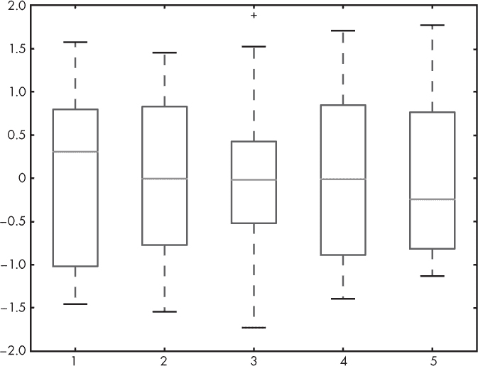

*图 4-5：由清单 4-4 生成的箱型图*

我们如何解读箱型图呢？我将通过检查标准化特征 *x*[2] 来向你展示，见图 4-6。

下方的箱线 Q1 标志着第一四分位数的结束。这意味着该特征的 25% 数据值小于这个值。中位数 Q2 是 50% 的位置，因此是第二四分位数的结束。50% 的数据值小于这个值。上方的箱线 Q3 是 75% 的位置。剩余的 25% 数据值大于 Q3。

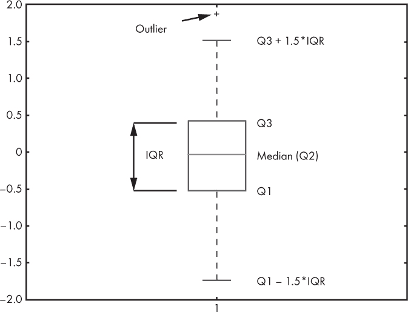

*图 4-6：我们数据集中标准化后的特征 x2*

箱型图的上下两条线也显示了。这些是*胡须*。（Matplotlib 称它们为*飞点*，但这不是一个常用术语。）胡须表示的是 Q1 *–* 1.5 × IQR 和 Q3 + 1.5 × IQR 处的值。按照惯例，超出这个范围的值被视为*异常值*。

查看异常值可能会有所帮助，因为你可能会发现它们是数据输入错误，可以从数据集中剔除它们。无论你如何处理异常值，然而，如果你打算发布或展示基于该数据集的结果，请做好为自己的选择辩护的准备。同样，你可能可以删除缺失值的样本，但确保没有系统性的错误导致数据缺失，并检查你不会因为删除这些样本而引入偏差。最终，常识应当优于对惯例的盲目遵循。

#### 警示故事

所以，尽管有些重复，*请查看你的数据*。你与数据打交道的时间越长，你就会越理解它，进而能更有效地做出合理的决定，关于什么该纳入，什么该排除，以及*为什么*。记住，数据集的目标是忠实而完整地捕捉父分布，或者是当模型被使用时，数据在实际环境中的表现。

我想到了两个简短的轶事。它们都展示了模型可能会学到我们未曾预料或考虑到的东西。

第一个故事是在 1980 年代我作为本科生时听到的。在这个故事中，一种早期形式的神经网络被用于检测坦克和非坦克图像。神经网络在测试中表现得很好，但在实际应用中，检测率迅速下降。研究人员意识到，坦克的图像是在阴天拍摄的，而非坦克的图像则是在晴天拍摄的。该识别系统根本没有学会区分坦克和非坦克；相反，它学会了区分阴天和晴天。这故事的寓意是，训练集需要包含模型在实际环境中可能遇到的*所有*条件。

第二个故事较为近期。我在 2016 年西班牙巴塞罗那的神经信息处理系统（NIPS）大会上听到过，后来在研究人员的论文中找到了这个故事的重复。^(2) 在这个案例中，作者们展示了他们的技术，旨在让模型解释其决策，他们训练了一个模型，声称能够区分哈士奇和狼的图像。这个模型表现得相当好，在演讲期间，作者们向由机器学习研究人员组成的听众进行了调查，询问他们认为该模型有多可信。大多数人认为这是一个不错的模型。然后，使用他们的技术，讲者揭示出，网络实际上并没有学到哈士奇和狼之间的任何区别。相反，它学会了狼的照片背景中有雪，而哈士奇的照片没有雪。

思考你的数据，并留意可能的意外后果。模型不是人类。我们在数据集上带入了大量的先入之见和无意的偏见。

### 总结

在本章中，我们描述了数据集的组成部分（类别、标签、特征、特征向量），并且界定了一个好的数据集，强调确保数据集能够很好地代表母体分布的重要性。接着，我们描述了基本的数据准备技术，包括如何对数据进行缩放，以及处理缺失特征的一种方法。然后，我们学习了如何将完整的数据集划分为训练集、验证集和测试集，并且如何应用*k*-折交叉验证，特别是在数据集较小的情况下非常有用。最后，我们以一些简单的方法结束了本章，帮助我们检查数据是否合理。

在下一章中，我们将直接应用本章所学的内容，构建我们将在本书剩余部分中使用的数据集。

1. 这些是经典机器学习模型的示例。我们将在本书后续章节中进一步了解它们。

2. Ribeiro, Marco Tulio, Sameer Singh, and Carlos Guestrin. “为什么我应该信任你？：解释任何分类器的预测。” *在第 22 届 ACM SIGKDD 国际数据挖掘和知识发现会议论文集*，pp. 1135–1144\. ACM, 2016.
