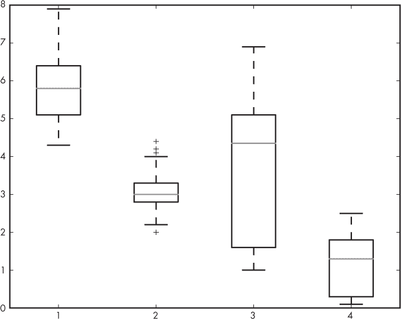
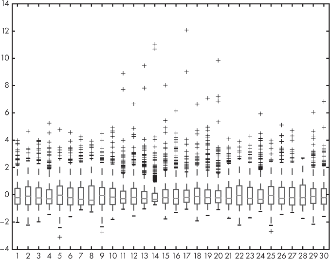
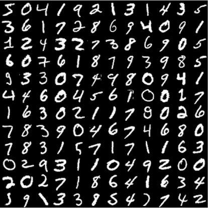
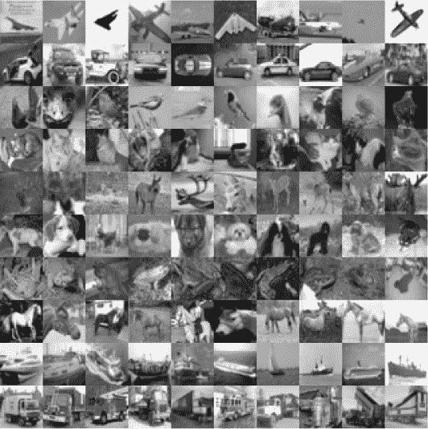
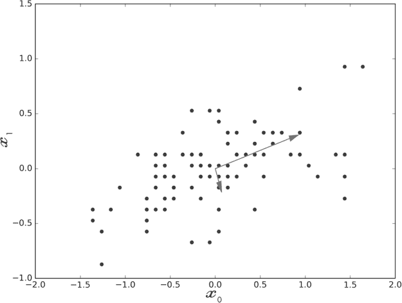
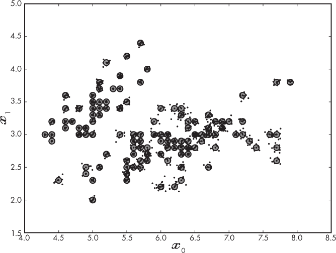
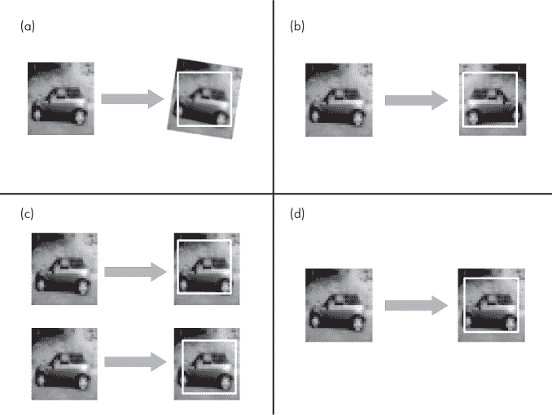

## 第五章：构建数据集**


前一章提供了很多详细的建议。现在让我们将这些建议付诸实践，构建在本书剩余部分将使用的数据集。这些数据集有些非常适合传统模型，因为它们由特征向量组成。而另一些则更适合使用多维输入的深度学习模型——特别是图像，或是可以视作图像的东西。

我们将通过获取原始数据并对其进行预处理，使其适合我们的工具进行处理。在我们将这些数据集应用于具体模型之前，不会进行实际的训练/验证/测试划分。值得注意的是，预处理数据以使其适合模型，通常是机器学习中最为繁重的任务之一。尽管如此，如果这一步没有做好，或者做得不充分，你的模型可能会远不如预期有用。

### 鸢尾花

也许所有机器学习数据集中最经典的是鸢尾花数据集，它由 R. A. Fisher 于 1936 年在论文《多重测量在分类问题中的应用》中提出。这是一个包含三个类别的小型数据集，每个类别有 50 个样本。数据集有四个特征：花萼宽度、花萼长度、花瓣宽度和花瓣长度，单位为厘米。这三个类别是*I. setosa*、*I. versicolor*和*I. virginica*。该数据集已内置于 sklearn 中，但我们将从加利福尼亚大学欧文分校机器学习库下载它，以便练习使用外部数据源，并引入一个适合许多传统机器学习模型的数据集合集。主库位于*[`archive.ics.uci.edu/ml/index.php`](https://archive.ics.uci.edu/ml/index.php)*，但你可以直接从*[`archive.ics.uci.edu/ml/datasets/iris/`](https://archive.ics.uci.edu/ml/datasets/iris/)*下载鸢尾花数据集。

截至本文撰写时，该数据集已被下载近 180 万次。你可以通过点击页面顶部附近的**数据文件夹**链接，然后右键点击并保存*iris.data*文件，最好保存到一个名为*iris*的新目录中。我们来看一下这个文件的开头：

```py
5.1,3.5,1.4,0.2,Iris-setosa

4.9,3.0,1.4,0.2,Iris-setosa

4.7,3.2,1.3,0.2,Iris-setosa

4.6,3.1,1.5,0.2,Iris-setosa

5.0,3.6,1.4,0.2,Iris-setosa

5.4,3.9,1.7,0.4,Iris-setosa

4.6,3.4,1.4,0.3,Iris-setosa
```

由于每行末尾的类别名称都相同，我们应该立即怀疑样本是按类别排序的。查看文件的其余部分证实了这一点。因此，正如第四章中强调的那样，我们必须在训练模型之前确保对数据进行随机化。此外，我们还需要将类别名称替换为整数标签。我们可以通过清单 5-1 中的脚本将数据集加载到 Python 中。

import numpy as np

❶ with open("iris.data") as f:

lines = [i[:-1] for i in f.readlines()]

❷ n = ["Iris-setosa", "Iris-versicolor", "Iris-virginica"]

x = [n.index(i.split(",")[-1]) for i in lines if i != ""]

x = np.array(x, dtype="uint8")

❸ y = [[float(j) for j in i.split(",")[:-1]] for i in lines if i != ""]

y = np.array(y)

❹ i = np.argsort(np.random.random(x.shape[0]))

x = x[i]

y = y[i]

❺ np.save("iris_features.npy", y)

np.save("iris_labels.npy", x)

*列表 5-1：加载原始的鸢尾花数据集并映射到我们的标准格式*

首先，我们加载包含数据的文本文件。列表推导式去除了多余的换行符❶。接下来，我们通过将文本标签转换为整数（0–2）来创建标签向量。通过按逗号拆分每行，列表中的最后一个元素是文本标签。我们需要的是 NumPy 数组，因此将列表转换为一个。`uint8` 类型是多余的，但由于标签从不为负且不超过 2，我们通过将数据类型设为无符号 8 位整数来节省一些空间❷。

接下来通过双重列表推导式创建 150 行 4 列的特征向量。外部推导式（`i`）遍历文件中的每一行，内部推导式（`j`）将每个样本的测量值转换为浮动小数。然后，我们将这个列表列表转换为 2D NumPy 数组❸。最后，我们像之前一样随机化数据集❹，并最终将 NumPy 数组写入磁盘，以便稍后使用❺。

图 5-1 显示了特征的箱线图。这个数据集表现良好，但第二个特征确实可能存在一些离群值。由于所有特征的尺度相似，我们将保持特征原样使用。



*图 5-1：四个鸢尾花数据集特征的箱线图*

### 乳腺癌

我们的第二个数据集，威斯康星乳腺癌诊断数据集，也包含在 sklearn 中，你也可以从 UCI 机器学习库下载。我们将遵循之前的步骤，下载数据集并查看如何处理它。虽然看起来这似乎没有必要，但正如构建一个良好的数据集对于训练一个好模型至关重要一样，学习如何处理格式不符合我们需求的数据源同样重要。如果有一天你决定将机器学习和数据科学作为职业，你将几乎每天都会遇到这个问题。

下载数据集，访问 *[`archive.ics.uci.edu/ml/datasets/Breast+Cancer+Wisconsin+(Diagnostic)/`](https://archive.ics.uci.edu/ml/datasets/Breast+Cancer+Wisconsin+(Diagnostic)/)*。然后，点击 **Data Folder** 链接，保存 *wdbc.data* 文件。

该数据集包含从乳腺肿块的细针穿刺活检切片中获取的细胞测量数据。数据集包含 30 个连续特征和两个类别：恶性（癌症，212 个样本）和良性（无癌症，357 个样本）。这个数据集也非常流行，下载量超过 67 万次。文件的第一行如下所示：

```py
842302,M,17.99,10.38,122.8,1001,0.1184, ...
```

那一行的第一个元素是病人的 ID 号，我们不需要担心。第二个元素是标签——*M*代表恶性，*B*代表良性。该行的其余数字是与细胞大小相关的 30 个测量值。特征本身的量纲不同，因此除了创建原始数据集外，我们还将创建一个标准化版本。由于这就是数据集的全部内容，并且我们将需要保留一部分数据用于测试，所以在这种情况下我们不需要记录每个特征的均值和标准差。如果我们能够获得更多类似的生成数据，可能来自一个被遗忘的旧文件，我们就需要保留这些值，以便能够标准化新的输入。构建此数据集并生成汇总箱形图的脚本在清单 5-2 中。

import numpy as np

import matplotlib.pyplot as plt

❶ with open("wdbc.data") as f:

lines = [i[:-1] for i in f.readlines() if i != ""]

❷ n = ["B", "M"]

x = np.array([n.index(i.split(",")[1]) for i in lines], dtype="uint8")

y = np.array([[float(j) for j in i.split(",")[2:]] for i in lines])

i = np.argsort(np.random.random(x.shape[0]))

x = x[i]

y = y[i]

z = (y - y.mean(axis=0)) / y.std(axis=0)

❸ np.save("bc_features.npy", y)

np.save("bc_features_standard.npy", z)

np.save("bc_labels.npy", x)

plt.boxplot(z)

plt.show()

*清单 5-2：加载原始乳腺癌数据集*

我们首先做的是读取原始文本数据 ❶。然后，我们提取每个标签，并将其映射为 0 表示良性，1 表示恶性。请注意，这里我们使用 1 表示自然目标情况，这样输出概率值的模型就可以指示是否发现癌症的可能性 ❷。我们使用嵌套的列表推导式提取每个样本的 30 个特征值，并将它们转换为浮动类型（`i`是特征的文本值，`j`是转换后的浮动值）。这将生成一个嵌套列表，NumPy 将其方便地转换成一个包含 569 行和 30 列的矩阵。

接下来，我们对数据集进行随机化，并通过减去每个特征的均值并除以标准差来计算标准化版本。我们将使用这个版本，并在图 5-2 ❸的箱形图中对其进行分析，该图展示了所有 30 个特征标准化后的结果。



*图 5-2：30 个乳腺癌数据集特征的箱形图*

在这种情况下，我们不需要知道特征代表什么。我们将假设所选的特征对于确定恶性程度的任务是足够的。我们的模型将告诉我们这种假设是否成立。现在，这些特征的尺度都是相同的，从我们在 y 轴上看到的框的位置可以看出：它们基本覆盖了相同的范围。数据的一个显著特征立刻显现出来——即，存在许多明显的异常值，正如四分位数范围所指出的（见图 4-6）。这些值不一定是错误的，但它们表明数据并不是正态分布的——每个特征都没有呈现钟形曲线型分布。

### MNIST 手写数字

我们的下一个数据集通常不是由特征向量组成的，而是由成千上万张手写数字的小图像构成。这个数据集是现代机器学习中的工作马，也是深度学习研究者在测试新想法时首选的第一个数据集。它虽然过于使用，但也正因为它如此容易理解且便于使用。

这个数据集有着悠久的历史，但我们将使用的版本——最常见的版本——被简单地称为*MNIST 数据集*。该数据集的标准来源，[`yann.lecun.com/exdb/mnist/`](http://yann.lecun.com/exdb/mnist/)，包含了一些背景材料。为了节省时间，我们将使用 Keras 来下载并格式化数据集。

Keras 会将数据集以 3D NumPy 数组的形式返回。第一维是图像的数量——60,000 张用于训练，10,000 张用于测试。第二维和第三维是图像的像素。图像的大小为 28×28 像素。每个像素是一个无符号 8 位整数，[0,255]。

因为我们想要使用期望输入为向量的模型，并且希望使用这个数据集来说明书中后续章节中模型的一些特性，我们将从这个初始数据集中创建额外的数据集。为此，首先我们将展开图像以形成特征向量，这样我们就可以将这个数据集与传统模型一起使用，这些模型期望输入为向量。其次，我们将使用图像，但我们会打乱数据集中图像的顺序。我们将以相同的方式打乱每张图像的像素顺序，因此，尽管这些像素不再按照生成数字图像的顺序排列，但这种重排是确定性的，并且会在所有图像中一致地应用。第三，我们将创建这些打乱图像的展开特征向量版本。我们将使用这些额外的数据集来探索传统神经网络与卷积神经网络模型之间的差异。

使用清单 5-3 来构建数据集文件。

import numpy as np

import keras

from keras.datasets import mnist

❶ (xtrn, ytrn), (xtst, ytst) = mnist.load_data()

idx = np.argsort(np.random.random(ytrn.shape[0]))

xtrn = xtrn[idx]

ytrn = ytrn[idx]

idx = np.argsort(np.random.random(ytst.shape[0]))

xtst = xtst[idx]

ytst = ytst[idx]

np.save("mnist_train_images.npy", xtrn)

np.save("mnist_train_labels.npy", ytrn)

np.save("mnist_test_images.npy", xtst)

np.save("mnist_test_labels.npy", ytst)

❷ xtrnv = xtrn.reshape((60000,28*28))

xtstv = xtst.reshape((10000,28*28))

np.save("mnist_train_vectors.npy", xtrnv)

np.save("mnist_test_vectors.npy", xtstv)

❸ idx = np.argsort(np.random.random(28*28))

for i in range(60000):

xtrnv[i,:] = xtrnv[i,idx]

for i in range(10000):

xtstv[i,:] = xtstv[i,idx]

np.save("mnist_train_scrambled_vectors.npy", xtrnv)

np.save("mnist_test_scrambled_vectors.npy", xtstv)

❹ t = np.zeros((60000,28,28))

for i in range(60000):

t[i,:,:] = xtrnv[i,:].reshape((28,28))

np.save("mnist_train_scrambled_images.npy", t)

t = np.zeros((10000,28,28))

for i in range(10000):

t[i,:,:] = xtstv[i,:].reshape((28,28))

np.save("mnist_test_scrambled_images.npy", t)

*清单 5-3：加载和构建各种 MNIST 数据集*

我们首先告诉 Keras 加载 MNIST 数据集❶。当第一次运行时，Keras 会显示一条关于下载数据集的消息。之后，它不会再显示此消息。

数据集本身存储在四个 NumPy 数组中。第一个 `xtrn` 具有形状 (60000, 28, 28)，用于存储 60,000 张训练图像，每张 28×28 像素。相应的标签存储在 `ytrn` 中，标签为整数 [0,9]。10,000 张测试图像存储在 `xtst` 中，标签存储在 `ytst`。我们还对样本的顺序进行了随机化，并将这些数组写入磁盘以便日后使用。

接下来，我们将训练和测试图像展开，并将其转换为包含 784 个元素的向量❷。展开操作将第一行像素放在前面，然后是第二行，以此类推，直到所有行按顺序排列在一起。由于 28 × 28 = 784，因此我们得到 784 个元素。

接下来，我们生成 784 个元素的无序向量排列（`idx`）❸。

我们使用排列后的向量来形成新的、打乱的数字图像并将其存储到磁盘上❹。打乱的图像通过对打乱后的向量进行反向展开操作生成。在 NumPy 中，这只是对向量数组调用 `reshape` 方法的过程。请注意，我们在任何时候都没有改变图像的相对顺序，因此我们只需要为训练集和测试集标签各存储一个文件。

图 5-3 显示了 MNIST 数据集中的代表性数字。



*图 5-3：MNIST 代表性数字图像*

我们不需要对图像进行标准化，因为我们知道它们已经处于相同的尺度，因为它们是像素值。我们在使用时会对它们进行缩放，但现在可以将它们保留为字节灰度图像存储在磁盘上。数据集相对平衡；表 5-1 显示了训练集的分布。因此，我们不需要担心数据不平衡问题。

**表 5-1：** MNIST 训练集的数字频率

| **数字** | **计数** |
| --- | --- |
| 0 | 5,923 |
| 1 | 6,742 |
| 2 | 5,958 |
| 3 | 6,131 |
| 4 | 5,842 |
| 5 | 5,421 |
| 6 | 5,918 |
| 7 | 6,265 |
| 8 | 5,851 |
| 9 | 5,949 |

### CIFAR-10

*CIFAR-10* 是另一个标准的深度学习数据集，足够小，使用时无需大量训练时间或 GPU。与 MNIST 一样，我们可以使用 Keras 提取数据集，第一次请求时它将自动下载。CIFAR-10 的源页面地址是 *https://www.cs.toronto.edu/\%7Ekriz/cifar.html*。

值得浏览一下页面，了解数据集的来源。它包含来自 10 个类别的 60,000 张 32×32 像素的 RGB 图像，每个类别有 6,000 个样本。训练集包含 50,000 张图像，测试集包含 10,000 张图像。10 个类别在表 5-2 中展示。

**表 5-2：** CIFAR-10 类别标签和名称

| 标签 | 类别 |
| --- | --- |
| 0 | 飞机 |
| 1 | 汽车 |
| 2 | 鸟 |
| 3 | 猫 |
| 4 | 鹿 |
| 5 | 狗 |
| 6 | 青蛙 |
| 7 | 马 |
| 8 | 船 |
| 9 | 卡车 |

图 5-4 按行展示了每个类别的代表性图像集合。我们将提取数据集，存储以供未来使用，并创建向量表示，就像我们对 MNIST 所做的那样。



*图 5-4：代表性的 CIFAR-10 图像*

执行这一切的脚本在清单 5-4 中。

import numpy as np

import keras

from keras.datasets import cifar10

❶ (xtrn, ytrn), (xtst, ytst) = cifar10.load_data()

idx = np.argsort(np.random.random(ytrn.shape[0]))

xtrn = xtrn[idx]

ytrn = ytrn[idx]

idx = np.argsort(np.random.random(ytst.shape[0]))

xtst = xtst[idx]

ytst = ytst[idx]

np.save("cifar10_train_images.npy", xtrn)

np.save("cifar10_train_labels.npy", ytrn)

np.save("cifar10_test_images.npy", xtst)

np.save("cifar10_test_labels.npy", ytst)

❷ xtrnv = xtrn.reshape((50000,32*32*3))

xtstv = xtst.reshape((10000,32*32*3))

np.save("cifar10_train_vectors.npy", xtrnv)

np.save("cifar10_test_vectors.npy", xtstv)

*清单 5-4：加载并构建各种 CIFAR-10 数据集*

我们首先从 Keras 加载 CIFAR-10 ❶。与 MNIST 一样，数据集将在第一次运行代码时自动下载。而且，与 MNIST 一样，我们会随机化训练和测试数据的分配。训练数据在`xtrn`中，形状为(50,000; 32; 32; 3)的数组。最后一个维度代表每个像素的三个颜色分量：红色、绿色和蓝色。测试数据类似，存储在`xtst`中，形状为(10,000; 32; 32; 3)的数组。最后，我们将随机化的训练和测试图像写入磁盘。接下来，我们将图像展开，生成 32 × 32 × 3 = 3072 个元素的特征向量表示这些图像 ❷，并将其写入磁盘。

### 数据增强

正如我们在第四章中看到的，数据集是至关重要的，因此它需要尽可能完整。通常，你可以通过仔细选择符合模型在使用时可能遇到的输入范围的样本来实现这一点。回想我们之前的类比，我们希望模型能够*插值*而不是*外推*。但有时候，即使我们有广泛的可能样本，我们实际上也没有很多样本。这时，数据增强就可以发挥作用。

*数据增强*利用现有数据集中的数据生成新的可能样本，加入到数据集中。这些样本总是以某种方式基于现有数据。数据增强是一项强大的技术，尤其在我们的实际数据集较小时，它特别有用。从实际角度来看，数据增强应该在可行的情况下尽可能使用。

数据增强通过修改我们已有的数据来创建新的样本，这些新样本可能来自与我们实际数据相同的母体分布。这意味着，如果我们有足够的耐心继续收集真实数据，我们可以测量这些新的样本。有时，数据增强可以超越我们实际测量的内容，但仍然能帮助模型学习如何推广到实际数据。例如，使用图像作为输入的模型可能从不现实的颜色或背景中受益，尽管实际输入模型时不会使用这些颜色或背景。

尽管数据增强在许多情况下都有效，并且是深度学习中的主流技术，但并不是所有数据都能通过增强得到有效提升，因此你并不总是能够使用它。

在本节中，我们将探讨为什么我们需要考虑使用数据增强以及如何进行增强。然后，我们将增强之前开发的两个数据集，这样在构建模型时，我们可以看到增强如何影响模型的学习。关于数据增强，这里有一个经验法则：一般来说，只要可能，尤其是当数据集较小时，你应该进行数据增强。

#### 为什么你应该增强训练数据？

在第四章中，我们遇到了维度灾难。我们看到，对于许多模型来说，解决方案是通过更多的训练数据来填充可能的输入空间。数据增强是我们填充这个空间的一种方式。未来我们将需要这么做；例如，在第六章中，我们将会接触到*k*-最近邻分类器，可能是所有分类器中最简单的一种。

这个分类器关键依赖于有足够的训练数据来充分填充输入特征空间。如果有三个特征，那么空间是三维的，训练数据将适合在这个空间中的某个立方体内。我们拥有的训练数据越多，立方体中的样本就越多，分类器的表现也就越好。这是因为分类器测量的是训练数据中各点与新输入特征向量之间的距离，并根据距离投票决定要分配哪个标签。训练数据点在空间中的分布越密集，投票过程成功的几率就越大。宽泛来说，数据增强填补了这个空间。对于大多数数据集来说，获取更多的数据，即获取更多来自父分布的样本，并不能填补特征空间的每一部分，但它会创造出一幅越来越完整的父分布在特征空间中的图像。

当我们使用现代深度学习模型时（第十二章），我们将看到数据增强有额外的好处。在训练过程中，神经网络会逐渐学会训练数据中的特征。如果网络学会关注的特征确实有助于区分类别，那么一切都很好。但正如我们在第四章中看到的狼与哈士奇的例子，有时网络会学到错误的东西，这些错误的特征无法用于泛化到新的输入——就像狼类图像背景有雪，而哈士奇图像没有雪一样。

避免这种倾向的措施被称为*正则化*。正则化帮助网络学习训练数据中重要的特征，这些特征能够按我们希望的方式进行泛化。数据增强是——除非获取更多实际数据——也许是正则化网络学习过程的最简单方式。它使学习过程不关注训练集中特定样本的特征，而是聚焦于数据的更一般性特征。至少，这是我们的期望。

数据增强的另一个好处是，它可以减少训练时过拟合的可能性。我们将在第九章中更详细地讨论过拟合，但简而言之，过拟合是指模型几乎完美地学习了训练数据，但没有学会如何泛化到新的输入数据。如果使用小数据集，模型可能会将训练数据“记住”，从而导致过拟合。数据增强通过增加数据集的大小，降低了过拟合的概率，并可能允许使用更大容量的模型。（容量是一个模糊的概念。可以理解为“更大”，即模型可以学习到训练数据中更多重要的内容，同时还能泛化到新的数据上。）

关于数据增强与训练/验证/测试集划分相关的一个极其重要的点是：你*必须*确保每个增强样本属于相同的集。例如，如果我们增强了样本*X*[12345]，并且这个样本被分配到了训练集，那么我们必须确保基于*X*[12345]增强的*所有*样本也属于训练集。这一点非常重要，值得再次强调：*确保永远不要将基于原始样本的增强样本混入训练、验证和测试集中*。

如果我们不遵循这个规则，我们对模型质量的信念将是没有依据的，或者至少是部分不成立的，因为验证集和测试集中的样本本质上也在训练集中，因为它们基于训练数据。这条警告看起来可能不必要，但实际上很容易犯这个错误，特别是在与他人合作或使用某种数据库时。

正确的数据增强方法是在训练、验证和测试集划分完成后进行的。然后，至少增强训练数据，并将所有新样本标记为训练数据。

那么，增强验证集和测试集怎么样？这样做并不错误，如果你没有很多验证集或测试集数据，这样做可能是有意义的。我还没看到有研究严格探讨增强验证集和测试数据的效果，但从概念上讲，这不会有什么坏处，甚至可能有所帮助。

#### 增强训练数据的方法

为了增强数据集，我们需要从中生成新的、合理的样本，即这些样本在数据集中是可能出现的。对于图像，这很简单；你可以经常旋转图像，或水平、垂直翻转图像。其他时候，你可以直接操作像素，改变对比度或调整颜色。有些方法甚至会直接交换整个颜色通道——例如交换红色通道和蓝色通道。

当然，操作必须合理。细微的旋转可能模仿相机方向的变化，左右翻转可能模拟照镜子的体验。但上下翻转可能就不那么真实了。的确，猴子可能会在画面中倒挂，但翻转画面也会翻转树和地面。另一方面，你可能能够在航空影像中进行上下翻转，因为航空影像展示了任意方向的物体。

好的，图像通常很容易增强，而且很容易理解增强是否合理。特征向量的增强则更加微妙。它并不总是那么明显，如何操作，甚至是否可能进行增强。那我们该怎么做呢？

再次强调，指导原则是增强操作必须合理。如果我们将颜色编码为一个独热向量，例如红色、绿色或蓝色，并且一个类别的实例可以是红色、绿色或蓝色，那么一种增强方法就是在红色、绿色和蓝色之间切换颜色。如果一个样本可以表示男性或女性，那么我们也可以改变这些值，从而获得一个性别不同但类别相同的新样本。

然而，这些做法比较不常见。通常，你会尝试增强连续值，创建一个仍能代表原始类别的新特征向量。接下来，我们将通过增强鸢尾花数据集来研究这种方法。之后，我们将增强 CIFAR-10 数据集，看看如何处理图像。

#### 增强鸢尾花数据集

鸢尾花数据集包含来自三个类别的 150 个样本，每个样本有四个连续特征。我们将通过使用*主成分分析（PCA）*来增强该数据集。这是一种使用了超过一个世纪的老技术。在深度学习出现之前，它在机器学习中很常见，用于应对维度灾难，因为它可以减少数据集中的特征数量。它在机器学习之外也有多种用途。

假设我们有一个只有两个特征的数据集——例如，鸢尾花数据集的前两个特征。这些特征的散点图将显示样本在二维空间中的分布。图 5-5 展示了鸢尾花数据集类别 1 和类别 2 的前两个特征的图像。该图通过减去每个特征的均值，将原点移动到(0,0)位置。这样做不会改变数据的方差或分散程度，只是改变了其原点。

图 5-5 中的图还显示了两条箭头。这是数据的两个主成分。由于数据是二维的，所以我们有两个成分。如果我们有 100 个特征，那么就会有最多 100 个主成分。这就是 PCA 的作用：它告诉你数据方差的方向。这些方向就是*主成分*。



*图 5-5：类别 1 和类别 2 的前两个鸢尾花特征及其主成分*

主成分还告诉你每个方向解释的数据方差的多少。在图中，箭头的长度对应于每个成分解释的总方差的比例。如你所见，最大的成分位于与数据点最大散布匹配的对角线方向。传统的机器学习方法使用 PCA 来减少特征数量，同时仍然尽量保留数据集的表示。这就是 PCA 如何帮助应对维度灾难的方法：找到主成分，然后舍弃那些影响较小的成分。然而，对于数据增强，我们希望保留所有成分。

生成图 5-5 的代码位于清单 5-5 中。

import numpy as np

import matplotlib.pylab as plt

from sklearn import decomposition

❶ x = np.load("../data/iris/iris_features.npy")[:,:2]

y = np.load("../data/iris/iris_labels.npy")

idx = np.where(y != 0)

x = x[idx]

x[:,0] -= x[:,0].mean()

x[:,1] -= x[:,1].mean()

❷ pca = decomposition.PCA(n_components=2)

pca.fit(x)

v = pca.explained_variance_ratio_

❸ plt.scatter(x[:,0],x[:,1],marker='o',color='b')

ax = plt.axes()

x0 = v[0]*pca.components_[0,0]

y0 = v[0]*pca.components_[0,1]

ax.arrow(0, 0, x0, y0, head_width=0.05, head_length=0.1, fc='r', ec='r')

x1 = v[1]*pca.components_[1,0]

y1 = v[1]*pca.components_[1,1]

ax.arrow(0, 0, x1, y1, head_width=0.05, head_length=0.1, fc='r', ec='r')

plt.xlabel("$x_0$", fontsize=16)

plt.ylabel("$x_1$", fontsize=16)

plt.show()

*清单 5-5: 鸢尾花 PCA 图*

上面的代码大部分是为了绘制图形 ❸。导入的模块是标准的，除了从 sklearn 导入的`decomposition`模块。我们加载之前保存的鸢尾花数据集，只保留`x`中的前两个特征，`y`中的标签。然后通过排除类 0 的特征，只保留类 1 和类 2 的特征。接着，我们通过减去每个特征的均值来将数据集中在点(0,0)周围 ❶。

然后我们创建 PCA 对象并将鸢尾花数据拟合到它上面 ❷。有两个特征，所以在这种情况下，成分数也是两个。PCA Python 类模仿了 sklearn 的标准方法：首先定义模型，然后拟合数据。一旦完成，我们就可以通过`components_`成员变量访问存储在`pca`中的主成分。我们将`v`设置为一个向量，表示数据中每个主成分方向解释的方差的比例。由于有两个成分，这个向量也有两个成分。

成分总是按降序排列，因此第一个成分是描述大部分方差的方向，第二个成分是下一个最重要的方向，以此类推。在这种情况下，第一个成分描述了大约 84%的方差，第二个成分描述了剩下的 16%。我们在生成新的增强样本时会使用这种排序。这里我们使用方差比例来缩放图中显示的箭头的长度，以表示主成分方向及其相对重要性。

如何使用图 5-5 进行数据增强？一旦你知道了主成分，就可以使用 PCA 来创建派生变量，这意味着你将数据旋转，使其与主成分对齐。PCA 类的`transform`方法通过将输入（在我们这里是原始数据）映射到一个新的表示来实现这一点，在这个新的表示中，方差与主成分对齐。这个映射是精确的，你可以通过使用`inverse_transform`方法将其逆向操作。

单独这样做并不会为我们生成新的样本。如果我们将原始数据`x`转换为新的表示形式，然后再进行反向转换，我们将会回到原始的`x`。但是，如果我们先转换`x`，然后在调用反向转换之前，*修改*一些主成分，我们将得到一组新的样本，这些样本不等于`x`，但基于`x`。这正是我们想要的数据增强方法。接下来，我们将看到哪些主成分需要修改，以及如何修改。

这些主成分在`pca`中按其重要性排序。我们希望保持最重要的主成分不变，因为我们希望反向转换产生的数据看起来尽可能接近原始数据。我们不希望对数据进行过度转换，否则新生成的样本就不再是我们所声明的类的合理实例。我们可以随便说，我们希望保留那些累计表示数据方差的 90%到 95%的主成分。这些主成分我们将完全不做修改。剩余的主成分将通过添加正态分布的噪声进行修改。请记住，*正态分布*意味着它遵循钟形曲线，大多数情况下其值会接近中间值，我们将中间值设为 0，表示该主成分不变，且随着值的增大，变化的频率越来越低。我们将噪声添加到现有主成分中，并调用反向转换来生成新的样本，这些样本与原始样本非常相似，但不完全相同。

上一段内容比较密集，代码会让理解变得更容易。我们生成增强数据的方法在 Listing 5-6 中展示。

import numpy as np

from sklearn import decomposition

❶ def generateData(pca, x, start):

original = pca.components_.copy()

ncomp = pca.components_.shape[0]

a = pca.transform(x)

for i in range(start, ncomp):

pca.components_[i,:] += np.random.normal(scale=0.1, size=ncomp)

b = pca.inverse_transform(a)

pca.components_ = original.copy()

return b

def main():

❷ x = np.load("../../../data/iris/iris_features.npy")

y = np.load("../../../data/iris/iris_labels.npy")

N = 120

x_train = x[:N]

y_train = y[:N]

x_test = x[N:]

y_test = y[N:]

pca = decomposition.PCA(n_components=4)

pca.fit(x)

print(pca.explained_variance_ratio_)

start = 2

❸ nsets = 10

nsamp = x_train.shape[0]

newx = np.zeros((nsets*nsamp, x_train.shape[1]))

newy = np.zeros(nsets*nsamp, dtype="uint8")

❹ for i in range(nsets):

if (i == 0):

newx[0:nsamp,:] = x_train

newy[0:nsamp] = y_train

else:

newx[(i*nsamp):(i*nsamp+nsamp),:] =

generateData(pca, x_train, start)

newy[(i*nsamp):(i*nsamp+nsamp)] = y_train

❺ idx = np.argsort(np.random.random(nsets*nsamp))

newx = newx[idx]

newy = newy[idx]

np.save("iris_train_features_augmented.npy", newx)

np.save("iris_train_labels_augmented.npy", newy)

np.save("iris_test_features_augmented.npy", x_test)

np.save("iris_test_labels_augmented.npy", y_test)

main()

*Listing 5-6: 使用 PCA 增强鸢尾花数据。见* iris_data_augmentation.py。

`main` 函数❷加载现有的鸢尾花数据，`x`，以及相应的标签，`y`，然后调用 PCA，这次使用数据集中的所有四个特征。这将给我们四个主成分，告诉我们每个成分解释的方差是多少：

```py
0.92461621 0.05301557 0.01718514 0.00518309
```

前两个主成分描述了超过 97%的方差。因此，我们将保留前两个成分不变，即索引 0 和 1，在我们想生成新样本时，从索引 2 开始。

接下来，我们声明我们将定义的集合数量❸。这里的*集合*指的是一组新的样本。由于这些样本基于原始数据`x`，并且每组有 150 个样本，因此每个新集合也将包含 150 个样本。事实上，它们的顺序与原始样本相同，因此每个新样本对应的类别标签将与 `y` 中的类别标签顺序一致。我们也不想丢失原始数据，因此 `nsets=10` 将原始数据和基于原始数据生成的九组新样本放在一起——总共 1,500 个样本——进入新的数据集中。我们抓取 `x` 中样本的数量 150，并定义数组来保存我们的新特征（`newx`）和关联的标签（`newy`）。

接下来，我们循环生成新样本，每次生成一组 150 个样本❹。第一次循环只是将原始数据复制到输出数组中。其余的循环类似，适当地更新输出数组的源和目标索引，但不是赋值 `x`，而是赋值 `generateData` 的输出。当循环完成时，我们将整个数据集的顺序打乱，并将其写入磁盘❺。

所有的魔法都在 `generateData` ❶ 中。我们传入 PCA 对象（`pca`）、原始数据（`x`）和起始主成分索引（`start`）。我们将最后一个参数设为 2，以保留最重要的两个成分不变。我们保留实际成分的副本，以便在返回之前重置`pca`对象。接着，我们定义 `ncomp`，主成分的数量，方便起见，并调用前向变换，将原始数据映射到主成分上。

循环通过添加一个从正态曲线中抽取的随机值来更新两个最不重要的成分，该值的均值为 0，标准差为 0.1。为什么是 0.1？没有特别的原因；如果标准差较小，那么新样本将接近旧样本，而如果标准差较大，它们将更远，甚至可能不再代表该类别。接着，我们使用修改后的主成分调用逆变换，并恢复实际的成分。最后，我们返回新的样本集合。

让我们看看新的数据集，如图 5-6 所示。大灰点来自我们原始的数据集，而较小的黑点则是增强后的样本。我们可以清楚地看到，所有的点都靠近现有的样本，这正是我们从仅修改最弱主成分时所期望的结果。由于我们将原始数据复制到增强数据集中，所以每个大点的中心都有一个小点。



*图 5-6：原始虹膜数据集的前两个特征（大点）与通过清单 5-6 生成的增强特征（小点）*

这种方法仅适用于连续特征，正如之前所述，你应该小心只修改最弱的主成分，而且修改幅度要小。实验在这里非常重要。作为练习，尝试应用相同的技术来增强乳腺癌数据集，它也由连续特征组成。

#### 增强 CIFAR-10 数据集

增强虹膜数据集涉及了很多讨论以及一些不太显而易见的数学问题。幸运的是，增强图像通常要简单得多，但在训练现代模型时同样有效。当我们构建卷积神经网络模型时（第十二章），我们将看到如何在训练过程中动态进行数据增强，这是一种特别有帮助的方法，但现在我们首先进行增强，创建一个包含现有图像的额外版本的新数据集。

图 5-4 展示了 CIFAR-10 数据集中每个类别的代表性图像。这些是存储为 RGB 数据的彩色图像，分别表示红色、绿色和蓝色通道。它们是在地面水平拍摄的，因此上下翻转在这里没有意义，而左右翻转则有意义。平移—将图像在 *x* 或 *y* 方向（或两者）上平移—是一种常见技术。小角度旋转是另一种常见技术。

然而，每种方法都会引发一个问题：如何处理在平移或旋转后没有数据的像素？例如，如果我将图像平移 3 个像素到左边，我需要用某些内容填充右边的三个列。或者，如果我向右旋转图像，那么右上角和左下角会有一些需要填充的像素。处理这些问题有几种方法。一种方法是简单地将这些像素保持为黑色，或者全是 0 值，让模型学习到这些地方没有有用信息。另一种方法是用图像的均值替换这些像素，这样也不会提供任何信息，并且我们希望模型能忽略这些区域。然而，最常见的解决方案是裁剪图像。

这张图像是 32×32 像素。我们从图像中随机抽取一个 28×28 像素的补丁，相当于将图像在随机的*x*或*y*位置上平移最多 4 个像素，而无需担心填补空白像素。如果我们先旋转图像，旋转过程中会进行像素插值，然后再裁剪去除边缘区域，这时我们仍然不需要担心空白像素。Keras 提供了通过图像生成器对象来执行这些操作的工具，这个生成器在训练过程中使用。我们在使用 Keras 构建模型时会利用这个工具，但为了理解整个过程，暂时我们自己手动完成所有这些操作。

我们需要在这里提到一点。到目前为止，我们讨论的是如何为训练模型构建数据集。那么，当我们想要使用模型时该怎么办呢？我们是否也会给模型提供测试输入的随机裁剪？不，正确的做法是给模型提供一个以图像中心为基准的裁剪。所以，对于 CIFAR-10，我们会将每个 32 × 32 的测试输入裁剪成 28 × 28，去掉外侧 6 个像素，然后将其输入模型。我们这么做是因为中心裁剪仍然代表了实际的测试图像，而不是某种增强版本的图像。

图 5-7 说明了我们所说的旋转、翻转、训练时的随机裁剪和测试时的中心裁剪的含义。在(a)中，我们旋转图像并进行中心裁剪，输出图像位于白色方框内。在(b)中，我们进行左右翻转并随机裁剪。在(c)中，我们做两个随机裁剪，但不进行翻转；在(d)中，我们对测试图像进行中心裁剪，且不进行旋转或翻转。有些人会对测试图像进行增强，但我们在这里不这么做。



*图 5-7：旋转，然后中心裁剪（a）。左右翻转，然后随机裁剪（b）。训练时的两个随机裁剪（c）。测试时的中心裁剪，不旋转或翻转（d）。*

列表 5-7 展示了如何通过随机裁剪、旋转和翻转来增强 CIFAR-10 训练集。

import numpy as np

from PIL import Image

❶ def augment(im, dim):

img = Image.fromarray(im)

if (np.random.random() < 0.5):

img = img.transpose(Image.FLIP_LEFT_RIGHT)

if (np.random.random() < 0.3333):

z = (32-dim)/2

r = 10*np.random.random()-5

img = img.rotate(r, resample=Image.BILINEAR)

img = img.crop((z,z,32-z,32-z))

else:

x = int((32-dim-1)*np.random.random())

y = int((32-dim-1)*np.random.random())

img = img.crop((x,y,x+dim,y+dim))

return np.array(img)

def main():

❷ x = np.load("../data/cifar10/cifar10_train_images.npy")

y = np.load("../data/cifar10/cifar10_train_labels.npy")

factor = 10

dim = 28

z = (32-dim)/2

newx = np.zeros((x.shape[0]*factor, dim,dim,3), dtype="uint8")

newy = np.zeros(y.shape[0]*factor, dtype="uint8")

k=0

❸ for i in range(x.shape[0]):

im = Image.fromarray(x[i,:])

im = im.crop((z,z,32-z,32-z))

newx[k,...] = np.array(im)

newy[k] = y[i]

k += 1

for j in range(factor-1):

newx[k,...] = augment(x[i,:], dim)

newy[k] = y[i]

k += 1

idx = np.argsort(np.random.random(newx.shape[0]))

newx = newx[idx]

newy = newy[idx]

np.save("../data/cifar10/cifar10_aug_train_images.npy", newx)

np.save("../data/cifar10/cifar10_aug_train_labels.npy", newy)

❹ x = np.load("../data/cifar10/cifar10_test_images.npy")

newx = np.zeros((x.shape[0], dim, dim, 3), dtype="uint8")

对于 i 在 range(x.shape[0]) 中：

im = Image.fromarray(x[i,:])

im = im.crop((z, z, 32-z, 32-z))

newx[i,...] = np.array(im)

np.save("../data/cifar10/cifar10_aug_test_images.npy", newx)

*清单 5-7：增强 CIFAR-10 数据集。见* cifar10_augment.py。

`main` 函数加载现有数据集并定义我们的增强因子、裁剪大小和一个用于定义中心裁剪的常量❷。

新图像将放入`newx`中，其维度如下：(500,000;28;28;3)；包含 50,000 张训练图像，每张图像为 32×32 像素，具有三个颜色通道。我们将增强因子设置为 10。类似地，也会有 500,000 个标签。计数器`k`将用于索引此新数据集。对于旧数据集中的每张图像，我们将创建九个完全不同的新版本，并对原始图像进行中心裁剪❶❸。

由于数据集包含图像，最方便的方式是以图像形式处理数据，因此我们将当前样本转换为实际的 `PIL` 图像，以便轻松裁剪。这是原始图像的中心裁剪。我们将其存储到新的输出数组中。

这里有两个 Python 的习惯用法，我们将看到不止一次。第一个是将表示图像的 NumPy 数组转换为 `PIL` 图像：

```py
im = Image.fromarray(arr)
```

第二种方法是反过来，将 `PIL` 图像转换为 NumPy 数组：

```py
arr = np.array(im)
```

我们必须确保 NumPy 数组是有效的图像数据类型，如无符号字节（`uint8`）。使用 `astype` NumPy 数组方法进行类型转换，记住你需要完全理解这种类型转换的含义。

参见 清单 5-7，我们正在创建当前图像的九个版本。对于每一个版本，我们简单地复制标签并为输出数组分配增强版。稍后我们将描述 `augment` 函数。一旦新数据集构建完成，我们将打乱顺序并将增强后的训练数据集写入磁盘❸。

然而，我们还没有完全完成。我们创建了一个增强的训练集，将原始的 32 × 32 图像裁剪为 28 × 28。因此，我们必须至少裁剪原始的测试集❹。正如我们之前所说，我们使用中心裁剪，并且不对测试数据进行增强。因此，我们只需加载测试数据集，定义新的输出测试数据集，然后运行一个循环，将 32 × 32 的图像裁剪为 28 × 28。完成后，我们将裁剪后的测试数据写入磁盘。请注意，我们并没有修改测试集中的*顺序*；我们只是裁剪了它们，因此不需要为测试标签写入新文件。

`augment`函数 ❶是所有操作的核心。我们立即将输入的 NumPy 数组转换为实际的`PIL`图像对象。接着，我们以 50-50 的概率决定是否将图像左右翻转。请注意，我们暂时不对图像进行裁剪。

接下来，我们要决定是否对图像进行旋转。我们以 33%的概率（1/3 的机会）选择旋转。为什么是 33%？没有特别的原因，但似乎我们更希望随机裁剪的频率高于旋转。我们甚至可以将这个概率降低到 20%（1/5 的机会）。如果我们进行旋转，我们选择旋转角度，[*–*5,5]，然后使用双线性插值调用`rotate`方法，以使旋转后的图像看起来比仅使用最近邻（即`PIL`默认方法）更美观。接下来，我们对旋转后的图像进行中心裁剪。这样，我们就不会在旋转后的图像边缘出现黑色像素，因为这些区域在旋转时没有图像信息。

如果我们不进行旋转，我们可以自由选择一个随机裁剪区域。我们选择这个随机裁剪区域的左上角，确保裁剪后的正方形不会超过原始图像的尺寸。最后，我们将数据转换回 NumPy 数组并返回。

### 总结

在本章中，我们构建了四个数据集，将在本书的其余部分作为示例使用。前两个数据集，鸢尾花数据集和乳腺癌组织学数据集，基于特征向量。最后两个数据集，MNIST 和 CIFAR-10，以图像形式表示。然后，我们学习了两种数据增强方法：使用 PCA 增强连续值的特征向量，以及对于深度学习更为关键的，使用基本变换增强图像。

在下一章，我们将转向讨论经典的机器学习模型。在之后的章节中，我们将使用这些数据集与这些模型进行结合。
