## 第六章：经典机器学习**


能够写出“经典机器学习”这一说法令人满意，因为它意味着有更新的技术，使得旧的技术变得“经典”。当然，我们现在知道是有的——深度学习——我们将在后续章节中讨论它。但首先，我们需要通过检查较早的技术来建立我们的直觉，这些技术有助于我们巩固概念，坦率地说，因为当情况合适时，旧技术仍然是有用的。

很容易想在这里加入一些历史内容。为了保持本书的实用性，我们不会这样做，但机器学习的完整历史是需要的，截至目前，我还没有找到相关的历史资料。阅读此书的历史学家，请注意。我想说的是，机器学习并不新鲜；本章的技术可以追溯数十年，并且已经取得了相当的成功。

然而，这些成功总是有限的，而深度学习如今在很大程度上已经克服了这些局限。尽管如此，拥有一把锤子并不意味着一切问题都能用锤子解决。你会遇到适合这些旧技术的问题。这可能是因为可用的数据太少，无法训练深度模型，或者因为问题简单且容易通过经典技术解决，或者因为操作环境不适合大型深度模型（比如微控制器）。此外，许多这些技术在概念上比深度模型更容易理解，而早期章节关于构建数据集的所有评论，以及第十一章中关于评估模型的评论，仍然适用。

接下来的几个部分将介绍几种流行的经典模型，不会详细展开，但会讲解其本质。所有这些模型都受支持于 sklearn。在第七章中，我们将把这些模型应用到我们在第五章中开发的一些数据集上。这将帮助我们了解这些模型相互之间的相对性能，同时为后续章节中深度模型的性能比较提供基准。

我们将讨论六种经典模型。我们讨论这些模型的顺序大致与模型类型的复杂度相关。前三个，最近质心、*k*-近邻算法和朴素贝叶斯，都非常容易理解和实现。最后三个，决策树、随机森林和支持向量机，难度较大，但我们会尽力解释其原理。

### 最近质心

假设我们想要构建一个分类器，并且我们有一个经过合理设计的包含 *n* 个类别的数据集（见第四章）。为了简化起见，我们假设每个 *n* 个类别中都有 *m* 个样本。虽然这不是必须的，但它避免了我们在公式中添加许多下标。由于我们的数据集设计得当，我们有训练样本和测试样本。在这种情况下，我们不需要验证样本，因此可以将它们放入训练集。我们的目标是有一个模型，利用训练集进行学习，然后将该模型应用到测试集上，看看它在面对新的、未知的样本时表现如何。在这里，样本是一个由浮点值组成的特征向量。

选择特征向量组件的目标是得到一个能使不同类别在特征空间中具有区分性的特征向量。假设特征向量有 *w* 个特征。这意味着我们可以将特征向量看作是 *w* 维空间中一个点的坐标。如果 *w* = 2 或 *w* = 3，我们可以绘制特征向量。然而，从数学上讲，没有理由限制 *w* 为 2 或 3；我们所描述的一切同样适用于 100 维、500 维或 1000 维。请注意，这样做并不会总是效果一样：我们将面临维度灾难，最终可能需要一个指数级增长的训练数据集，但我们暂时忽略这个问题。

如果特征选择得当，我们可能会期望在 *w* 维空间中绘制出的点能将各类别分组，使得类别 0 的所有样本彼此接近，类别 1 的所有样本彼此接近且与类别 0 区分开来，依此类推。如果这是我们的预期，那么我们如何利用这些知识将一个新的、未知的样本分配到特定类别呢？当然，这是分类的目标，但在这种情况下，考虑到我们假设类别在特征空间中已经很好地区分，那么我们可以做什么简单的操作呢？

图 6-1 展示了一个假设的二维特征空间，其中包含四个不同的类别。在这个玩具示例中，不同的类别被清晰地分隔开。一个新的、未知的特征向量将作为一个点落入这个空间。目标是为新点分配一个类别标签，可能是方形、星形、圆形或三角形。

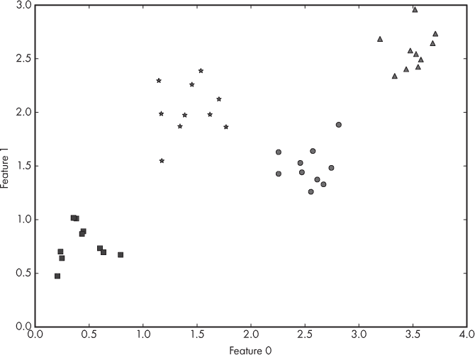

*图 6-1：一个假设的二维特征空间，包含四个不同的类别*

由于图 6-1 中的点已经很好地分组，我们可能会认为可以通过特征空间中的平均位置来表示每个组。我们不再使用 10 个小方块来表示这些点，而是用一个点来代表这些方块。这似乎是一个完全合理的做法。

事实证明，一组点的平均点有一个名字：*重心*，即中心点。我们知道如何计算一组数字的平均值：将它们加起来并除以加起来的数量。要找到二维空间中一组点的重心，我们首先找到所有 x 轴坐标的平均值，然后找到所有 y 轴坐标的平均值。如果我们有三维空间，我们将对 x、y 和 z 轴分别计算。如果我们有 *w* 维空间，我们将对每个维度进行此操作。最后，我们将得到一个可以代表整个组的单一点。如果我们对我们的示例进行这样的计算，得到的结果是 图 6-2，其中重心显示为大标记。

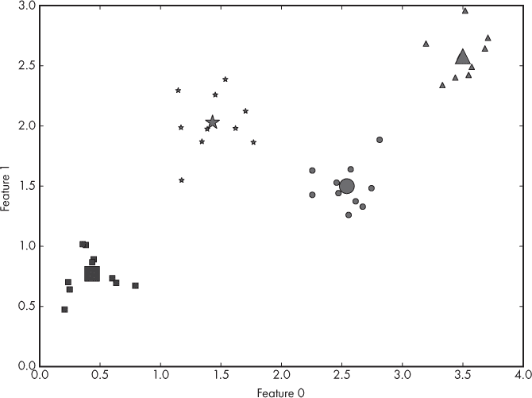

*图 6-2：一个假设的二维特征空间，包含四个不同的类别及其重心*

重心对我们有何帮助？好吧，如果给我们一个新的、未知的样本，它将是前面提到的特征空间中的一个点。我们可以测量这个点与每个重心之间的距离，并分配离它最近的重心的类别标签。*距离*的概念有些模糊；定义距离的方式有很多种。一种显而易见的方法是画一条直线连接这两个点；这个距离被称为*欧几里得距离*，计算起来相当简单。如果我们有两个点，(*x*[0], *y*[0]) 和 (*x*[1], *y*[1])，那么它们之间的欧几里得距离就是以下公式：

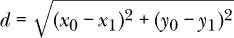

如果我们有三维空间，两个点之间的距离变为：

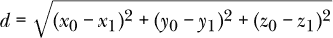

这可以推广到 *w* 维空间，对于两个点 *x*[0] 和 *x*[1]，公式如下：

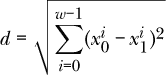

其中 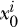 是点 *x*[0] 的第 *i* 个分量。这意味着，逐个分量地找出两个点之间的差值，平方它，然后将所有其他分量的平方差加起来，最后取平方根。

图 6-3 展示了特征空间中的一个样本点以及它与重心之间的距离。最短的距离是到圆形类别的，因此我们将该新样本分配给该类别。

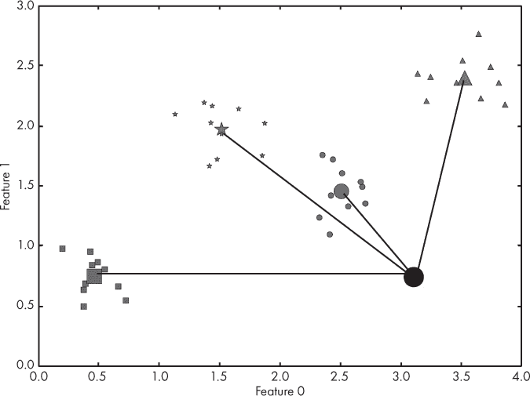

*图 6-3：一个假设的二维特征空间，包含四个不同的类别、它们的重心和一个新的、未知的样本*

我们刚才实现的过程被称为 *最近重心* 分类器。有时也称为 *模板匹配*。从训练数据中学习到的类别的重心被用作代表整个类别的代理。然后，新的样本利用这些重心来决定标签。

这看起来非常简单，甚至可能有些显而易见，那么为什么这个分类器没有被广泛使用呢？嗯，有几个原因。一个已经提到过了，那就是维度灾难。随着特征数量的增加，空间变得越来越大，我们需要指数级的更多训练数据来更好地确定质心的位置。所以，大的特征空间意味着这可能不是最合适的方法。

然而，还有一个更严重的问题。我们的玩具例子中，各个组非常紧密。如果这些组更为分散，甚至是重叠的呢？那么选择最近质心就变得有问题了：我们怎么知道最近的质心代表的是类别 A 还是类别 B 呢？

更为严重的是，某个特定类别可能会分布在*两个*或更多的不同组中。如果我们只计算整个类别的质心，这个质心将位于类别的各个组之间，并不能很好地代表任何一个集群。我们需要知道这个类别被分割成多个组，并且需要为该类别使用多个质心。如果特征空间较小，我们可以将其绘制出来，看到该类别在不同的组之间被划分。然而，如果特征空间较大，我们就没有简单的方法来判断类别是否分布在多个组中，并且是否需要多个质心。不过，对于初级问题来说，这种方法可能是理想的。并非每个应用都涉及复杂的数据。我们可能正在构建一个自动化系统，需要在新输入上做出简单、轻松的决策。在这种情况下，这个简单的分类器可能是完美的选择。

### k-最近邻

正如我们之前看到的，质心方法的一个问题是类别可能在特征空间中分布在多个组中。随着组数的增加，指定类别所需的质心数量也会增加。这意味着需要另一种方法。我们可以不计算每个类别的质心，而是直接使用训练数据本身，找到训练集中与新输入样本最接近的成员，并使用其标签来为新样本分配类别。

这种类型的分类器被称为*最近邻*分类器。如果我们只看训练集中最近的样本，我们就使用了一个邻居，所以我们把这个分类器称为*1-最近邻*或*1-NN 分类器*。但是，我们不必只看最近的训练点。我们可能想看多个训练点，然后投票决定为新样本分配最常见的类别标签。如果出现平局，我们可以随机选择一个类别标签。如果我们使用三个最近邻，就得到一个 3-NN 分类器，如果使用*k*个邻居，就得到一个*k*-NN 分类器。

让我们重新审视图 6-1 中的假设数据集，但生成一个新版本，其中紧密的聚类更加分散。我们仍然有两个特征和四个类别，每个类别有 10 个示例。我们设定 *k* = 3，这是一个典型的值。为了为新样本分配标签，我们将在特征空间中绘制该样本，然后找到与它最接近的三个训练数据点。图 6-4 展示了三个未知样本的三个最近邻。

离样本 A 最近的三个训练数据点分别是方形、方形和星形。因此，通过多数投票，我们将样本 A 分配到方形类别。同样，样本 B 的三个最近训练数据点分别是圆形、三角形和三角形。因此，我们将样本 B 标记为三角形类别。样本 C 更有意思。在这种情况下，三个最近的训练样本分别来自不同的类别：圆形、星形和三角形。因此，投票结果是平局。

当出现这种情况时，*k*-NN 实现需要做出选择。最简单的方法是随机选择类别标签，因为有人可能会认为三者的可能性是一样的。或者，也可以更加强烈地相信未知样本与训练数据之间的距离值，并选择距离最短的那个。在这种情况下，我们会将样本 C 标记为星形类别，因为这是与其最近的训练样本。

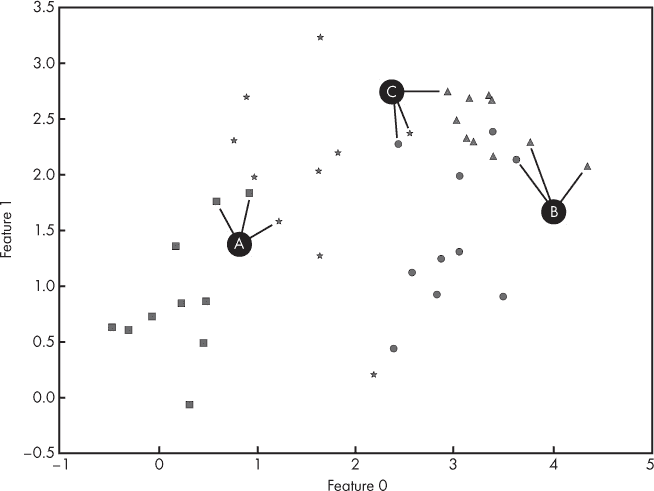

*图 6-4：将 *k*-NN 应用于 *k* = 3，处理三个未知样本 A、B 和 C*

*k*-NN 分类器的魅力在于训练数据本身就是模型——无需训练步骤。当然，训练数据必须和模型一起存储，并且根据训练集的大小，寻找新输入样本的 *k* 个最近邻可能会非常耗费计算资源。人们已经花费了几十年的时间来加速邻居搜索或更高效地存储训练数据，但最终，维度灾难仍然存在，依然是一个问题。

然而，一些 *k*-NN 分类器表现得非常出色：如果特征空间的维度足够小，*k*-NN 可能会非常有吸引力。训练数据的大小需要平衡：虽然较大的训练数据集能带来更好的性能，但也意味着更多的存储空间以及更繁琐的邻居搜索过程，同时还要考虑特征空间的维度。能够让 Nearest Centroid 成为合适选择的情景，也可能使 *k*-NN 成为一个好的选择。然而，*k*-NN 可能比 Nearest Centroid 更加健壮，尤其是在类别组之间有所重叠或分散时。如果某一类的样本被分配到多个组，*k*-NN 将优于 Nearest Centroid。

### 朴素贝叶斯

在自然语言处理研究中广泛使用的*朴素贝叶斯*分类器实现简单，理解直观，尽管我们需要一些数学来完成它。然而，我保证，即使符号不太熟悉，所描述的内容也会让数学变得容易理解。

该技术使用贝叶斯定理（参见托马斯·贝叶斯于 1763 年发表的《解决概率学问题的论文》）。该定理涉及概率关系，其现代表述是：

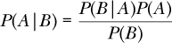

这使用了一些来自概率论的数学符号，我们需要对其进行描述，以便理解如何使用这个定理来实现分类器。

表达式 *P*(*A|B*) 表示在已知事件 B 已经发生的情况下，事件 A 发生的概率。在此上下文中，它被称为*后验概率*。类似地，*P*(*B|A*) 表示在已知事件 A 发生的情况下，事件 B 发生的概率。我们将 *P*(*B|A*) 称为给定 A 时 B 的*似然*。最后，*P*(*A*) 和 *P*(*B*) 分别表示事件 A 发生的概率（不考虑事件 B），以及事件 B 发生的概率（不考虑事件 A）。我们将 *P*(*A*) 称为 A 的*先验概率*，而 *P*(*B*) 则表示事件 B 发生的概率，不考虑事件 A。

贝叶斯定理给出了在已知某些事情已经发生（事件 B）的情况下，某个事件 A 发生的概率。那么这如何帮助我们分类呢？我们想知道一个特征向量是否属于某个给定类别。我们知道特征向量，但不知道类别。所以，如果我们有一个包含*m*个特征向量的数据集，其中每个特征向量有*n*个特征，*x* = *{x*[1],*x*[2],*x*[3],…,*x*[*n*]*}*，那么我们可以用特征向量中的每个特征来替代贝叶斯定理中的*B*。我们还可以将*A*替换为*y*，即我们想为新的未知特征向量*x*分配的类别标签。定理现在看起来是这样的：

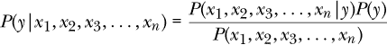

让我们稍微解释一下。贝叶斯定理表明，如果我们知道在*y*是类别的情况下，*x*是我们的特征向量的可能性，并且我们知道类别*y*出现的频率（即*y*的先验概率，记作 *P*(*y*)），那么我们就可以计算特征向量*x*属于类别*y*的概率。如果我们能够对所有可能的类别，所有不同的*y*值都做出这个计算，我们就可以选择概率最大的类别，并将输入的特征向量*x*标记为属于该类别*y*。

回想一下，训练数据集是由一组对（*x*^(*i*),*y*^(*i*））组成的，其中 *x*^(*i*) 是已知的特征向量，*y*^(*i*) 是已知的类别标签。这里的 *i* 上标用来标记训练数据集中的特征向量和标签对。现在，给定一个这样的数据集，我们可以通过制作每个类别标签在训练集中出现的频率的直方图来计算 *P*(*y*)。我们相信训练集能够公平地代表可能的特征向量的母体分布，因此我们可以使用训练数据来计算我们需要的值，以便应用贝叶斯定理。（关于如何确保数据集是有效的，参见第四章的内容。）

一旦我们有了 *P*(*y*)，我们需要知道似然 *P*(*x*[1],*x*[2],*x*[3],…,*x*[*n*]*|y*)。不幸的是，我们无法直接计算这一点。但并非一切都失去希望：我们将做一个假设，允许我们继续前进。我们假设 *x* 中的每个特征都是*统计独立*的。这意味着我们测量一个特定的 *x*[1] 与其他 *n –* 1 个特征的值之间没有任何关系。这并不总是正确的，甚至大多数情况下也不成立，但实际上，这个假设通常足够接近真理，以至于我们可以继续使用它。这就是所谓的*朴素贝叶斯*，因为假设特征彼此独立是天真的。这个假设显然不对，例如，当我们的输入是图像时。图像的像素之间是高度依赖的。随机选一个像素，它旁边的像素几乎肯定与它相差不多。

当两个事件是独立时，它们的*联合概率*，即两者同时发生的概率，仅仅是各自概率的乘积。独立性假设允许我们像这样改变贝叶斯定理中的似然部分：

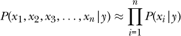

∏ 符号表示*相乘*，就像 ∑ 符号表示*相加*一样。方程式的右侧表示，如果我们知道测量特定特征值的概率，比如特征 *x*[*i*]，给定类别标签 *y*，我们可以通过将每个特征的概率相乘，得到整个特征向量 *x*，在给定类别标签 *y* 的情况下的似然。

如果我们的数据集由类别值或离散值（如整数，例如年龄）组成，那么我们可以通过为每个类别的每个特征构建直方图，使用数据集来计算 *P*(*x*[*i*]*|y*) 的值。例如，如果类别 1 的特征 *x*[2] 有以下值

```py
7, 4, 3, 1, 6, 5, 2, 8, 5, 4, 4, 2, 7, 1, 3, 1, 1, 3, 3, 3, 0, 3,

4, 4, 2, 3, 4, 5, 2, 4, 2, 3, 2, 4, 4, 1, 3, 3, 3, 2, 2, 4, 6, 5,

2, 6, 5, 2, 6, 6, 3, 5, 2, 4, 2, 4, 5, 4, 5, 5, 2, 5, 3, 4, 3, 1,

6, 6, 5, 3, 4, 3, 3, 4, 1, 1, 3, 5, 4, 4, 7, 0, 6, 2, 4, 7, 4, 3,

4, 3, 5, 4, 6, 2, 5, 4, 4, 5, 6, 5
```

那么每个值的发生概率为

```py
0: 0.02

1: 0.08

2: 0.15

3: 0.20

4: 0.24

5: 0.16

6: 0.10

7: 0.04

8: 0.01
```

该概率来自于每个值发生的次数除以 100，即数据集中值的总数。

这个直方图正是我们需要的，用来找到*P*(*x*[2]*|y* = 1)，即当类别标签为 1 时，特征 2 的概率。例如，我们可以预期一个类别为 1 的新特征向量，其*x*[2] = 4 的概率约为 24%，而*x*[2] = 1 的概率约为 8%。

通过为每个特征和每个类别标签建立这样的表格，我们可以完成分类器，用于分类和离散情况。对于一个新的特征向量，我们使用这些表格来找到每个特征具有该值的概率。我们将这些概率相乘，然后再乘以该类别的先验概率。对于数据集中每个*m*类别，重复此过程，将得到一组*m*后验概率。要对新的特征向量进行分类，选择这些*m*值中的最大值，并分配相应的类别标签。

如果特征值是连续的，我们如何计算*P*(*x*[*i*]*|y*)？一种方法是将连续值分箱，然后像离散情况一样建立表格。另一种方法是做出更多假设。我们需要对可以测量的*x*[*i*]特征值的分布做出假设。大多数自然现象似乎遵循正态分布。我们在第一章中讨论了正态分布。那么，我们假设这些特征都遵循正态分布。正态分布由其均值(*μ*, mu)和标准差(*σ*, sigma)定义。均值就是我们如果从分布中反复抽取样本时，期望的平均值。标准差是分布宽度的度量——即它围绕均值的分散程度。

从数学上讲，我们想要做的是将每个*P*(*x*[*i*]*|y*)替换为如下形式：

*P*(*x*[*i*]|*y*) ≈ *N*(*μ*[*i*], *σ*[*i*])

对于特征向量中的每个特征。这里的 N(*μ*[*i*],*σ*[*i*])表示以某个均值(*μ*)为中心，并由分布范围(*σ*)定义的正态分布。

我们并不完全知道精确的*μ*和*σ*值，但我们可以从训练数据中对它们进行近似。例如，假设训练数据包含 25 个样本，其中类别标签为 0\。进一步假设以下是特征 3，也就是*x*[3]，在这些情况下的值：

0.21457111, 4.3311102, 5.50481251, 0.80293956, 2.5051598,

2.37655204, 2.4296739, 2.84224169, -0.11890662, 3.18819152,

1.6843311, 4.05982237, 4.14488722, 4.29148855, 3.22658406,

6.45507675, 0.40046778, 1.81796124, 0.2732696, 2.91498336,

1.42561983, 2.73483704, 1.68382843, 3.80387653, 1.53431146

然后，当为类别 0 设置特征 3 的正态分布时，我们将使用*μ*[3] = 2.58 和*σ*[3] = 1.64，因为这些值的平均值为 2.58，标准差，即围绕均值的分布范围，为 1.64。

当给定一个新的未知样本时，我们将使用以下方程计算在实际类别为类别 0 的情况下给定的*x*[3]发生的概率。

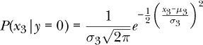

这个方程来自于正态分布的定义，其中均值为*μ*，标准差为*σ*。它表明，给定类别为*y*的情况下，某一特征值的可能性是围绕我们从训练数据中测量到的均值按照正态分布分布的。这是我们在特征之间独立性假设基础上做出的假设。

我们会对未知特征向量中的每个特征使用这个方程。然后将得到的概率相乘，并将这个值乘以类别 0 的先验概率。我们会对每个类别重复这一过程。最终，我们会得到*m*个数字，即特征向量属于每个*m*类别的概率。为了做出最终决定，我们将像之前一样：选择这些概率中的最大值，并将输入标记为对应的类别。

有些读者可能会抱怨我们忽略了贝叶斯定理中的分母。我们之所以这么做，是因为它在所有计算中是一个常数，而且由于我们总是选择最大的后验概率，所以其实我们并不在意是否将每个值除以常数。我们无论如何都会选择相同的类别标签。

此外，对于离散情况，可能我们的训练集没有包含那些极少出现的值的实例。我们忽略了这一点，但这是一个问题，因为如果某个值从未出现，那么我们使用的*P*(*x*[*i*]*|y*)将为 0，从而使整个后验概率为 0。这个问题经常出现在自然语言处理中，某些词汇使用非常少。一个叫做*拉普拉斯平滑*的技术可以解决这个问题，但就我们而言，我们主张一个“好的”训练集将能够表示特征的*所有*可能值，并继续前进。sklearn 的`MultinomialNB`朴素贝叶斯分类器对离散数据默认使用拉普拉斯平滑。

### 决策树与随机森林

图 6-5 的左侧展示了一只小狗的 X 光图像，右髋关节窝发育不良。由于小狗在 X 光片中是仰躺的，右髋关节窝位于图像的左侧。图像右侧展示了对应的像素强度直方图（8 位值，[0,255]）。该直方图有两个峰值，分别对应于黑色背景和较亮的 X 光数据。如果我们想将图像中的每个像素分类为背景或 X 光，我们可以使用以下规则：“如果像素强度小于 11，将该像素归为背景。”

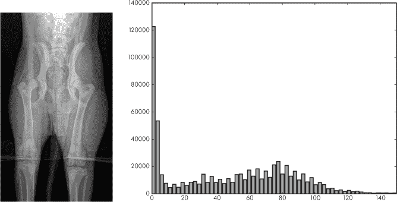

*图 6-5：一只小狗的 X 光图像（左）。对应的 8 位像素值直方图[0,255]（右）。*

这个规则实现了基于数据某个特征（在此为像素强度值）做出的决策。像这样的简单决策正是*决策树*——我们将在本节中探讨的分类算法——的核心。如果我们将这个决策规则应用于图像中的每个像素，并输出 0 或 255（背景与 X 光数据的最大像素值），就能得到一个掩码，显示哪些像素是图像的一部分。见图 6-6。

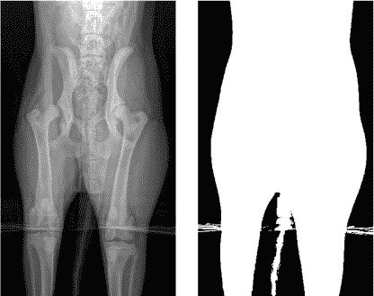

*图 6-6：一张小狗的 X 光图像（左）。由决策规则生成的相应像素掩码。白色像素为 X 光图像的一部分（右）。*

决策树是一组节点。这些节点要么根据条件的真假定义一个条件并分支，要么选择一个特定的类别。没有分支的节点称为*叶节点*。决策树之所以叫做*树*，是因为，特别是在我们这里讨论的二分类情况下，它们像树一样分支。图 6-7 展示了一个通过 sklearn `DecisionTreeClassifier` 类针对完整的鸢尾花数据集，使用前几个特征所学习到的决策树。见第五章。

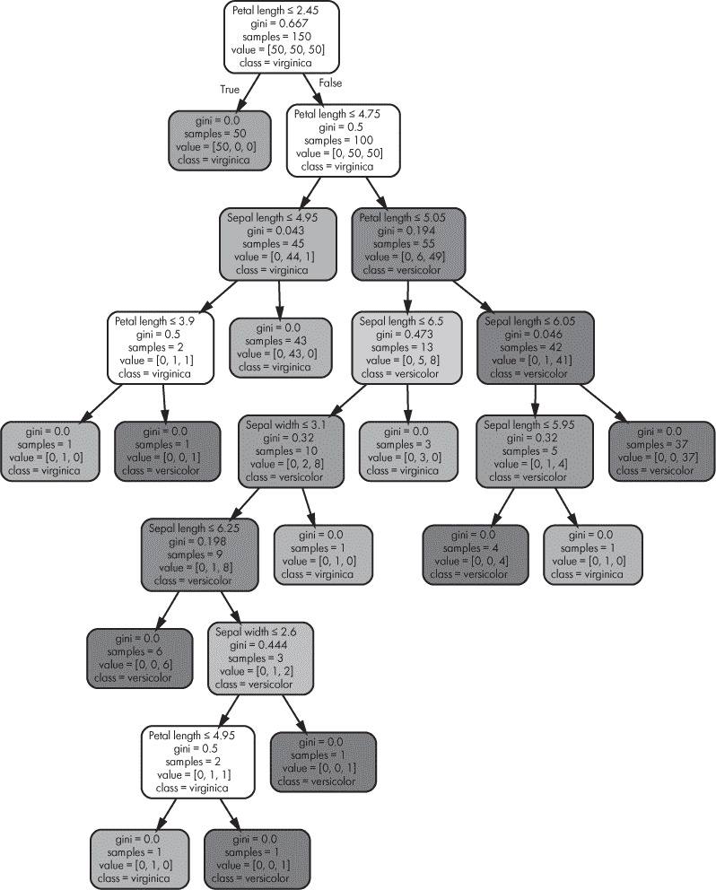

*图 6-7：鸢尾花数据集的决策树分类器*

按照惯例，树中的第一个节点，即*根节点*，绘制在最上方。对于这棵树，根节点提出了问题：“花瓣长度是否 ≤ 2.45？”如果是，则选择左侧分支，树立即到达叶节点并赋予标签“virginica”（类别 0）。稍后我们将讨论节点中的其他信息。如果花瓣长度不 ≤ 2.45，则选择右侧分支，进入一个新节点，该节点询问：“花瓣长度是否 ≤ 4.75？”如果是，我们进入一个询问萼片长度的问题的节点。如果不是，则进入右侧节点，再次考虑花瓣长度。这个过程持续进行，直到到达叶节点，进而确定类别标签。

刚才描述的过程正是决策树在创建后使用的方式。对于任何新的特征向量，从根节点开始一系列问题被提问，树会被遍历，直到到达叶节点以决定类别标签。这是一种对人类友好的分类过程，因此决策树在需要了解类别分配“为什么”与类别分配本身同样重要的场合非常有用。决策树能够自我解释。

使用决策树足够简单，但树是如何一开始就创建出来的呢？与前几节中的简单算法不同，构建树的过程更为复杂，但也并非如此复杂，以至于我们无法跟随主要步骤，从中获得一些关于定义树的直觉。

#### 递归基础

然而，在讨论决策树算法之前，我们需要先讨论*递归*的概念。如果你熟悉计算机科学，你可能已经知道树状数据结构和递归是密不可分的。如果你不太了解，别担心；递归是一个简单但强大的概念。递归算法的本质是算法在不同的层次上重复自己。当作为编程语言中的函数实现时，通常意味着该函数在问题的较小版本上递归调用自己。当然，如果函数无限递归调用自己，我们就会陷入无限循环，因此递归需要一个停止条件——即某种方式来说明我们不再需要继续递归。

让我们从数学上引入递归的概念。一个整数 *n* 的阶乘，记作 *n*!，定义为

*n*! = *n*(*n* – 1)(*n* – 2)(*n* – 3) . . . (*n* – *n* + 1)

这意味着将从 1 到 *n* 的所有整数相乘。根据定义，0! = 1。所以，5 的阶乘是 120，因为

5! = 5 × 4 × 3 × 2 × 1 = 120

如果我们看 5!，我们会发现它不过是 5 × 4!，或者更一般地说，*n*! = *n* × (*n –* 1)!. 现在，让我们用这个洞察力编写一个递归计算阶乘的 Python 函数。代码很简单，也是许多递归函数的典型特征，正如 清单 6-1 所示。

def fact(n):

if (n <= 1):

return 1

else:

return n*fact(n-1)

*清单 6-1：计算阶乘*

这段代码是阶乘公式的直接实现：*n* 的阶乘等于 *n* 乘以 *n - 1* 的阶乘。要计算 `n` 的阶乘，我们首先判断 `n` 是否为 1。如果是，我们知道阶乘是 1，于是返回 1——这就是我们的停止条件。如果 `n` 不是 1，我们知道 *n* 的阶乘是 *n* 乘以 *n-1* 的阶乘，我们通过将 `n-1` 作为参数递归调用 `fact` 来得到 *n-1* 的阶乘。

#### 构建决策树

构建决策树的算法也是递归的。让我们从一个高层次上了解发生了什么。算法从根节点开始，确定该节点的适当规则，然后对左右分支递归调用。对左分支的调用将重新开始，就好像左分支是根节点一样。这一过程会一直持续，直到满足停止条件为止。

对于决策树来说，停止条件是叶节点（我们将接下来讨论决策树如何知道何时创建叶节点）。一旦创建了叶节点，递归终止，算法返回到该叶节点的父节点，并对右分支递归调用。然后算法重新开始，就好像右分支是根节点一样。一旦两个递归调用终止，并且节点的左右子树创建完毕，算法会返回到该节点的父节点，依此类推，直到整个树构建完成。

现在，我们来稍微具体一些。训练数据是如何被用来构建树的呢？当根节点被定义时，所有的训练数据都会被使用——假设是所有的*n*个样本。这些样本集将用于选择根节点实现的规则。一旦规则被选择并应用到训练样本中，我们就得到了两个新的样本集：一个是左侧的（即为真侧），另一个是右侧的（即为假侧）。

接下来，递归将在这些节点上工作，利用各自的训练样本集来定义左右分支的规则。每当一个分支节点被创建时，该分支节点的训练集会被分成满足规则的样本和不满足规则的样本。当训练样本集过小、某一类别的比例足够高，或达到最大树深度时，叶节点就会被声明。

到现在为止，你可能在想，“我们如何为分支节点选择规则？”这个规则将单一的输入特征（比如花瓣长度）与一个特定的值关联。决策树是一个*贪心*算法；这意味着在每个节点，它会选择一个最适合当前可用信息的规则。在这种情况下，当前可用的信息集是该节点所拥有的训练样本集。最好的规则是能够最好地将类别分为两组的规则。这意味着我们需要一种方法来选择可能的候选规则，并且有一种方法来确定候选规则是否是“最佳的”。决策树算法使用暴力搜索来找到候选规则。它遍历所有可能的特征和值的组合，通过分箱将连续值离散化，并在应用规则后评估左右训练集的纯度。表现最好的规则会被保留在该节点。

“表现最好”是通过划分后的左右训练样本子集的*纯度*来决定的。衡量纯度的一种方法是使用*基尼指数*。这是 sklearn 使用的度量标准。每个节点在图 6-7 中的基尼指数都会被计算出来。其计算公式如下：

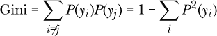

其中，*P*(*y*[*i*])是当前节点子集内属于类别*i*的训练样本的比例。类别之间的完美划分，即一类全为一种类别，另一类全为另一类别，将导致基尼指数为 0。50-50 的划分则基尼指数为 0.5。该算法通过选择能够使基尼指数最小化的候选规则，在每个节点上尽量减少基尼指数。

例如，在图 6-7 中，根节点下方的右侧节点的基尼指数为 0.5。这意味着*上面的节点*，即根节点，所定义的规则会导致一个训练数据的子集，其中花瓣长度>2.45，而这个子集将会在类别 1 和类别 2 之间均匀分配。这就是节点文本中“value”行的含义。它显示了定义该节点的子集中的训练样本数量。“class”行则是如果树在该节点停止时所分配的类别。它只是该节点子集中训练样本最多的类别标签。当决策树应用于新的未知样本时，它始终是从根节点一直运行到叶子节点。

#### 随机森林

决策树在数据是离散的、分类的或有缺失值时非常有用。连续数据需要先进行分箱（sklearn 会为你处理这一过程）。然而，决策树有一个坏习惯，就是*过拟合*训练数据。这意味着它们可能会学习到训练数据中的一些无意义的统计特征，而不是学习到数据中有用的、在处理未知数据样本时能够应用的有意义的通用特征。决策树也会变得非常庞大，特别是在特征数量增加的情况下，除非通过深度参数来加以管理。

通过使用*随机森林*，可以缓解决策树的过拟合问题。事实上，除非你的问题很简单，否则你可能希望从一开始就使用随机森林。以下三个概念将决策树引导到随机森林：

+   分类器集成及其投票

+   通过选择带有*放回*的样本对训练集进行重采样

+   随机特征子集的选择

如果我们有一组分类器，每个分类器都基于不同的数据或不同类型的模型进行训练，比如一个*k*-NN 和一个朴素贝叶斯，我们可以利用它们的输出对任何特定的未知样本进行投票，从而决定实际的分类。这就是所谓的*集成*，尽管随着分类器数量的增加，收益会递减，但通常，它会提高整体性能，超过任何单个分类器的表现。我们也可以应用类似的思想，想象一个由决策树组成的*森林*，但除非我们对训练集进行更多处理，否则我们将得到一片*完全相同的*树，因为特定的训练样本集总是会产生完全相同的决策树。创建决策树的算法是确定性的——它总是返回相同的结果。

处理训练集中特定统计细节的一种方法是从原始训练集中选择一个新的训练集，但允许同一训练集样本被选择多次。这就是**带替换的选择**。可以把它想象成从袋子里挑选彩色弹珠，在选择下一个弹珠之前，把刚才选中的弹珠放回袋子中，这样你可能会再次选中它。通过这种方式选出的新数据集被称为*自助采样*。以这种方式构建多个新数据集的过程称为*集成法（bagging）*，由这些重新采样的数据集构建的模型就形成了随机森林（Random Forest）。

如果我们训练多个树，每棵树都使用带替换的重新采样训练集，我们将得到一片树林，每棵树略有不同。仅凭这一点，再加上集成投票，可能就能改善性能。然而，这里有一个问题。如果某些特征高度预测，那么它们将主导结果，导致生成的树林中的树木非常相似，从而面临相似的弱点。这就是*随机*（Random）森林中“随机”的作用。

与仅进行集成法不同，集成法改变了每棵树的训练集中样本的分布，但没有改变检查的特征集。如果我们为森林中的每棵树随机选择一个特征子集，并仅在这些特征上进行训练，结果会怎样？这样做可以打破树与树之间的相关性，从而提高森林的整体鲁棒性。实际上，如果每个特征向量有*n*个特征，那么每棵树会随机选择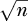个特征来构建树。Random Forest 在 sklearn 中也有支持。

### 支持向量机

我们的最终经典机器学习模型是那个在 1990 年代大部分时间里与神经网络抗衡的模型——*支持向量机（SVM）*。如果神经网络是一种高度数据驱动的经验方法来生成模型，那么 SVM 是一种高度优雅、基于数学的方式。我们将从概念层面讨论 SVM 的性能，因为涉及的数学超出了我们在这里想要介绍的范围。如果你有兴趣，经典的参考文献是 Cortes 和 Vapnik（1995 年）的《Support-Vector Networks》。

我们可以通过直观理解边距、支持向量、优化和核函数的概念来总结支持向量机的工作原理。接下来我们依次来看每个概念。

#### 边距

图 6-8 展示了一个具有两个特征的二分类数据集。我们已将数据集中的每个样本绘制出来，特征 1 沿 x 轴，特征 2 沿 y 轴。类别 0 用圆圈表示，类别 1 用菱形表示。这显然是一个人为构造的数据集，通过在圆圈和菱形之间绘制一条线就能轻松分开。

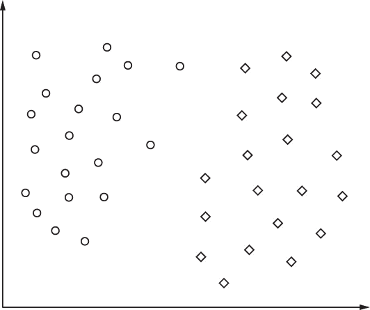

*图 6-8：一个包含两类、圆圈和菱形的玩具数据集，以及两个特征，x 轴和 y 轴*

分类器可以被看作是定位一个或多个 *平面*，将训练数据空间分成同类群组。在 图 6-8 的情况下，分隔“平面”是一条线。如果我们有三个特征，分隔平面将是一个二维平面。有四个特征，分隔平面将是三维的，对于 *n* 维度，分隔平面是 *n –* 1 维度的。由于平面是多维的，我们称之为 *超平面*，并且说分类器的目标是使用超平面将训练特征空间分成群组。

如果我们再次看一下 图 6-8，我们可以想象无限多条线将训练数据分为两组，所有类别 0 的在一边，所有类别 1 的在另一边。我们应该选择哪一条？好吧，让我们稍微思考一下，一条分隔两类的线的位置意味着什么。如果我们将一条线画得更靠右一些，就在任何菱形的右边，我们将分隔训练数据，但仅仅是勉强分隔开来。记住，我们使用训练数据作为每个类别样本的真实分布的替代品。我们拥有的训练数据越多，我们就越能忠实地了解真实分布。然而，我们实际上并不了解它。

一个新的未知样本，必须是类别 0 或类别 1，将会落在图上的某个位置。可以合理地认为，在野外可能存在类别 1（菱形）的样本，它们将比训练集中的任何样本更接近圆圈。如果分隔线太靠近菱形，我们面临将有效的类别 1 样本误判为 *类别 0* 的风险，因为分隔线太靠右。如果我们将分隔线放置得非常接近类别 0 点（圆圈），那么我们面临将类别 0 样本误判为 *类别 1*（菱形）的风险。

因此，在没有更多训练数据的情况下，选择尽可能远离两类的分隔线似乎是最合理的选择。这条线是离最右侧的圆圈最远，并且仍然尽可能靠近菱形的线。这条线是最大间隔位置，其中 *间隔* 被定义为最接近样本点的距离。 图 6-9 显示了最大间隔位置，以粗线表示，并由两条虚线表示最大间隔。支持向量机的目标是找到最大间隔位置，因为这是我们可以最确保不会错误分类新样本的位置，根据从训练集中获取的知识。

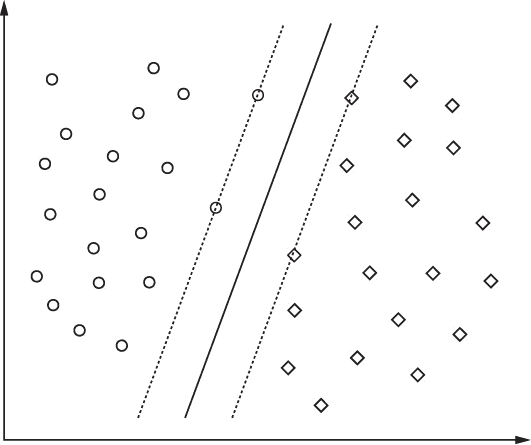

*图 6-9：图 6-8 的玩具数据集，带有最大间隔分隔线（粗线）和最大间隔（虚线）*

#### 支持向量

再次查看 图 6-9。注意到边界上的四个训练数据点了吗？这些训练样本定义了边界，换句话说，支持了边界；因此它们被称为 *支持向量*。这就是 *支持向量机* 这一名称的由来。支持向量定义了边界，但我们如何利用它们来确定边界的位置呢？在这里，我们将简化一些内容，以避免涉及大量复杂的向量数学，这只会让我们更加困惑。如果需要更数学化的处理，请参考 Christopher Burges 的《用于模式识别的支持向量机教程》（1998）。

#### 优化

从数学角度来看，我们可以通过求解优化问题来找到最大间隔超平面。回想一下，在优化问题中，我们有一个依赖于某些参数的量，我们想要找到一组参数值，使得该量尽可能小或尽可能大。

在 SVM 的情况下，超平面的方向可以通过一个向量来指定，。还有一个偏移量 *b*，我们需要找到它。最后，在进行优化之前，我们需要改变指定类别标签的方式。我们不再使用 0 或 1 来表示 *y*[*i*]，即第 *i* 个训练样本 *x*[*i*] 的标签，而是使用 -1 或 +1。这将使我们能够更简单地定义优化问题的条件。

从数学角度来看，我们想要的是找到  和 *b*，使得给定条件下，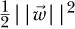 的数量尽可能小，前提是对于数据集中的所有 *y*[*i*] 标签和 *x*[*i*] 训练向量都有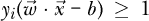。这种优化问题可以通过一种称为 *二次规划* 的技术轻松解决。（我们在这里忽略了另一个重要的数学步骤：实际的优化问题是通过拉格朗日方法求解其对偶形式，但我们将尽量避免使事情复杂化。）

上述公式适用于数据集假设只有两类且可以通过超平面分离的情况。这是线性可分的情况。实际上，正如我们现在已经深刻理解的那样，并非所有数据集都能通过这种方式分离。因此，优化问题的完整形式包括一个调整因子 *C*，它影响找到的间隔的大小。这个因子出现在 sklearn 的 SVM 类中，需要设置一个合适的值。从实践角度来看，*C* 是 SVM 的一个 *超参数*，是我们需要设置的值，以便让 SVM 正常训练。*C* 的最佳值依赖于具体问题。通常来说，模型的任何一个不是由模型学习的、而必须手动设置以使用模型的参数（比如 SVM 的 *C* 或 *k*-NN 的 *k*）都是超参数。

#### 核函数

还有一个数学概念需要介绍，带有适当的手势。前述描述是针对线性 SVM，并直接使用训练数据（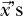）。非线性情况通过将训练数据传递给一个函数来将其映射到另一个空间，通常这个函数叫做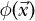，它会生成训练数据向量的新版本，。SVM 算法使用内积，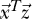，这意味着映射后的版本将使用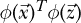。在这种表示法中，向量被视为一列数字，因此*T*，即转置，会生成一个行向量。然后，1 × *n*的行向量与*n* × 1 的列向量进行常规矩阵乘法，将得到一个 1 × 1 的输出，这是一个标量。内积通常写作

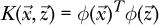

而这个函数 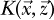 被称为*核*。线性核函数就是简单的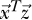，但也可以使用其他核函数。*高斯核*是一个常用的核函数，也叫做*径向基函数（RBF）*核。在实际使用中，这个核函数引入了一个新的参数，除了*C*之外，就是*γ*。这个参数决定了高斯核在特定训练点周围的扩展范围，较小的值会扩展训练样本的影响范围。通常，使用网格搜索来调整*C*，如果使用 RBF 核，也会调整*γ*，以找到性能最佳的模型。

总结来说，支持向量机通过将训练数据通过核函数映射，来优化超平面的方向和位置，从而在超平面和训练数据的支持向量之间产生最大边界。用户需要选择核函数以及相关参数，如*C*和*γ*，以使模型最适应训练数据。

支持向量机在 1990 年代和 2000 年代初期主导了机器学习领域，直到深度学习的兴起。这是因为 SVM 训练效率高，且不需要大量的计算资源即可成功。 然而，随着深度学习的到来，SVM 逐渐被边缘化，因为强大的计算机使得神经网络能够完成以前在计算资源有限的情况下无法实现的任务。然而，SVM 仍然有其独特的地位。一种流行的方法是使用在特定数据集上训练的大型神经网络作为另一个数据集的预处理器，然后在神经网络输出（去掉顶层）上训练 SVM。

### 总结

在本章中，我们介绍了六种最常见的经典机器学习模型：最近质心、*k*-NN、朴素贝叶斯、决策树、随机森林和支持向量机（SVM）。这些模型之所以被称为经典，是因为它们已经使用了几十年。如果条件适合它们的最佳支持，它们依然是有用的。有时候，经典模型仍然是正确的选择。一位经验丰富的机器学习实践者会知道何时回归经典模型。

在下一章中，我们将通过 sklearn 使用每个模型，进行一系列实验，帮助我们理解这些模型是如何工作的，以及何时使用它们。
