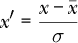
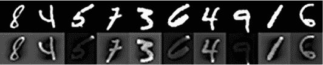
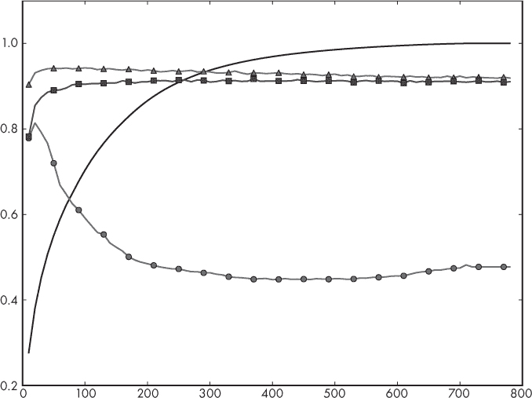
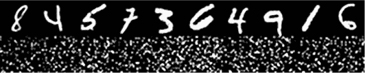

## 第七章：经典模型实验**


在第六章中，我们介绍了几种经典的机器学习模型。现在让我们使用在第五章中构建的数据集，并将其与这些模型一起使用，看看它们的表现如何。我们将使用 sklearn 创建模型，然后通过查看它们在保留的测试集上的表现来进行比较。

这将给我们一个很好的概述，帮助我们了解如何使用 sklearn，并建立对不同模型相对表现的直觉。我们将使用三个数据集：鸢尾花数据集（包括原始数据和增强数据）；乳腺癌数据集；以及 MNIST 手写数字数据集的向量形式。

### 鸢尾花数据集实验

我们将从鸢尾花数据集开始。该数据集有四个连续特征——萼片长度、萼片宽度、花瓣长度和花瓣宽度——以及三个类别——不同的鸢尾花种类。共有 150 个样本，每个类别 50 个。在第五章中，我们对数据集应用了 PCA 增强，因此我们实际上有两个版本可以使用：原始的 150 个样本和增强后的 1200 个训练样本。两者都可以使用相同的测试集。

我们将使用 sklearn 实现我们在第六章中概述的最近质心、*k*-NN、朴素贝叶斯、决策树、随机森林和 SVM 模型的版本。我们将很快看到 sklearn 工具包是多么强大和优雅，因为我们的测试几乎在所有模型中都完全相同。唯一变化的是我们实例化的具体类。

#### 经典模型测试

我们最初测试的代码在清单 7-1 中。

import numpy as np

from sklearn.neighbors import NearestCentroid

from sklearn.neighbors import KNeighborsClassifier

from sklearn.naive_bayes import GaussianNB, MultinomialNB

from sklearn.tree import DecisionTreeClassifier

from sklearn.ensemble import RandomForestClassifier

from sklearn.svm import SVC

❶ def run(x_train, y_train, x_test, y_test, clf):

clf.fit(x_train, y_train)

print("    预测结果  :", clf.predict(x_test))

print("    实际标签:", y_test)

print("    得分 = %0.4f" % clf.score(x_test, y_test))

print()

def main():

❷ x = np.load("../data/iris/iris_features.npy")

y = np.load("../data/iris/iris_labels.npy")

N = 120

x_train = x[:N]; x_test = x[N:]

y_train = y[:N]; y_test = y[N:]

❸ xa_train=np.load("../data/iris/iris_train_features_augmented.npy")

ya_train=np.load("../data/iris/iris_train_labels_augmented.npy")

xa_test =np.load("../data/iris/iris_test_features_augmented.npy")

ya_test =np.load("../data/iris/iris_test_labels_augmented.npy")

print("最近质心：")

❹ run(x_train, y_train, x_test, y_test, NearestCentroid())

print("k-NN 分类器（k=3）：")

run(x_train, y_train, x_test, y_test,

KNeighborsClassifier(n_neighbors=3))

print("朴素贝叶斯分类器（高斯）：")

❺ run(x_train, y_train, x_test, y_test, GaussianNB())

print("朴素贝叶斯分类器（多项式）：")

run(x_train, y_train, x_test, y_test, MultinomialNB())

❻ print("决策树分类器：")

run(x_train, y_train, x_test, y_test, DecisionTreeClassifier())

print("随机森林分类器（估计器=5）：")

run(xa_train, ya_train, xa_test, ya_test,

RandomForestClassifier(n_estimators=5))

❼ print("SVM（线性，C=1.0）：")

run(xa_train, ya_train, xa_test, ya_test, SVC(kernel="linear", C=1.0))

print("SVM（RBF，C=1.0，gamma=0.25）：")

run(xa_train, ya_train, xa_test, ya_test,

SVC(kernel="rbf", C=1.0, gamma=0.25))

print("SVM（RBF，C=1.0，gamma=0.001，增强版）")

run(xa_train, ya_train, xa_test, ya_test,

SVC(kernel="rbf", C=1.0, gamma=0.001))

❽ print("SVM（RBF，C=1.0，gamma=0.001，原始）")

run(x_train, y_train, x_test, y_test,

SVC(kernel="rbf", C=1.0, gamma=0.001))

*Listing 7-1: 使用鸢尾花数据集的经典模型。请参见* iris_experiments.py。

首先，我们导入必要的类和模块。请注意，每个类代表一种特定的模型（分类器）。对于朴素贝叶斯分类器，我们使用了两个版本：高斯版本`GaussianNB`，因为特征是连续值，以及`MultinomialNB`，用于离散情况，以说明选择不适合数据集的模型的影响。由于 sklearn 为其分类器提供了统一的接口，我们可以通过使用相同的函数来训练和测试任何特定的分类器，从而简化流程。这个函数是`run` ❶。我们传入训练特征（`x_train`）和标签（`y_train`）以及测试特征和标签（`x_test`、`y_test`）。我们还传入特定的分类器对象（`clf`）。

在 `run` 中，首先通过调用 `fit` 方法，将模型拟合到数据上，传入训练数据样本和标签，这是训练步骤。训练完成后，我们可以通过调用 `predict` 方法并传入保留的测试数据来测试模型的表现。该方法返回测试数据中每个样本的预测类别标签。我们从原始的 150 个样本中保留了 30 个样本，因此 `predict` 将返回一个包含 30 个类别标签的向量，我们会打印出来。接下来，我们打印出实际的测试标签，以便与预测结果进行视觉对比。最后，我们使用 `score` 方法，将分类器应用到测试数据（`x_test`）上，使用已知的测试标签（`y_test`）来计算总体准确率。

准确率作为 0 到 1 之间的分数返回。如果每个测试样本都被标记为错误，准确率将为 0。即使是随机猜测，也能比这做得更好，因此返回值为 0 是一个表明出了问题的信号。由于鸢尾花数据集中有三个类别，我们预计一个随机猜测类别的分类器大约有三分之一的概率猜对，返回值接近 0.3333。实际得分计算方法如下：

score = *N[c]* / (*N[c]* + *N[w]*)

其中 *N*[*c*] 是预测类别正确的测试样本数；也就是说，它与`y_test`中的类别标签匹配。*N*[*w*] 是预测类别与实际类别标签不匹配的测试样本数。

现在我们有了训练和测试每个分类器的方法，接下来只需要加载数据集并通过创建不同的分类器对象并将其传递给`run`来运行一系列实验。在`main`函数内部，我们首先加载原始的鸢尾花数据集，并将其分为训练集和测试集 ❷。我们还加载了在第五章中创建的增强版鸢尾花数据集 ❸。这两个测试集在设计上是相同的，因此无论我们使用哪个训练集，测试集都会是一样的。这简化了我们的比较。

我们接着定义并执行了最近质心分类器 ❹。输出结果如下所示：

```py
Nearest Centroid:

 predictions  :[011202120211112202201101102211]

 actual labels:[011202120211112202201101102211]

 score = 1.0000
```

我们移除了空格，以便更直观地对比预测的类别标签和实际的类别标签。如果存在错误，相应的值（0-2）将在两行之间不匹配。得分也会显示。在这种情况下，得分为 1.0，这告诉我们分类器在保留的测试集上的预测是完美的。这并不令人惊讶；鸢尾花数据集是一个简单的例子。由于鸢尾花数据集在第五章中被随机化，你可能会得到不同的整体得分。然而，除非你的随机化非常不幸，否则你应该能够得到一个较高的测试得分。

基于我们在第六章中学到的内容，我们应该预期，如果最近质心分类器在测试数据上是完美的，那么所有其他更复杂的模型也将是完美的。一般来说，这种情况是成立的，但正如我们将看到的，粗心选择模型类型或模型超参数值将导致即使是更复杂的模型也表现不佳。

再次查看列表 7-1，我们通过将`GaussianNB`的实例传递给`run`来训练高斯朴素贝叶斯分类器 ❺。这个分类器也是完美的，返回得分为 1.0。 这就是使用连续值与朴素贝叶斯分类器的正确方法。如果我们尽管有连续特征，但仍使用离散情况，会发生什么呢？这就是`MultinomialNB`分类器，它假设特征是从离散的可能值集合中选择的。对于鸢尾花数据集，由于特征值是非负的，我们可以使用这种分类器。然而，由于这些特征并非离散的，这个模型并不完美，返回了以下结果：

```py
Naive Bayes classifier (Multinomial):

 predictions  :[011202220211122202202101102221]

 actual labels:[011202120211112202201101102211]

 score = 0.8667
```

我们可以看到，分类器在我们的测试样本上的准确率只有 86.7%。如果我们需要概率的离散计数，为什么这种方法在这种情况下还能有效呢？答案在`MultinomialNB`分类器的 sklearn 源代码中显而易见。该方法通过`np.dot`计算每个类别的特征频率，因此即使特征值是连续的，输出仍然是一个有效的数字，尽管不是整数。尽管如此，还是出现了错误，所以我们不应感到满足。相反，我们应该小心地为我们正在处理的实际数据选择合适的分类器类型。

我们在清单 7-1 中训练的下一个模型是决策树❻。这个分类器在该数据集上表现得非常好，接下来训练的随机森林也是如此。注意，随机森林使用了五个估计器，这意味着创建并训练了五棵随机树；个别输出之间的投票决定了最终的类别标签。还要注意，随机森林是在扩增后的鸢尾花数据集`xa_train`上训练的，因为未扩增数据集中的训练样本数量有限。

然后，我们在扩增后的数据集上训练了几个支持向量机(SVM)分类器❼。回想一下，SVM 有两个我们可以控制的参数：边际常数`C`和高斯核使用的`gamma`。

第一个是线性 SVM，这意味着我们需要为边际常数(`C`)指定一个值。我们将`C`定义为 1.0，这是 sklearn 的默认值。这个分类器在测试数据上表现完美，接下来的分类器使用高斯核，我们也将*γ*设置为 0.25。`SVC`类默认`gamma`为`auto`，这会将*γ*设置为 1/*n*，其中*n*是特征的数量。对于鸢尾花数据集，*n* = 4，因此*γ* = 0.25。

接下来，我们使用非常小的*γ*训练一个模型。这个分类器在测试数据上仍然完美。最后，我们训练了相同类型的 SVM，但这次我们使用的是原始训练数据❽，而不是增强后的训练数据。这个分类器并不完美：

```py
SVM (RBF, C=1.0, gamma=0.001, original)

 predictions  :[022202020222222202202202202220]

 actual labels:[011202120211112202201101102211]

 score = 0.5667
```

实际上，结果相当糟糕。它从未预测出类别 1，而且只有 56.7%的时间是正确的。这表明数据增强非常有价值，因为它将一个糟糕的分类器转变成了一个不错的分类器——至少，从我们使用的小测试集来看是这样的！

#### 实现最近质心分类器

如果我们被困在荒岛上，无法访问 sklearn，怎么办？我们还能快速构建一个适合鸢尾花数据集的分类器吗？答案是“可以”，正如清单 7-2 所示。这段代码实现了一个快速且简陋的最近质心分类器，用于鸢尾花数据集。

import numpy as np

❶ def centroids(x,y):

c0 = x[np.where(y==0)].mean(axis=0)

c1 = x[np.where(y==1)].mean(axis=0)

c2 = x[np.where(y==2)].mean(axis=0)

return [c0,c1,c2]

❷ def predict(c0,c1,c2,x):

p = np.zeros(x.shape[0], dtype="uint8")

for i in range(x.shape[0]):

d = [((c0-x[i])**2).sum(),

((c1-x[i])**2).sum(),

((c2-x[i])**2).sum()]

p[i] = np.argmin(d)

return p

def main():

❸ x = np.load("../data/iris/iris_features.npy")

y = np.load("../data/iris/iris_labels.npy")

N = 120

x_train = x[:N]; x_test = x[N:]

y_train = y[:N]; y_test = y[N:]

c0, c1, c2 = centroids(x_train, y_train)

p = predict(c0, c1, c2, x_test)

nc = len(np.where(p == y_test)[0])

nw = len(np.where(p != y_test)[0])

acc = float(nc) / (float(nc) + float(nw))

print("预测值：", p)

print("实际值：", y_test)

print("测试准确率 = %0.4f" % acc)

*清单 7-2：一个快速简便的最近中心分类器，用于鸢尾花数据集。见* iris_centroids.py。

我们加载鸢尾花数据集，并像之前一样将其分为训练集和测试集❸。`centroids`函数返回三个类别的中心点❶。我们可以通过计算每个训练样本的特征均值来轻松得到这些中心点。这就是训练这个模型所需的全部内容。如果我们将返回的中心点与之前训练的`NearestCentroid`分类器中的中心点（请参见`centroids_`成员变量）进行比较，我们会得到完全相同的值。

使用分类器非常直接，如`predict`所示❷。首先，我们定义预测向量，每个测试样本一个（`x`）。循环定义了`d`，它是当前测试样本`x[i]`到三个类别中心点的欧几里得距离向量。`d`中最小距离的索引就是预测的类别标签（`p[i]`）。

让我们进一步解析一下`d`。我们将`d`设置为一个包含三个值的列表，表示从每个中心点到当前测试样本的距离。这个表达式

```py
((c0-x[i])**2).sum()
```

这一部分有点密集。`c0-x[i]`这个短语返回一个包含四个数字的向量——四个数字是因为我们有四个特征。这些数字是类别 0 的中心点与测试样本特征值之间的差异。这个差异会被平方，即将四个值中的每一个平方。这个平方后的向量按元素逐一相加，得到距离度量。

严格来说，我们还缺少最后一步。`c0`和`x[i]`之间的实际距离是这个值的平方根。由于我们只是寻找到每个类别中心点的最小距离，所以我们不需要计算平方根。无论我们是否计算所有值的平方根，最小的值仍然是最小值。运行这段代码会产生与我们之前为最近中心分类器看到的相同的输出，这是令人鼓舞的。

鸢尾花数据集非常简单，因此即使我们看到不小心选择模型类型和超参数会给我们带来麻烦，我们也不应该对模型的优异表现感到惊讶。现在让我们来看一个更大的数据集，它有更多特征，并且不是为了作为玩具而设计的。

### 乳腺癌数据集实验

我们在第五章中开发的双类乳腺癌数据集包含 569 个样本，每个样本有 30 个特征，所有测量均来自组织学切片。该数据集有 212 个恶性病例（类 1）和 357 个良性病例（类 0）。我们将在此数据集上训练经典模型，并查看得到的结果。由于所有特征都是连续的，我们将使用数据集的标准化版本。回想一下，标准化数据集是指对于每个特征向量中的特征，先减去该特征的均值，再除以该特征的标准差：



数据集的标准化将所有特征映射到相同的总体范围内，使得一个特征的值与另一个特征的值相似。这有助于许多模型类型，并且是典型的数据预处理步骤，如我们在第四章中讨论的那样。

#### 两次初步测试

首先，我们将像上一节那样快速运行一次单一的测试拆分。代码见列表 7-3，它模仿了我们之前描述的代码，在其中我们传入模型实例，训练它，然后使用测试数据对其进行评分。

import numpy as np

from sklearn.neighbors import NearestCentroid

from sklearn.neighbors import KNeighborsClassifier

from sklearn.naive_bayes import GaussianNB, MultinomialNB

from sklearn.tree import DecisionTreeClassifier

from sklearn.ensemble import RandomForestClassifier

from sklearn.svm import SVC

def run(x_train, y_train, x_test, y_test, clf):

clf.fit(x_train, y_train)

print("    得分 = %0.4f" % clf.score(x_test, y_test))

print()

def main():

x = np.load("../data/breast/bc_features_standard.npy")

y = np.load("../data/breast/bc_labels.npy")

❶ N = 455

x_train = x[:N];  x_test = x[N:]

y_train = y[:N];  y_test = y[N:]

print("最近中心:")

run(x_train, y_train, x_test, y_test, NearestCentroid())

print("k-NN 分类器 (k=3):")

run(x_train, y_train, x_test, y_test,

KNeighborsClassifier(n_neighbors=3))

print("k-NN 分类器 (k=7):")

run(x_train, y_train, x_test, y_test,

KNeighborsClassifier(n_neighbors=7))

print("朴素贝叶斯分类器 (高斯):")

run(x_train, y_train, x_test, y_test, GaussianNB())

print("决策树分类器:")

run(x_train, y_train, x_test, y_test, DecisionTreeClassifier())

print("随机森林分类器 (估计器=5):")

run(x_train, y_train, x_test, y_test,

RandomForestClassifier(n_estimators=5))

print("随机森林分类器 (估计器=50):")

run(x_train, y_train, x_test, y_test,

RandomForestClassifier(n_estimators=50))

print("支持向量机 (线性, C=1.0):")

run(x_train, y_train, x_test, y_test, SVC(kernel="linear", C=1.0))

print("支持向量机 (RBF, C=1.0, gamma=0.03333):")

run(x_train, y_train, x_test, y_test,

SVC(kernel="rbf", C=1.0, gamma=0.03333))

*列表 7-3: 使用乳腺癌数据集的初步模型。见* bc_experiments.py。

如之前所述，我们加载数据集并将其分为训练数据和测试数据。我们保留 569 个样本中的 455 个用于训练（80%），剩下的 114 个样本作为测试集（74 个良性，40 个恶性）。数据集已经随机化，因此我们省略了这一步。接下来我们训练了九个模型：最近质心（1），*k*-NN（2），朴素贝叶斯（1），决策树（1），随机森林（2），线性 SVM（1）以及 RBF SVM（1）。对于支持向量机，我们使用默认的*C*值，*γ*则设为 1/30 = 0.033333，因为我们有 30 个特征。运行这段代码给我们带来了表 7-1 中的得分。

**表 7-1：** 乳腺癌模型得分

| **模型类型** | **得分** |
| --- | --- |
| 最近质心 | 0.9649 |
| 3-NN 分类器 | 0.9912 |
| 7-NN 分类器 | 0.9737 |
| 朴素贝叶斯（高斯） | 0.9825 |
| 决策树 | 0.9474 |
| 随机森林（5 棵树） | 0.9298 |
| 随机森林（50 棵树） | 0.9737 |
| 线性 SVM（C = 1） | 0.9737 |
| RBF SVM（C = 1，*γ* = 0.03333） | 0.9825 |

请注意，随机森林分类器括号中的数字是估计器的数量（森林中树的数量）。

有几个亮点需要我们注意。首先，可能令人惊讶的是，简单的最近质心分类器几乎有 97%的准确率。我们还看到，除了决策树和五棵树的随机森林外，所有其他分类器的表现都优于最近质心分类器。有些令人意外的是，朴素贝叶斯分类器表现非常好，和 RBF SVM 的得分相当。*k* = 3 的最近邻分类器表现最好，准确率达到 99%，尽管我们有 30 个特征，这意味着我们的 569 个样本是在一个 30 维空间中散布的。回想一下，*k*-NN 的一个弱点是维度灾难：随着特征数的增加，它需要更多的训练样本。所有分类器的结果都很好，因此这给我们一个提示：在这个数据集中，恶性和良性之间的区分非常明显。使用这些特征时，两个类别之间几乎没有重叠。

那么，这个数据集就处理完了吗？当然不是！事实上，我们才刚刚开始。如果我们第二次运行代码，会发生什么呢？我们得到的得分是一样的吗？我们不应该期望它们相同吧？第二次运行给我们带来了表 7-2。

**表 7-2：** 乳腺癌得分，第二次运行

| **模型类型** | **得分** |
| --- | --- |
| 最近质心 | 0.9649 |
| 3-NN 分类器 | 0.9912 |
| 7-NN 分类器 | 0.9737 |
| 朴素贝叶斯（高斯） | 0.9825 |
| 决策树 | **0.9386** |
| 随机森林（5 棵树） | **0.9474** |
| 随机森林（50 棵树） | **0.9649** |
| 线性 SVM（C = 1） | 0.9737 |
| RBF SVM（C = 1，*γ* = 0.03333） | 0.9825 |

我们已经突出显示了变化的分数。为什么会有变化呢？稍微反思一下就会有一个*啊哈！*的时刻：随机森林就是如此，随机的，因此我们自然会期望每次运行结果不同。那么决策树呢？在 sklearn 中，决策树分类器会随机选择一个特征并找到最佳分割点，因此不同的运行也会导致不同的树。这是我们在第六章讨论的基本决策树算法的变种。

所有其他算法都是固定的：对于给定的训练数据集，它们只能生成一个模型。顺便提一下，sklearn 中的 SVM 实现确实使用了随机数生成器，因此有时不同的运行会给出略微不同的结果，但从概念上讲，我们期望相同的输入数据会得到相同的模型。然而，基于树的分类器在训练过程中会发生变化。我们将在接下来进一步探讨这种变化。现在，我们需要为我们的快速分析增加一些严谨性。

#### 随机分割的影响

让我们改变训练数据和测试数据之间的分割，看看结果会发生什么变化。我们不需要再次列出所有代码，因为唯一的变化是`x_train`和`x_test`的定义。在分割之前，我们通过先固定伪随机数种子来随机化整个数据集的顺序，这样每次运行都会给数据集相同的顺序。

再次查看列表 7-3，在❶之前插入以下代码，以便我们生成数据集（`idx`）的固定排列。

```py
np.random.seed(12345)

idx = np.argsort(np.random.random(y.shape[0]))

x = x[idx]

y = y[idx]
```

它是固定的，因为我们固定了伪随机数生成器的种子值。然后，我们重新排序样本（`x`）和标签（`y`），在进行训练和测试子集的分割之前，和之前一样。运行这段代码给出了表 7-3 中的结果。

**表 7-3：** 随机化数据集后的乳腺癌分数

| **模型类型** | **分数** |
| --- | --- |
| 最近邻心态 | 0.9474 |
| 3-NN 分类器 | 0.9912 |
| 7-NN 分类器 | 0.9912 |
| 朴素贝叶斯（高斯） | 0.9474 |
| 决策树 | 0.9474 |
| 随机森林（5） | 0.9912 |
| 随机森林（50） | 1.0000 |
| 线性 SVM（C = 1） | 0.9649 |
| RBF SVM（C = 1，*γ* = 0.03333） | 0.9737 |

请注意，这些结果与我们之前的完全不同。*k*-NN 分类器都同样优秀，SVM 分类器表现较差，而 50 棵树的随机森林在测试集上达到了完美。那究竟发生了什么呢？为什么每次运行结果都会有这么大的不同？

我们正在看到构建训练集和测试集拆分的随机抽样效应。第一次拆分恰好使用了一个样本顺序，这对某些模型类型产生了良好的结果，而对其他模型类型产生了较差的结果。新的拆分则偏向不同的模型类型。哪个是正确的？两个都是。回想一下数据集所代表的内容：它是从某个未知的父分布中采样，生成我们实际拥有的数据。如果我们从这个角度思考，就会发现我们拥有的数据集是对真实父分布的不完整描述。它有偏差，尽管我们不一定知道这些偏差是什么，并且存在缺陷，因为数据集未能很好地代表父分布的某些部分。

此外，当我们在随机化顺序后拆分数据时，我们可能会遇到一个“坏”混合的训练集或测试集——一个未能很好代表真实分布的数据混合。如果是这样，我们可能会训练一个模型来识别一个稍微不同的分布，而这个分布与真实分布不匹配，或者测试集可能是一个坏的混合，并且不能公正地代表模型所学到的内容。当类别的比例使得一个或多个类别稀少并且可能在训练集或测试集中不存在时，这种影响尤为明显。这正是导致我们在第四章引入*k*-折交叉验证概念的原因。通过*k*-折验证，我们可以确保每个样本在某些时候都会作为训练集和测试集使用，并通过对所有折叠求平均，为自己提供一定的保护，避免出现不良的拆分。

然而，在我们将*k*-折交叉验证应用于乳腺癌数据集之前，我们应该注意一件至关重要的事情。我们修改了清单 7-3 中的代码，以修复伪随机数种子，这样每次运行时我们就可以完全相同地重新排序数据集。然后，我们运行了代码并查看了结果。如果我们重新运行代码，我们将获得*完全相同*的输出，即使是对于基于树的分类器。这与我们之前看到的情况不同。树分类器是*随机的*——它们每次都会生成一个独特的树或森林——所以我们应该预期结果会有所不同。但现在它们没有变化；我们每次都会得到相同的输出。通过明确设置 NumPy 伪随机数种子，我们不仅固定了数据集的排序，还固定了 sklearn 用来生成树模型的*伪随机序列*的排序。这是因为 sklearn 也使用了 NumPy 的伪随机数生成器。这是一个微妙的效果，可能会产生严重后果，在一个更大的项目中，可能很难发现它是一个 bug。解决方法是在我们完成数据集重新排序后，将种子设置为随机值。我们可以在`y = y[idx]`之后添加一行代码来做到这一点。

```py
np.random.seed()
```

这样伪随机数生成器通过使用系统状态（通常从 */dev/urandom* 读取）来重置。现在，当我们再次运行时，我们会得到不同的树模型结果，正如之前一样。

#### 添加 *k*-折交叉验证

为了实现 *k* 折交叉验证，我们首先需要选择一个 *k* 的值。我们的数据集有 569 个样本。我们希望将其拆分，以便每一折都有足够的样本，因为我们希望测试集能够合理地代表数据。这就倾向于选择一个较小的 *k* 值。然而，我们也希望平衡一个不好的拆分影响，所以我们可能希望 *k* 较大。就像生活中的大多数事情一样，需要寻找平衡。如果我们设置 *k* = 5，我们将得到每一折 113 个样本（忽略最后的四个样本，这些样本应该没有实质性影响）。这会为每种折叠组合保留 80% 用于训练，20% 用于测试，这是一个合理的做法。所以，我们将使用 *k* = 5，但我们会编写代码，使得如果需要的话可以调整 *k* 的值。

我们已经有了一种方法来训练多个模型并进行训练/测试拆分。我们需要做的就是添加生成每个 *k* 折叠的代码，然后在它们上面训练模型。代码位于列表 7-4 和列表 7-5，分别显示了辅助函数和 `main` 函数。我们从列表 7-4 开始。

import numpy as np

from sklearn.neighbors import NearestCentroid

from sklearn.neighbors import KNeighborsClassifier

from sklearn.naive_bayes import GaussianNB, MultinomialNB

from sklearn.tree import DecisionTreeClassifier

from sklearn.ensemble import RandomForestClassifier

from sklearn.svm import SVC

import sys

def run(x_train, y_train, x_test, y_test, clf):

clf.fit(x_train, y_train)

return clf.score(x_test, y_test)

def split(x,y,k,m):

❶ ns = int(y.shape[0]/m)

s = []

for i in range(m):

❷ s.append([x[(ns*i):(ns*i+ns)],

y[(ns*i):(ns*i+ns)]])

x_test, y_test = s[k]

x_train = []

y_train = []

for i in range(m):

if (i==k):

continue

else:

a,b = s[i]

x_train.append(a)

y_train.append(b)

❸ x_train = np.array(x_train).reshape(((m-1)*ns,30))

y_train = np.array(y_train).reshape((m-1)*ns)

return [x_train, y_train, x_test, y_test]

def pp(z,k,s):

m = z.shape[1]

print("%-19s: %0.4f +/- %0.4f | " % (s, z[k].mean(),

z[k].std()/np.sqrt(m)), end='')

for i in range(m):

print("%0.4f " % z[k,i], end='')

print()

*列表 7-4：使用 *k*-折交叉验证评估乳腺癌数据集。辅助函数。见* bc_kfold.py。

Listing 7-4 首先包含了我们之前使用的所有模块，然后定义了三个函数：`run`、`split` 和 `pp`。`run` 函数看起来很熟悉。它接收训练集、测试集和模型实例，训练模型并在测试集上对模型进行评分。`pp` 函数是一个漂亮的打印函数，用于显示每个分割的得分以及所有分割的平均得分。平均值以均值 ± 标准误差的形式显示。回想一下，sklearn 的得分是模型在测试集上的总体准确率，或者说模型预测测试样本实际类别的次数比例。完美的得分是 1.0，完全失败的得分是 0.0。完全失败是罕见的，因为即使是随机猜测，也会在一定比例的情况下正确预测。

Listing 7-4 中唯一有趣的函数是 `split`。它的参数包括完整数据集 `x`、对应的标签 `y`、当前的折数 `k` 和总的折数 `m`。我们将把完整数据集分成 *m* 个不同的子集，称为折，并使用第 *k* 个折作为测试集，同时将其余的 *m –* 1 个折合并成新的训练集。首先，我们设置每个折的样本数量 ❶。然后循环创建一个折的列表 `s`，该列表的每个元素包含了折的特征向量和标签 ❷。

测试集很简单，它就是第 *k* 个折，所以接下来我们设置这些值（`x_test`，`y_test`）。然后循环将剩余的 *m –* 1 个折合并成新的训练集 `x_train`，并附上标签 `y_train`。

循环结束后，接下来的两行代码有点神秘 ❸。当循环结束时，`x_train` 是一个 *列表*，其中的每个元素都是代表我们希望放入训练集的折的特征向量列表。因此，我们首先将这个列表转换为 NumPy 数组，然后对其进行重塑，使得 `x_train` 具有 30 列，每个向量的特征数量，并且有 *n**s* 行，其中 *n*[*s*] 是每个折中的样本数量。这样，`x_train` 就变成了 `x` 减去我们放入测试集中的样本，即第 *k* 个折的样本。我们还构建了 `y_train`，使得每个特征向量在 `x_train` 中都有相应的正确标签。

Listing 7-5 向我们展示了如何使用辅助函数。

def main():

x = np.load("../data/breast/bc_features_standard.npy")

y = np.load("../data/breast/bc_labels.npy")

idx = np.argsort(np.random.random(y.shape[0]))

x = x[idx]

y = y[idx]

❶ m = int(sys.argv[1])

z = np.zeros((8,m))

for k in range(m):

x_train, y_train, x_test, y_test = split(x,y,k,m)

z[0,k] = run(x_train, y_train, x_test, y_test,

NearestCentroid())

z[1,k] = run(x_train, y_train, x_test, y_test,

KNeighborsClassifier(n_neighbors=3))

z[2,k] = run(x_train, y_train, x_test, y_test,

KNeighborsClassifier(n_neighbors=7))

z[3,k] = run(x_train, y_train, x_test, y_test,

GaussianNB())

z[4,k] = run(x_train, y_train, x_test, y_test,

DecisionTreeClassifier())

z[5,k] = run(x_train, y_train, x_test, y_test,

随机森林分类器(n_estimators=5))

z[6,k] = run(x_train, y_train, x_test, y_test,

随机森林分类器(n_estimators=50))

z[7,k] = run(x_train, y_train, x_test, y_test,

SVC(kernel="linear", C=1.0))

pp(z,0,"最近"); pp(z,1,"3-NN")

pp(z,2,"7-NN");    pp(z,3,"朴素贝叶斯")

pp(z,4,"决策树");    pp(z,5,"随机森林 (5)")

pp(z,6,"随机森林 (50)");    pp(z,7,"支持向量机 (线性)")

*清单 7-5：使用 k-fold 验证评估乳腺癌数据集。主代码。参见* bc_kfold.py。

在 `main` 中，我们首先加载完整的数据集并随机化排序。折叠数 `m` 从命令行读取 ❶，并用于创建输出数组 `z`。该数组保存我们将训练的八个模型的每个折叠得分，因此其形状为 8 × *m*。回想一下，当从命令行运行 Python 脚本时，任何在脚本名后传递的参数都可以在 `sys.argv` 中作为字符串列表使用。这就是为什么参数被传递给 `int` 来转换为整数 ❶。

接下来，我们对 *m* 个折叠进行循环，其中 *k* 是我们将用作测试数据的折叠。我们创建分割，然后使用该分割训练之前训练的八种模型类型。每次调用 `run` 都会训练一个传入类型的模型，并返回该模型在 *k* 号折叠上作为测试数据时的得分。我们将这些结果存储在 `z` 中。最后，我们使用 `pp` 显示每种模型类型和每个折叠的得分，以及所有折叠的平均得分。

这段代码的一个示例运行，对于 *k* = 5，并且仅显示跨折叠的平均得分，结果见表 7-4。

**表 7-4：** 乳腺癌得分的五折平均值

| **模型** | **平均值** ± **标准误差** |
| --- | --- |
| 最近质心 | 0.9310 ± 0.0116 |
| 3-NN | 0.9735 ± 0.0035 |
| 7-NN | 0.9717 ± 0.0039 |
| 朴素贝叶斯 | 0.9363 ± 0.0140 |
| 决策树 | 0.9027 ± 0.0079 |
| 随机森林 (5) | 0.9540 ± 0.0107 |
| 随机森林 (50) | 0.9540 ± 0.0077 |
| 支持向量机 (线性) | 0.9699 ± 0.0096 |

这里我们展示了每个模型在所有折叠上的平均表现。一种理解这些结果的方法是，如果我们使用数据集中的 *所有* 数据训练模型，并将其测试于来自同一父分布的新样本，那么每种模型类型的表现大致如此。实际上，我们通常会这样做，因为我们可以假设构建模型的原因本身就是为了将来用于某些目的。

再次运行代码，*k* = 5。此时会出现一组新的输出。这是因为我们在每次运行时都会随机化数据集的顺序（列表 7-5）。这会产生一组新的拆分，意味着每个模型每次运行时都将在数据集的不同子集上进行训练。所以，我们应该期待不同的结果。让我们将代码运行 1,000 次，*k* = 5。请注意，在一台标准台式机上训练这么多模型大约需要 20 分钟。对于每次运行，我们将获得五折交叉验证的平均分数。然后我们计算这些平均值的均值，这称为*大均值*。表 7-5 显示了结果。

**表 7-5：** 乳腺癌得分作为 1,000 次运行中的大均值，包含五折交叉验证

| **模型** | **大均值** ± **标准误差** |
| --- | --- |
| 最近质心 | 0.929905 ± 0.000056 |
| 3-NN | 0.966334 ± 0.000113 |
| 7-NN | 0.965496 ± 0.000110 |
| 朴素贝叶斯 | 0.932973 ± 0.000095 |
| 决策树 | 0.925706 ± 0.000276 |
| 随机森林（5） | 0.948378 ± 0.000213 |
| 随机森林（50） | 0.958845 ± 0.000135 |
| SVM（线性） | 0.971871 ± 0.000136 |

我们可以将这些大均值作为每个模型在未知特征向量的新集合上可能表现的指示。较小的标准误差表示均值的了解程度，而不是该类型的模型在数据集上训练后的实际表现。我们使用大均值帮助我们排序模型，从而选择最合适的模型。

根据得分从高到低对模型进行排名，结果如下：

1.  SVM（线性）

1.  *k*-NN（*k* = 3）

1.  *k*-NN（*k* = 7）

1.  随机森林（50）

1.  随机森林（5）

1.  朴素贝叶斯（高斯）

1.  最近质心

1.  决策树

这很有趣，因为我们可能预期 SVM 会表现最好，但可能会认为随机森林会比*k*-NN 表现更好。决策树的表现不如我们预期，准确度低于最近质心分类器。

在这里需要做一些说明。首先，注意这些结果是从在数据集的 1,000 种不同排列上训练的 8,000 个不同模型中得出的。当我们研究神经网络时，会看到更长的训练时间。实验经典机器学习模型通常很容易进行，因为每次修改参数时不需要长时间的训练。

其次，我们没有尝试优化任何模型超参数。这些超参数中有些是间接的，比如假设特征服从正态分布，以便高斯朴素贝叶斯分类器是一个合理的选择，而有些则是数值型的，例如*k*-NN 中的邻居数或随机森林中的树木数。如果我们想要使用经典模型为这个数据集彻底开发一个好的分类器，我们就需要探索一些这些超参数。理想情况下，我们会针对每一个新的超参数设置，重复实验很多次，以便得到一个紧密的均值分数，正如我们以前在 1,000 次运行中的大均值所做的那样。在下一节中，我们将更多地玩转超参数，看看如何找到适合我们数据集的良好超参数。

#### 搜索超参数

让我们探索一些超参数对各种模型类型的影响。具体来说，我们来看看是否能优化*k*-NN 中的*k*选择、随机森林中的森林大小以及线性 SVM 中的*C*边界大小。

##### 微调我们的*k*-NN 分类器

因为*k*-NN 分类器中的邻居数是一个整数，通常是奇数，所以很容易在变化*k* ∈ *{*1,3,5,7,9,11,13,15*}*时，重复我们的五折交叉验证实验。为此，我们只需更改列表 7-5 中的主循环，使得每次调用`run`时使用不同数量的邻居的`KNeighborsClassifier`，如下所示。

```py
for k in range(m):

    x_train, y_train, x_test, y_test = split(x,y,k,m)

    z[0,k] = run(x_train, y_train, x_test, y_test,

                 KNeighborsClassifier(n_neighbors=1))

    z[1,k] = run(x_train, y_train, x_test, y_test,

                 KNeighborsClassifier(n_neighbors=3))

    z[2,k] = run(x_train, y_train, x_test, y_test,

                 KNeighborsClassifier(n_neighbors=5))

    z[3,k] = run(x_train, y_train, x_test, y_test,

                 KNeighborsClassifier(n_neighbors=7))

    z[4,k] = run(x_train, y_train, x_test, y_test,

                 KNeighborsClassifier(n_neighbors=9))

    z[5,k] = run(x_train, y_train, x_test, y_test,

                 KNeighborsClassifier(n_neighbors=11))

    z[6,k] = run(x_train, y_train, x_test, y_test,

                 KNeighborsClassifier(n_neighbors=13))

    z[7,k] = run(x_train, y_train, x_test, y_test,

                 KNeighborsClassifier(n_neighbors=15))
```

1,000 次重复五折交叉验证代码的得分大均值，使用每次不同的随机排序整个数据集，结果见表 7-6。

**表 7-6：** 不同 k 值和五折验证下乳腺癌评分的均值

| ***k*** | **大均值** ± **标准误** |
| --- | --- |
| 1 | 0.951301 ± 0.000153 |
| 3 | 0.966282 ± 0.000112 |
| 5 | 0.965998 ± 0.000097 |
| 7 | 0.96520 ± 0.000108 |
| **9** | **0.967011** ± **0.000100** |
| 11 | 0.965069 ± 0.000107 |
| 13 | 0.962400 ± 0.000106 |
| 15 | 0.959976 ± 0.000101 |

我们强调*k* = 9，因为它返回了最高的分数。这表明我们可能需要在这个数据集上使用*k* = 9。

##### 微调我们的随机森林

让我们看看随机森林模型。sklearn 的`RandomForestClassifier`类有相当多的超参数可以调整。为了避免过于繁琐，我们只寻找森林中树木的最佳数量。这就是`n_estimators`参数。就像在*k*-NN 中调整*k*一样，我们将搜索不同的森林大小范围，选择在每次运行五折交叉验证中 1,000 次运行后，获得最佳大均值分数的森林大小。

这是一个一维网格搜索。我们通过一变量*k*进行了变化，但对于森林中的树木数量，我们需要覆盖更大的范围。我们不希望在森林中使用 10 棵树或 11 棵树之间存在有意义的差异，特别是考虑到即使树木数量固定，每次随机森林训练会导致不同的树组合。在上一节中我们多次看到了这种效果。相反，让我们通过选择*n*[t] ∈ *{5, 20, 50, 100, 200, 500, 1000, 5000}*，其中*n*[t]是森林中的树木数量（评估器数量）来变化树的数量。运行这个搜索给我们在表格 7-7 中的总平均值。

**表格 7-7：** 不同随机森林大小及五折交叉验证的乳腺癌评分总平均

| ***n[t]*** | **总平均** ± **SE** |
| --- | --- |
| 5 | 0.948327 ± 0.000206 |
| 20 | 0.956808 ±0.000166 |
| 50 | 0.959048 ± 0.000139 |
| 100 | 0.959740 ± 0.000130 |
| 200 | 0.959913 ± 0.000122 |
| 500 | 0.960049 ± 0.000117 |
| 750 | 0.960147 ± 0.000118 |
| 1000 | 0.960181 ± 0.000116 |

首先要注意的是，差异非常小，尽管如果进行曼-惠特尼 U 检验，您会发现*n*[t] = 5（最差）和*n*[t] = 1000（最佳）之间的差异在统计上是显著的。然而，*n*[t] = 200 和*n*[t] = 1000 之间的差异不显著。在这里，我们需要做出判断。设置*n*[t] = 1000 确实给出了最佳结果，但从实际角度来看，与*n*[t] = 500 甚至*n*[t] = 100 相比，几乎无法区分。由于随机森林的运行时间与树木数量成线性关系，使用*n*[t] = 100 的分类器平均比使用*n*[t] = 1000 的快 10 倍。因此，根据任务的不同，我们可能因此选择*n*[t] = 100 而不是*n*[t] = 1000。

##### 微调我们的 SVMs

让我们把注意力转向线性支持向量机（SVM）。对于线性核函数，我们将调整*C*。请注意，scikit-learn 有其他参数，就像随机森林一样，但我们将保留它们的默认设置。

我们应该搜索哪个*C*的范围？答案取决于问题，但 scikit-learn 的默认值*C* = 1 是一个很好的起点。我们将选择*C*在*{0.001, 0.01, 0.1, 1.0, 2.0, 10.0, 50.0, 100.0}*范围内。进行一千次五折验证，每次对完整数据集进行不同的随机排序，得到如表格 7-8 所示的总平均值。

**表格 7-8：** 不同 SVM C 值的乳腺癌评分及五折交叉验证的总平均

| **C** | **总平均** ± **SE** |
| --- | --- |
| 0.001 | 0.938500 ± 0.000066 |
| 0.01 | 0.967151 ± 0.000089 |
| 0.1 | 0.975943 ± 0.000101 |
| 1.0 | 0.971890 ± 0.000141 |
| 2.0 | 0.969994 ± 0.000144 |
| 10.0 | 0.966239 ± 0.000154 |
| 50.0 | 0.959637 ± 0.000186 |
| 100.0 | 0.957006 ± 0.000189 |

*C* = 0.1 给出了最佳准确度。虽然从统计学上讲，*C* = 0.1 与 *C* = 1 之间的差异是有意义的，但在实践中，差异仅约为 0.4％，因此 *C* = 1 的默认值同样是一个合理的选择。对*C*进行进一步优化是可能的，因为我们发现*C* = 0.01 和 *C* = 2 的准确度相同，而 *C* = 0.1 的准确度高于它们，意味着如果*C*曲线是平滑的，那么在[0.01,2.0]范围内某个*C*值会达到最大的准确度。

找到适合我们数据集的*C*是成功使用线性支持向量机（SVM）的关键部分。我们之前的粗略运行使用了一维网格搜索。由于*C*是连续的，我们预期准确度与*C*的关系图也会是平滑的。如果是这样的话，可以设想通过优化算法来搜索合适的*C*，而不是使用网格搜索。然而，在实践中，数据集的排序随机性及其对*k*折交叉验证结果的影响，可能使得通过优化算法找到的任何*C*值都过于特定于当前问题。对更大范围的网格进行搜索，并进行可能的一次精细化，通常在大多数情况下已足够。关键的信息是：确实需要花些时间来寻找合适的*C*值，以最大化线性 SVM 的效果。

细心的读者会注意到，前面的分析忽略了 RBF 核心支持向量机（SVM）。我们现在重新审视一下，并看看如何对*C*和*γ*进行简单的二维网格搜索，其中*γ*是与 RBF（高斯）核相关的参数。sklearn 有一个`GridSearchCV`类可以执行复杂的网格搜索。我们在这里不使用它，是为了教学目的，展示如何直接进行简单的网格搜索。对于这个核来说，选择这两个参数的好值尤其重要。

对于搜索，我们将使用与线性案例相同范围的*C*值。对于*γ*，我们将使用以二的幂次方为基础的值，2^(*p*)，乘以 sklearn 的默认值，1/30 = 0.03333，其中*p* ∈ [*–*4,3]。对于当前的*C*值，搜索将在每个*γ*值上对数据集进行五折交叉验证，然后再转到下一个*C*值，以确保所有的(*C*,*γ*)组合都被考虑。最终结果将输出得分（准确度）最高的组合。代码见 Listing 7-6。

import numpy as np

from sklearn.svm import SVC

def run(x_train, y_train, x_test, y_test, clf):

clf.fit(x_train, y_train)

return clf.score(x_test, y_test)

def split(x,y,k,m):

ns = int(y.shape[0]/m)

s = []

for i in range(m):

s.append([x[(ns*i):(ns*i+ns)], y[(ns*i):(ns*i+ns)]])

x_test, y_test = s[k]

x_train = []

y_train = []

for i in range(m):

if (i==k):

continue

else:

a,b = s[i]

x_train.append(a)

y_train.append(b)

x_train = np.array(x_train).reshape(((m-1)*ns,30))

y_train = np.array(y_train).reshape((m-1)*ns)

return [x_train, y_train, x_test, y_test]

def main():

m = 5

x = np.load("../data/breast/bc_features_standard.npy")

y = np.load("../data/breast/bc_labels.npy")

idx = np.argsort(np.random.random(y.shape[0]))

x = x[idx]

y = y[idx]

❶ Cs = np.array([0.01,0.1,1.0,2.0,10.0,50.0,100.0])

gs = (1./30)*2.0**np.array([-4,-3,-2,-1,0,1,2,3])

zmax = 0.0

❷ 对于 C 在 Cs 中：

对于 g 在 gs 中：

z = np.zeros(m)

对于 k 在 range(m) 中：

x_train, y_train, x_test, y_test = split(x,y,k,m)

z[k] = run(x_train, y_train, x_test, y_test,

SVC(C=C,gamma=g,kernel="rbf"))

❸ 如果 (z.mean() > zmax)：

zmax = z.mean()

bestC = C

bestg = g

print("best C     = %0.5f" % bestC)

print("     gamma = %0.5f" % bestg)

print("   准确度 = %0.5f" % zmax)

*列表 7-6：用于 RBF 核 SVM 的 C 和 γ 的二维网格搜索。乳腺癌数据集。参见* bc_rbf_svm_search.py。

两个辅助函数，`run` 和 `split`，与之前使用的完全相同（见 列表 7-4）；所有的操作都在 `main` 中。我们将折叠的数量固定为五，然后加载并随机化整个数据集。

然后我们定义了要搜索的特定 *C* 和 *γ* 值 ❶。注意 `gs` 是如何定义的。第一部分是 1/30，表示特征数的倒数。这是 sklearn 默认使用的 *γ* 值。然后，我们将这个因子乘以一个数组，（2^(*–*4),2^(*–*3),2^(*–*1),2⁰,2¹,2²,2³)），得到最终要搜索的 *γ* 值。注意其中一个 *γ* 值正好是 sklearn 使用的默认值，因为 2⁰ = 1。

双重循环 ❷ 遍历所有可能的 *C* 和 *γ* 配对。对于每一对，我们进行五折交叉验证，得到 `z` 中的五个得分。然后，我们检查这些得分的均值是否大于当前的最大值 (*z*[max])，如果是，就更新最大值并保留 *C* 和 *γ* 的值作为当前的最佳值 ❸。当 *C* 和 *γ* 的循环结束时，我们就得到了 `bestC` 和 `bestg` 的最佳值。

如果我们反复运行这段代码，我们每次都会得到不同的输出。这是因为我们在随机化整个数据集的顺序，这会改变折叠中的子集，从而导致不同的折叠均值。例如，10 次运行生成了 表 7-9 中的输出。

**表 7-9：** 不同 C 和 *γ* 值的 RBF SVM 在乳腺癌数据集上的得分，经过 10 次运行平均

| ***C*** | ***γ*** | ***准确度*** |
| --- | --- | --- |
| 1 | 0.03333 | 0.97345 |
| 2 | 0.03333 | 0.98053 |
| 10 | 0.00417 | 0.97876 |
| 10 | 0.00417 | 0.97699 |
| 10 | 0.00417 | 0.98053 |
| 10 | 0.01667 | 0.98053 |
| 10 | 0.01667 | 0.97876 |
| 10 | 0.01667 | 0.98053 |
| 1 | 0.03333 | 0.97522 |
| 10 | 0.00417 | 0.97876 |

这些结果表明 (*C*,*γ*) = (10,0.00417) 是一个不错的组合。如果我们使用这些值来生成 1,000 次五折交叉验证的总体均值，就能得到 0.976991 的准确度，或 97.70％，这是我们在乳腺癌组织学数据集上训练的所有模型类型中最高的总体均值准确度。

乳腺癌数据集并不是一个大数据集。我们能够使用*k*-折验证找到一个适合该数据集的良好模型。现在，让我们从一个纯粹的仅向量数据集转到一个实际上是基于图像的且更大的数据集——MNIST 数据集。

### MNIST 数据集实验

本章中我们将处理的最后一个数据集是 MNIST 手写数字数据集的向量版本（请参见第五章）。回想一下，这个数据集由 28×28 像素的灰度手写数字图像组成，数字范围是[0,9]，每个图像中心只有一个数字。这个数据集是机器学习中最常用的基础数据集，尤其在深度学习中应用广泛，我们将在本书剩余部分使用它。

#### 测试经典模型

MNIST 包含 60,000 张训练图像，数字类别大致均匀分布，以及 10,000 张测试图像。由于我们有大量的训练数据，至少对于我们这里关心的经典模型来说，我们不会使用*k*-折验证，尽管实际上是可以使用的。我们将使用训练数据进行训练，使用测试数据进行测试，并相信这两者来自同一母体分布（它们确实如此）。

由于我们的经典模型期望输入是向量形式，因此我们将使用我们在第五章中创建的 MNIST 数据集的向量版本。这些图像被展开，向量的前 28 个元素对应第一行，接下来的 28 个元素对应第二行，以此类推，形成一个 28 × 28 = 784 个元素的输入向量。图像以 8 位灰度存储，因此数据值的范围是 0 到 255。我们将考虑数据集的三种版本。第一种是原始字节版本。第二种是将数据缩放到 0,1)的版本，通过除以 256，即灰度值的可能范围。第三种是标准化版本，其中每个“特征”（实际上是像素），我们会减去该特征在数据集中的均值，然后除以标准差。这将帮助我们探讨特征值的范围如何影响结果。

[图 7-1 展示了原始图像的例子，以及标准化后的向量将其重新拼接回图像并缩放到[0,255]的效果。标准化影响了外观，但不会破坏数字图像中各部分之间的空间关系。仅仅将数据缩放到 0,1)将得到与[图 7-1 顶部相同的图像。



*图 7-1：原始 MNIST 数字（上）和模型使用的标准化版本（下）*

我们将使用的代码与之前的非常相似，但出于接下来将解释的原因，我们将用一个新的 SVM 类`LinearSVC`替换`SVC`类。首先，查看清单 7-7 中的辅助函数。

import time

import numpy as np

from sklearn.neighbors import NearestCentroid

from sklearn.neighbors import KNeighborsClassifier

from sklearn.naive_bayes import GaussianNB, MultinomialNB

from sklearn.tree import DecisionTreeClassifier

from sklearn.ensemble import RandomForestClassifier

from sklearn.svm import LinearSVC

from sklearn import decomposition

def run(x_train, y_train, x_test, y_test, clf):

s = time.time()

clf.fit(x_train, y_train)

e_train = time.time() - s

s = time.time()

score = clf.score(x_test, y_test)

e_test = time.time() - s

print("score = %0.4f (time, train=%8.3f, test=%8.3f)")

% (score, e_train, e_test))

def train(x_train, y_train, x_test, y_test):

print("    最近质心          : ", end='')

run(x_train, y_train, x_test, y_test, NearestCentroid())

print("    k-NN 分类器 (k=3)     : ", end='')

run(x_train, y_train, x_test, y_test,

KNeighborsClassifier(n_neighbors=3))

print("    k-NN 分类器 (k=7)     : ", end='')

run(x_train, y_train, x_test, y_test,

KNeighborsClassifier(n_neighbors=7))

print("    朴素贝叶斯 (高斯)    : ", end='')

run(x_train, y_train, x_test, y_test, GaussianNB())

print("    决策树             : ", end='')

run(x_train, y_train, x_test, y_test, DecisionTreeClassifier())

print("    随机森林 (树=  5) : ", end='')

run(x_train, y_train, x_test, y_test,

RandomForestClassifier(n_estimators=5))

print("    随机森林 (树= 50) : ", end='')

run(x_train, y_train, x_test, y_test,

RandomForestClassifier(n_estimators=50))

print("    随机森林 (树=500) : ", end='')

run(x_train, y_train, x_test, y_test,

RandomForestClassifier(n_estimators=500))

print("    随机森林 (树=1000): ", end='')

run(x_train, y_train, x_test, y_test,

RandomForestClassifier(n_estimators=1000))

print("    线性 SVM (C=0.01)        : ", end='')

run(x_train, y_train, x_test, y_test, LinearSVC(C=0.01))

print("    线性 SVM (C=0.1)         : ", end='')

run(x_train, y_train, x_test, y_test, LinearSVC(C=0.1))

print("    线性 SVM (C=1.0)         : ", end='')

run(x_train, y_train, x_test, y_test, LinearSVC(C=1.0))

print("    线性 SVM (C=10.0)        : ", end='')

run(x_train, y_train, x_test, y_test, LinearSVC(C=10.0))

*Listing 7-7: 使用经典模型训练不同规模的 MNIST 数据集。辅助函数。详见* mnist_experiments.py。

Listing 7-7 中的 `run` 函数也类似于之前使用的函数，唯一不同的是，我们添加了计时代码来测量训练和测试所需的时间。这些时间与得分一起报告。我们为 MNIST 添加了这段代码，因为与小型的鸢尾花和乳腺癌数据集不同，MNIST 拥有更多的训练样本，因此不同模型类型之间的运行时间差异开始显现出来。`train` 函数是新的，但它所做的只是包装对 `run` 函数的调用，用于不同的模型类型。

现在看看 Listing 7-8，它包含了 `main` 函数。

def main():

x_train = np.load("mnist_train_vectors.npy").astype("float64")

y_train = np.load("mnist_train_labels.npy")

x_test = np.load("mnist_test_vectors.npy").astype("float64")

y_test = np.load("mnist_test_labels.npy")

print("在原始[0,255]图像上训练的模型：")

train(x_train, y_train, x_test, y_test)

print("在原始 0,1)图像上训练的模型：")

train(x_train/256.0, y_train, x_test/256.0, y_test)

❶ m = x_train.mean(axis=0)

s = x_train.std(axis=0) + 1e-8

x_ntrain = (x_train - m) / s

x_ntest = (x_test - m) / s

print("在标准化图像上训练的模型：")

train(x_ntrain, y_train, x_ntest, y_test)

❷ pca = decomposition.PCA(n_components=15)

pca.fit(x_ntrain)

x_ptrain = pca.transform(x_ntrain)

x_ptest = pca.transform(x_ntest)

print("在标准化图像的前 15 个 PCA 组件上训练的模型：")

train(x_ptrain, y_train, x_ptest, y_test)

*列表 7-8：使用经典模型训练不同缩放版本的 MNIST 数据集。主函数。请参见* mnist_experiments.py。

[列表 7-8 中的`main`函数加载数据，然后使用原始字节值训练模型。接着，它使用数据的缩放 0,1)版本和测试数据的缩放版本重复训练。这些是我们将使用的前两个数据集版本。

数据标准化需要了解每个特征的均值和标准差❶。注意，我们向标准差中添加一个小值，以弥补标准差为零的像素。毕竟，我们不能除以零。我们需要对测试数据进行标准化，但应该使用哪个均值和标准差呢？通常，训练数据比测试数据多，所以使用训练数据的均值和标准差是有意义的；它们更能代表最初生成数据的母体分布的真实均值和标准差。然而，有时训练和测试数据的分布可能会有些微差异，在这种情况下，考虑测试数据的均值和标准差可能更合适。在这种情况下，由于 MNIST 的训练和测试数据集是一起创建的，所以没有差异，因此我们将使用训练数据的值。请注意，所有新的未知样本也需要使用相同的每个特征的均值和标准差。

接下来，我们像[第五章 ❷中的鸢尾花数据那样对数据集应用 PCA。这里我们保留前 15 个主成分，这些主成分仅占数据方差的 33%以上，并将特征向量从 784 个特征（像素）减少到 15 个特征（主成分）。然后，我们使用这些特征训练模型。

运行此代码会产生大量输出，我们可以从中学习。首先，我们考虑每种模型类型和数据源的评分。这些内容在表 7-10 中；括号中的值表示随机森林中的树木数量。

**表 7-10：** 不同预处理步骤的 MNIST 模型评分

| **模型** | **原始[0,255]** | **缩放 0,1)** | **标准化** | **PCA** |
| --- | --- | --- | --- | --- |
| 最近质心 | 0.8203 | 0.8203 | 0.8092 | 0.7523 |
| *k*-NN (*k* = 3) | 0.9705 | 0.9705 | 0.9452 | 0.9355 |
| *k*-NN (*k* = 7) | 0.9694 | 0.9694 | 0.9433 | 0.9370 |
| 朴素贝叶斯 | 0.5558 | 0.5558 | 0.5239 | 0.7996 |
| 决策树 | 0.8773 | 0.8784 | 0.8787 | 0.8403 |
| 随机森林 (5) | 0.9244 | 0.9244 | 0.9220 | 0.8845 |
| 随机森林 (50) | 0.9660 | 0.9661 | 0.9676 | 0.9215 |
| 随机森林 (500) | 0.9708 | 0.9709 | 0.9725 | 0.9262 |
| 随机森林 (1000) | 0.9715 | 0.9716 | 0.9719 | 0.9264 |
| LinearSVM (C = 0.01) | 0.8494 | 0.9171 | 0.9158 | 0.8291 |
| LinearSVM (C = 0.1) | 0.8592 | 0.9181 | 0.9163 | 0.8306 |
| LinearSVM (C = 1.0) | 0.8639 | 0.9182 | 0.9079 | 0.8322 |
| LinearSVM (C = 10.0) | 0.8798 | 0.9019 | 0.8787 | 0.7603 |

看一下最近质心的得分。随着我们从左到右遍历数据集的不同版本，这些得分是有意义的。对于原始数据，每个 10 类的质心位置可以得到一个简单的分类器，准确率为 82%——考虑到随机猜测的准确率接近 10%（10 类问题的 1/10），这个结果还算不错。通过常数缩放数据不会改变各类质心之间的相对关系，因此我们可以预期在[表 7-10 的第 2 列中的表现与第 1 列相同。

然而，归一化不仅仅是将数据除以一个常数。我们在图 7-1 中清楚地看到了这一效果。至少对于 MNIST 数据集来说，这一变化改变了质心之间的关系，导致准确率下降至 80.9%。

最后，使用 PCA 将特征数量从 784 减少到 15 会产生严重的负面影响，导致准确率仅为 75.2%。注意这里的词语*仅仅*。过去，在深度学习出现之前，10 类问题的准确率达到 75%通常被认为是相当不错的。当然，实际上并不是。谁会乘坐那种每四次出行就出一次事故的自动驾驶汽车呢？我们想要做得更好。

接下来我们来看看*k*-NN 分类器。我们可以看到无论是*k* = 3 还是*k* = 7，其表现都相似，且与最近质心分类器所看到的趋势相同。这是可以预期的，因为这两种模型在本质上非常相似。然而，二者（质心和*k*-NN）之间的准确率差异却很大。97%的准确率通常被认为是不错的。但仍然，谁会选择一种失败率为 3%的选择性手术呢？

当我们查看朴素贝叶斯分类器时，情况变得有趣。这里，所有版本的数据集表现都较差，尽管仍然比随机猜测好五倍。我们看到在 PCA 处理的数据集上，准确率大幅提高，从 56%提升到 80%。这是唯一一个在使用 PCA 后表现有所改善的模型。为什么会这样呢？请记住，我们使用的是高斯朴素贝叶斯，这意味着我们的独立性假设与假设连续特征值在每个特征上都来自一个正态分布，并且我们可以通过特征值本身来估计该分布的参数（均值和标准差）。

现在回想一下 PCA 在几何上的作用。它相当于将特征向量旋转到一个新的坐标系，该坐标系与从数据集中推导出的最大正交方向对齐。*正交*一词意味着一个方向的任何部分都不会与任何其他方向的部分重叠。可以想象三维图中的 x 轴、y 轴和 z 轴。*x*轴的任何部分都不与*y*轴或*z*轴重叠，依此类推。这就是 PCA 所做的。因此，PCA 使得朴素贝叶斯的第一个假设更有可能成立，即新特征确实相互独立。再加上关于每个像素值分布的高斯假设，我们就能解释在表 7-10 中看到的现象。

基于树的分类器——决策树和随机森林——的表现非常相似，直到我们处理 PCA 版本的数据集。事实上，原始数据和经过 256 缩放的数据之间没有区别。同样，这是可以预期的，因为通过常数进行缩放所做的只是调整树中每个节点的决策阈值。像之前一样，通过 PCA 处理后的低维向量导致准确率下降，因为可能重要的信息被丢弃了。

对于任何数据源，我们看到的得分相对彼此是有意义的。如前所述，单棵决策树表现最差，除了简单的情况外，这是预期的，因为它要与通过随机森林集成的树集合竞争。对于随机森林，我们看到得分随着森林中树的数量增加而提高——这也是预期的。然而，这种提升是递减的。从 5 棵树到 50 棵树时，提升显著，但从 500 棵树增加到 1000 棵树时，提升几乎可以忽略不计。

在查看 SVM 结果之前，让我们先理解一下为什么我们从`SVC`类切换到了`LinearSVC`。顾名思义，`LinearSVC`仅实现了一个线性核。`SVC`类更通用，可以实现其他核函数，那么为什么要切换呢？

其原因与运行时间有关。在计算机科学中，有特定的复杂度定义，并且有一个专门的分支来分析算法以及它们如何随着输入的增大而表现得不同。我们在这里关注的仅仅是 *大-O* 符号。这是一种描述算法运行时间如何随着输入（或输入的数量）增大而变化的方法。

例如，一个经典的冒泡排序算法在对几十个数字进行排序时运行得很好。但是，随着输入量的增大（需要排序的数字增多），运行时间的增加并不是线性增长，而是二次增长，这意味着排序数字所需的时间，*t*，与需要排序的数字数量的*平方*成正比，*t* ∝ *n*²，这可以表示为 *O*(*n*²)。因此，冒泡排序是一种 *n*² 复杂度的算法。一般来说，我们希望算法的复杂度优于 *n*²，最好是 *n* 复杂度，表示为 *O*(*n*)，甚至是与 *n* 无关，表示为 *O*(1)。事实证明，用于训练支持向量机（SVM）的核心算法的复杂度比 *O*(*n*²)还要差，因此当训练样本数增加时，运行时间会爆炸。这也是从 `SVC` 类切换到 `LinearSVC` 类的原因之一，后者不使用核方法。

切换的第二个原因与支持向量机的设计有关，支持向量机是为二分类问题设计的——只有两个类别。MNIST 数据集有 10 个类别，因此需要采取不同的方法。有多种方法可供选择。根据 sklearn 文档，`SVC` 类使用一种 *一对一* 的方法，训练成对的分类器，一个类别与另一个类别对比：类别 0 对比 类别 1，类别 1 对比 类别 2，类别 0 对比 类别 2，依此类推。这意味着它最终训练的不仅仅是一个，而是 *m*(*m –* 1)/2 个分类器，对于 *m* = 10 个类别而言，即 10(10 *–* 1)/2 = 45 个独立的分类器。在这种情况下，这种方法并不高效。`LinearSVC` 分类器则使用 *一对多* 的方法。这意味着它训练一个 SVM 来分类“0”对“1–9”，然后是“1”对“0, 2–9”，依此类推，总共只训练 10 个分类器，每个数字一个。

使用 SVM 分类器时，我们可以看到数据缩放相对于原始字节输入的明显优势。我们还看到最佳的 *C* 值可能介于 *C* = 0.1 和 *C* = 1.0 之间。请注意，简单的 0,1) 缩放方式导致的 SVM 模型，在这个数据集上，比使用归一化数据训练的模型表现更好。这个效果虽小，但对于不同的 *C* 值来说是一致的。而且，正如我们之前看到的那样，通过 PCA 将维度从 784 个特征降到只有 15 个特征，导致准确率有相当大的损失。在这个案例中，PCA 似乎并没有起到帮助作用。我们稍后会回到这个问题，看看是否能理解为什么。

#### 分析运行时间

现在我们来看一下这些算法的运行时性能。[表 7-11 展示了每种模型类型和数据集版本的训练和测试时间，单位为秒。

看一下测试时间。这是每个模型分类测试集中的所有 10,000 个数字图像所需的时间。首先引人注目的是，*k*-NN 速度较慢。当使用完整的特征向量时，分类测试集需要超过 10 分钟！只有当我们减少到前 15 个 PCA 组件时，*k*-NN 的运行时间才变得合理。这是一个典型例子，展示了我们为一个看似简单的思路付出的代价。回想一下，*k*-NN 分类器通过找到最接近的* k *个训练样本来分类我们希望识别的未知样本。在这里，“最接近”是指在欧几里得空间中的距离，就像图表上两点之间的距离一样，只不过在这个案例中，我们的空间维度不是二维或三维，而是 784 维。

**表 7-11：** 各模型类型的训练和测试时间（秒）

|  | **原始 [0,255]** | **缩放 0,1)** | **归一化** | **PCA** |
| --- | --- | --- | --- | --- |
| **模型** | 训练 | 测试 | 训练 | 测试 | 训练 | 测试 | 训练 | 测试 |
| --- | --- | --- | --- | --- | --- | --- | --- | --- |
| 最近质心 | 0.23 | 0.03 | 0.24 | 0.03 | 0.24 | 0.03 | 0.01 | 0.00 |
| *K*-NN (*K* = 3) | 33.24 | 747.34 | 33.63 | 747.22 | 33.66 | 699.58 | 0.09 | 3.64 |
| *K*-NN (*K* = 7) | 33.45 | 746.00 | 33.69 | 746.65 | 33.68 | 709.62 | 0.09 | 4.65 |
| 朴素贝叶斯 | 0.80 | 0.88 | 0.85 | 0.90 | 0.83 | 0.94 | 0.02 | 0.01 |
| 决策树 | 25.42 | 0.03 | 25.41 | 0.02 | 25.42 | 0.02 | 2.10 | 0.00 |
| 随机森林 (5) | 2.65 | 0.06 | 2.70 | 0.06 | 2.61 | 0.06 | 1.20 | 0.03 |
| 随机森林 (50) | 25.56 | 0.46 | 25.14 | 0.46 | 25.27 | 0.46 | 12.06 | 0.25 |
| 随机森林 (500) | 252.65 | 4.41 | 249.69 | 4.47 | 249.19 | 4.45 | 121.10 | 2.51 |
| 随机森林 (1000) | 507.52 | 8.86 | 499.23 | 8.71 | 499.10 | 8.91 | 242.44 | 5.00 |
| 线性 SVM (C = 0.01) | 169.45 | 0.02 | 5.93 | 0.02 | 232.93 | 0.02 | 16.91 | 0.00 |
| 线性 SVM (C = 0.1) | 170.58 | 0.02 | 36.00 | 0.02 | 320.17 | 0.02 | 37.46 | 0.00 |
| 线性 SVM (C = 1.0) | 170.74 | 0.02 | 96.34 | 0.02 | 488.06 | 0.02 | 66.49 | 0.00 |
| 线性 SVM (C = 10.0) | 170.46 | 0.02 | 154.34 | 0.02 | 541.69 | 0.02 | 86.87 | 0.00 |

因此，对于每个测试样本，我们需要在训练数据中找到距离最小的*k* = 3 或*k* = 7 个点。做这件事的朴素方法是计算未知样本与每一个 60,000 个训练样本之间的距离，对它们进行排序，查看距离最小的*k*个，并通过投票决定输出的类别标签。这是一项繁琐的工作，因为我们有 60,000 个训练样本和 10,000 个测试样本，总共需要进行 600,000,000 次距离计算。虽然这听起来很糟糕，但幸运的是，sklearn 会自动选择用于查找最近邻的算法，而且几十年的研究已经发现了“比暴力计算更好的”方法。感兴趣的读者可以查阅术语*K-D 树*和*Ball 树*（有时也叫*度量树*）。见 Kibriya 和 Frank（2007）发布的《准确最近邻算法的经验比较》。不过，由于其他模型类型和*k*-NN 之间运行时间的极大差异，还是有必要记住，当数据集很大时，*k*-NN 可能非常慢。

接下来最慢的测试时间是对于随机森林分类器。我们理解为什么包含 500 棵树的森林比包含 50 棵树的森林需要花费 10 倍的时间来运行；因为我们需要评估的树木数量是前者的 10 倍。训练时间也线性增长。使用 PCA 减少特征向量的大小可以改善性能，但并没有提高 50 倍（784 个特征除以 15 个 PCA 特征≈50），因此性能差异主要不是由特征向量的大小影响的。

线性 SVM 是继随机森林之后训练速度第二慢的模型，但其执行时间非常低。许多模型类型的特点是训练时间长，分类（推理）时间短。最简单的模型训练快速且使用迅速，比如最近质心或朴素贝叶斯，但一般来说，“训练慢，使用快”是一个可靠的假设。神经网络尤其如此。

使用 PCA 会降低模型的性能，除了朴素贝叶斯分类器之外。我们来做一个实验，观察 PCA 成分数量变化时对模型效果的影响。

#### 实验 PCA 组件

对于[表 7-10 和表 7-11，我们选择了 15 个 PCA 成分，它们代表了数据集中大约 33%的方差。这个值是随机选择的。你可以想象，使用其他数量的主成分来训练模型。

让我们检查使用不同数量的 PCA 成分对结果模型准确性的影响。我们将成分数量从 10 变到 780，基本涵盖了图像中的所有特征。对于每个成分数量，我们将训练一个朴素贝叶斯分类器、一个包含 50 棵树的随机森林和一个线性 SVM（*C* = 1.0）。实现这一点的代码见列表 7-9。

def main():

x_train = np.load("../data/mnist/mnist_train_vectors.npy")

.astype("float64")

y_train = np.load("../data/mnist/mnist_train_labels.npy")

x_test = np.load("../data/mnist/mnist_test_vectors.npy").astype("float64")

y_test = np.load("../data/mnist/mnist_test_labels.npy")

m = x_train.mean(axis=0)

s = x_train.std(axis=0) + 1e-8

x_ntrain = (x_train - m) / s

x_ntest  = (x_test - m) / s

n = 78

pcomp = np.linspace(10,780,n, dtype="int16")

nb=np.zeros((n,4))

rf=np.zeros((n,4))

sv=np.zeros((n,4))

tv=np.zeros((n,2))

for i,p in enumerate(pcomp):

❶ pca = decomposition.PCA(n_components=p)

pca.fit(x_ntrain)

(*\newpage*)

xtrain = pca.transform(x_ntrain)

xtest = pca.transform(x_ntest)

tv[i,:] = [p, pca.explained_variance_ratio_.sum()]

❷ sc,etrn,etst =run(xtrain, y_train, xtest, y_test, GaussianNB())

nb[i,:] = [p,sc,etrn,etst]

sc,etrn,etst =run(xtrain, y_train, xtest, y_test,

RandomForestClassifier(n_estimators=50))

rf[i,:] = [p,sc,etrn,etst]

sc,etrn,etst =run(xtrain, y_train, xtest, y_test, LinearSVC(C=1.0))

sv[i,:] = [p,sc,etrn,etst]

np.save("mnist_pca_tv.npy", tv)

np.save("mnist_pca_nb.npy", nb)

np.save("mnist_pca_rf.npy", rf)

np.save("mnist_pca_sv.npy", sv)

*列表 7-9：模型精度作为所用 PCA 组件数量的函数。见* mnist_pca.py。

首先，我们加载 MNIST 数据集并计算其标准化版本。这是我们将与 PCA 一起使用的版本。接下来，我们为结果设置存储空间。变量 `pcomp` 存储将从 10 到 780 以 10 为步长的 PCA 组件数量。然后，我们开始对 PCA 组件数量进行循环。我们找到所请求的组件数量（`p`），并将数据集映射到实际训练和测试的数据集（`xtrain`，`xtest`）❶。

我们还存储了当前 PCA 组件数量解释的数据集中实际方差量（`tv`）。稍后我们将绘制这个值，看看组件数量是如何迅速涵盖数据集的大部分方差的。

接下来，我们使用当前特征数量训练和测试高斯朴素贝叶斯分类器❷。这里调用的 `run` 函数与列表 7-7 中使用的几乎相同，唯一不同的是它返回分数、训练时间和测试时间。这些结果会被捕获并存储到相应的输出数组（`nb`）中。然后我们对随机森林和线性支持向量机（SVM）进行相同的操作。

当循环完成时，我们已经获得了所有需要的数据，并将 NumPy 数组存储到磁盘以供绘图。运行这段代码需要一些时间，但当绘制输出时，结果会显示在图 7-2 中。

实线曲线显示了数据集中当前 PCA 组件数量所解释的总方差比例（x 轴）。当数据集中的所有特征都被使用时，这条曲线将达到 1.0 的最大值。在这种情况下，它很有帮助，因为它展示了添加新组件后如何迅速解释数据的主要方向。对于 MNIST，我们可以看到，通过使用不到一半的 PCA 组件数量，约 90% 的方差得到了解释。



*图 7-2：PCA 搜索结果*

剩余的三条曲线绘制了在测试数据上得到的模型准确率。在这种情况下，表现最好的模型是具有 50 棵树的随机森林（标记为三角形）。其后是线性 SVM（标记为方块）和朴素贝叶斯（标记为圆圈）。这些曲线展示了 PCA 组件数量与准确率的关系，尽管随机森林和 SVM 随着 PCA 变化只有缓慢变化，但我们看到，朴素贝叶斯分类器随着 PCA 组件数量增加迅速下降准确率。即使是随机森林和 SVM，随着 PCA 组件数量的增加，准确率也会下降，这可能是因为维度灾难最终会显现。看起来，朴素贝叶斯分类器的剧烈不同表现是由于随着使用的组件数量增加，独立性假设被违反。

最大准确率及其发生时的 PCA 组件数量显示在表 7-12 中。

**表 7-12：** 按模型和成分数量计算的 MNIST 最大准确率

| **模型** | **准确率** | **成分数** | **方差** |
| --- | --- | --- | --- |
| 朴素贝叶斯 | 0.81390 | 20 | 0.3806 |
| 随机森林 (50) | 0.94270 | 100 | 0.7033 |
| 线性 SVM (C = 1.0) | 0.91670 | 370 | 0.9618 |

表 7-12 与图 7-2 中的图形一致。有趣的是，SVM 直到几乎使用了原始数据集中的所有特征时，才达到了最大值。此外，随机森林和 SVM 的最佳准确率不如之前未使用 PCA 的其他数据集版本中的准确率。因此，对于这些模型来说，PCA 并没有带来好处；然而，对于朴素贝叶斯分类器来说，PCA 是有益的。

#### 打乱我们的数据集

在我们离开这一部分之前，让我们看一个更多的实验，我们将在第九章和第十二章再次提到。在第五章中，我们创建了一个 MNIST 数据集版本，打乱了数字图像中像素的顺序。打乱不是随机的：每个输入图像中的相同像素被移动到输出图像中的相同位置，结果是这些图像至少对我们来说不再像原始数字，正如图 7-3 所示。这种打乱可能会如何影响我们在本章中使用的模型的准确率？



*图 7-3：原始 MNIST 数字（顶部）和相同数字的打乱版本（底部）。*

让我们重复清单 7-8 中的实验代码，这次只运行打乱过的 MNIST 图像的缩放 0,1)版本。由于与原始代码的唯一区别是源文件名以及我们只调用一次 `run`，因此我们不再列出新的代码。

将准确率结果并排显示，得到[表 7-13。

**表 7-13：** 未打乱和打乱数字的 MNIST 模型类型得分

| **模型** | **未混乱 0,1)** | **混乱 [0,1)** |
| --- | --- | --- |
| 最近质心 | 0.8203 | 0.8203 |
| *k*-NN (*k* = 3) | 0.9705 | 0.9705 |
| *k*-NN (*k* = 7) | 0.9694 | 0.9694 |
| 朴素贝叶斯 | 0.5558 | 0.5558 |
| 决策树 | 0.8784 | 0.8772 |
| 随机森林 (5) | 0.9244 | 0.9214 |
| 随机森林 (50) | 0.9661 | 0.9651 |
| 随机森林 (500) | 0.9709 | 0.9721 |
| 随机森林 (1000) | 0.9716 | 0.9711 |
| 线性 SVM (C = 0.01) | 0.9171 | 0.9171 |
| 线性 SVM (C = 0.1) | 0.9181 | 0.9181 |
| 线性 SVM (C = 1.0) | 0.9182 | 0.9185 |
| 线性 SVM (C = 10.0) | 0.9019 | 0.8885 |

在这里，我们几乎看不到混乱和未混乱结果之间的差异。实际上，对于几个模型，结果是完全相同的。对于像随机森林这样的随机模型，结果仍然非常相似。这个结果令人惊讶吗？也许一开始会有些惊讶，但如果我们稍微思考一下，我们会意识到其实不应该令人惊讶。

所有经典模型都是整体的：它们在整个特征向量上作为一个整体进行操作。虽然我们不能再看到数字，因为我们的视觉并不以整体方式运作，但图像中存在的*信息*依然存在，所以模型对混乱输入和未混乱输入的反应是一样的。当我们到达[第十二章时，我们将遇到这个实验的不同结果。

### 经典模型总结

以下是对本章中我们探讨的每种经典模型类型的优缺点总结。它可以作为未来参考的快速列表。它还将结合我们通过实验得出的观察结果，使其更加具体。

#### 最近质心

这是所有模型中最简单的，可以作为基准。除非任务特别简单，否则很少足够。每个类别的单一质心是不必要的限制。你可以使用更通用的方法，首先为每个类别找到合适的质心数，然后将它们组合起来构建分类器。在极端情况下，这接近于*k*-NN，但仍然更简单，因为质心的数量可能远少于训练样本的数量。我们将把这种变体的实现作为激励读者的练习。

##### 优点

正如我们在本章看到的，最近质心分类器的实现只需要几行代码。此外，最近质心并不限于二分类模型，并且可以轻松支持多分类模型，如鸢尾花数据集。训练速度非常快，由于每个类别只存储一个质心，内存开销也非常小。当用于标记一个未知样本时，运行时间也非常短，因为只需要计算样本与每个类别质心的距离。

##### 缺点

最近质心法对类在特征空间中的分布做出了简单的假设——这一假设在实际中很少成立。由于这一假设，最近质心分类器只有在类形成一个紧密的单一群体，且各群体像孤岛一样远离时，才会非常准确。

#### *k*-最近邻

这是最简单的模型，因为不需要训练：我们存储训练集，通过查找与未知实例最接近的*k*个训练样本并进行投票，来对新实例进行分类。

##### 优点

如前所述，*k*-最近邻方法由于不需要训练而特别具有吸引力。它在训练样本相对于特征空间的维度数（即特征向量中的特征数）较大时，表现也非常好。多类别支持是隐式的，不需要特殊的处理。

##### 缺点

“训练”的简化带来了代价：分类速度慢，因为需要查看每一个训练样本，以找到与未知特征向量最接近的邻居。几十年的研究仍在进行中，旨在加速搜索，改善每次查看所有训练样本的朴素实现。但正如我们在本章中看到的，分类仍然很慢，尤其是与其他模型类型（例如，SVM）的速度相比。

#### Naïve Bayes

这个模型概念简单且高效，即使核心假设——特征独立性假设——没有得到满足，仍然表现得出奇的有效。

##### 优点

Naïve Bayes 方法训练速度快、分类速度快，都是其优点。它还支持多类别模型，而不仅仅是二分类，并且适用于非连续特征。只要某个特征值的概率能够计算出来，我们就可以应用 Naïve Bayes 方法。

##### 缺点

Naïve Bayes 的特征独立性假设在实际中很少成立。特征之间的相关性越强（例如，特征*x*[2]的变化可能意味着特征*x*[3]也会变化），模型的表现通常越差。

虽然 Naïve Bayes 直接处理离散值特征，但使用连续特征时通常需要做第二层假设，就像我们假设乳腺癌数据集的连续特征可以很好地被高斯分布的样本表示一样。这一假设在实际中通常也不成立，这意味着我们需要从数据集中估算分布的参数，而不是使用直方图代替实际的特征概率。

#### 决策树

当需要用人类可理解的方式解释为何选择某个特定类别时，这个模型非常有用。

##### 优点

决策树的训练速度相当快。它们在分类时也很快。多类模型不是问题，且不限于使用连续特征。决策树可以通过展示从根到叶的提问过程来为其答案提供依据。

##### 缺点

决策树容易出现过拟合——即学习到训练数据中不普遍适用于母体分布的部分内容。而且，随着树的规模增大，易解释性会降低。树的深度需要与作为树叶的决策（标签）质量进行平衡，这直接影响错误率。

#### 随机森林

这是一种比决策树更强大的形式，它通过引入随机性来减少过拟合问题。随机森林是经典模型类型中表现最好的之一，适用于广泛的应用领域。

##### 优点

与决策树类似，随机森林支持多类模型并且不限于使用连续特征。它们的训练速度合理，并且在推理时也很快。随机森林对特征向量中各特征的尺度差异具有较强的鲁棒性。一般来说，随着森林规模的增加，准确率会提高，但增益逐渐减小。

##### 缺点

决策树的易解释性在随机森林中消失。虽然森林中的每棵树都可以为其决策提供理由，但森林作为一个整体的组合效果可能很难理解。

森林的推理运行时间随着树木数量的增加呈线性增长。然而，可以通过并行化来缓解这个问题，因为森林中的每棵树进行的计算不依赖于其他树，直到将所有树的输出合并以做出最终决策。

作为随机模型，森林的整体性能在每次训练中会有所不同，即使是同一个数据集。一般来说，这不是问题，但可能会存在病态森林——如果可能的话，建议训练森林多次，以便了解实际的表现。

#### 支持向量机

在神经网络“重生”之前，支持向量机通常被认为是当它们适用且经过良好调优时，模型表现的巅峰。

##### 优点

支持向量机（SVM）在适当调整时能够表现出色。训练完成后，推理速度非常快。

##### 缺点

不直接支持多类模型。对于多类问题的扩展需要训练多个模型，无论是采用一对一还是一对多的方法。此外，SVM 只期望连续特征，特征缩放非常重要；通常需要进行归一化或其他缩放处理，以获得良好的表现。

使用非线性核时，大型数据集训练非常困难，且 SVM 通常需要仔细调整边际和核参数（*C*，*γ*），尽管通过寻找最佳超参数值的搜索算法可以在一定程度上缓解这个问题。

### 何时使用经典模型

经典模型或许是*经典*的，但在适当的条件下它们仍然是合适的。在这一部分，我们将讨论何时应该考虑使用经典模型，而不是更现代的方法。

#### 处理小数据集

使用经典模型的最佳理由之一是当数据集较小时。如果你只有几十个或几百个例子，那么经典模型可能非常合适，而深度学习模型可能没有足够的训练数据来使自己适应问题。当然，也有例外。深度神经网络可以通过迁移学习，有时从相对较少的例子中学习。其他方法，如零样本学习或少样本学习，也可能允许深度网络从小数据集中学习。然而，这些技术超出了本书所要讨论的范围。对我们来说，经验法则是：当数据集较小的时候，可以考虑使用经典模型。

#### 处理减少计算需求的情况

考虑经典模型的另一个原因是，当计算需求必须保持在最低限度时。深度神经网络在计算资源上是出了名的消耗大。深度网络中的成千上万、百万乃至数十亿的连接都需要大量计算。在小型手持设备或嵌入式微控制器上实现这样的模型是不可行的，或者至少无法在合理的时间内实现。

在这种情况下，你可以考虑使用不需要大量计算开销的经典模型。像最近质心或朴素贝叶斯这样的简单模型是不错的选择。经过训练的决策树和支持向量机也是如此。从之前的实验来看，除非特征空间或训练集很小，*k*-NN 可能不是一个好的选择。这引出了我们的下一个经验法则：当计算必须保持在最低限度时，可以考虑使用经典模型。

#### 拥有可解释的模型

一些经典模型可以通过揭示它们如何得出对于给定未知输入的答案来解释自己。这包括决策树，按设计原理如此，但也包括*k*-NN（通过显示*k*个投票者的标签）、最近质心（通过选择的质心）甚至朴素贝叶斯（通过选择的后验概率）。相比之下，深度神经网络是黑箱——它们无法自我解释——并且这是一个活跃的研究领域，旨在学习如何让深度网络给出其决策的理由。毫无疑问，这项研究并非完全没有成功，但它距离像树形分类器中的决策路径一样清晰还有很大差距。因此，我们可以得出另一个经验法则：当了解分类器是如何做出决策时至关重要时，可以考虑使用经典模型。

#### 使用向量输入

我们的最终经验法则，当然，承认还有其他我们可以提出的规则，涉及到模型输入的形式。现代深度学习系统通常处理的输入并不是将单独的特征融合成一个向量，而是多维输入，例如图像，其中的“特征”（像素）彼此之间并不不同，而是相同类型并且通常高度相关（例如，苹果的红色像素旁边可能有一个红色像素）。彩色图像是一个三维的对象：有三个彩色图像，分别对应红色通道、蓝色通道和绿色通道。如果输入是来自其他来源的图像，如卫星图像，每张图像可能有四个、八个或更多的通道。卷积神经网络正是为这种类型的输入设计的，它将寻找与网络试图学习的类别相关的空间模式。更多细节请参见第十二章。

但如果模型的输入是一个向量，特别是特征之间没有关联的向量（例如朴素贝叶斯分类器的主要假设），那么经典模型可能是合适的，因为不需要在特征之间寻找结构，经典模型通过将输入视为一个单一的整体来进行全局解释。因此，我们可以提出如下规则：当输入是没有空间结构的特征向量（不同于图像），特别是特征之间没有关联时，可以考虑使用经典模型。

重要的是要记住，这些只是经验法则的建议，并不是所有情况下都适用某个特定问题。此外，即使这些规则似乎适用，也可以使用深度网络；只是它们可能无法提供最佳性能，或者可能过于复杂，像用猎枪打苍蝇一样。本书的主要目的是培养直觉，以便当情况发生时，我们能知道如何最大限度地利用我们正在探索的技术。巴斯德曾说过，“在观察的领域中，机会只青睐于有准备的头脑”（1854 年 12 月在里尔大学的讲座），我们完全同意。

### 总结

在本章中，我们使用了六种常见的经典机器学习模型：最近质心、*k*最近邻、朴素贝叶斯、决策树、随机森林和支持向量机。我们将它们应用于第五章中开发的三个数据集：鸢尾花、乳腺癌和 MNIST 数字。我们通过这些数据集的实验结果深入了解了每种模型类型的优缺点，并分析了不同数据预处理步骤的影响。最后，我们在本章结束时讨论了经典模型以及在何种情况下适合使用它们。

在下一章，我们将从经典模型出发，开始探索神经网络——现代深度学习的基石。
