## 第八章：神经网络简介**


神经网络是深度学习的核心。在第九章中，我们将深入探讨我们称之为*传统神经网络*的内容。然而，在此之前，我们将介绍神经网络的解剖学，并且进行一个快速的示例。

具体来说，我们将介绍*全连接前馈神经网络*的组成部分。在视觉上，你可以想象网络如图 8-1 所示。我们将在本章和下一章经常提到这个图。如果你选择接受这个任务，你应该将这个图形记忆下来，以免频繁翻书。

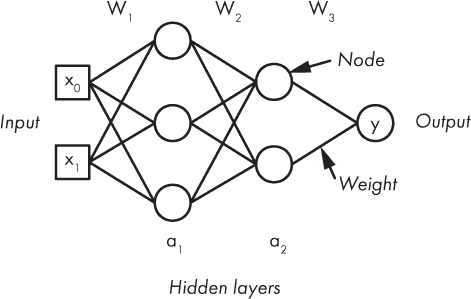

*图 8-1：一个样本神经网络*

在讨论神经网络的结构和部分之后，我们将探索训练我们的示例网络以对鸢尾花进行分类。从这个初步实验开始，第九章将引导我们进入梯度下降和反向传播算法——这是训练神经网络（包括先进的深度神经网络）的标准方法。本章旨在作为一个热身。真正的挑战从第九章开始。

### 神经网络的解剖学

*神经网络*是一个图。在计算机科学中，*图*是一系列*节点*，通常以圆圈表示，通过*边*（短线段）连接。这种抽象有助于表示许多不同类型的关系：城市之间的道路、社交媒体上的人际关系、互联网的结构，或者一系列可以用来逼近任何数学函数的基本计算单元。

最后一个例子显然是有意为之。神经网络是通用的函数逼近器。它们使用图结构来表示一系列计算步骤，将输入特征向量映射到输出值，通常解释为概率。神经网络是分层构建的。从概念上讲，它们从左到右操作，通过沿着边传递值到节点来将输入特征向量映射到输出。注意，神经网络的节点通常被称为*神经元*。我们很快就会看到为什么这样说。节点根据它们的输入计算新值。然后将新值传递给下一层节点，依此类推直到达到输出节点。在图 8-1 中，左边有一个输入层，其右边是一个隐藏层，再右边是另一个隐藏层，并且输出层有一个单独的节点。

前一部分提到了*全连接前馈神经网络*这个词，却没有过多解释。让我们来分解一下。*全连接*部分意味着每一层的每个节点的输出都会发送到下一层的每个节点。*前馈*部分意味着信息从左到右通过网络传递，而不会被送回到前一层；网络结构中没有*反馈*，没有循环。这就只剩下*神经网络*部分。

#### 神经元

就我个人而言，我对*神经网络*这个词有一种爱恨交加的感觉。这个词本身来源于一个非常粗略的近似——网络的基本单元类似于大脑中的神经元。考虑一下图 8-2，我们稍后会详细描述它。

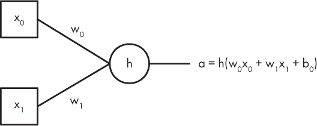

*图 8-2：单个神经网络节点*

记住我们的网络可视化总是从左到右移动，我们看到节点（圆圈）从左侧接受输入，并在右侧有一个输出。这里有两个输入，但它也可能有数百个输入。

多个输入映射到单个输出，类似于大脑中神经元的工作方式：称为树突的结构接收来自其他许多神经元的输入，单一的轴突则是输出。我喜欢这个类比，因为它引出了一个很酷的方式来讨论和思考网络。但我也讨厌这个类比，因为这些人工神经元在操作上与真实的神经元有很大的不同，这个类比很快就会崩溃。它与真实神经元在解剖上有相似之处，但它们并不相同，这会导致那些不熟悉机器学习的人产生困惑，有些人甚至认为计算机科学家正在真正地构建人工大脑，或者认为这些网络会“思考”。“思考”这个词的含义很难界定，但对我来说，它并不适用于神经网络的行为。

现在回到图 8-2，我们看到左边有两个方块，一堆线，一个圆圈，右边有一条线，还有一些带下标的标签。我们来理清楚这个图。如果我们理解了图 8-2，我们就能很好地理解神经网络。稍后，我们会看到这个视觉模型的代码实现，并会惊讶地发现它可以是如此简单。

图 8-2 中的一切都集中在圆圈上。这就是实际的节点。实际上，它实现了一个叫做*激活函数*的数学函数，用于计算节点的输出，也就是一个单一的数字。两个方块是节点的输入。这个节点接受来自输入特征向量的特征；我们使用方块来与圆圈区分，但输入也可能来自前一个网络层中的另一组圆形节点。

每个输入是一个数字，一个单一的标量值，我们称之为 *x*[0] 和 *x*[1]。这些输入沿着标有 *w*[0] 和 *w*[1] 的两条线段移动到节点。这些线段代表*权重*，即连接的强度。在计算上，输入 (*x*[0], *x*[1]) 被权重 (*w*[0], *w*[1]) 相乘，求和，并提供给节点的激活函数。这里我们将激活函数称为 *h*，这是一个相当常见的称呼。

激活函数的值是节点的输出。这里我们称这个输出为 *a*。输入乘以权重相加，并传递给激活函数以产生输出值。我们还没有提到 *b*[0] 值，它也被加入并传递给激活函数。这是*偏置*项。它是一个偏移量，用于调整输入范围，使其适合激活函数。在图 8-2 中，我们加了一个零下标。每个层中的每个节点都有一个偏置值，因此这里的下标表明该节点是该层中的第一个节点。（请记住，计算机人员总是从零开始计数，而不是从一开始。）

这就是神经网络节点的全部功能：神经网络节点接受多个输入，*x*[0], *x*[1], ...，将每个输入与权重值 *w*[0], *w*[1], ... 相乘，然后将这些乘积与偏置项 *b* 相加，并将这个总和传递给激活函数 *h*，以产生单个标量输出值 *a*：

*a* = *h*(*w*[0]*x*[0] + *w*[1]*x*[1] + ... + *b*)

就是这样。将一堆节点组合在一起，适当地链接它们，找出如何训练它们来设置权重和偏置，你就有了一个有用的神经网络。正如你将在下一章看到的那样，训练神经网络并不容易。但是一旦训练好，它们就很简单：输入一个特征向量，输出一个分类。

顺便说一句，我们一直将这些图形称为*神经网络*，并将继续这样称呼，有时使用缩写*NN*。如果你读其他书籍或论文，可能会看到它们被称为*人工神经网络 (ANNs)*或者甚至是*多层感知器 (MLPs)*，例如 sklearn 中的`MLPClassifier`类名。我建议坚持使用*神经网络*，但这只是我的建议。

#### 激活函数

让我们谈谈激活函数。节点的激活函数接受一个单一的标量输入，即输入乘以权重加偏置的总和，并对其进行某些处理。特别是，我们需要激活函数是非线性的，以便模型可以学习复杂的函数。从数学上来说，通过说明线性函数来定义非线性函数可能更容易理解。任何不是线性的映射都是非线性的。

一个*线性函数*，*g*，其输出与输入直接成比例，*g*(*x*) ∝ *x*，其中 ∝ 表示*与...成比例*。或者，线性函数的图形是一条直线。因此，任何图形不是直线的函数都是非线性函数。

例如，函数

*g*(*x*) = 3*x* + 2

是一个线性函数，因为它的图形是一条直线。像 *g*(*x*) = 1 这样的常数函数也是线性的。然而，函数

*g*(*x*) = *x*² + 2

是一个非线性函数，因为 *x* 的指数是 2。超越函数也是非线性的。*超越函数* 是像 *g*(*x*) = log*x*，或者 *g*(*x*) = *e*^(*x*) 这样的函数，其中 *e* = 2.718*...* 是自然对数的底数。像正弦和余弦这样的*三角函数*，它们的反函数，以及由正弦和余弦构建的像正切这样的函数也都是超越函数。这些函数是超越的，因为你不能将它们表示为有限的初等代数运算的组合。它们是非线性的，因为它们的图形不是直线。

网络需要非线性激活函数；否则，它只能学习线性映射，而线性映射不足以使网络具有普遍的实用性。考虑一个简单的由两个节点组成的网络，每个节点有一个输入。这意味着每个节点有一个权重和一个偏置值，且第一个节点的输出是第二个节点的输入。如果我们设置 *h*(*x*) = 5*x* –* 3，一个线性函数，那么对于输入 *x*，网络计算得到的输出 *a*[1] 为

| *a*[1] | = *h*(*w*[1]*a*[0] + *b*[1]) |
| --- | --- |
|  | = *h*(*w*[1]*h*(*w*[0]*x* + *b*[0]) + *b*[1]) |
|  | = *h*(*w*1 – 3) + *b*[1]) |
|  | = *h*(*w*1 + *b*[1]) |
|  | = *h*(5*w*[1]*w*[0]*x* + 5*w*[1]*b*[0] – 3*w*[1] + *b*[1]) |
|  | = 5(5*w*[1]*w*[0]*x* + 5*w*[1]*b*[0] – 3*w*[1] + *b*[1]) – 3 |
|  | = (25*w*[1]*w*[0])*x* + (25*w*[1]*b*[0] – [1]5*w*[1] + 5*b*[1] – 3) |
|  | = *W**x* + *B* |

对于 *W* = 25*w*[1]*w*[0] 和 *B* = 25*w*[1]*b*[0] *–* 15*w*[1] + 5*b*[1] *–* 3，这也是一个线性函数，另一条具有斜率 *W* 和截距 *B* 的直线，因为 *W* 和 *B* 都不依赖于 *x*。因此，具有线性激活函数的神经网络只能学习线性模型，因为线性函数的组合仍然是线性的。正是线性激活函数的这个局限性导致了 1970 年代首次神经网络的“寒冬”：由于被认为过于简单，无法学习复杂的函数，神经网络研究实际上被放弃了。

好的，我们需要非线性激活函数。哪些是可选的？有无数种可能性。在实践中，少数几种因其经过验证的有效性或优良特性或两者兼备而脱颖而出。传统的神经网络使用的是 sigmoid 激活函数或双曲正切激活函数。一个*sigmoid*函数是

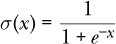

和 *双曲正切* 是

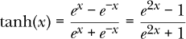

这些函数的图形绘制在 图 8-3 中，Sigmoid 在顶部，双曲正切在底部。

首先要注意的是，这两个函数都大致具有相同的 “S” 形状。Sigmoid 在沿 x 轴向左移动时从 0 变为 1，在 x = 0 时函数值为 0.5。双曲正切也是如此，但从 –1 变为 +1，在 *x* = 0 时为 0。

较近期，**Sigmoid** 和 **双曲正切** 被简称为 **ReLU** 的 *修正线性单元* 所取代。ReLU 简单且对神经网络有便利的特性。尽管名称中有 *线性* 一词，ReLU 是一种非线性函数——其图形并非直线。当我们在 第九章 中讨论神经网络的反向传播训练时，我们将了解为何发生了这种变化。

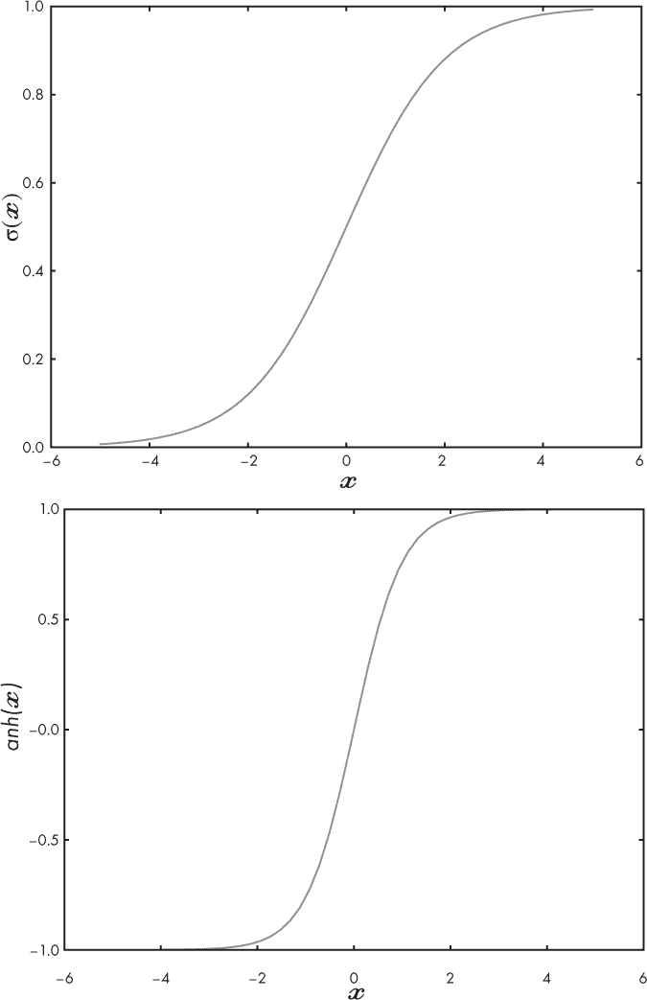

*图 8-3：Sigmoid 函数（顶部）和双曲正切函数（底部）。请注意 y 轴的比例尺不相同*。

ReLU 如下，并在 图 8-4 中显示。

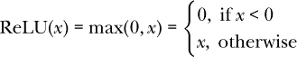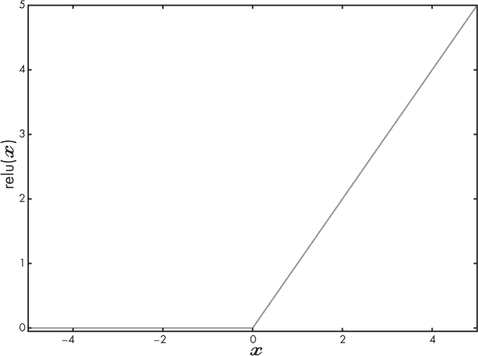

*图 8-4：修正线性激活函数，ReLU(x) = max(0,x)*

ReLU 被称为 *修正*，因为它消除了负值并用 0 替换。事实上，机器学习社区使用了几种不同版本的这个函数，但所有这些版本本质上都是用常数或其他值替换负值。ReLU 的分段特性使其成为非线性函数，因此适合作为神经网络的激活函数。它还计算简单，比 Sigmoid 或双曲正切要快得多。这是因为后两者使用 *e*^(*x*)，在计算机术语中意味着调用 `exp` 函数。该函数通常被实现为级数展开的项的和，这意味着在执行 ReLU 所需的单个 `if` 语句中，需要执行数十次浮点运算。这类小节省在具有数千个节点的大规模网络中将会累积。

#### 网络的架构

我们已经讨论了节点及其工作方式，并暗示节点是如何连接形成网络的。让我们更仔细地看看节点是如何连接的，网络的 *架构*。

标准神经网络，如本章节中使用的那些，是分层构建的，就像您在图 8-1 中看到的那样。我们不一定非要这样做，但正如我们将看到的那样，这样做可以简化计算，并极大简化训练。前馈网络包括一个输入层，一个或多个隐藏层以及一个输出层。输入层只是特征向量，输出层是预测（概率）。如果网络用于多类问题，则输出层可能有多个节点，每个节点代表输入可能类别的模型预测。

隐藏层由节点组成，第*i*层的节点接受第*i-1*层节点的输出作为输入，并将它们的输出传递给第*i+1*层的节点的输入。层之间的连接通常是全连接的，这意味着第*i-1*层的每个节点的每个输出都用作第*i*层的每个节点的输入，因此*全连接*。再次强调，我们不一定非要这样做，但这简化了实现。

隐藏层的数量和每个隐藏层中的节点数量定义了网络的架构。已经证明，具有足够节点的单隐藏层可以学习任何函数映射。这很好，因为这意味着神经网络适用于机器学习问题，因为最终，模型充当将输入映射到输出标签和概率的复杂函数。然而，就像许多理论结果一样，这并不意味着单层网络在所有情况下都是实用的。随着网络中节点（和层）的数量增加，需要学习的参数（权重和偏差）的数量也增加，因此需要的训练数据量也增加。这又是维度的诅咒。

这些问题使得神经网络在 20 世纪 80 年代第二次停滞不前。计算机训练大型网络的速度太慢，而且无论如何，训练网络可用的数据通常太少。从业者们知道，如果这两种情况都改变了，那么训练大型网络将成为可能，这些网络将比当时的小型网络更加强大。对世界而言，幸运的是，情况在 21 世纪初发生了改变。

选择正确的神经网络架构对于模型是否能够学习任何内容具有巨大影响。这就是经验和直觉发挥作用的地方。选择正确的架构是使用神经网络的黑暗艺术。让我们试着通过提供一些（粗略的）经验法则来更有帮助：

+   如果您的输入具有明确定义的空间关系，例如图像的部分，您可能希望改用卷积神经网络（第十二章）。

+   隐藏层不要超过三个。回想一下，理论上，一个足够大的隐藏层就足够了，所以只使用必要的隐藏层。如果模型在一个隐藏层下能够学习，那么就添加第二个隐藏层，看看是否能提高效果。

+   第一个隐藏层的节点数应与输入特征向量的数量匹配或（理想情况下）超过输入特征向量的数量。

+   除了第一个隐藏层（参见前一条规则）外，每个隐藏层的节点数应与前一层和下一层的节点数相同或在其之间。如果第*i-1*层有*N*个节点，第*i+1*层有*M*个节点，那么第*i*层可能需要*N* ≤ *x* ≤ *M*个节点。

第一条规则指出，传统的神经网络最适用于输入没有空间关系的情况——也就是说，你有一个特征向量，而不是图像。此外，当输入维度较小，或者数据不多时，这会使得训练较大的卷积网络变得困难，此时你应该尝试使用传统网络。如果你认为自己正处于需要传统神经网络的情况，建议从小做起，随着性能的提高逐步扩展。

#### 输出层

神经网络的最后一层是输出层。如果网络建模的是一个连续值，称为*回归*，这是我们在本书中忽略的用例，那么输出层是一个不使用激活函数的节点；它只报告图 8-2 中*h*的参数。请注意，这与激活函数是身份函数*h*(*x*) = *x*是一样的。

我们的神经网络用于分类；我们希望它们输出一个决策值。如果我们有两个类别，分别标记为 0 和 1，我们将最终节点的激活函数设置为 sigmoid 函数。这将输出一个介于 0 和 1 之间的值，我们可以将其解释为输入属于类别 1 的可能性或概率。我们根据输出值使用简单的规则做出分类决策：如果激活值小于 0.5，则将输入归类为类别 0；否则，将其归类为类别 1。我们将在第十一章中看到，如何通过改变 0.5 的阈值来调整模型的性能以应对当前任务。

如果我们有超过两个类别，我们需要采取不同的方法。我们将在输出层中使用*N*个输出节点，每个类别一个，每个节点都使用身份函数处理*h*。然后，我们对这*N*个输出应用*softmax*操作，并选择具有最大 softmax 值的输出。

让我们来解释一下 softmax 的含义。假设我们有一个包含四个类别的数据集。它们代表的是什么并不重要；网络也不知道它们代表什么。这些类别标记为 0、1、2 和 3。所以，*N* = 4 表示我们的网络将有四个输出节点，每个节点使用恒等函数作为 *h*。这看起来像是 图 8-5，我们还展示了 softmax 操作和最终的输出向量。

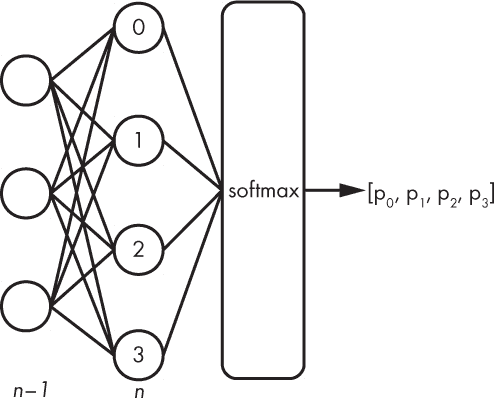

*图 8-5：最后一个隐藏层 *n*-1 和输出层 (*n*，节点编号) 对应一个有四个类别的神经网络。应用 softmax 操作，产生一个包含四个元素的输出向量，* [p*0,*p*1,*p*2,*p*3]*。*

我们选择这个输出向量中最大值的索引作为给定输入特征向量的类别标签。softmax 操作确保该向量的元素之和为 1，因此我们可以稍微马虎地称这些值为属于每个类别的概率。这就是为什么我们只取最大值来决定输出类别标签的原因。

softmax 操作是直接的：每个输出的概率就是

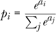

其中 *a*[*i*] 是第 *i* 个输出，分母是所有输出值的总和。以此为例，*i* = 0, 1, 2, 3，最大值的索引将是分配给输入的类别标签。

作为示例，假设四个最后一层节点的输出为：

*a*[0] = 0.2

*a*1 = 1.3

*a*2 = 0.8

*a*3 = 2.1

然后按如下方式计算 softmax：

*p*[0] = *e*^(0.2)/(*e*^(0.2) + *e*^(1.3) + *e*^(0.8) + *e*^(2.1)) = 0.080

*p*[1] = *e*^(1.3)/(*e*^(0.2) + *e*^(1.3) + *e*^(0.8) + *e*^(2.1)) = 0.240

*p*[2] = *e*^(0.8)/(*e*^(0.2) + *e*^(1.3) + *e*^(0.8) + *e*^(2.1)) = 0.146

*p*[3] = *e*^(2.1)/(*e*^(0.2) + *e*^(1.3) + *e*^(0.8) + *e*^(2.1)) = 0.534

选择类别 3，因为 *p*[3] 是最大的。注意，*p*[*i*] 值的总和是 1.0，这是我们预期的。

这里有两点需要提到。在前面的公式中，我们使用了 sigmoid 函数来计算网络的输出。如果我们将类别数设置为 2 并计算 softmax，我们将得到两个输出值：一个是某个 *p*，另一个是 1 *– p*。这与单独使用 sigmoid 是相同的，选择输入属于类别 1 的概率。

第二点涉及到如何实现 softmax。如果网络的输出，即 *a* 值，比较大，那么 *e*^(*a*) 可能会非常大，这可能会导致计算机不喜欢。至少会丧失精度，或者该值可能会溢出，从而使输出变得没有意义。从数值上看，如果我们在计算 softmax 之前，将最大的 *a* 值从所有其他值中减去，我们就可以对较小的值取指数，这样更不容易发生溢出。对前面的例子进行这种处理得到新的 *a* 值：

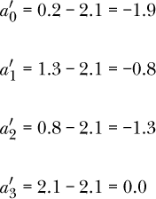

其中我们减去 2.1，因为这是最大的 *a* 值。这将导致我们之前找到的相同的 *p* 值，但这一次可以防止溢出情况，假如任何 *a* 值过大。

#### 表示权重和偏置

在我们继续讲解一个示例神经网络之前，先回顾一下权重和偏置，并看到通过将其视为矩阵和向量，我们可以大大简化神经网络的实现。

考虑从一个包含两个元素的输入特征向量到第一隐层（有三个节点）(*a*[1] 在图 8-1 中的位置)。我们将两个层之间的边（即权重）标记为 *w*[*ij*]，其中 *i* = 0,1 对应输入 *x*[0] 和 *x*[1]，*j* = 0,1,2 对应图中从上到下编号的三个隐层节点。此外，我们还需要三个偏置值，这些在图中未显示，每个隐节点一个。我们将它们分别命名为 *b*[0]、*b*[1] 和 *b*[2]，同样是从上到下。

为了计算三个隐层节点的激活函数 *h* 的输出，我们需要找到以下内容。

*a*[0] = *h*(*w*[00]*x*[0] + *w*[10]*x*[1] + *b*[0])

*a*[1] = *h*(*w*[01]*x*[0] + *w*[11]*x*[1] + *b*[1])

*a*[2] = *h*(*w*[02]*x*[0] + *w*[12]*x*[1] + *b*[2])

但是，记住矩阵乘法和向量加法的工作原理，我们可以看到这实际上是：

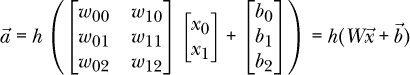

其中 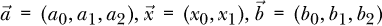，*W* 是一个 3 × 2 的权重矩阵。在这种情况下，激活函数 *h* 接收一组输入值，并输出一组输出值。这实际上是将 *h* 应用到 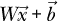 的每个元素。例如，将 *h* 应用到一个包含三个元素的向量 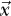 中时，结果是：


其中 *h* 分别应用于  中的每个元素。

由于 NumPy Python 模块是专为数组设计的，而矩阵和向量本身就是数组，因此我们得出一个令人愉快的结论：神经网络的权重和偏置可以存储在 NumPy 数组中，我们只需要简单的矩阵操作（调用 `np.dot`）和加法即可处理一个全连接神经网络。请注意，这也是我们为何要使用全连接网络的原因：它们的实现非常简单。

为了存储图 8-1 中的网络，我们需要在每一层之间存储一个权重矩阵和一个偏置向量，这样我们就得到了三个矩阵和三个向量：每层输入到第一隐层、第一隐层到第二隐层、第二隐层到输出的矩阵和向量。权重矩阵的维度分别为 3 × 2、2 × 3 和 1 × 2。偏置向量的长度分别为 3、2 和 1。

### 实现一个简单的神经网络

在本节中，我们将实现图 8-1 中的示例神经网络，并在来自鸢尾花数据集的两个特征上训练它。我们将从头实现网络，但使用 sklearn 来训练它。本节的目标是看看实现一个简单神经网络有多直接。希望这可以清除前几节讨论中可能存在的一些困惑。

图 8-1 中的网络接受一个包含两个特征的输入特征向量。它有两个隐藏层，一个有三个节点，另一个有两个节点。它有一个 sigmoid 输出。隐藏节点的激活函数也是 sigmoid。

#### 构建数据集

在查看神经网络代码之前，让我们先构建用于训练的数据集，并看看它长什么样。我们已经知道鸢尾花数据集，但在此示例中，我们只使用两个类别和四个特征中的两个。构建训练集和测试集的代码见清单 8-1。

import numpy as np

❶ d = np.load("iris_train_features_augmented.npy")

l = np.load("iris_train_labels_augmented.npy")

d1 = d[np.where(l==1)]

d2 = d[np.where(l==2)]

❷ a=len(d1)

b=len(d2)

x = np.zeros((a+b,2))

x[:a,:] = d1[:,2:]

x[a:,:] = d2[:,2:]

❸ y = np.array([0]*a+[1]*b)

i = np.argsort(np.random.random(a+b))

x = x[i]

y = y[i]

❹ np.save("iris2_train.npy", x)

np.save("iris2_train_labels.npy", y)

❺ d = np.load("iris_test_features_augmented.npy")

l = np.load("iris_test_labels_augmented.npy")

d1 = d[np.where(l==1)]

d2 = d[np.where(l==2)]

a=len(d1)

b=len(d2)

x = np.zeros((a+b,2))

x[:a,:] = d1[:,2:]

x[a:,:] = d2[:,2:]

y = np.array([0]*a+[1]*b)

i = np.argsort(np.random.random(a+b))

x = x[i]

y = y[i]

np.save("iris2_test.npy", x)

np.save("iris2_test_labels.npy", y)

*清单 8-1：构建简单示例数据集。见* nn_iris_dataset.py。

这段代码是简单的数据预处理。我们从增强后的数据集开始，加载样本和标签 ❶。我们只想要类别 1 和类别 2，因此我们找到这些样本的索引并将它们提取出来。我们只保留特征 2 和特征 3，并将它们放入 `x` ❷。接下来，我们构建标签 (`y`) ❸。请注意，我们将类别标签重新编码为 0 和 1。最后，我们打乱样本的顺序并将新数据集写入磁盘 ❹。最后，我们重复此过程构建测试样本 ❺。

图 8-6 显示了训练集。我们可以绘制它，因为这里只有两个特征。

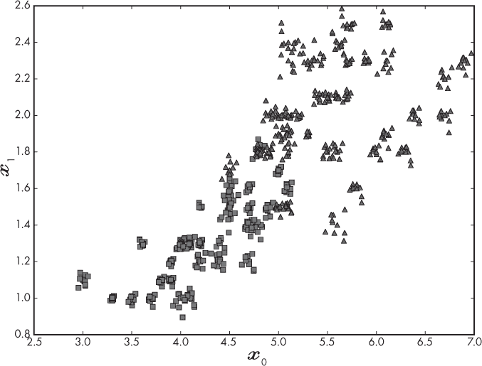

*图 8-6：两类两特征鸢尾花数据集的训练数据*

我们立刻发现这个数据集并不是简单可分的。没有一条简单的线可以将训练集正确地分成两个组，一个全是类别 0，另一个全是类别 1。这使得问题变得稍微有趣一些。

#### 实现神经网络

让我们来看一下如何使用 NumPy 在 Python 中实现图 8-1 所示的网络。我们假设网络已经训练好，这意味着我们已经知道所有的权重和偏置。代码见列表 8-2。

import numpy as np

import pickle

import sys

def sigmoid(x):

return 1.0 / (1.0 + np.exp(-x))

def evaluate(x, y, w):

❶ w12,b1,w23,b2,w34,b3 = w

nc = nw = 0

prob = np.zeros(len(y))

for i in range(len(y)):

a1 = sigmoid(np.dot(x[i], w12) + b1)

a2 = sigmoid(np.dot(a1, w23) + b2)

prob[i] = sigmoid(np.dot(a2, w34) + b3)

z  = 0 if prob[i] < 0.5 else 1

❷ if (z == y[i]):

nc += 1

else:

nw += 1

return [float(nc) / float(nc + nw), prob]

❸ xtest = np.load("iris2_test.npy")

ytest = np.load("iris2_test_labels.npy")

❹ weights = pickle.load(open("iris2_weights.pkl","rb"))

score, prob = evaluate(xtest, ytest, weights)

print()

for i in range(len(prob)):

print("%3d:  actual: %d  predict: %d  prob: %0.7f" %

(i, ytest[i], 0 if (prob[i] < 0.5) else 1, prob[i]))

print("Score = %0.4f" % score)

*列表 8-2：使用训练好的权重和偏置来分类持出的测试样本。见* nn_iris_evaluate.py。

也许我们应该注意到的第一件事是代码是多么简短。`evaluate`函数实现了网络。我们还需要定义`sigmoid`，因为 NumPy 本身没有这个函数。主代码加载了测试样本（`xtest`）和相关标签（`ytest`）❸。这些是前面的代码生成的文件，因此我们知道`xtest`的形状是 23 × 2，因为我们有 23 个测试样本，每个样本有两个特征。类似地，`ytest`是一个包含 23 个标签的向量。

当我们训练这个网络时，我们会将权重和偏置存储为一个 NumPy 数组列表。Python 存储列表到磁盘的方式是通过`pickle`模块，因此我们使用`pickle`从磁盘加载列表❹。该列表`weights`有六个元素，表示三个权重矩阵和三个偏置向量，定义了网络。这些是我们训练过程中根据数据集调整的“魔法”数字。最后，我们调用`evaluate`函数，将每个测试样本通过网络进行计算。该函数返回每个样本的得分（准确率）和输出概率（`prob`）。其余的代码显示样本编号、实际标签、预测标签和对应的输出概率。最后，显示得分（准确率）。

网络在`evaluate`中实现；我们来看一下如何实现。首先，从提供的权重列表中提取各个权重矩阵和偏置向量❶。这些是 NumPy 数组：`w12`是一个 2 × 3 的矩阵，将两个输入元素映射到具有三个节点的第一隐藏层，`w23`是一个 3 × 2 的矩阵，将第一隐藏层映射到第二隐藏层，`w34`是一个 2 × 1 的矩阵，将第二隐藏层映射到输出层。偏置向量有`b1`，包含三个元素；`b2`，包含两个元素；以及`b3`，是一个单独的元素（标量）。

请注意，权重矩阵的形状与我们之前指出的不同。它们是转置矩阵。这是因为我们正在将向量（视为 1×2 矩阵）与权重矩阵相乘。由于标量乘法是可交换的，即*ab* = *ba*，所以我们看到我们仍然在计算激活函数的相同参数值。

接下来，`evaluate` 将正确计数器（`nc`）和错误计数器（`nw`）初始化为 0。这些用于计算整个测试集的总体得分。同样，我们定义了 `prob`，这是一个向量，用于存储每个测试样本的输出概率值。

循环将整个网络应用于每个测试样本。首先，我们将输入向量映射到第一隐藏层，并计算*a*[1]，这是一个包含三个数的向量，表示每个隐藏节点的激活值。然后，我们将这些第一隐藏层的激活值作为输入，计算第二隐藏层的激活值*a*[2]。由于第二隐藏层有两个节点，因此它是一个包含两个元素的向量。接下来，我们计算当前输入向量的输出值，并将其存储在`prob`数组中。通过检查网络的输出值是否小于 0.5 来分配类别标签`z`。最后，我们根据该样本的实际标签（`y[i]`）递增正确（`nc`）或错误（`nw`）的计数器❷。当所有样本都通过网络处理完毕时，整体准确率通过正确分类的样本数与总样本数之比返回。

这一切都很好，我们可以实现一个网络，并将输入向量传递其中，查看其表现如何。如果网络有第三个隐藏层，我们将把第二个隐藏层的输出（`a2`）传递给它，然后计算最终的输出值。

#### 神经网络的训练与测试

Listing 8-2 中的代码将训练好的模型应用于测试数据。为了训练模型，我们将使用 sklearn。训练模型的代码在 Listing 8-3 中。

import numpy as np

import pickle

from sklearn.neural_network import MLPClassifier

xtrain= np.load("iris2_train.npy")

ytrain= np.load("iris2_train_labels.npy")

xtest = np.load("iris2_test.npy")

ytest = np.load("iris2_test_labels.npy")

❶ clf = MLPClassifier(

❷ hidden_layer_sizes=(3,2),

❸ activation="logistic",

solver="adam", tol=1e-9,

max_iter=5000,

verbose=True)

clf.fit(xtrain, ytrain)

prob = clf.predict_proba(xtest)

score = clf.score(xtest, ytest)

❹ w12 = clf.coefs_[0]

w23 = clf.coefs_[1]

w34 = clf.coefs_[2]

b1 = clf.intercepts_[0]

b2 = clf.intercepts_[1]

b3 = clf.intercepts_[2]

weights = [w12,b1,w23,b2,w34,b3]

pickle.dump(weights, open("iris2_weights.pkl","wb"))

print()

print("测试结果：")

print("  总体得分: %0.7f" % score)

print()

for i in range(len(ytest)):

p = 0 if (prob[i,1] < 0.5) else 1

print("%03d: %d - %d, %0.7f" % (i, ytest[i], p, prob[i,1]))

print()

*列表 8-3：使用 sklearn 训练鸢尾花神经网络。请参见* nn_iris_mlpclassifier.py。

首先，我们从磁盘加载训练数据和测试数据。这些是我们之前创建的相同文件。然后我们设置神经网络对象，即 `MLPClassifier` 的实例 ❶。该网络有两个隐藏层，第一个包含三个节点，第二个包含两个节点 ❷。这与图 8-1 中的架构相匹配。该网络还使用 *logistic* 层 ❸。这就是 sigmoid 层的另一个名称。我们通过调用 `fit` 来训练模型，就像我们为其他 sklearn 模型类型所做的那样。由于我们将 `verbose` 设置为 `True`，因此我们会看到输出显示每次迭代的损失。

调用 `predict_proba` 可以给我们测试数据的输出概率。此方法也被大多数其他 sklearn 模型支持。这是模型对分配的输出标签的确定性。然后我们调用 `score` 来计算测试集上的得分，就像我们之前做的那样。

我们希望存储学习到的权重和偏置，以便我们可以在测试代码中使用它们。我们可以直接从训练好的模型 ❹ 中提取它们。这些被打包成一个列表（`weights`）并导出为 Python pickle 文件。

剩下的代码输出的是运行经过 sklearn 训练的模型在保留的测试数据上的结果。例如，运行此代码的一次结果显示

```py
Test results:

  Overall score: 1.0000000

000: 0 - 0, 0.0705069

001: 1 - 1, 0.8066224

002: 0 - 0, 0.0308244

003: 0 - 0, 0.0205917

004: 1 - 1, 0.9502825

005: 0 - 0, 0.0527558

006: 1 - 1, 0.9455174

007: 0 - 0, 0.0365360

008: 1 - 1, 0.9471218

009: 0 - 0, 0.0304762

010: 0 - 0, 0.0304762

011: 0 - 0, 0.0165365

012: 1 - 1, 0.9453844

013: 0 - 0, 0.0527558

014: 1 - 1, 0.9495079

015: 1 - 1, 0.9129983

016: 1 - 1, 0.8931552

017: 0 - 0, 0.1197567

018: 0 - 0, 0.0406094

019: 0 - 0, 0.0282220

020: 1 - 1, 0.9526721

021: 0 - 0, 0.1436263

022: 1 - 1, 0.9446458
```

表明该模型在小型测试数据集上的表现完美。输出显示了样本编号、实际类别标签、分配的类别标签以及属于类别 1 的输出概率。如果我们将包含 sklearn 网络权重和偏置的 pickle 文件通过我们的评估代码运行，我们会看到输出概率与前面的代码完全相同，表明我们手动生成的神经网络实现是正确的。

### 总结

在本章中，我们讨论了神经网络的结构。我们描述了架构、节点的排列以及它们之间的连接。我们讨论了输出层节点及其计算的函数。然后我们看到，所有的权重和偏置可以方便地通过矩阵和向量来表示。最后，我们展示了一个简单的网络，用于对鸢尾花数据集的子集进行分类，并展示了如何训练和评估该网络。

现在我们已经初步了解，让我们继续深入研究神经网络背后的理论。
