## 第九章：训练神经网络**


本章将讨论如何训练神经网络。我们将研究当前领域中使用的标准方法和技巧。会有一些数学、一些手势表达，还有一大堆新术语和概念。但你不需要深入跟进数学部分：我们会适当地跳过一些内容，以便传达主要观点。

本章可能是本书中最具挑战性的一章，至少在概念上是如此。从数学上来说，绝对是。虽然这对建立直觉和理解至关重要，但有时我们会感到不耐烦，喜欢先跳进实操中试探一下。幸运的是，由于已有的库，我们可以在这里做到这一点。如果你想在学习它们如何工作之前先玩玩神经网络，可以跳到第十章，然后再回来填补理论。但一定要回来。

有可能在不理解它们如何工作的情况下学习使用像 sklearn 和 Keras 这样的强大工具包。然而，这种方法应该不会满足任何人，尽管诱惑很大。理解这些算法如何工作是非常值得花时间的。

### 高级概览

让我们从概述我们将讨论的概念开始这一章的内容。读一读它，但如果这些概念不清楚，不用担心。相反，尽量感受一下整个过程。

训练神经网络的第一步是为权重和偏置选择智能的初始值。然后，我们使用*梯度下降*来调整这些权重和偏置，从而减少训练集上的误差。我们将使用损失函数的平均值来衡量误差，这告诉我们网络当前的错误程度。我们知道网络是否正确，因为我们有每个输入样本在训练集中的预期输出（即类标签）。

梯度下降是一种需要梯度的算法。现在，可以把梯度看作是陡峭度的度量。梯度越大，函数在该点的陡峭度就越大。为了使用梯度下降搜索损失函数的最小值，我们需要能够找到梯度。为此，我们将使用*反向传播*。这是神经网络的基本算法，它使得神经网络能够成功学习。它通过从网络的输出开始，向输入方向反向传播，通过计算每个权重和偏置的梯度值来为我们提供所需的梯度。

通过梯度值，我们可以使用梯度下降算法更新权重和偏置，这样下次我们将训练样本传入网络时，损失函数的平均值将比之前小。换句话说，我们的网络会变得更少出错。这就是训练的目标，我们希望它能带来一个已经学会数据一般特征的网络。

学习数据集的通用特征需要进行*正则化*。正则化有许多方法，我们将讨论其中的主要几种。如果没有正则化，训练过程就可能面临过拟合的风险，最终可能得到一个无法泛化的网络。而通过正则化，我们可以取得成功，并得到一个有用的模型。

接下来，我们将介绍梯度下降、反向传播、损失函数、权重初始化以及最后的正则化。这些是成功的神经网络训练的主要组成部分。我们不需要了解它们所有的复杂数学细节；相反，我们需要从概念上理解它们，这样我们才能建立起一种直观的理解，知道训练神经网络的含义。有了这种直觉，我们就能有意义地使用 sklearn 和 Keras 提供的参数来进行训练。

### 梯度下降

训练神经网络的标准方法是使用梯度下降。

让我们解析一下“*梯度下降*”这个短语。我们已经知道“*下降*”意味着什么，它表示从更高的地方向下走。那么“*梯度*”呢？简短的答案是，梯度表示某事物相对于另一样事物的变化速度。测量一件事随着另一件事变化的程度是我们都熟悉的事情。我们都知道速度，它是位置随着时间变化的速度。我们甚至会用语言表达出来：*每小时多少英里*或*每小时多少公里*。

你可能已经在其他上下文中熟悉了梯度。考虑直线的方程

*y* = *mx* + *b*

其中 *m* 是斜率，*b* 是 y 轴截距。斜率表示直线的 *y* 位置随着 *x* 位置变化的速度。如果我们知道直线上的两个点，(*x*[0], *y*[0]) 和 (*x*[1], *y*[1])，那么我们可以通过以下公式计算斜率：

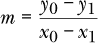

用语言描述的话，我们可以说是“*y* 对 *x* 的变化”。它是衡量直线陡峭或平缓的程度：即它的梯度。在数学中，我们经常讨论变量的变化，表示这种变化的符号是在前面加一个Δ（delta）。所以，我们可能会写出直线的斜率为

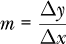

为了强调斜率是每次 *x* 变化时 *y* 的变化量。幸运的是，事实证明，不仅直线在每个点都有斜率，大多数函数在每个点也有斜率。然而，除了直线外，这个斜率会随着点的位置而变化。这里用一张图来帮助理解。请参考图 9-1。

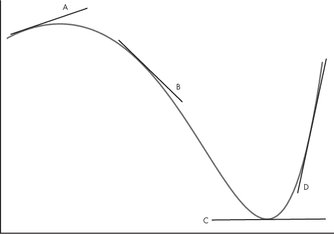

*图 9-1：一个具有多个切线的函数*

图 9-1 中的图是一个多项式图。注意图中那些与函数仅有一个接触点的线条，这些是*切线*。作为直线，它们的斜率可以在图中看到。现在，想象将其中一条线移动到函数上，使其继续仅在一个点上接触函数；想象当这条线移动时，斜率是如何变化的。

事实证明，斜率如何随着函数变化而变化本身也是一个函数，这个函数叫做*导数*。给定一个函数和 *x* 值，导数告诉我们该点 *x* 处的函数斜率。函数有导数这一事实是微积分的一个基本洞察，对我们来说非常重要。

导数的概念至关重要，因为对于单变量函数，点 *x* 处的导数就是该点的梯度；它代表了函数变化的方向。如果我们想找到函数的最小值，即给我们最小 *y* 的 *x*，我们需要朝着梯度的*相反方向*移动，因为这会把我们带向最小值的方向。

导数有许多不同的写法，但最能体现斜率概念，即 *y* 如何随 *x* 的变化而变化的写法是：

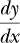

我们将在下文讨论反向传播算法时回到这种形式。梯度部分讲解完毕，现在让我们更深入地了解下降法。

#### 寻找最小值

由于我们需要一个能够尽量减少错误的模型，我们需要找到一组参数，使得损失函数的值尽可能小。换句话说，我们需要找到损失函数的*最小值*。

再次看一下图 9-1。最小值位于右侧，切线 C 所在的位置。我们可以看到这是最小值，并且注意到此处的梯度为 0。这告诉我们我们处于一个最小值（或最大值）处。如果我们从 B 开始，我们看到切线的斜率是负的（向下且朝右）。因此，我们需要朝着正方向的 *x* 值移动，因为这与梯度的符号相反。这样做会使我们更接近 C 处的最小值。类似地，如果我们从 D 开始，切线的斜率是正的（向上且朝右），意味着我们需要朝着负 *x* 方向移动，再次朝着 C 移动，以便接近最小值。所有这些都暗示着一种寻找函数最小值的算法：选择一个起点（*x* 值），然后使用梯度移动到更低的点。

对于像图 9-1 中那样的简单 *x* 函数，这种方法可以很好地工作，前提是我们从一个好的位置开始，比如 B 或 D。当我们扩展到多维空间时，事实证明，只要我们从一个合适的初始猜测开始，这种方法仍然有效。

继续使用图 9-1，假设我们从 B 开始，我们可以看到梯度告诉我们向右移动，朝 C 方向前进。但我们如何选择下一个 *x* 值，以便将我们带得更接近 C 呢？这就是步长，它告诉我们从一个 *x* 位置到下一个 *x* 位置该跳多远。步长是我们必须选择的参数，实际上，这个值，称为 *学习率*，通常是流动的，随着我们的移动，它会越来越小，假设随着我们接近最小值，我们需要越来越小的步伐。

这一切看起来都不错，甚至是直观的，但我们有一个小问题。如果我们不是从 B 或 D 开始，而是从 A 开始呢？A 点的梯度是指向左边的，而不是右边。在这种情况下，我们的简单算法将失败——它会将我们推向左边，而我们永远也无法到达 C。图中只显示了一个最小值，位于 C 处，但我们很容易想象在 A 的左侧有第二个最小值，虽然它没有 C 那么低（即没有那么小的 *y* 值）。如果我们从 A 开始，我们会朝这个最小值前进，而不是 C 处的最小值。我们的算法会陷入 *局部最小值*。一旦陷入局部最小值，我们的算法就无法摆脱它，我们将无法找到位于 C 的全局最小值。我们会看到，这是神经网络中的一个真实问题，但对于现代深度网络来说，这个问题几乎是神奇地不再是问题了。

那么，这一切如何帮助我们训练神经网络呢？梯度告诉我们 *x* 的小变化如何影响 *y*。如果 *x* 是我们网络中的一个参数，而 *y* 是损失函数给出的误差，那么梯度告诉我们这个参数的变化对网络整体误差的影响。了解这一点后，我们就可以根据梯度修改参数，并且知道这样做会使我们向最小误差靠近。当训练集上的误差达到最小值时，我们就可以宣称网络已完成训练。

让我们再多谈一谈梯度和参数。到目前为止，我们所有的讨论，基于图 9-1，都相当单维；我们的函数仅仅是 *x* 的函数。我们讨论了改变一个因素，即沿着 x 轴的位置，来观察它如何影响 *y* 位置。实际上，我们并不仅仅在处理一个维度。网络中的每个权重和偏置都是一个参数，而损失函数的值依赖于所有这些参数。仅在图 8-1 中，简单网络就有 20 个参数，这意味着损失函数是一个 20 维的函数。尽管如此，我们的方法仍然大致相同：如果我们知道每个参数的梯度，我们仍然可以应用我们的算法，试图找到一组最小化损失的参数。

#### 更新权重

我们稍后会讲解如何获得梯度值，但暂时假设我们已经得到了这些值。我们可以说，我们已经有了一组数字，它告诉我们在当前网络配置下，任何权重或偏置值的变化是如何影响损失的。借助这些信息，我们可以应用梯度下降：我们通过梯度值的一部分来调整权重或偏置，从而将整体网络推向损失函数的最小值。

数学上，我们使用一个简单的规则来更新每个权重和偏置：

*w* ← *w* –Δ*w*

这里，*w*是权重（或偏置）之一，*η*（eta）是学习率（步长），*Δw*是梯度值。

清单 9-1 给出了使用梯度下降训练神经网络的算法。

1\. 为权重和偏置选择一些智能的初始值。

2\. 使用当前的权重和偏置将训练集传入网络。

偏置并计算平均损失。

3\. 使用该损失来计算每个权重和偏置的梯度。

4\. 根据步长和梯度值更新权重或偏置值。

5\. 从第 2 步开始重复，直到损失足够低。

*清单 9-1：五个（看似）简单的梯度下降步骤*

该算法看起来很简单，但正如人们所说，关键在于细节。我们在每个步骤都需要做出选择，而我们做出的每个选择都会引发进一步的问题。例如，第 1 步要求“选择一些智能的初始值。”这些初始值应该是什么呢？事实证明，成功训练神经网络关键在于选择好的初始值。我们已经在前面的例子中看到了这一点，使用图 9-1 时，如果我们从 A 开始，我们就无法找到 C 的最小值。多年来，关于第 1 步的研究已经积累了大量的成果。

第 2 步很直接，就是通过网络进行前向传播。我们还没有详细讨论损失函数本身；目前，只需要将它视为一个衡量网络在训练集上有效性的函数。

第 3 步目前还是一个黑盒。我们很快会探讨如何实现它。现在，假设我们能够找到每个参数的梯度值。

第 4 步遵循前一个方程的形式，将参数从当前值移动到一个能够减少整体损失的值。实际上，这个方程的简单形式不足够；还有其他项，例如动量，它保留一些前一次权重变化的分量，供下一次迭代（即下一次训练数据通过网络）使用，从而防止参数变化过于剧烈。稍后我们会再讨论动量。现在，先来看一种梯度下降的变种，这种变种实际上被用来训练深度网络。

### 随机梯度下降

之前的步骤描述了神经网络的梯度下降训练。正如我们可能预期的那样，实际上这种基本思想有很多不同的变种。一个广泛使用且在实践中表现良好的变种叫做*随机梯度下降（SGD）*。其中的*随机*一词指的是一种随机过程。接下来我们将看到，为什么在这种情况下，*随机*这个词要放在*梯度下降*前面。

#### 批次与小批次

清单 9-1 的第 2 步提到，使用当前的权重和偏置值将完整的训练集输入到网络中。这种方法被称为*批量训练*，之所以这样命名，是因为我们使用所有的训练数据来估计梯度。直观来看，这是一种合理的做法：我们已经精心构建了训练集，使其能公平地代表生成数据的未知母过程，而我们希望网络成功地为我们建模的正是这个母过程。

如果我们的数据集很小，比如第五章中的原始鸢尾花数据集，那么批量训练是合适的。但如果我们的训练数据集很大呢？如果它有成百上千甚至数百万个样本呢？那样的话，我们将面临越来越长的训练时间。

我们遇到了一个问题。我们希望拥有一个大的训练集，因为这将（希望）更好地代表我们想要建模的未知母过程。但是训练集越大，每次通过网络处理每个样本，计算损失的平均值，并更新权重和偏置的时间就越长。我们称将整个训练集通过网络一次的过程为*一个时期*，我们将需要几十到几百个时期来训练网络。更好地代表我们想要建模的对象意味着更长的计算时间，因为必须通过网络处理所有样本。

这就是 SGD 发挥作用的地方。我们不再在每次迭代时使用所有的训练数据，而是交替选择一个小的训练数据子集，并利用从中计算出的平均损失来更新参数。由于我们只是使用一个小样本来估算整个训练集上的损失，计算出来的梯度值可能是“错误的”，但我们将节省大量的时间。

让我们通过一个简单的例子来看看这个采样是如何运作的。我们将使用 NumPy 定义一个包含 100 个随机字节的向量：

```py
>>> d = np.random.normal(128,20,size=100).astype("uint8")

>>> d

130, 141,  99, 106, 135, 119,  98, 147, 152, 163, 118, 149, 122,

133, 115, 128, 176, 132, 173, 145, 152,  79, 124, 133, 158, 111,

139, 140, 126, 117, 175, 123, 154, 115, 130, 108, 139, 129, 113,

129, 123, 135, 112, 146, 125, 134, 141, 136, 155, 152, 101, 149,

137, 119, 143, 136, 118, 161, 138, 112, 124,  86, 135, 161, 112,

117, 145, 140, 123, 110, 163, 122, 105, 135, 132, 145, 121,  92,

118, 125, 154, 148,  92, 142, 118, 128, 128, 129, 125, 121, 139,

152, 122, 128, 126, 126, 157, 124, 120, 152
```

在这里，字节值呈正态分布，均值为 128。100 个值的实际均值是 130.9。从这些值中每次选择 10 个子集，我们可以估算出实际的均值。

```py
>>> i = np.argsort(np.random.random(100))

>>> d[i[:10]].mean()

138.9
```

通过重复的子集，估计得到的均值分别为 135.7、131.7、134.2、128.1 等等。

所有估计的均值都不是实际的均值，但它们都非常接近。如果我们可以从完整数据集的随机子集估计均值，我们可以通过类比看出，我们应该能够通过完整训练集的一个子集来估计损失函数的梯度。由于样本是随机选择的，因此得到的梯度值是随机波动的估计值。这就是为什么我们在*梯度下降*前面加上*随机*一词的原因。

因为在每次更新权重和偏置时将完整训练集传递通过网络被称为*批训练*，而将一个子集传递通过网络则称为*小批量训练*。你会经常听到人们使用*小批量*这个术语。小批量是用于每次随机梯度下降步骤的训练数据子集。训练通常包含若干个周期（epoch），其中周期和小批量之间的关系如下：

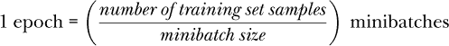

实际上，我们并不希望从完整的训练集中随机选择小批量。如果我们这样做，可能会面临没有使用到所有样本的风险：有些样本可能永远不会被选中，而有些样本可能被选中得太频繁。通常，我们会随机化训练样本的顺序，并在需要小批量时按顺序选择固定大小的样本块。当所有可用的训练样本都被使用完时，我们可以打乱整个训练集的顺序，并重复这一过程。有些深度学习工具包甚至不这样做，它们会再次循环使用相同的小批量。

#### 凸函数与非凸函数

随机梯度下降（SGD）听起来像是对实用性的让步。从理论上讲，我们似乎永远不想使用它，并且可能会预期我们的训练结果因此而受损。然而，事实恰恰相反。在某种意义上，神经网络的梯度下降训练本不应当有效，因为我们把一个用于凸函数的算法应用于非凸函数。图 9-2 说明了凸函数和非凸函数之间的区别。

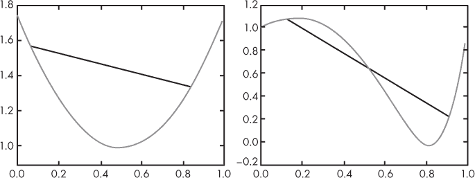

*图 9-2：* x *的凸函数（左）。* x *的非凸函数（右）*。

凸函数是指在函数上的任意两点之间的线段不会在其他点与函数交叉。图 9-2 左侧的黑线就是一个例子，任何这样的线段都不会在其他点与函数交叉，表明这是一个凸函数。然而，图 9-2 右侧的曲线就不能这样说了。这就是图 9-1 中的曲线。在这里，黑线确实会与函数交叉。

梯度下降法在函数是凸的情况下被设计用来找到最小值，因为它仅依赖于梯度，即一阶导数，因此有时被称为*一阶*优化方法。一般来说，梯度下降法不应在非凸函数上起作用，因为它有可能陷入局部最小值，而不是找到全局最小值。我们在图 9-1 的例子中也看到了这一点。

这就是随机梯度下降的帮助所在。在多维空间中，梯度指向的方向不一定是损失函数的最近最小值方向。这意味着我们的步伐会稍微朝错误的方向前进，但这个略微错误的方向可能帮助我们避免被困在不想去的地方。

情况当然更加复杂，也更加神秘。机器学习社区一直在挣扎于使用一阶优化方法在非凸损失函数上取得明显成功与其实际上不应该起作用之间的矛盾。

有两个思想正在浮现。第一个是我们刚刚提到的，随机梯度下降通过实际让我们朝稍微错误的方向移动来起作用。第二个思想，现在似乎已经得到充分验证的是，对于深度学习中使用的损失函数，实际上存在着许多局部最小值，而这些最小值基本上是相同的，因此几乎落在任何一个局部最小值上都能得到表现良好的网络。

一些研究人员认为，大多数梯度下降学习最终会停留在一个*鞍点*；这个地方看起来像一个最小值，但并不是。想象一下马鞍，将一个小球放在中间。小球会保持在原地，但你可以把它推向某个方向，使它从鞍点滚下来。这个论点，尽管有一定的合理性，认为大多数训练最终停留在鞍点，且通过更好的算法可以获得更好的结果。然而，即使这个点是鞍点，若它真的是鞍点，它仍然在实际操作中是一个不错的位置，因此模型无论如何都能取得成功。

因此，实际操作中我们应该使用随机梯度下降，因为它能够带来更好的整体学习效果，并通过不要求全批次的数据来减少训练时间。它确实引入了一个新的超参数——小批量大小，我们必须在训练之前的某个时刻选择它。

#### 结束训练

我们还没有讨论一个关键问题：我们应该何时停止训练？记得在第五章中，我们花了一些功夫来创建训练集、验证集和测试集。现在就是我们使用验证集的地方。在训练过程中，我们可以使用验证集上的准确度或其他一些指标来决定何时停止。如果使用 SGD，我们通常会在每个小批量或一组小批量上运行验证集，通过网络计算准确度。通过跟踪验证集上的准确度，我们可以决定何时停止训练。

如果我们训练很长时间，通常会发生两件事。第一，训练集上的误差趋近于零；我们在训练集上的表现越来越好。第二，验证集上的误差先下降，然后最终开始回升。

这些效应是由于过拟合导致的。随着模型不断学习以表示生成数据集的母体分布，训练误差会不断下降。然而，最终，它将停止学习训练集的通用特征。在这个时候，我们发生了过拟合，应该停止训练，因为模型不再学习通用特征，而是学习我们所用特定训练集的细节。我们可以通过在训练过程中使用验证集来监控这一点。由于我们不使用验证集中的样本来更新网络的权重和偏置，它应该能公平地测试网络当前的状态。当过拟合开始时，验证集上的误差将从最小值开始上升。此时，我们可以保留在验证集上产生最小误差的权重和偏置，并认为这些代表了最佳模型。

我们不希望使用任何已影响训练的数据来衡量网络的最终效果。我们使用验证集来决定何时停止训练，因此验证集中样本的特征也已影响最终模型；这意味着我们不能过度依赖验证集来判断模型在新数据上的表现。只有在我们宣布训练胜利之前未使用的测试集，才能让我们对模型在实际数据中的表现有所了解。因此，正如报告训练集准确度作为模型好坏的衡量标准是错误的，报告验证集准确度同样也是错误的。

#### 更新学习率

在我们基于梯度更新权重和偏置的通用更新方程中，我们引入了一个超参数，*η*（eta），即学习率或步长。它是一个比例因子，表示我们应根据梯度值更新权重或偏置的程度。

我们之前提到过，学习率不需要固定，并且它可以，甚至应该，随着训练逐渐变小，因为我们假设需要越来越小的步伐才能达到损失函数的实际最小值。我们没有说明应该如何实际更新学习率。

更新步长有不止一种方法，但有些方法比其他方法更有帮助。sklearn 的`MLPClassifier`类使用 SGD 求解器，提供了三种选项。第一种是永远不改变学习率——只需保持*η*为初始值*η*[0]。第二种是按周期（小批量）缩放*η*，使其随着周期数的增加而减小，具体如下：

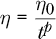

其中*η*[0]由用户设置，*t*是迭代次数（周期，小批量），*p*是*t*的指数，用户也可以指定。sklearn 的默认值*p*为 0.5，也就是按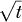进行缩放，这似乎是一个合理的默认值。

第三个选项是通过观察损失函数值来调整学习率。只要损失在下降，就保持学习率不变。当损失在设置的几个小批量后不再下降时，将学习率除以一个值，比如 5，这是 sklearn 的默认值。如果我们从不改变学习率，并且它太大，我们可能会一直围绕最小值移动，而无法到达它，因为我们总是跨越它。那时，降低学习率是使用 SGD 的一个好主意。本书后面我们将遇到其他优化方法，它们会自动为我们调整学习率。

#### 动量

SGD 中还有一个最后需要注意的问题。如我们之前所见，梯度下降和 SGD 的权重更新方程式是：

*w* ← *w* – *η*Δ*w*

我们通过学习率（*η*）乘以梯度来更新权重，我们在这里表示为Δ*w*。

一个常见且强大的技巧是引入一个*动量*项，将前一次Δ*w*的某个分数加回来，即前一个小批量的更新。动量项可以防止*w*参数在面对某个特定小批量时变化过快。加入此项后，我们得到：

*w*[*i*+1] ← *w*[*i*] – *η*Δ*w*[*i*] + *μ*Δ*w*[*i–1*]

我们添加了下标来表示网络的下一次传递（*i* + 1），当前传递（*i*）和上一次传递（*i –* 1）。我们需要使用的是上一次传递的Δ*w*。*μ*（动量）的典型值约为 0.9。几乎所有工具包都以某种形式实现了动量，包括 sklearn。

### 反向传播

我们一直假设已经知道每个参数的梯度值。让我们讨论一下反向传播算法是如何为我们提供这些“魔法数字”的。反向传播算法可能是神经网络历史上最重要的进展，它使得训练包含成百上千甚至数百万、数十亿个参数的大型网络成为可能。特别是在我们将在 第十二章 中研究的卷积网络中，这一点尤为重要。

反向传播算法本身由 Rumelhart、Hinton 和 Williams 在 1986 年的论文《通过反向传播误差来学习表示》中发布。这是链式法则在导数中的一种巧妙应用。该算法被称为 *反向传播*，因为它从网络的输出层向输入层反向工作，将损失函数中的误差传播到网络的每个参数。口语中，这个算法被称为 *反向传播*（*backprop*）；我们在这里也使用这个术语，这样听起来更像是机器学习领域的专家。

将反向传播加入梯度下降的训练算法，并根据随机梯度下降（SGD）进行调整，给出了 列表 9-2 中的算法。

1\. 为权重和偏置选择一些合理的初始值。

2\. 使用当前的权重和偏置将一个小批量数据通过网络运行。

并计算平均损失。

3\. 使用此损失和反向传播来获取每个权重和偏置的梯度。

4\. 通过步长乘以梯度值来更新权重或偏置值。

5\. 从步骤 2 开始重复，直到损失足够小。

*列表 9-2：带有反向传播的随机梯度下降*

列表 9-2 的步骤 2 被称为 *前向传播*；步骤 3 是 *反向传播*。前向传播也是我们在网络训练完成后使用网络的方式。反向传播是反向传播算法，它计算梯度，供我们在步骤 4 中更新参数。

我们将描述两次反向传播。首先，我们将通过一个简单的例子并运用实际的导数进行讲解。其次，我们将使用更抽象的符号，看看反向传播如何在一般意义上应用于实际的神经网络。不能回避这一点：这一部分涉及导数，但我们已经通过梯度下降的讨论对这些有了直观的理解，因此应该能顺利进行。

#### 反向传播，第一部分

假设我们有两个函数，*z* = *f* (*y*) 和 *y* = *g*(*x*)，也就是说 *z* = *f* (*g*(*x*)）。我们知道函数 *g* 的导数给出了 *dy*/*dx*，它告诉我们当 *x* 改变时 *y* 如何变化。类似地，我们知道函数 *f* 的导数会给出 *dz*/*dy*。*z* 的值依赖于 *f* 和 *g* 的组合，即 *g* 的输出是 *f* 的输入，因此，如果我们想找到 *dz*/*dx* 的表达式，表示 *z* 随着 *x* 的变化，我们需要通过组合函数进行链接。这就是导数链式法则给我们的结果：

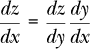

这个符号特别好，因为我们可以想象 *dy* 这个“项”就像实际的分数一样被消去。

这对我们有什么帮助呢？在神经网络中，一层的输出是下一层的输入，这就是组合，所以我们可以直观地看到链式法则可能适用。记住，我们想要的是告诉我们损失函数如何相对于权重和偏置变化的值。我们把损失函数叫做 *L*，任何给定的权重或偏置叫做 *w*。我们想计算所有权重和偏置的 *∂*ℒ/*∂w*。

警钟应该在你脑中响起了。前一段中引入了新的符号。到目前为止，我们一直写导数为 *dy*/*dx*，但损失函数对权重的导数却写作 *∂*ℒ/*∂w*。这个花哨的 *∂* 是什么？

当我们只有一个变量函数，即只有 *x* 时，讨论一个点的斜率是没有问题的。但一旦我们有了多个变量的函数，点的斜率的概念就变得模糊了。在任何点上，都有无数条切线。因此，我们需要使用*偏导数*的概念，它是我们所考虑的变量的方向上的斜率，而将其他变量视为固定值。这告诉我们，当我们只改变一个变量时，输出会如何变化。为了表示我们使用的是偏导数，我们将 *d* 换成 *∂*，这只是 *d* 的一种变体。

让我们建立一个简单的网络，这样我们可以看到链式法则是如何直接得到我们想要的表达式的。我们正在查看 图 9-3 中的网络，它由一个输入、两个每个只有一个节点的隐藏层和一个输出层组成。

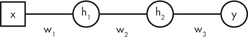

*图 9-3：一个简单的网络，用于说明链式法则*

为了简化，我们将忽略任何偏置值。此外，假设激活函数是恒等函数，*h*(*x*) = *x*。这个简化去除了激活函数的导数，使得问题更为清晰。

对于这个网络，前向传播计算

*h*[1] = *w*[1]*x*

*h*[2] = *w*[2]*h*[1]

*y* = *w*[3]*h*[2]

这遵循了我们之前使用的形式，通过将一层的输出作为下一层的输入将各个部分链接在一起。这给出了网络的输出 *y*，对应输入 *x*。如果我们希望训练网络，就会有一个训练集，一组对 (*x*[*i*], *ŷ*)，*i* = 0, 1, …，表示对于给定输入应该得到的输出。请注意，前向传播是从输入 *x* 到输出 *y*。接下来我们将看到为什么反向传播是从输出到输入。

现在，让我们定义损失函数 *ℒ* 为 *y*（给定输入 *x* 时的网络输出）和 *ŷ*（我们应该得到的输出）之间的平方误差。函数上看，损失像下面这样：

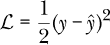

为了简化起见，我们忽略了损失是训练集或从中抽取的某个小批次的平均值这一事实。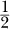因子不是绝对必要的，但它通常用于让导数更简洁一些。因为我们希望最小化特定权重集的损失，所以不管我们是否总是将损失乘以一个常数因子，这并不重要——最小的损失仍然是最小的损失，无论其实际数值如何。

为了使用梯度下降，我们需要找出损失函数随权重变化的情况。在这个简单的网络中，这意味着我们需要找到三个梯度值，分别是 *w*[1]、*w*[2] 和 *w*[3]。这就是链式法则发挥作用的地方。我们先写出方程，然后再讨论它们：

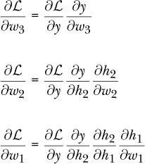

这些方程的顺序展示了为什么这个算法被称为 *反向传播*。为了得到输出层参数的偏导数，我们只需要输出 *y* 和损失 *ℒ*。为了得到中间层权重的偏导数，我们需要以下两个来自输出层的偏导数：

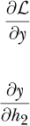

最后，为了得到输入层权重的偏导数，我们需要输出层和中间层的偏导数。实际上，我们已经通过网络反向传播，从后面的层传播值。

对于这些方程中的每一个，如果我们想象“项”像分数一样相互抵消，那么右侧与左侧是匹配的。由于我们为网络选择了一个特别简单的形式，因此我们可以手动计算实际的梯度。我们需要以下梯度，来自前面方程的右侧。

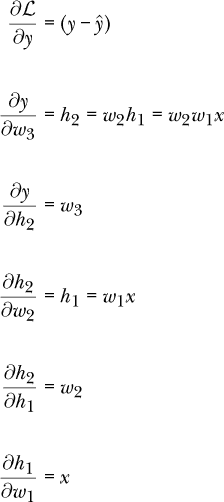

*∂ℒ*/*∂y* 来自我们为损失选择的形式以及微积分中的求导规则。

将这些代回到权重梯度的方程中，得到：

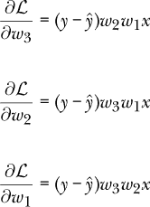

在前向传播后，我们已经得到了这些方程右侧所有量的数值。因此，我们知道了梯度的数值。梯度下降的更新规则告诉我们像下面这样改变权重。

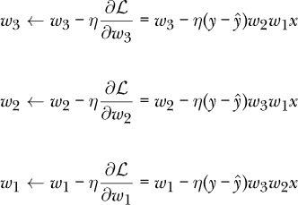

其中 *η* 是学习率参数，定义了在更新时应该采取的步长。

简而言之，我们需要使用链式法则，这是反向传播算法的核心，以找到在训练过程中更新权重所需的梯度。对于我们的简单网络，我们通过从输出反向推导到输入，明确地计算出了这些梯度的值。当然，这只是一个简单的玩具网络。现在让我们再看一下如何在更一般的意义上使用反向传播来计算任何网络所需的梯度。

#### 反向传播，第二部分

让我们从重新审视损失函数并引入一些新的符号开始。损失函数是网络中所有参数的函数，意味着每个权重和偏置的值都会对其产生影响。例如，具有 20 个权重和偏置的图 8-1 网络的损失可以写成


请注意，我们引入了一种新的参数符号：

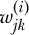

这表示将第*i – 1*层的第*j*个输入（即输出）连接到第*i*层的第*k*个节点的权重。我们还可以有

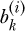

表示第*i*层的第*k*个节点的偏置值。这里，层 0 就是输入层本身。指数上的括号是一个标签，表示层号；它们不应被理解为实际的指数。因此，

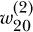

这是从第一层的第三个输出到第二层的第一个节点的权重。这是图 9-4 中突出显示的权重。记住，我们总是从上到下编号节点，从 0 开始。

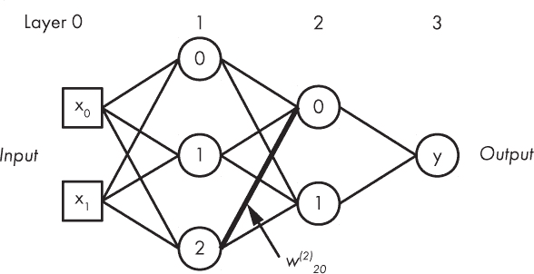

*图 9-4：带有加粗线标记的图 8-1 网络，权重 w^((2))[20]*

这个符号有些令人生畏，但它能让我们精确地引用网络中的任何权重或偏置。我们需要用来反向传播的数字是损失函数对每个权重或偏置的偏导数。因此，我们最终要找到的是，用所有华丽的数学符号表示的

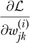

这给出了斜率：当连接第*i*层第*k*个节点到第*i – 1*层第*j*个输出的权重发生变化时，损失的变化量。类似的方程给出了偏置的偏导数。

我们可以通过仅处理层号来简化这种繁琐的符号，因为在符号中包含了一个向量（偏置、激活）或矩阵（权重），因此我们想要找到的是

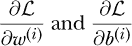

这些分别对应于从第*i – 1*层到第*i*层的所有权重的矩阵，以及第*i*层所有偏置的向量。

我们通过将问题转换为向量和矩阵的形式来保护我们的符号一致性。让我们从输出层开始，看看这样做能带来什么好处。我们知道输出层（层*L*）的激活值是通过以下方式找到的：

*a*^((*L*)) = *h*(*W*^((*L*))*a*^((*L*–1)) + *b*^((*L*)))

其中*a*是来自层*L –* 1 的激活值，*b*是层*L*的偏置向量，*W*是层*L –* 1 和*L*之间的权重矩阵。激活函数是*h*。

此外，我们将定义* h *的参数为* z *^((*L*))

*z*^((*L*)) ≡ *W*^((*L*))*a*^((*L*–1)) + *b*^((*L*))

并称*∂L*/*∂z*^((*l*))为*误差*，即来自层*l*输入对损失的贡献。接下来，我们定义

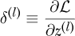

这样我们就可以从现在开始处理*δ*（delta）。

对于输出层，我们可以将*δ*写为

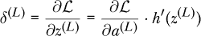

符号*h*′(*z*^((*L*)))是另一种表示*h*对*z*的导数的方式，评估点为*z*^((*L*))。⋅表示逐元素相乘。这是 NumPy 在乘两个相同大小的数组时的工作方式，假设*C* = *A* ⋅ *B*，那么*C*[*ij*] = *A*[*ij*] * B*[*ij*]。技术上，这个乘积被称为*Hadamard 积*，以法国数学家 Jacques Hadamard 命名。

上述意味着，要使用反向传播，我们需要一个可以微分的损失函数——即在每个点都有导数的损失函数。这并不是太大的负担；我们将在下一节中考察的损失函数都满足这个条件。我们还需要一个可以微分的激活函数，这样我们才能找到*h*(*z*)。同样，到目前为止我们考虑的激活函数基本上都是可微的。

**注意** *我说“基本上”是因为 ReLU 的导数在* x = 0*时是未定义的。左侧的导数是 0，而右侧的导数是 1。在实际应用中，当 ReLU 导数的参数恰好为 0 时，通常会选择返回一个特定的值。例如，TensorFlow 会检查参数是否小于或等于 0，如果是，则返回 0 作为导数，否则返回 1。这是因为在计算过程中，浮点值会进行大量的舍入，因此传递给 ReLU 导数函数的值不太可能恰好是 0。*

方程*δ*告诉我们特定层输入导致的误差。接下来我们将看到如何利用这个误差来计算每个层的权重误差。

有了*δ*^((*L*))，我们可以通过以下方式将误差传播到下一层：

*δ*^((*l*)) = ((*W*^((*l*+1)))^(*Tδ*^(*l*+1))) · *h*′(*z*^((*l*)))

对于倒数第二层，*l* + 1 = *L*。*T*表示矩阵转置。这是一个标准的矩阵操作，涉及到沿对角线的反射，因此如果

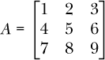

然后

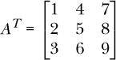

我们需要权重矩阵的转置，因为我们正朝着与前向传播相反的方向进行。如果 *l* 层有三个节点，而 *l* + 1 层有两个节点，那么它们之间的权重矩阵 *W* 是一个 2 × 3 矩阵，因此 *Wx* 是一个包含两个元素的向量。在反向传播中，我们是从 *l* + 1 层到 *l* 层，所以我们将权重矩阵转置，以便将这个包含两个元素的向量（此处为 *δ*）映射为 *l* 层的三元素向量。

*δ*^((*l*)) 方程用于通过网络向后移动的每一层。输出层的值由 *δ*^((*L*)) 给出，它启动了这个过程。

一旦我们得到了每层的误差，就可以最终找到所需的梯度值。对于偏置，值就是该层的 *δ* 元素。

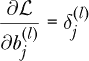

对于 *l* 层的 *j* 号偏置项。对于权重，我们需要

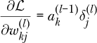

将前一层的 *k* 号输出与当前层 *l* 的 *j* 号误差连接起来。

使用前述的每一层的方程，可以得到继续应用梯度下降所需的权重和偏置梯度值集合。

正如你可能从这一段密集的内容中看到的那样，我们可以使用一个方便的数学定义来设定一个迭代过程，将误差从网络的输出通过各层向输入层传递。我们无法计算某一层的误差，除非已经知道后一层的误差，因此我们最终通过网络反向传播误差，这也就是“反向传播”（*backpropagation*）的由来。

### 损失函数

*损失函数* 在训练过程中用来衡量网络的表现有多差。训练的目标是将这个值尽可能地小，同时仍然能很好地概括数据的真实特征。理论上，如果我们觉得某个损失函数与当前问题相关，我们可以创建任何损失函数。如果你阅读深度学习文献，会发现很多论文都在这么做。尽管如此，大多数研究还是依赖于一些标准的损失函数，这些损失函数经验上大多数情况下表现得不错。我们将在这里讨论三种：绝对误差（有时称为 *L*[1] 损失）、均方误差（有时称为 *L*[2] 损失）和交叉熵损失。

#### 绝对误差和均方误差损失

让我们从绝对误差和均方误差损失函数开始。我们将一起讨论它们，因为它们在数学上非常相似。

我们在讨论反向传播时已经看过均方误差。绝对误差是新内容。从数学角度看，这两个方程是

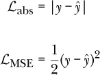

在这里，我们将它们分别标记为 *abs*（绝对值）和 *MSE*（均方误差）。请注意，我们总是使用 *y* 来表示网络的输出，即通过输入 *x* 进行前向传播得到的输出。我们总是使用 *ŷ* 来表示已知的训练类标签，通常是从 0 开始的整数标签。

即使我们将损失函数写成简单的形式，我们需要记住，当使用时，实际值是训练集或小批量上损失的均值。这也是*均值*在*均方误差*中的来源。因此，我们实际上应该这样写：

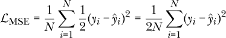

在这里，我们计算训练集（或小批量）中*N*个值的平方误差损失的平均值。

如果我们考虑它们测量的内容，这两种损失函数都是合理的。我们希望网络输出一个值，与期望的值（即样本标签）匹配。这两者之间的差异表示网络输出有多错误。对于绝对损失，我们找到差异并去掉符号，这就是绝对值的作用。对于 MSE 损失，我们找到差异然后将其平方。这也使得差异变为正数，因为将负数与其自身相乘总是会得到正数。如第 200 页“反向传播”部分中所提到的，MSE 损失中的因子简化了损失函数的导数，但并没有改变它的工作方式。

然而，绝对损失和 MSE 是不同的。MSE 对异常值更加敏感。这是因为我们在平方差异，而*y* = *x*²的图像随着*x*（差异）增大而迅速增长。对于绝对损失，这种影响被最小化，因为没有平方，差异只是差异。

事实上，当网络的目标是*分类*时，这两种损失函数并不是常用的，这也是本书中的隐含假设。更常见的是使用接下来介绍的交叉熵损失。我们希望网络输出能导致输入的正确类别标签。然而，完全有可能训练一个网络输出一个连续的实值，这叫做*回归*，在这种情况下，这两种损失函数都是非常有用的。

#### 交叉熵损失

即使我们可以使用绝对损失和 MSE 损失来训练神经网络进行分类，最常用的损失函数是*交叉熵损失*（与对数损失密切相关）。这个损失函数假设网络的输出是多类情况下的 softmax（向量）或二类情况下的 sigmoid（逻辑斯蒂，标量）。在数学上，对于多类情况中的*M*类，它看起来是这样的：

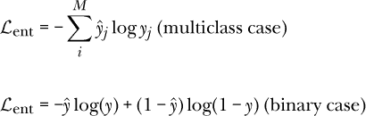

交叉熵到底在做什么，为什么它通常是训练神经网络进行分类时的更好选择？我们来思考一下带有 softmax 输出的多类情况。*softmax*的定义意味着网络的输出可以被看作是每个可能类别的输入表示的概率估计。如果我们有三个类别，softmax 的输出可能看起来是这样的：

*y* = (0.03, 0.87, 0.10)

这个输出大致意味着网络认为输入属于类别 0 的概率是 3%，属于类别 1 的概率是 87%，属于类别 2 的概率是 10%。这就是输出向量 *y*。我们通过提供实际标签来计算损失，标签向量中 0 表示*不是这个类别*，1 表示*是这个类别*。因此，与此 *y* 相关联的 *ŷ* 向量就是

*ŷ* = (0,1,0)

用于整体损失值的

*ℒ*[ent] = –(0(log 0.03) + 1(log 0.87) + 0(log 0.10)) = 0.139262

网络的三个预测可以被看作是一个概率分布，就像我们在掷两个骰子时，通过加总不同结果的可能性得到的概率分布一样。我们也有一个已知的类标签的概率分布。在前面的例子中，实际类别是类别 1，因此我们构建了一个概率分布，将类别 0 和类别 2 的概率设为 0，将类别 1 的概率设为 100%，即实际类别。随着网络训练的进行，我们期望输出分布会越来越接近 (0,1,0)，即标签的分布。

最小化交叉熵会推动网络不断改进对不同类别概率分布的预测，这些类别是我们希望网络学习的。理想情况下，这些输出分布将与训练标签相似：除了实际类别外，所有类别的输出为 0，实际类别的输出为 1。

对于分类任务，我们通常使用交叉熵损失。sklearn 的 `MLPClassifier` 类使用交叉熵。Keras 也支持交叉熵损失，但还提供了其他许多选项，包括绝对误差和均方误差。

### 权重初始化

在我们能够训练神经网络之前，需要初始化权重和偏差。列表 9-1 中的第 1 步提到“为权重和偏差选择一些智能的初始值”。

这里考察的初始化技术都依赖于在某个范围内选择随机数。更重要的是，这些随机数需要在该范围内均匀分布或符合正态分布。*均匀分布*意味着该范围内的所有值被选中的概率是相等的。这正是你在多次投掷公平的骰子时，每个数字（1 到 6）出现的概率。正态分布值在第四章中介绍过。正态分布的值具有特定的均值，即最可能的返回值，并且围绕均值有一个范围，在这个范围内，随着偏离均值的增大，选中某个值的可能性逐渐减小，直到接近 0，这个过程由一个叫做*标准差*的参数控制。这就是经典的钟形曲线形状。两种分布都可以使用。关键点是初始权重不是所有值都相同（比如 0），因为如果它们相同，反向传播过程中所有的梯度将会相同，每个权重将会以相同的方式变化。初始权重需要有所不同，以打破这种对称性，并使得每个权重能够根据训练数据自我调整。

在神经网络的早期，人们通过选择[0,1)范围内均匀分布的值（*U*(0,1)）或从标准正态分布中抽取值（*N*(0,1)，均值为 0，标准差为 1）来初始化权重和偏差。这些值通常会乘以一些小常数，比如 0.01。在许多情况下，这种方法有效，至少对于简单的网络来说。然而，随着网络变得更加复杂，这种简单的方法逐渐失败了。以这种方式初始化的网络在学习时遇到困难，许多网络根本无法学习。

让我们快进到几十年后，经过大量研究。研究人员意识到，特定层的权重应该如何初始化，主要取决于几件事：使用的激活函数类型、进入该层的权重数量（*f*[*in*]）以及可能，出去的权重数量（*f*[*out*]）。这些认识促成了今天使用的主要初始化方法。

sklearn 的`MLPClassifier`类使用*Glorot 初始化*。这也有时被称为*Xavier 初始化*，不过一些工具包使用该术语时表示的含义有所不同。^(1)（注意，*Xavier*和*Glorot*实际上指的是同一个人。）我们来看看 sklearn 是如何使用 Glorot 初始化的。`MLPClassifier`中初始化权重的关键方法是`_init_coef`。该方法使用均匀分布，并为其设置范围，使得权重在

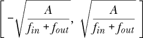

方括号表示从最小可能值（左）到最大可能值（右）所选的范围。由于分布是均匀的，这个范围内的每个值被选中的概率是相同的。

我们还没有具体说明*A*是什么。这个值取决于所使用的激活函数。根据文献，如果激活函数是 sigmoid（逻辑函数），则建议*A* = 2。否则，推荐*A* = 6。

现在，事情变得更加复杂了。一些工具包，比如 Caffe，使用 Xavier 初始化的另一种形式，即通过标准正态分布中的样本来进行乘法初始化。在这种情况下，我们通过从中抽取样本来初始化权重：

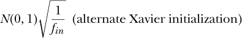

为了更进一步增加混淆，修正线性单元（ReLU）的引入导致了一个进一步推荐的变化。现在，这被称为*He 初始化*，它用 2 替代了 Xavier 初始化中的 1：

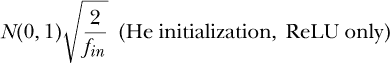

想了解更多内容，请参阅 Kaiming He 等人的《深入探讨修正线性单元：超越人类级别的 ImageNet 分类性能》。

这些初始化方案的关键在于，传统的“随机小值”被一组更加有原则的值所取代，这些值通过*f*[*in*]和*f*[*out*]考虑了网络架构。

前面的讨论忽略了偏差值。这是故意的。虽然初始化偏差值而不是将其全部设为 0 可能是可以接受的，但当前的主流观点（尽管这个观点常常变化）认为最好将其全部初始化为 0。话虽如此，sklearn 的 `MLPClassifier` 以与权重相同的方式初始化偏差值。

### 过拟合与正则化

训练模型的目标是让它学习数据集所采样的父分布的基本、通用特征。这样，当模型遇到新的输入时，它就能正确地进行解释。正如我们在本章中所看到的，训练神经网络的主要方法是优化——寻找“最佳”的参数集，使得网络在训练集上的错误尽可能少。

然而，仅仅寻找能最小化训练误差的最佳值集是不够的。如果我们在分类训练数据时没有犯错，通常意味着我们已经过拟合，并没有真正学到数据的一般特征。这种情况在传统模型中更为常见，无论是神经网络还是经典模型，而对于像第十二章中提到的卷积网络这样的深度模型来说，情况要少一些。

#### 理解过拟合

我们之前已经不时提到过拟合，但还没有对它形成清晰的直觉。思考过拟合的一种方式是考虑一个独立的问题——将一个函数拟合到一组点上。这被称为*曲线拟合*，而其一种方法是通过找到能够最小化误差的函数参数，从而优化这些点上的误差度量。这应该听起来很熟悉，这正是我们在训练神经网络时所做的事情。

作为曲线拟合的一个例子，考虑以下几点：

| *x* | *y* |
| --- | --- |
| 0.00 | 50.0 |
| 0.61 | –17.8 |
| 1.22 | 74.1 |
| 1.83 | 29.9 |
| 2.44 | 114.8 |
| 3.06 | 55.3 |
| 3.67 | 66.0 |
| 4.28 | 89.1 |
| 4.89 | 128.3 |
| 5.51 | 180.8 |
| 6.12 | 229.7 |
| 6.73 | 229.3 |
| 7.34 | 227.7 |
| 7.95 | 354.9 |
| 8.57 | 477.1 |
| 9.18 | 435.4 |
| 9.79 | 470.1 |

我们希望找到一个函数，*y* = *f* (*x*)，描述这些点——一个函数，可能是这些点从中测量出来的父函数，尽管有噪声。

通常情况下，在曲线拟合时，我们已经知道函数的形式；我们要找的是参数。但如果我们不知道函数的确切形式，只知道它是某种多项式，该怎么办？一般来说，多项式的形式如下，对于某个最大指数*n*：

*y* = *a*[0] + *a*[1]*x* + *a*[2]*x*² + *a*[3]*x*³ + … + *a[n]*x^n*

拟合多项式到数据集的目标是找到参数，*a*[0]，*a*[1]，*a*[2]，…，*a*[*n*]。通常的方法是最小化 *y*，即给定 *x* 位置的输出，与 *f* (*x*)，即当前参数集合下的函数输出之间的平方差。这应该听起来很熟悉，因为我们讨论过在神经网络训练中使用这种类型的损失函数。

这与过拟合有何关联？让我们将前面的数据集绘制出来，以及拟合两个不同函数的结果。第一个函数是

*y* = *a*[0] + *a*[1]*x* + *a*[2]*x*²

这是一个二次函数，这是你可能作为初学代数学生学会讨厌的类型函数。第二个函数是

*y* = *a*[0] + *a*[1]*x* + *a*[2]**x*² + *a*[3]*x*³ + … + *a*[14]*x*¹⁴ + *a*[15]*x*¹⁵

这是一个 15 次多项式。结果如图 9-5 所示。

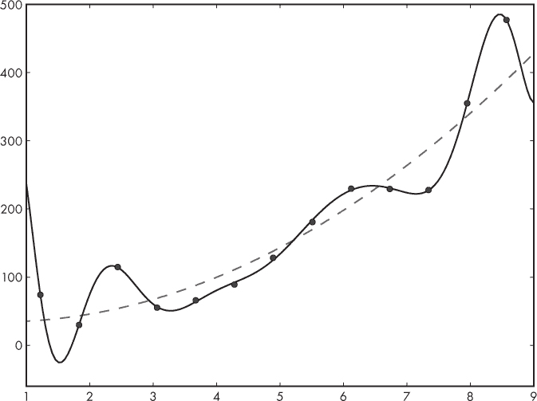

*图 9-5：数据集和拟合到它的两个函数：一个二次函数（虚线）和一个 15 次多项式（实线）*

哪个函数更好地捕捉了数据集的一般趋势？明显是二次函数更符合数据的一般趋势，而 15 次多项式则到处都是。再看一下图 9-5。如果我们决定我们已经很好地拟合了数据的唯一依据是数据点与相应函数值之间的距离，我们可能会说 15 次多项式是更好的拟合；毕竟它几乎通过了所有数据点。这类似于训练神经网络并在训练集上达到完美。然而，这种完美的代价很可能是无法很好地推广到新的输入。二次拟合图 9-5 未命中数据点，但却捕捉了数据的一般趋势，这使其更有用，如果我们想预测我们将得到的*y*值的新*x*值。

当人类想要拟合一条曲线到类似我们样本数据集的东西时，他们通常会观察数据，注意到一般趋势，然后选择一个合适的函数进行拟合。也可能在理论上已经知道期望的函数形式。然而，如果我们想要与神经网络类比，我们会发现自己处于一种情况——我们不知道应该拟合哪个函数，而是需要从 *x* 的函数空间中找到一个“最佳”函数及其参数。

希望这个例子能帮助你理解，训练神经网络并不是一个像其他优化问题那样的优化问题——我们需要某种方式将网络学习的函数推向一个方向，使其能够捕捉数据的本质，而不是过度关注训练数据中的特定特征。这种方式就是正则化，而且它是必需的，尤其是对于那些具有巨大容量的大型网络。

#### 理解正则化

*正则化* 是指任何能够推动网络学习父分布相关特征，而不是训练集细节的手段。最好的正则化方式是增加训练集的大小和代表性。数据集越大，越能代表网络在实际应用中遇到的所有样本类型，网络学习效果就越好。当然，我们通常需要在有限的训练集上工作。机器学习社区花费了大量的时间和精力，研究如何从较小的数据集中获得更多信息。

在第五章中，我们遇到了或许是第二好的正则化方法——数据增强。这是通过使用现有数据生成新的训练样本来模拟更大数据集的一种方式，这些新样本看起来是来自父分布的。例如，我们考虑通过对训练集中已有的图像进行简单的旋转、翻转和位移，来增加有限的训练图像数据集。数据增强非常强大，应该在可能的情况下使用。尤其是在使用图像作为输入时，这种方法特别容易应用，尽管在第五章中我们也看到了增强一个包含连续值向量的数据集的方法。

现在我们在正则化工具箱里有了两种技巧：更多的数据和数据增强。这些是最好的技巧，但还有其他技巧，应该在可能时使用。让我们来看两个更多的技巧：L2 正则化和 dropout。前者现在已经成为标准，并且被各大工具包广泛支持，包括 sklearn 和 Keras。后者则非常强大，2012 年出现时堪称改变游戏规则的技术。

#### L2 正则化

一个具有几个大权重的模型，其复杂度往往高于一个具有较小权重的模型。因此，保持权重较小有助于网络实现一个更简单的函数，更适合我们希望其学习的任务。

我们可以通过使用 L2 正则化来鼓励权重变小。*L2 正则化*向损失函数添加一个项，使得损失变为

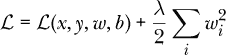

其中，第一个项是我们已经使用的任何损失，第二个项是新的 L2 正则化项。注意，损失是输入（*x*）、标签（*y*）、权重（*w*）和偏置（*b*）的函数，其中我们指的是网络的所有权重和所有偏置。正则化项是对网络中所有权重的求和，并且仅涉及权重。“L2”标签就是让我们对权重进行平方的原因。

这里的*L2*指的是一种范数或距离类型。你可能熟悉平面上两点之间距离的公式：*d*² = (*x*[2] – *x*[1])² + (*y*[2] – *y*[1])²。这是*欧几里得距离*，也称为*L2 距离*，因为数值是平方的。这就是为什么正则化项被称为*L2*，并且权重值被平方的原因。也可以使用 L1 损失项，在这种情况下，不是对权重进行平方，而是使用其绝对值。在实践中，L2 正则化更为常见，至少从经验上看，它似乎对于神经网络分类器效果更好。

*λ*（lambda）乘数设置了这个项的重要性；它越大，越会主导训练网络时使用的整体损失。*λ*的典型值大约是 0.0005。稍后我们将看到，为什么乘数是*λ*/2，而不仅仅是*λ*。

L2 项是做什么的？回顾一下，损失是我们在训练时想要最小化的东西。新的 L2 项对网络的权重进行平方求和。如果权重很大，损失就很大，而这是我们在训练时不想要的。较小的权重会使 L2 项变小，因此梯度下降会偏向小权重，无论它们是正数还是负数，因为我们对权重值进行平方。如果网络的所有权重都相对较小，并且没有任何权重特别占主导地位，那么网络会利用所有权重来表示数据，这在防止过拟合方面是一个好现象。

L2 正则化也被称为*权重衰减*，因为 L2 项在反向传播过程中所起的作用。反向传播给出了损失函数关于*W*[*i*]的偏导数。添加 L2 正则化意味着，总损失的偏导数现在还包含 L2 项本身关于某个特定权重*W*[*i*]的偏导数。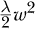的导数是*λW*；抵消了原本会出现的 2 的因子。此外，由于我们想要得到关于特定权重*W*[*i*]的偏导数，L2 项的其他部分会变为 0。最终效果是，梯度下降过程中对于权重*W*[*i*]的更新变为

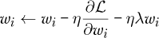

其中，*η*（eta）是学习率，我们忽略任何额外的动量项。*ηλw*[*i*]项是新的，它是由于 L2 正则化的影响，我们可以看到随着训练的进行，它在推动权重趋向 0，因为*η*和*λ*都小于 1，因此在每个小批次上，我们都会从权重值中减去一小部分。权重仍然可以增加，但要做到这一点，原始损失的梯度必须很大。

我们之前提到过，损失函数的形式是由我们作为网络的开发者决定的。正则化项不是唯一可以添加到损失函数中的项。正如我们使用 L2 项一样，我们可以创建并添加其他项，以改变网络在训练过程中的行为，帮助它学习我们希望它学习的内容。这是一种强大的技术，可以用来定制神经网络学习的各个方面。

#### Dropout（丢弃法）

Dropout（丢弃法）在 2012 年出现时震撼了机器学习社区，参见 Alex Krizhevsky 等人发表的论文《使用深度卷积神经网络进行 Imagenet 分类》。截至 2020 年秋季，该论文已被引用超过 70,000 次，正如当时一位著名的机器学习研究人员私下告诉我：“如果我们在 1980 年代就有了 dropout，今天的世界将完全不同。”那么，什么是 dropout，为什么大家如此兴奋？

为了回答这个问题，我们需要回顾一下模型集成的概念。我们在第六章中稍微讨论过它。集成是一组模型，这些模型稍有不同，并且都在同一数据集或该数据集的略微不同版本上进行训练。这个想法很简单：由于训练大多数模型都涉及随机性，训练多个相似的模型应该会产生一个互相强化的结果——一个可以将输出结果结合起来，从而产生比任何单个模型更好的结果的集合。集成是有用的，我们经常使用它们，但它们在运行时间上有一定的代价。如果通过一个神经网络运行一个样本需要*x*毫秒，而我们有一个由 20 个网络组成的集成，那么我们的评估时间（推理时间）将跳到 20*x*毫秒，忽略并行执行的可能性。在某些情况下，这是无法接受的（更不用说 20 个大网络与 1 个网络在存储和功耗方面的差异了）。由于模型集成的最终结果是更好的整体性能，我们可以说，集成本质上是一种正则化方法，因为它体现了“集体智慧”。

*Dropout* 将集成思想推向极致，但它仅在训练期间进行，而且不创建第二个网络，因此最终我们仍然只需要处理一个模型。就像许多统计学中的好想法一样，这个方法也需要随机性。现在，当我们训练网络时，我们使用当前的权重和偏置进行前向传递。如果在前向传递过程中，我们随机为网络的每个节点分配一个 0 或 1，那么值为 1 的节点会在下一层被使用，而值为 0 的节点则会被丢弃？实际上，我们每次都会让训练样本通过一个不同的神经网络配置。例如，见图 9-6。

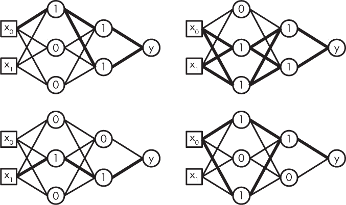

*图 9-6：在训练期间应用 dropout 时可能使用的网络*

这里我们展示了图 8-1 的网络，但每个隐藏节点的值为 0 或 1。这个 0 或 1 决定了输出是否被使用。网络中的粗线表示仍然有效的连接。换句话说，粗线显示的是实际用于生成反向传播累计输出的网络。如果我们对每个训练样本都这样做，我们很容易看到，我们将训练大量的神经网络，每个网络都只训练一个单独的样本。此外，由于权重和偏置在前向传递之间是持续存在的，所有网络将共享这些权重，期望这一过程能够强化那些表示数据集本质的良好权重值。正如我们在本章中多次提到的，学习数据的本质是训练的目标；我们希望能很好地对来自相同虚拟父分布的新数据进行泛化，这个父分布最初生成了训练集。Dropout 是一种严密的正则化方法。

我之前说过，我们“随机地为节点分配 0 或 1”。我们是否是等概率分配的呢？我们丢弃一个层中的节点的概率是我们可以指定的。我们称之为 *p*。通常，*p* = 0.5，这意味着每个训练样本中，该层大约 50%的节点会被丢弃。如果设置 *p* = 0.8，则 80%的节点会被丢弃，而 *p* = 0.1 则只有 10%的节点会被丢弃。有时，不同的网络层会使用不同的概率，尤其是输入层，它的丢弃概率通常比隐藏层小。如果我们丢弃了太多输入节点，我们就会失去我们试图让网络识别的信号来源。对输入层应用的 dropout 可以看作是一种数据增强的形式。

从概念上讲，dropout 就是训练一大组共享权重的网络。每个网络的输出可以通过几何平均与其他网络的输出结合，前提是我们使用 softmax 输出。两个数的几何平均是它们乘积的平方根。*n* 个数的几何平均是它们乘积的 *n* 次根。在 dropout 的情况下，事实证明，这可以通过使用整个网络并将所有权重乘以它们被包含的概率来近似。假设我们说 *p* 是节点被丢弃的概率，那么权重需要乘以 1 *– p*，因为这是节点不会被丢弃的概率。所以，如果我们将 *p* = 0.5 并将其用于所有节点，那么最终的网络就是所有权重都除以 2 的网络。

截至目前，sklearn 的 `MLPClassifier` 类不支持 dropout，但 Keras 肯定支持，因此我们将在第十二章中再次看到 dropout。

### 总结

因为这是一个重要的章节，让我们更深入地复习一下我们所学的内容。在本章中，我们描述了如何使用梯度下降和反向传播来训练神经网络。整体步骤的顺序如下：

1.  选择模型的架构。这意味着选择层数、层的大小以及激活函数的类型。

1.  使用智能选择的初始值初始化网络的权重和偏置。

1.  运行一小批训练样本通过网络，并计算小批量的平均损失。我们讨论了常见的损失函数。

1.  使用反向传播，计算每个权重和偏置对小批量整体损失的贡献。

1.  使用梯度下降，根据反向传播找到的贡献来更新模型的权重和偏置值。我们讨论了随机梯度下降及其与小批量概念的关系。

1.  从步骤 3 开始重复，直到处理完所需的周期或小批量，或者损失降到某个阈值以下，或者停止变化，或者当验证集样本的分数达到最小值时。

1.  如果网络学习不好，应用正则化并重新训练。我们在本章中讨论了 L2 正则化和 dropout。数据增强，即增加训练集的大小或代表性，也可以视为一种正则化方法。

训练神经网络的目标是学习一个能很好地对未见输入进行泛化的模型参数。这是所有监督学习的目标。对于神经网络，我们知道它在具备足够容量和足够训练数据的情况下能够逼近任何函数。天真地看，我们可能会认为这不过是普通的优化过程，但从一个重要角度来看，实际上并非如此。训练集上的完美表现往往不是一件好事，它通常是过拟合的表现。相反，我们希望模型学习到一个能捕捉训练集所暗示的函数本质的函数。我们使用测试数据来确保我们已经学到一个有用的函数。

在下一章，我们将通过一系列使用 sklearn 的实验，深入探索传统神经网络。

1. 关于这些内容，参见 Glorot, Xavier 和 Yoshua Bengio. “理解训练深度前馈神经网络的难度。”
