## 第十章：神经网络实验**


在 第九章 中，我们讨论了神经网络背后的理论。在本章中，我们将用代码替代方程式，进行一系列实验，以增强我们对神经网络基本参数的直觉：架构与激活函数、批量大小、基础学习率、训练集大小、L2 正则化、动量、权重初始化、特征排序，以及权重和偏差的精度。

为了节省空间并消除冗长的重复，我们不会展示每个实验的具体代码。在大多数情况下，代码与之前的示例仅有微小的不同；我们通常只会改变 `MLPClassifier` 构造函数中的特定参数。每个实验的代码包含在本书相关文件集中，我们将列出网络参数和文件名。必要时，我们将提供代码以阐明某个特定方法。我们将展示第一个实验的完整代码。

### 我们的数据集

我们将使用 MNIST 数据集的向量形式，该形式在 第五章 中已汇总。回顾一下，该数据集由 28×28 像素的 8 位灰度手写数字图像组成，范围为 [0,9]。在向量形式中，每个 28 × 28 的图像被展开成一个包含 28 × 28 = 784 个元素的向量，所有字节的范围为 [0,255]。展开操作将每一行按顺序排列。因此，每个样本包含 784 个元素及其相关标签。训练集包含 60,000 个样本，测试集包含 10,000 个样本。在我们的实验中，我们不会使用训练集中的所有数据。这是为了帮助展示网络参数的效果，并保持训练时间在合理范围内。请参考 图 5-3 以查看代表性的 MNIST 数字。

### MLPClassifier 类

`MLPClassifier` 类遵循与其他 sklearn 分类器相同的格式。它有一个构造函数和预期的方法：`fit` 用于训练，`score` 用于将分类器应用于测试数据，`predict` 用于对未知输入进行预测。我们还将使用 `predict_proba` 来返回每个类别的实际预测概率。构造函数有许多选项：

```py
MLPClassifier(hidden_layer_sizes=(100, ), activation='relu',

  solver='adam', alpha=0.0001, batch_size='auto',

  learning_rate='constant', learning_rate_init=0.001,

  power_t=0.5, max_iter=200, shuffle=True,

  random_state=None, tol=0.0001, verbose=False,

  warm_start=False, momentum=0.9, nesterovs_momentum=True,

  early_stopping=False, validation_fraction=0.1, beta_1=0.9,

  beta_2=0.999, epsilon=1e-08)
```

在这里，我们提供了每个参数的默认值。请参阅 [`scikit-learn.org/`](http://scikit-learn.org/) 上的 sklearn 文档页面，以获取每个参数的完整描述。我们将一些参数设置为特定的值，其他的将在实验中进行调整，还有一些参数仅在特定情况下相关。我们将使用的关键参数列在 表 10-1 中。

以下一组实验探讨了各种 `MLPClassifier` 参数的影响。如前所述，我们将展示第一个实验所用的所有代码，理解其余实验只需进行小的更改即可。有时，我们将展示一些小的代码片段，以使更改更加具体。

**表 10-1:** 重要的`MLPClassifier`构造函数关键词及其默认值

| **关键词** | **描述** |
| --- | --- |
| `hidden_layer_sizes` | 隐藏层大小的元组 |
| `activation` | 激活函数类型；例如，ReLU |
| `alpha` | L2 参数—我们称之为*λ*（lambda） |
| `batch_size` | 小批量大小 |
| `learning_rate_init` | 学习率，*η*（eta） |
| `max_iter` | 训练的轮数 |
| `warm_start` | 继续训练或重新开始 |
| `momentum` | 动量 |
| `solver` | 求解算法（"sgd"） |
| `nesterovs_momentum` | 是否使用 Nesterov 动量（默认：False） |
| `early_stopping` | 是否使用提前停止（默认：False） |
| `learning_rate` | 学习率计划（"constant"） |
| `tol` | 如果损失变化小于 tol，则提前停止（1e-8） |
| `verbose` | 训练过程中是否输出到控制台（默认：False） |

### 架构和激活函数

在设计神经网络时，我们首先面临两个基本问题：选择什么架构和什么激活函数？这无疑是决定模型成功的最重要因素。让我们探讨一下，当保持训练数据集固定时，使用不同的架构和激活函数进行训练时会发生什么。

#### 代码

如所承诺，对于这个首次实验，我们将展示完整代码，从 Listing 10-1 中的辅助函数开始。

import numpy as np

import time

from sklearn.neural_network import MLPClassifier

def run(x_train, y_train, x_test, y_test, clf):

s = time.time()

(*\pagebreak*)

clf.fit(x_train, y_train)

e = time.time()-s

loss = clf.loss_

weights = clf.coefs_

biases = clf.intercepts_

params = 0

for w in weights:

params += w.shape[0]*w.shape[1]

for b in biases:

params += b.shape[0]

return [clf.score(x_test, y_test), loss, params, e]

def nn(layers, act):

return MLPClassifier(solver="sgd", verbose=False, tol=1e-8,

nesterovs_momentum=False, early_stopping=False,

learning_rate_init=0.001, momentum=0.9, max_iter=200,

hidden_layer_sizes=layers, activation=act)

*Listing 10-1: 用于实验架构和激活函数的辅助函数。请参见* mnist_nn_experiments.py。

Listing 10-1 导入常用的模块，然后定义了两个辅助函数，`run`和`nn`。从`nn`开始，我们看到它所做的只是使用隐藏层大小和给定的激活函数类型返回一个`MLPClassifier`实例。

隐藏层的大小以元组的形式给出，其中每个元素表示相应层的节点数。回想一下，sklearn 只使用全连接层，因此我们只需要一个数字来指定大小。用于训练的输入样本决定了输入层的大小。这里，输入样本是表示数字图像的向量，因此输入层有 28 × 28 = 784 个节点。

输出层怎么样？它没有明确指定，因为它取决于训练标签中的类别数量。MNIST 数据集有 10 个类别，所以输出层将有 10 个节点。当调用 `predict_proba` 方法获取输出概率时，sklearn 会对这 10 个输出应用 softmax。如果模型是二分类的，即只有 0 和 1 这两个类别标签，那么只有一个输出节点，一个逻辑回归（sigmoid），表示属于类别 1 的概率。

现在让我们看看传递给 `MLPClassifier` 的参数。首先，我们明确声明我们希望使用 SGD 解算器。解算器是训练过程中用于调整权重和偏差的方法。所有解算器都使用反向传播来计算梯度；我们如何使用这些梯度是不同的。普通的 SGD 就足够我们现在使用了。

接下来，我们设置了较低的容忍度，以便训练所请求的轮数（`max_iter`）。我们还关闭了 Nesterov 动量（标准动量的变种）和提前停止（虽然通常很有用，但在这里不需要）。

初始学习率设置为默认值 0.001，标准动量值为 0.9。训练的轮数被任意设置为 200（默认值），但我们将在接下来的实验中进一步探讨这个问题。请随时保持好奇心，看看改变这些值会对结果产生什么影响。为了保持一致性，除非我们想要实验的参数，否则我们将在整个过程中将这些值作为默认值。

在清单 10-1 中，另一个辅助函数是 `run`。这个函数将使用标准的 sklearn `fit` 和 `score` 方法训练和测试传入的分类器对象。它还做了一些我们之前没有见过的其他事情。

特别地，在计时训练所需的时间后，我们从 `MLPClassifier` 对象中提取最终的训练损失值、网络权重和网络偏差，以便返回它们。`MLPClassifier` 类最小化对数损失（log-loss），我们在第九章中描述过。我们将对数损失存储在 `loss_` 成员变量中。这个值的大小以及它在训练过程中的变化，能给我们一个关于网络学习得怎么样的线索。通常来说，对数损失越小，网络的表现越好。随着你对神经网络的探索越来越深入，你将开始培养出对什么是良好损失值的直觉，并且通过损失变化的速度来判断训练过程是学习得快还是慢。

权重和偏置存储在 `coefs_` 和 `intercepts_` 成员变量中。这些分别是 NumPy 矩阵（权重）和向量（偏置）的列表。在这里，我们使用它们通过求和每个矩阵和向量中的元素数量来计算网络中的参数数量。这正是 `run` 函数中两个小循环所做的。最后，我们将包括对测试集的评分在内的所有信息返回给 `main` 函数。`main` 函数见 清单 10-2。

def main():

x_train = np.load("mnist_train_vectors.npy").astype("float64")/256.0

y_train = np.load("mnist_train_labels.npy")

x_test = np.load("mnist_test_vectors.npy").astype("float64")/256.0

y_test = np.load("mnist_test_labels.npy")

N = 1000

x_train = x_train[:N]

y_train = y_train[:N]

x_test = x_test[:N]

y_test = y_test[:N]

layers = [

(1,), (500,), (800,), (1000,), (2000,), (3000,),

(1000,500), (3000,1500),

(2,2,2), (1000,500,250), (2000,1000,500),

]

for act in ["relu", "logistic", "tanh"]:

print("%s:" % act)

for layer in layers:

scores = []

loss = []

tm = []

for i in range(10):

s,l,params,e = run(x_train, y_train, x_test, y_test,

nn(layer,act))

scores.append(s)

loss.append(l)

tm.append(e)

s = np.array(scores)

l = np.array(loss)

t = np.array(tm)

n = np.sqrt(s.shape[0])

print("    layers: %14s, score= %0.4f +/- %0.4f,

loss = %0.4f +/- %0.4f (params = %6d, time = %0.2f s)" % \

(str(layer), s.mean(), s.std()/n, l.mean(),

l.std()/n, params, t.mean()))

*清单 10-2：用于实验架构和激活函数的 `main` 函数。参见* mnist_nn_experiments.py。

我们首先加载存储在 `x_train`（样本）和 `y_train`（标签）、`x_test` 和 `y_test` 中的 MNIST 训练和测试数据。请注意，我们将样本除以 256.0，使其转换为范围 0,1) 内的浮点数。这是本章唯一的预处理步骤。

由于完整的训练集包含 60,000 个样本，而我们想进行多次训练，所以我们只使用前 1,000 个样本进行训练。同样，我们将保留前 1,000 个测试样本。本章的目标是通过改变参数来观察相对差异，而不是构建最佳的模型，因此我们会牺牲模型质量，以便在合理的时间内得到结果。使用 1,000 个训练样本时，我们平均每个数字类型只有 100 个实例。对于特定实验，我们会改变训练样本的数量。

`layers` 列表包含了我们将要探索的不同架构。最终，我们会将这些值传递给 `MLPClassifier` 构造函数的 `hidden_layer_sizes` 参数。请注意，我们将会检查从一个包含单个节点的单一隐藏层到三个隐藏层（每个隐藏层最多有 2,000 个节点）的架构。

`main` 循环运行三个激活函数类型：修正线性单元（ReLU）、逻辑（Sigmoid）单元和双曲正切（Tanh）。我们将为每种激活函数类型和架构（`layers`）的组合训练一个模型。此外，由于我们知道神经网络训练是随机的，我们将为每个组合训练 10 个模型，并报告均值和标准误差，这样就不会被一个特别差的、不具有代表性的模型影响。

**注** *当你运行下面实验中的代码时，你很可能会收到来自 sklearn 的警告消息，类似于这个：*

```py
ConvergenceWarning: Stochastic Optimizer: Maximum iterations (200) reached

and the optimization hasn't converged yet.
```

*这些消息是 sklearn 通知您，在训练迭代完成之前，sklearn 认为网络已经收敛到一个良好的权重集。警告是可以安全忽略的，并且可以通过在运行代码时在命令行添加 `-W ignore` 来完全禁用；例如：*

```py
$ python3 -W ignore mnist_nn_experiments.py
```

#### 结果

运行此代码需要几小时才能完成，并且产生的输出包含如下所示的行：

```py
layers:(3000,1500), score=0.8822+/-0.0007, loss=0.2107+/-0.0006

(params=6871510, time=253.42s)
```

这告诉我们，使用 ReLU 激活函数，并且架构具有两个隐藏层（分别为 3,000 和 1,500 个节点），模型的平均得分为 88.2%，最终训练损失的平均值为 0.21（记住，越低越好）。这还告诉我们，神经网络总共有将近 690 万个参数，训练时间平均略超过四分钟。

[表 10-2 总结了不同网络架构和激活函数类型的得分。

**表 10-2：** 作为架构和激活函数类型的函数，MNIST 测试集的平均得分（均值 ± 标准误差）

| 架构 | ReLU | Tanh | Logistic (sigmoid) |
| --- | --- | --- | --- |
| 1 | 0.2066 ± 0.0046 | 0.2192 ± 0.0047 | 0.1718 ± 0.0118 |
| 500 | 0.8616 ± 0.0014 | 0.8576 ± 0.0011 | 0.6645 ± 0.0029 |
| 800 | 0.8669 ± 0.0014 | 0.8612 ± 0.0011 | 0.6841 ± 0.0030 |
| 1000 | 0.8670 ± 0.001 | 0.8592 ± 0.0014 | 0.6874 ± 0.0028 |
| 2000 | 0.8682 ± 0.0008 | 0.8630 ± 0.0012 | 0.7092 ± 0.0029 |
| 3000 | 0.8691 ± 0.0005 | 0.8652 ± 0.0011 | 0.7088 ± 0.0024 |
| 1000; 500 | 0.8779 ± 0.0011 | 0.8720 ± 0.0011 | 0.1184 ± 0.0033 |
| 3000; 1500 | 0.8822 ± 0.0007 | 0.8758 ± 0.0009 | 0.1221 ± 0.0001 |
| 1000; 500; 250 | 0.8829 ± 0.0011 | 0.8746 ± 0.0012 | 0.1220 ± 0.0000 |
| 2000; 1000; 500 | 0.8850 ± 0.0007 | 0.8771 ± 0.0010 | 0.1220 ± 0.0000 |

在每种情况下，我们展示了在减少的测试集上的平均得分，得分是对 10 个训练模型的平均值（加减标准误差）。这张表中包含了大量信息，因此我们需要仔细分析。

如果我们看一下激活类型，我们会立刻发现某些地方不对。逻辑激活函数的结果显示，随着单隐藏层的增大，得分有所提高，这是我们可能预期的，但当我们增加隐藏层数量超过一个时，网络无法训练。我们知道它无法训练，因为测试集上的得分非常糟糕。如果你检查输出，你会看到损失值并没有下降。如果在训练过程中，损失值没有减少，那么就说明出现了问题。

为什么逻辑激活函数的训练失败并不立即显现。一个可能性是 sklearn 中的错误，但考虑到该工具包的广泛使用，这种情况不太可能。最可能的原因与网络初始化有关。sklearn 工具包使用了我们在第八章中讨论过的标准、常用的初始化方案。但这些方案是针对 ReLU 和 tanh 激活函数设计的，可能不适合逻辑激活函数。

对于我们的目的，我们可以将这个失败视为一个显著的信号，表明逻辑激活函数并不是适合用于隐藏层的激活函数。可悲的是，这正是神经网络早期历史中广泛使用的激活函数，所以我们从一开始就给自己设置了障碍。难怪神经网络要花这么长时间才最终找到了适合的位置！从现在开始，我们将忽略逻辑激活函数的结果。

再次考虑单隐藏层网络的得分（见表 10-2，第 1–6 行）。对于 ReLU 和 tanh 激活函数，我们看到网络性能有了稳定的改善。此外，注意到在每种情况下，对于相同数量的隐藏层节点，ReLU 激活函数的表现稍微优于 tanh，尽管这类差异在每种架构只有 10 个模型的情况下，可能在统计上并不显著。尽管如此，这符合一个在社区中普遍存在的观察：ReLU 比 tanh 更受偏爱。

如果我们看一下表 10-2 的其余行，我们会看到，添加第二个甚至第三个隐藏层继续改善测试得分，但随着层数增加，效果递减。这也是一个广泛经历的现象，我们应该更仔细地研究一下。特别是，我们应该考虑表 10-2 中模型的参数数量。这使得比较变得有些不公平。如果我们训练的模型具有大致相同数量的参数，那么我们就能更公平地比较模型的表现。我们所看到的任何性能差异都可以合理地归因于使用的层数，因为整体参数数量几乎是一样的。

通过修改清单 10-2 中的层数组，我们可以训练表 10-3 中显示的架构的多个版本。每层的节点数量是根据模型中整体参数数量来选择的。

**表 10-3：** 为生成图 10-1 而测试的模型架构

| 架构 | 参数数量 |
| --- | --- |
| 1000 | 795,010 |
| 2000 | 1,590,010 |
| 4000 | 3,180,010 |
| 8000 | 6,360,010 |
| 700; 350 | 798,360 |
| 1150; 575 | 1,570,335 |
| 1850; 925 | 3,173,685 |
| 2850; 1425 | 6,314,185 |
| 660; 330; 165 | 792,505 |
| 1080; 540; 270 | 1,580,320 |
| 1714; 857; 429 | 3,187,627 |
| 2620; 1310; 655 | 6,355,475 |

那么，表 10-3 中的魔法数字是从哪里来的呢？我们首先选择了想要测试的单层尺寸。然后，我们确定了这些架构中模型的参数数量。接下来，我们使用第八章中的经验法则构建了两层架构，使得这些模型中的参数数量接近单层模型中的对应数量。最后，我们对三层模型重复了这个过程。这样做使我们能够比较具有相似参数数量的模型性能。实质上，我们固定了模型中的参数数量，仅改变它们之间的交互方式。

按照我们在清单 10-2 中做的那样训练模型，但这次平均了 25 个模型而不是仅仅 10 个，得到了图 10-1。

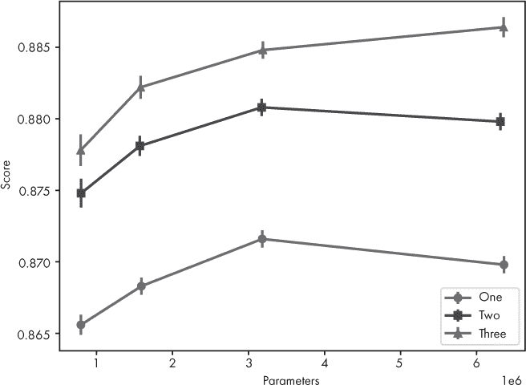

*图 10-1：基于网络中参数数量的架构在 MNIST 测试集上的得分（均值 ± E），参考表 10-3*

让我们来解析图 10-1。首先，注意横轴是模型中的参数数量，以百万为单位。其次，我们可以通过比较三条竖直的线来判断，这些模型的参数数量相似。图例告诉我们哪个图表示具有一层、两层或三层隐藏层的模型。

看看最左侧的点，代表每种情况中最小的模型，我们看到从单层到两层的变化给我们带来了模型性能的跃升。同样，从两层到三层的变化则带来了另一个较小的提升。这种情况在从左到右的所有层次大小中都会出现。稍后我们会讨论单层和双层架构中两个最大模型之间性能下降的问题。固定参数数量，但增加网络的深度（层数），会带来更好的性能。我们可能会在这里忍不住说：“深度比宽度更重要”，但也有情况会不适用。尽管如此，值得记住的是：更多的层次有助于提升性能，而不仅仅是增加更多节点的宽层。

那么在一层和两层情况下，最大的模型的性能下降如何呢？这些点是图 10-1 中的最右边部分。回想一下，绘制这个图的模型每个只用了 1,000 个样本进行训练。对于最大的模型，可能没有足够的数据来充分训练这样一个大规模的模型。如果我们增加训练样本的数量，因为 MNIST 数据集有 60,000 个样本可供选择，或许就能看到这个性能下降消失。我把这个作为练习留给读者。

### 批量大小

现在让我们关注批量大小如何影响训练。回想一下，这里所说的*批量大小*指的是小批量大小，即在前向传播中用于计算小批量的平均损失的训练集子集。通过这个损失，我们使用反向传播来更新权重和偏置。处理一个小批量，因此，会导致一次梯度下降步骤——即网络参数的单次更新。

我们将对 MNIST 数据集的一个固定大小子集进行训练，设定一定的训练轮次，并使用不同的小批量大小，看看这如何影响最终的测试分数。然而，在此之前，我们需要了解，对于训练轮次和小批量，sklearn 在训练神经网络时所使用的过程。

让我们简要看一下 sklearn 中`MLPClassifier`类的实际源代码，在`_fit_stochastic`方法中，代码位于[`github.com/scikit-learn/scikit-learn/blob/7389dba/sklearn/neural_network/multilayer_perceptron.py`](https://github.com/scikit-learn/scikit-learn/blob/7389dba/sklearn/neural_network/multilayer_perceptron.py)。理解到这个方法是内部方法，且可能会随着版本的更新而改变，我们看到的代码如下所示：

```py
for it in range(self.max_iter):

  X, y = shuffle(X, y, random_state=self._random_state)

  accumulated_loss = 0.0

  for batch_slice in gen_batches(n_samples, batch_size):

    activations[0] = X[batch_slice]

    batch_loss, coef_grads, intercept_grads = self._backprop(

      X[batch_slice], y[batch_slice], activations, deltas,

      coef_grads, intercept_grads)

    accumulated_loss += batch_loss * (batch_slice.stop -

                                      batch_slice.start)

    grads = coef_grads + intercept_grads

    self._optimizer.update_params(grads)

  self.n_iter_ += 1
```

这里有两个`for`循环，第一个是遍历训练轮次（`max_iter`），第二个是遍历训练数据中的小批量数量。`gen_batches`函数从训练集返回小批量数据。实际上，它返回的是切片索引，通过`X[batch_slice]`来返回实际的训练样本，但效果是一样的。调用`_backprop`和`update_params`完成当前小批量的梯度下降步骤。

一个*训练轮次*是指对训练集中的小批量数据进行完整的遍历。小批量本身是训练数据的分组，因此遍历小批量会使用训练集中的所有样本一次。如果训练样本的数量不是小批量大小的整数倍，那么最后一个小批量会比预期的要小，但这不会影响训练的长期效果。

我们可以通过图 10-2 以图形化的方式查看这一点，在那里我们可以看到一个训练轮次是如何由训练集中的小批量组成的。在图 10-2 中，整个训练集被表示为包含*n*个样本的一个训练轮次。一个小批量有*m*个样本，如图所示。最后一个小批量比其他的要小，这表示*n*/*m*可能不是整数。

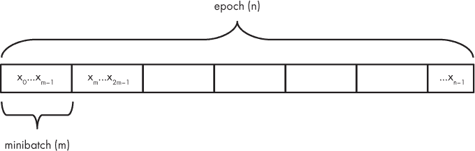

*图 10-2：周期数（*n*）、小批量（*m*）和样本（{x[*0*],x[*1*], …,x[*n-1*]}）之间的关系*

图 10-2 也意味着训练集中的样本顺序至关重要，这就是我们在创建数据集时打乱样本顺序的原因。如果需要，sklearn 工具包还会在每个训练周期后重新排列样本。只要小批量在统计上是从整个训练集中随机选取的样本，通常情况应该没问题。如果小批量不是这样，那么在反向传播过程中它可能会给出一个有偏的梯度方向。

我们的小批量实验将固定 MNIST 训练样本数为 16,384，同时变化小批量大小。我们还将固定训练周期数为 100。我们报告的分数是五次不同运行的平均值和标准误差，每次运行都有不同的随机初始化。因此，`MLPClassifier` 对象是通过以下方式实例化的：

```py
MLPClassifier(solver="sgd", verbose=False, tol=1e-8,

     nesterovs_momentum=False, early_stopping=False,

     learning_rate_init=0.001, momentum=0.9, max_iter=100,

     hidden_layer_sizes=(1000,500), activation="relu",

     batch_size=bz)
```

这段代码表明，所有的模型都有两个隐藏层，分别包含 1,000 和 500 个节点，整体网络架构为 784-1000-500-10，包含输入层和输出层的节点数。当定义网络时，唯一变化的参数是 `batch_size`。我们将使用 表 10-4 中的小批量大小，并结合每个周期的梯度下降步数（见 图 10-2）。

**表 10-4：** 小批量大小与每个周期梯度下降步数的对应关系

| 小批量大小 | 每个周期的 SGD 步数 |
| --- | --- |
| 2 | 8,192 |
| 4 | 4,096 |
| 8 | 2,048 |
| 16 | 1,024 |
| 32 | 512 |
| 64 | 256 |
| 128 | 128 |
| 256 | 64 |
| 512 | 32 |
| 1,024 | 16 |
| 2,048 | 8 |
| 4,096 | 4 |
| 8,192 | 2 |
| 16,384 | 1 |

当小批量大小为 2 时，每个周期将进行超过 8,000 次梯度下降步骤，但当小批量大小为 8,192 时，仅进行 2 次梯度下降步骤。固定训练周期数应该有利于选择较小的小批量大小，因为相应地会有更多的梯度下降步骤，这意味着有更多机会朝着最优的网络参数集前进。

图 10-3 显示了小批量大小对平均分数的影响。生成该图的数据代码位于 *mnist_nn_experiments_batch_size.py* 文件中。绘图代码本身位于 *mnist_nn_experiments_batch_size_plot.py* 文件中。此刻我们关注的曲线是使用圆圈标记的那条。我们稍后会解释使用方形符号的曲线。

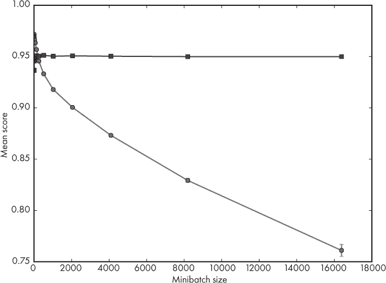

*图 10-3：固定周期数（100）下，MNIST 测试集上平均分数与小批量大小（均值* ± *标准误差）之间的关系，无论小批量大小（圆圈）还是固定小批量数（方形）*

在这里，我们将迭代次数固定为 100，因此通过改变小批量大小，我们改变了梯度步骤的数量：小批量越大，梯度步骤就越少。由于小批量更大，步骤本身基于对实际梯度方向的更真实表示；然而，由于每个迭代中的小批量较少，步骤数量减少，导致收敛变差：我们没有达到损失函数的良好最小值。

一个更“公平”的测试可能是，观察当我们调整迭代次数，使得检查的小批量数量在任何情况下都是恒定时会发生什么。实现这一点的一种方法是注意到每个迭代中的小批量数量是 *n*/*m*，其中 *n* 是训练样本数，*m* 是小批量数量。如果我们将希望执行的总体小批量数量称为 *M*，那么为了保持其恒定，我们需要设置迭代次数为

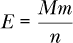

这样，无论 *m* 为何，我们在训练过程中都会执行 *M* 次梯度下降步骤。

让我们保持相同的小批量集合，但根据前面的公式调整迭代次数。我们需要选择 *M*，即总体的小批量数量（梯度下降步骤）。我们将其设置为 *M* = 8,192，以便每种情况下迭代次数都是整数。当小批量大小为 2 时，我们使用一个迭代来获取 8,192 个小批量。而当小批量大小为 16,384（*n* 仍然是 16,384 个样本）时，我们得到 8,192 个迭代。如果我们这样做，我们会得到完全不同的结果，正如在图 10-3 中看到的方形符号曲线一样，我们看到平均得分几乎是一个常数，代表了训练过程中执行的恒定梯度下降更新次数。当小批量大小较小时，对应于图 10-3 中的接近 0 的点，我们确实看到性能下降，但在达到一定的小批量大小后，性能趋于平稳，反映出梯度下降更新的恒定次数，并且通过使用足够大的小批量，合理地估计了真实的梯度。

对于一组基础神经网络参数，特别是对于固定学习率，固定迭代次数会导致性能下降，这是由于 sklearn 的设计所致。固定检查的小批量数量会导致性能保持基本恒定。

### 基础学习率

在第九章中，我们介绍了训练过程中更新神经网络权重的基本公式：

*w* ← *w* – *η*Δ*w*

这里 *η*（希腊字母 eta）表示学习率，是基于梯度值 *Δw* 控制步长的参数。在 sklearn 中，*η* 通过 `learning` `_rate_init` 参数指定。在训练过程中，学习率通常会降低，以便步长在接近训练最小值时逐渐变小（希望如此！）。然而，在我们的实验中，我们使用的是恒定的学习率，因此我们设置的 `learning_rate_init` 值在整个训练过程中都保持不变。让我们看看这个值如何影响学习过程。

在这个实验中，我们将小批量大小固定为 64 个样本，架构设置为（1000,500），即有两个隐藏层，分别包含 1000 和 500 个节点。接着，我们观察两个主要效果。第一个是固定训练轮次时，不考虑基础学习率的影响。在这种情况下，我们在训练期间始终进行固定数量的梯度下降步骤。第二种情况固定基础学习率与训练轮次的乘积。这种情况很有趣，因为它研究了较少的大步与更多的小步对测试成绩的影响。这些实验的代码在 *mnist_experiments_base_lr.py* 中。训练集使用的是前 20,000 个 MNIST 样本。

第一个实验固定训练轮次为 50，并对不同的基础学习率进行循环测试：

```py
[0.2, 0.1, 0.05, 0.01, 0.005, 0.001, 0.0005, 0.0001]
```

第二个实验使用相同的基础学习率，但调整训练轮次，使得每种情况中基础学习率与训练轮次的乘积都为 1.5。这将导致以下与之前基础学习率相匹配的训练轮次数：

```py
[8, 15, 30, 150, 300, 1500, 3000, 15000]
```

运行这两个实验需要一些时间。完成后，我们可以将测试成绩与基础学习率大小的关系绘制成图。通过这种方式，我们得到了 图 10-4。

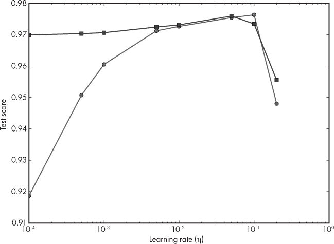

*图 10-4：MNIST 测试成绩与基础学习率的关系。圆圈代表固定训练轮次的情况。方框表示基础学习率与训练轮次乘积固定的情况。*

图 10-4 显示了两个图。第一个图中，使用圆圈表示，训练轮次固定为 50。固定训练轮次意味着训练期间梯度下降步骤的数量固定。然后，我们调整学习率。学习率越大，步骤越大。

想象你走过一个足球场，试图从一个角落走到正中心，且步数有限。如果我们迈大步，可能很快就走过了很多地面，但我们无法精确地走到中心，因为我们会一直走过它。如果我们迈小步，从角落到中心的距离就很短。虽然我们可能在正确的轨道上，但由于步数有限，我们无法到达中心。直观上，我们或许可以说，存在一个最佳步长与步数的组合，能够让我们到达中心。

我们在图 10-4 中的圆形图中看到了这种效果。最左边的点代表了微小步伐的情况。我们表现较差，因为我们没有遍历足够的误差空间来找到最小值。类似地，最右边的点代表了采取非常大步伐的情况。我们表现不佳，因为我们总是跨越最小值。最佳得分出现在我们可以采取的步数和步伐大小配合得当时，将我们推向最小值。在图中，这发生在基础学习率为 0.1 时。

现在让我们来看一下图 10-4 中的方形符号图。这张图来自于当基础学习率和训练周期数的乘积保持恒定时得到的得分，这意味着较小的学习率将会运行很长的训练周期。大部分情况下，除了最大值之外，所有基础学习率的测试得分都差不多。在我们的足球场思维实验中，方形符号图对应的是采取少数几步大步伐或非常多的小步伐。我们可以想象这两种方法都会让我们接近场地的中心，至少在我们的步伐大小适当时，能让我们到达中心。

一些读者此时可能会提出异议。如果我们比较图 10-4 中圆形和方形图的前三个点，会看到一个较大的差距。对于圆形图，性能随着基础学习率的增加而提升。然而，对于方形图，性能无论基础学习率如何都保持较高且恒定。对于圆形图，我们始终训练了 50 个周期。这是一个比对应基础学习率下方形图使用的训练周期更多的周期数。这意味着在圆形图的情况下，我们在接近场地中心后走了相当多的步。相反，对于方形图，我们限制了训练周期数，所以在接近场地中心时就停止了，这也是性能得到提升的原因。这意味着我们需要调整训练周期数（即梯度下降的步数），以匹配学习率，从而快速接近损失函数的最小值，而不会走太多冤枉路，但也不能太快，以至于步伐过大，导致无法收敛到最小值。

到目前为止，我们一直保持学习率在训练过程中不变。由于空间限制，我们无法全面探讨在训练过程中更改学习率的影响。不过，我们至少可以利用我们的足球场思维实验来帮助我们理解为何在训练过程中更改学习率是合理的。回想一下，网络是通过智能但随机的方式初始化的。这意味着我们在场地上的某个位置随机开始。这个随机位置离场地中心（即误差表面的最小值）可能很远，因此我们需要应用梯度下降法将我们带向中心。最开始，我们可以采取较大的步伐，以便快速穿过场地。由于我们跟随梯度，这样就能朝着中心移动。然而，如果我们继续采取大步伐，可能会越过中心。走了几步大步之后，我们可能会认为开始采取较小的步伐比较明智，因为我们认为现在已经离目标中心更近了。我们走得越远，步伐就越小，以便尽可能接近中心。这就是为什么在训练过程中学习率通常会逐渐减小的原因。

### 训练集大小

我们已经提到，训练集中的样本数量会显著影响性能。让我们使用 MNIST 数据来量化这个说法。在这个实验中，我们将变化训练集的样本数量，同时调整训练轮数（epoch），确保在每种情况下，我们在训练期间大约进行 1,000 次梯度下降步骤。这个实验的代码在 *mnist_nn_experiments_samples.py* 中。所有情况下，最小批量大小为 100，网络架构有两个隐藏层，分别包含 1,000 和 500 个节点。图 10-5 显示了该实验的结果。


*图 10-5：MNIST 测试分数与训练样本数量的关系*

图 10-5 特别令人满意，因为它展示了我们预期看到的结果。如果训练数据太少，我们无法很好地学习到泛化能力，因为我们用来自父分布的非常稀疏的样本来训练模型。随着训练数据的不断增加，我们预计网络的性能会迅速提高，因为训练集变得越来越接近我们希望模型学习的父分布。

图 10-5 显示，增大训练集的大小会导致收益递减。从 1,000 个训练样本增加到 5,000 个训练样本，性能有了显著提升，但从 5,000 个样本增加到 10,000 个样本时，性能提升变得很小，进一步增加训练集大小的效果逐渐趋于平缓，达到某个性能上限。我们可以将这个水平区域视为模型已经从数据集中学到了它能学到的东西。此时，我们可能会考虑扩展网络架构，看看是否能在有足够训练样本的情况下提升测试集的得分。

### L2 正则化

在第九章中，我们讨论了提高网络泛化能力的正则化技术，包括 L2 正则化。我们看到，L2 正则化在训练过程中向损失函数中添加了一个新项，本质上等同于权重衰减，如果权重过大，训练时会对网络进行惩罚。

在 sklearn 中，控制 L2 正则化强度的参数是`alpha`。如果此参数为 0，则没有 L2 正则化；而随着`alpha`的增加，正则化的强度也会增强。让我们来探索 L2 正则化对 MNIST 网络的影响。

在本实验中，我们将小批量大小固定为 64。我们还将动量设置为 0，这样我们看到的效果就完全是 L2 正则化的影响。最后，我们将使用一个包含 100 和 50 个节点的两层隐藏网络，并选取前 3,000 个 MNIST 样本作为一个小的训练集。代码位于*mnist_nn_experiments_L2.py*。

与之前的实验不同，在这种情况下，我们希望在每个训练周期后评估测试数据，以便我们可以观察网络在训练过程中的学习情况。如果网络正在学习，随着训练周期数的增加，测试集上的误差应该会下降。我们知道，sklearn 会在一个周期内遍历数据集中的所有小批量数据，因此我们可以将训练周期数设置为 1。然而，如果我们将`max_iter`设置为 1 并调用`fit`方法，下次调用`fit`时，网络将重新初始化开始训练，这样并不能帮助我们；我们需要在多次调用`fit`之间保留权重和偏置。

对我们来说，幸运的是，sklearn 的创建者考虑得很周到，加入了`warm_start`参数。如果将此参数设置为`True`，调用`fit`时将*不会*重新初始化网络，而是使用现有的权重和偏置。如果我们将`max_iter`设置为 1 并将`warm_start`设置为`True`，我们就可以通过在每个训练周期后调用`score`来观察网络的学习过程。调用`score`会给出测试数据上的准确度。如果我们想要误差，需要跟踪的值是 1 – `score`。这是我们绘制的随周期变化的值。我们将绘制的`alpha`值是

```py
[0.0, 0.1, 0.2, 0.3, 0.4]
```

与默认设置相比，我们将这些参数设置得相当大，以便观察其效果。

仅关注测试误差，评估单个周期的代码如下：

```py
def epoch(x_train, y_train, x_test, y_test, clf):

    clf.fit(x_train, y_train)

    val_err = 1.0 - clf.score(x_test, y_test)

    clf.warm_start = True

    return val_err
```

在这里，调用`fit`进行一次训练周期。然后，我们计算测试集上的误差，并将其存储在`val_err`中。调用`fit`后将`warm_start`设置为`True`，确保第一次调用`epoch`时会正确初始化网络，但随后的调用将保持上一次调用的权重和偏置。

训练过程发生在一个简单的循环中：

```py
def run(x_train, y_train, x_test, y_test, clf, epochs):

    val_err = []

    clf.max_iter = 1

    for i in range(epochs):

        verr = epoch(x_train, y_train, x_test, y_test, clf)

        val_err.append(verr)

    return val_err
```

这个循环收集每个周期的结果，并将它们返回给`main`函数，该函数本身对我们感兴趣的*α*值进行循环。

让我们运行这段代码，并绘制`val_err`，即测试误差，作为每个`alpha`的训练周期数的函数。图 10-6 是结果。

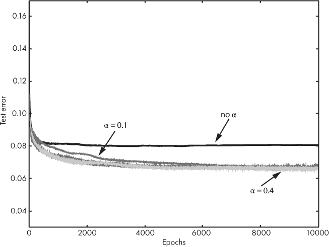

*图 10-6：不同α值下训练周期的 MNIST 测试误差*

在图 10-6 中，我们首先注意到任何非零的*α*值都能比不使用 L2 正则化时产生更低的测试误差。我们可以得出结论，L2 正则化是有帮助的。不同的*α*值结果的测试误差大致相同，但较大的值略微更有效，并且能更快地达到更低的测试误差。例如，可以比较*α* = 0.1 与*α* = 0.4。

注意，较大的*α*值似乎更嘈杂：相较于较小的*α*值，图表更粗，因为误差的波动更大。要理解这一点，可以思考在训练过程中最小化的总损失。当*α*较大时，我们在 L2 项相对于网络在小批次上的误差上赋予更多的权重。这意味着，当我们要求网络在反向传播过程中调整权重和偏置时，它将更多地受到网络参数大小的影响，而不是训练数据本身的影响。由于网络对减少训练数据导致的损失关注较少，我们可能会预期每个周期的测试误差会有更大的波动。

### 动量

动量通过将上一个小批次中用于更新权重的梯度值的一部分加到当前训练中的权重更新中，从而改变训练过程中的权重更新。这个部分通过对上一个梯度值的乘数来指定，范围为[0,1]。我们在第九章中讨论了动量。

让我们看看改变这个参数如何影响训练。在这种情况下，实验的设置很简单。它与之前用于 L2 正则化的设置相同，但不同之处在于，我们固定动量参数（*μ*），而变化 L2 权重（*α*）。我们将*α* = 0.0001，并变化*μ*。其他部分保持不变：按单个周期进行训练，网络配置等。请参见文件*mnist_nn_experiments_momentum.py*。

我们将探索这些动量值：

```py
[0.0, 0.3, 0.5, 0.7, 0.9, 0.99]
```

它们的范围从没有动量项（*μ* = 0）到一个较大的动量项（*μ* = 0.99）。运行实验生成了图 10-7。

在图 10-7 中，我们看到三个不同的区域。第一个区域表示没有动量或相对较小的动量值（*μ* = 0.3, *μ* = 0.5），此时测试集误差最大。第二个区域则显示了中等动量值（*μ* = 0.7, *μ* = 0.9）的改进，包括“标准”（sklearn 默认）值 0.9。然而，在这种情况下，较大的动量值 0.99 使测试集误差从大约 7.5% 降低到了大约 6%。动量的确有效，尤其是在接近标准值 0.9 时应该使用。实际上，人们很少改变动量的值，但正如这个例子所示，有时它对结果的影响非常大。

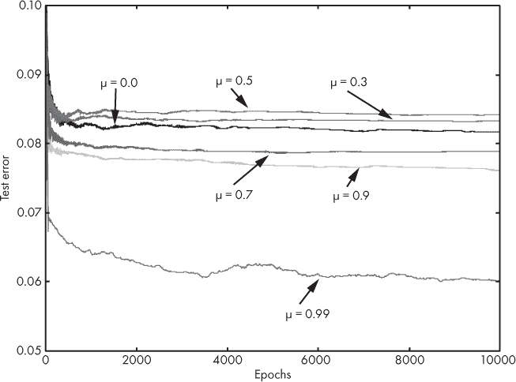

*图 10-7：不同 μ 值下，MNIST 测试误差随训练轮次的变化*

请注意，我们将训练集限制在仅 3,000 个样本左右，每个数字约 300 个样本，这可能使得动量的影响更为显著，因为训练集较小，且未能充分代表我们希望模型学习的母体分布。将训练集大小增加到 30,000 后，图表的顺序发生了变化，呈现出更典型的趋势，此时 0.9 的动量值是最优的选择。

### 权重初始化

曾经被视为不重要的网络权重和偏置的初始值，现在被认为是极其重要的。本节中的简单实验清楚地展示了这一点。

sklearn 工具包通过调用 `MLPClassifier` 类的 `_init_coef` 方法来初始化神经网络的权重和偏置。该方法根据我们在第九章中讨论的 Glorot 算法随机选择权重和偏置。该算法将权重和偏置设置为从范围内均匀采样的值。

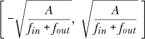

其中 *f*[*in*] 是当前层输入的数量，*f*[*out*] 是当前层输出的数量。如果激活函数是 Sigmoid，*A* = 2；否则，*A* = 6。

如果我们玩个小把戏，我们可以改变 sklearn 初始化网络的方式，从而尝试不同的初始化方案。这个小把戏利用了 Python 的面向对象编程特性。如果我们创建一个 `MLPClassifier` 的子类，称之为 `Classifier`，我们可以用自己的方式覆盖 `_init_coef` 方法。Python 还允许我们随意地向类实例添加新的成员变量，这为我们提供了所需的一切。

实验的其余部分遵循前面章节的格式。我们最终将绘制在一个子集数据上训练的 MNIST 数字测试误差随训练轮次的变化，使用不同的初始化方法。模型本身将使用前 6,000 个训练样本，迷你批次大小为 64，恒定学习率为 0.01，动量为 0.9，L2 正则化参数为 0.2，架构包括两层隐藏层，分别为 100 和 50 个节点。请参阅 *mnist_nn_experiments_init.py* 了解此实验的代码。

我们将测试四种新的权重初始化方案，并与 sklearn 的标准 Glorot 方法进行比较。这些方案显示在 表 10-5 中。

**表 10-5：** 权重初始化方案

| 名称 | 方程式 | 描述 |
| --- | --- | --- |
| Glorot | 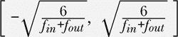 | sklearn 默认 |
| He | 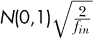 | ReLU 的 He 初始化 |
| Xavier | 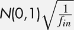 | 交替 Xavier |
| 均匀 | 0.01(*U*(0,1)-0.5) | 经典的小均匀 |
| 高斯 | 0.005*N*(0,1) | 经典的小高斯 |

请记住，*N*(0,1) 表示从均值为 0、标准差为 1 的钟形曲线中抽取的样本，而 *U*(0,1) 表示从 0,1) 区间中均匀抽取的样本，意味着该范围内的所有值都有相同的概率，除了 1.0。每种新的初始化方法都会将偏置值始终设置为 0。然而，sklearn 的 Glorot 实现会像设置权重一样设置偏置值。

**注意** *如 [第九章 所述，* Xavier *和* Glorot *指的是同一个人，Xavier Glorot。我们在这里区分是因为我们调用的* Xavier *在其他机器学习工具包中（如 Caffe）被称为 Xavier，并且使用的方程与原论文中使用的方程不同。*

这一切听起来不错且整洁，但如何在代码中实现呢？首先，我们定义一个新的 Python 类，`Classifier`，它是 `MLPClassifier` 的子类。作为子类，新的类立即继承了超类（`MLPClassifier`）的所有功能，同时允许我们自由地使用我们自己的实现来覆盖任何超类的方法。我们只需要定义我们自己版本的 `_init_coef`，并确保它具有相同的参数和返回值。代码如下所示：

```py
class Classifier(MLPClassifier):

    def _init_coef(self, fan_in, fan_out):

        if (self.init_scheme == 0):

            return super(Classifier, self)._init_coef(fan_in, fan_out)

        elif (self.init_scheme == 1):

            weights = 0.01*(np.random.random((fan_in, fan_out))-0.5)

            biases = np.zeros(fan_out)

        elif (self.init_scheme == 2):

            weights = 0.005*(np.random.normal(size=(fan_in, fan_out)))

            biases = np.zeros(fan_out)

        elif (self.init_scheme == 3):

            weights = np.random.normal(size=(fan_in, fan_out))*  \

                        np.sqrt(2.0/fan_in)

            biases = np.zeros(fan_out)

        elif (self.init_scheme == 4):

            weights = np.random.normal(size=(fan_in, fan_out))*  \

                        np.sqrt(1.0/fan_in)

            biases = np.zeros(fan_out)
```

我们执行的初始化依赖于 `init_scheme` 的值。这是一个新的成员变量，用于选择初始化方法（请参见 表 10-6）。

**表 10-6：** 初始化方案和 `init_scheme` 值

| 值 | 初始化方法 |
| --- | --- |
| 0 | sklearn 默认 |
| 1 | 经典的小均匀 |
| 2 | 经典的小高斯 |
| 3 | He 初始化 |
| 4 | 交替 Xavier |

我们在创建 `Classifier` 对象后立即设置该变量。

我们知道，训练一个网络多次会导致略有不同的性能，因为网络初始化的方式不同。因此，每种初始化类型训练一个网络可能会导致对初始化性能的错误看法，因为我们可能会遇到一组不理想的初始权重和偏置。为了解决这个问题，我们需要训练多个版本的网络，并报告平均性能。由于我们想要绘制训练轮次与测试误差的关系图，因此我们需要跟踪每个初始化方案的每次训练在每一轮的测试误差。这就需要一个三维数组：

```py
test_err = np.zeros((trainings, init_types, epochs))
```

我们对每种初始化类型（`init_types`）进行`trainings`次训练，最多训练`epochs`个周期。

在这一切准备好之后，实际实验结果的生成和存储变得相对直接，虽然速度较慢，运行起来大约需要一天的时间：

```py
for i in range(trainings):

    for k in range(init_types):

        nn = Classifier(solver="sgd", verbose=False, tol=0,

               nesterovs_momentum=False, early_stopping=False,

               learning_rate_init=0.01, momentum=0.9,

               hidden_layer_sizes=(100,50), activation="relu", alpha=0.2,

               learning_rate="constant", batch_size=64, max_iter=1)

        nn.init_scheme = k

        test_err[i,k,:] = run(x_train, y_train, x_test, y_test, nn, epochs)

np.save("mnist_nn_experiments_init_results.npy", test_err)
```

这里的`nn`是要训练的分类器实例，`init_scheme`设置要使用的初始化方案，而`run`是我们之前定义的用于增量训练和测试网络的函数。

如果我们将训练次数设为 10，训练周期设为 4,000，并绘制每个周期的平均测试误差，我们得到图 10-8。

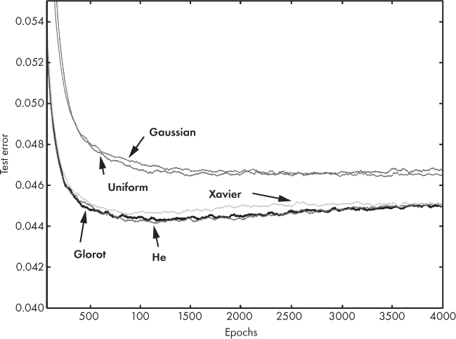

*图 10-8：不同权重初始化方法下的 MNIST 测试误差与训练周期的关系（10 次训练运行的平均值）*

让我们来理解这个图表所展示的内容。五种初始化方法被标注出来，每个标记指向图中的一条曲线。我们现在已经很熟悉这些曲线，它们展示了训练周期的函数下，测试集的误差。在这种情况下，每条曲线的值是 10 次训练运行的平均值，训练网络架构使用相同的初始化方法，但随机值不同。

我们立刻可以看到两组不同的结果。顶部是使用小的均匀分布或正态分布（高斯）的经典初始化方法的测试误差。底部是当前使用的更为原理化的初始化方法的结果。即便是这个基础实验，也清楚地显示出现代初始化方法的有效性。回想一下，经典的初始化方法曾是神经网络几十年前口碑差的部分原因。网络不稳定且难以训练，很大一部分原因是由于初始化不当。

看底部的结果，我们可以看到在这个实验中，sklearn 默认的初始化方法（我们称之为*Glorot*）与 He 初始化方法几乎没有区别。这两张图几乎完全相同。标记为*Xavier*的曲线起初稍差一些，但在训练的后期与另外两条曲线相匹配。Sklearn 使用了一种不错的初始化策略。

该图还向我们展示了其他一些信息。对于经典初始化方法，我们看到测试集误差趋于平稳并保持相对恒定。而对于现代初始化方法，我们观察到随着训练轮次的增加，测试误差略有上升。这对于 Glorot 和 He 方法尤为明显。这种增加是过拟合的明显信号：随着训练的进行，模型停止学习父分布的普遍特征，而开始专注于训练集的特定特征。我们没有绘制训练集误差，但即使测试集误差开始上升，训练集误差仍会下降。最低的测试集误差出现在大约 1,200 次训练周期时。理想情况下，我们应该在此时停止训练，因为这时模型最有可能正确地预测新的、未见过的输入。进一步训练往往会降低模型的泛化能力。

为什么测试误差会增加？这种现象可能的原因是训练集太小，仅有 6,000 个样本。此外，模型架构也不大，隐藏层只有 100 和 50 个节点。

本节生动地展示了使用当前最先进的网络初始化方法的好处。当我们在第十二章中探讨卷积神经网络时，我们将专门使用这些方法。

### 特征排序

我们将通过一点有趣的实验结束我们的 MNIST 实验，之后我们在探讨卷积神经网络时会再次提到这一点。到目前为止，所有的实验都使用将数字图像的每一行拼接在一起形成的向量。当我们这样做时，我们知道该向量的元素是相互关联的，这样一来，如果我们将向量重新塑形为一个 28 × 28 的数组，就能重构出数字。这意味着，除了每一行的结尾和下一行的开头，行中的像素仍然是数字的一部分——图像组件的空间关系得到了保留。

然而，如果我们打乱图像的像素，但始终以相同的方式打乱像素，我们将破坏像素之间的局部空间关系。我们在查看图像时会用到这种局部关系来判断它代表的是哪个数字。例如，我们会观察到数字 5 的上部分是直线段，而下部分则在右侧有一个弯曲，等等。

请看一下图 7-3。该图展示了 MNIST 数字图像在上行，以及这些数字图像经过打乱后的样子（下行）。在第七章中，我们展示了这种打乱并不会影响经典机器学习模型的准确性；这些模型是整体地考虑输入，而不是像我们一样通过局部空间关系来分析。那么，这对于神经网络也是如此吗？此外，如果是这样，网络在使用打乱后的输入时，学习的速度会像使用原始图像时一样快吗？让我们来看看。

该实验的代码可以在*mnist_nn_experiments_scrambled.py*中找到，在该代码中，我们简单地定义了我们现在预期的神经网络模型

```py
MLPClassifier(solver="sgd", verbose=False, tol=0,

  nesterovs_momentum=False, early_stopping=False,

  learning_rate_init=0.01, momentum=0.9,

  hidden_layer_sizes=(100,50), activation="relu",

  alpha=0.2, learning_rate="constant", batch_size=64, max_iter=1)
```

并在前 6000 个 MNIST 数字样本上进行训练——首先像往常一样，然后使用混乱版本。我们计算测试集误差与训练轮次的关系，并在 10 次运行中求平均，最后绘制结果。这就是图 10-9 所示的结果。

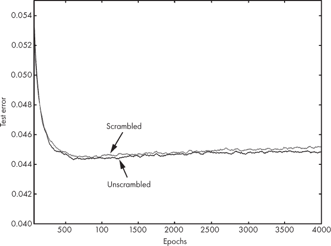

*图 10-9：混乱和未混乱数字的训练轮次与 MNIST 测试错误之间的关系*

在图中，我们看到了之前问题的答案。首先，的确，传统神经网络会整体性地解读它们的输入向量，就像经典模型一样。其次，网络在处理混乱数字时的学习速度与处理未混乱数字时相同。在图 10-9 中，混乱和未混乱曲线的差异在统计上不显著。

这些结果表明，（传统的）神经网络“全面理解”它们的输入，而不会寻找局部空间关系。当我们使用卷积神经网络时（见第十二章），我们将看到不同的实验结果。正是这种缺乏空间意识（假设输入为图像）长期限制了神经网络的发展，并促成了卷积神经网络的出现，后者具有空间感知能力。

### 总结

在本章中，我们通过对 MNIST 数据集的实验，探索了在第八章和第九章中开发的概念。通过调整与网络架构和梯度下降学习过程相关的关键参数，我们加深了对这些参数如何影响网络整体性能的直觉。由于篇幅限制，我们未能全面探讨所有`MLPClassifier`选项，因此鼓励你自己做更多实验。特别是，尝试使用不同的求解器、Nesterov 动量、早期停止，以及对训练卷积神经网络至关重要的非常规学习率。

下一章将探讨评估机器学习模型性能的技术和指标。在我们进入卷积神经网络之前的这一插曲将为我们提供一些工具，帮助我们理解更先进模型类型的性能。
