## 第十一章：评估模型**


到目前为止，我们通过查看模型在保留测试集上的准确率来评估模型。这是自然且直观的，但正如我们将在本章中学习的那样，这并不是评估模型时我们能做的或应该做的全部。

本章的开始，我们将定义度量标准并阐明一些基本假设。然后我们将讨论为什么仅仅依赖准确率是不够的。我们将介绍混淆矩阵的概念，并花时间讨论我们可以从中得出的度量标准。接下来，我们将讨论性能曲线，它们是比较不同模型的最佳方式。最后，我们将把混淆矩阵的概念扩展到多类别的情况。我们不会说完关于性能度量的所有内容，因为这一领域仍在发展。然而，到本章结束时，你将熟悉机器学习领域的人们常提到的各种数字，并且能很好地理解它们的含义。

### 定义和假设

除了准确率，还有许多其他度量标准可以帮助我们评估模型的表现。这些度量标准可以让我们合理地比较模型。我们先来定义一下“度量”这个词。对我们而言，度量是一个数字或一组数字，表示模型表现的某个方面。

当模型的性能提高或降低时，度量值也会随之增加或减少，反之亦然。有时我们会稍微不严谨，称图形为度量，因为我们用它们来判断模型的表现。

我们关心的是评估一个只有一个保留测试集的模型。我们将假设我们已经遵循了第四章的建议，构建了三个数据集：一个用于训练模型的训练集，一个用于决定模型何时训练完成的验证集，以及一个用于评估训练好模型的保留测试集。我们现在已经训练了模型，利用了训练集和验证集，并希望知道我们做得怎么样。

本章中还有另一个隐含的假设。它是一个关键假设：我们假设保留的测试集是生成数据的母体分布的一个良好代表。换句话说，保留的测试集必须尽可能多地代表模型在实际使用中将遇到的各种数据。例如，测试集中各个类别出现的频率应该尽可能与模型实际使用时将遇到的预期频率匹配。

这是必要的，因为训练集使模型预期一个特定的分布、一组特定的特征，如果模型使用时所接收到的数据具有不同的特征，模型的表现就会变差。训练集与模型使用时所呈现数据之间的分布差异，是已部署的机器学习模型在实际使用中失败的最常见原因之一。

### 为什么准确率不足够

二分类器为特定输入输出一个决策：类别 0 或类别 1。我们定义以下内容，

*N*[*c*]，模型正确分类的测试样本数量

*N*[*w*]，模型预测错误的测试样本数量

然后，这个模型的整体准确率，一个介于 0 和 1 之间的数字，是

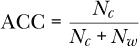

这就是我们在本书中一直使用的准确率。请注意，在本章中，当我们说到整体准确率时，我们会使用*ACC*。

这看起来是一个相当合理的度量，但有几个很好的理由不应该过于依赖这个数字。例如，*N*[*c*]和*N*[*w*]并没有告诉我们各类别的相对频率。如果某一类别很稀有呢？我们来看一下这种情况可能会产生什么影响。

如果模型的准确率是 95%（ACC = 0.95），我们可能会感到满意。然而，假设类别 1 的频率（即*先验概率*）仅为 5%，这意味着如果我们从测试集中抽取 100 个样本，平均来说，其中约 5 个将是类别 1，其他 95 个将是类别 0。我们看到，一个将所有输入预测为类别 0 的模型在 95%的情况下是正确的。但考虑一下：我们的模型可能对所有输入都只返回类别 0。如果我们仅关注整体准确率，我们可能会认为自己有一个不错的模型，而实际上我们拥有一个非常糟糕的模型，我们可以用两行 Python 代码实现如下

```py
def predict(x):

    return 0
```

在这段代码中，我们无论输入特征向量*x*是什么，都会认为类别是 0。没有人会对这样的模型感到满意。

类别的先验概率会影响我们如何思考整体准确率。然而，如果我们知道以下信息

*N*[0]，我们测试集中类别 0 实例的数量

*N*[1]，我们测试集中类别 1 实例的数量

*C*[0]，我们模型找出的类别 0 实例的数量

*C*[1]，我们模型找出的类别 1 实例的数量

我们可以轻松地计算每个类别的准确率：

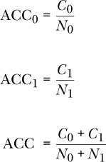

最终的表达式实际上是计算整体准确率的另一种方式，因为它统计了所有正确分类的数量，并除以测试样本的数量。

每个类别的准确率比整体准确率更好，因为它考虑了测试集中各类别频率的不平衡。对于我们之前假设的测试集，其中类别 1 的频率为 5%，如果分类器对所有输入都预测类别 0，我们会发现这一点，因为每个类别的准确率将是 ACC[0] = 1.0 和 ACC[1] = 0.0。这个很有道理。我们会将每个类别 0 的样本正确分类，而每个类别 1 的样本错误分类（我们还是会将它们归为类别 0）。每个类别的准确率将在我们考虑评估多类别模型时再次出现。

一个更微妙的原因是，不仅仅使用整体准确率可能会产生误导，因为错误的结果可能带来比正确更高的成本。这引入了超出测试集范围的内容：它引入了我们赋予类别 0 和类别 1 的意义。例如，如果我们的模型在测试乳腺癌，假设使用了我们在第五章中创建的数据集，报告类别 1（恶性）时，实际上该样本并不代表恶性病例，可能会导致等待测试结果的女性产生焦虑。然而，经过进一步的检测后，她最终会被证明没有乳腺癌。但考虑另一种情况。一个良性的结果实际上是恶性的，可能意味着她不会接受治疗，或者治疗太晚，这很可能是致命的。不同类别之间的相对成本并不相同，可能会字面上决定生死。同样的情况也适用于自动驾驶汽车，如果它把在路中间玩耍的孩子误认为是一个空的汽水罐，或者其他许多现实生活中的例子。

我们在现实世界中使用模型，因此它们的输出与现实世界相关，有时与输出相关的成本是显著的。仅使用模型的整体准确率可能会产生误导，因为它没有考虑错误的成本。

### 2 × 2 混淆矩阵

我们到目前为止使用的所有模型最终都为每个输入分配了一个类别标签。例如，具有逻辑输出的神经网络被解释为属于类别 1 的概率。使用典型的阈值 0.5，可以为其分配类别标签：如果输出小于 0.5，则将输入分配为类别 0；否则，分配为类别 1。对于其他类型的模型，决策规则可能不同（例如，*k*-最近邻中的投票），但效果是一样的：我们会为输入分配一个类别。

如果我们将整个测试集输入到模型中，并应用决策规则，我们就能获得每个样本的分配类别标签以及真实类别标签。同样，考虑到二分类器的情况，我们对于每个输入样本在分配类别和真实类别之间有四种可能的结果（见表 11-1）。

**表 11-1：** 二分类器中真实类别标签与分配类别标签之间的可能关系

| **分配的类别** | **真实类别** | **情况** |
| --- | --- | --- |
| 0 | 0 | 真阴性（TN） |
| 0 | 1 | 假阴性（FN） |
| 1 | 0 | 假阳性（FP） |
| 1 | 1 | 真阳性（TP） |

*案例* 标签定义了我们如何描述这些情况。如果输入的实际类是类 0 并且模型分配了类 0，那么我们就有一个正确识别的负类案例，这就是 *真正负*（*TN*）。如果实际类是类 1 并且模型分配了类 1，那么我们就有一个正确识别的正类案例，这就是 *真正正*（*TP*）。然而，如果实际类是类 1 并且模型分配了类 0，我们就有一个正类案例被错误地称为负类，这就是 *假负*（*FN*）。最后，如果实际类是类 0 并且模型分配了类 1，我们就有一个负类案例被错误地称为正类，这就是 *假正*（*FP*）。

我们可以将测试集中的每个输入归类到这些情况中的一个，且仅一个。这样做可以让我们统计每个情况在测试集中出现的次数，并且我们可以将其漂亮地展示为一个表格（见 表 11-2）。

**表 11-2：** 2 × 2 表格中类标签的定义

|  | **实际类 1** | **实际类 0** |
| --- | --- | --- |
| *模型分配类 1* | TP | FP |
| *模型分配类 0* | FN | TN |

我已将案例标签（TP、FP 等）放置在每个案例的实际计数应该出现的位置。

这个表格被称为 2 × 2 *混淆矩阵*（或 2 × 2 *列联表*）。它是 2 × 2，因为它有两行两列。之所以称之为混淆矩阵，是因为它可以让我们一目了然地看到分类器的表现，特别是它在哪些地方发生了混淆。当分类器将某个类的实例错误地分配给另一个类时，便发生了混淆。在 2 × 2 的表格中，这种混淆表现为不在表格主对角线（从左上到右下）上的计数。这些是 FP 和 FN 项。一个在测试集上表现完美的模型会有 FP = 0 和 FN = 0；它不会在分配类标签时犯错误。

在第七章中，我们使用在第五章中构建的乳腺癌数据集进行了实验。我们通过查看这些经典模型的整体准确性报告了它们在该数据集上的表现。这就是 sklearn `score` 方法返回的内容。现在我们来看看这些模型在测试集上生成的一些 2 × 2 表格。

我们正在查看的代码位于文件 *bc_experiments.py* 中。此代码训练了多种经典模型类型。但是，除了使用整体准确率，我们将引入一个新函数来计算 2 × 2 表格中的条目（列表 11-1）：

def tally_predictions(clf, x, y):

p = clf.predict(x)

score = clf.score(x, y)

tp = tn = fp = fn = 0

for i in range(len(y)):

如果 (p[i] == 0) 且 (y[i] == 0):

tn += 1

elif (p[i] == 0) 且 (y[i] == 1):

fn += 1

(*\pagebreak*)

elif (p[i] == 1) 且 (y[i] == 0):

fp += 1

否则：

tp += 1

return [tp, tn, fp, fn, score]

*列表 11-1：生成计数*

该函数接受一个训练好的 sklearn 模型对象（`clf`），测试样本（`x`）和相应的实际测试标签（`y`）。该函数的第一步是使用 sklearn 模型对每个测试样本预测一个类别标签；结果存储在`p`中。接下来，它计算整体得分，并遍历每个测试样本，将预测的类别标签（`p`）与实际的已知类别标签（`y`）进行比较，以确定该样本是正类、负类、假阳性还是假阴性。完成后，返回所有这些值。

将`tally_predictions`应用于*bc_experiments.py*的输出结果给出了表 11-3。在这里，给出了 sklearn 模型类型。

**表 11-3：** 乳腺癌测试集的 2 × 2 表格

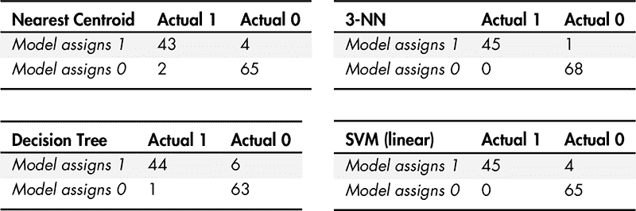

在表 11-3 中，我们看到四个 2 × 2 表格，分别对应于应用于各自模型的测试集：最近质心、3-NN、决策树和线性 SVM。从表格来看，我们看到表现最好的模型是 3-NN，因为它只有一个假阳性，没有假阴性。这意味着该模型从未将真正的恶性病例误判为良性，只是有一次将良性病例误判为恶性。根据我们在上一节的讨论，看到这是一个令人鼓舞的结果。

现在来看一下最近质心模型和决策树模型的结果。这两个模型的整体准确率分别为 94.7%和 93.9%。仅从准确率来看，我们可能会倾向于认为最近质心模型更好。然而，如果我们查看 2 × 2 表格，我们会发现尽管决策树的假阳性（6 个）更多，但它只有一个假阴性，而最近质心模型有两个假阴性。再说一次，在这种情况下，假阴性意味着漏掉了癌症的检测，可能会导致严重后果。因此，对于这个数据集，我们希望尽量减少假阴性，即使这意味着我们需要容忍假阳性稍微增加一点。因此，我们将选择决策树模型而非最近质心模型。

### 从 2 × 2 混淆矩阵中派生的度量指标

查看原始的 2 × 2 表格是有帮助的，但从中派生出的度量指标更为有用。让我们在本节中看几个这样的指标，看看它们如何帮助我们解释 2 × 2 表格中的信息。然而，在我们开始之前，我们应该牢记一点，接下来讨论的度量指标有时会引发争议。关于在何时使用哪些指标，学术界仍然存在积极的讨论。我们在这里的目的是通过示例介绍它们，并描述它们衡量的内容。作为一名机器学习实践者，你会时不时地遇到这些指标，因此至少应该对它们有所了解。

#### 从 2 × 2 表格中派生度量指标

第一个指标直接来自 2 × 2 表中的值：TP、TN、FP、FN。可以将这些看作是最基础的指标。它们计算起来简单，易于理解。回想一下 表 11-2 中 2 × 2 表的一般形式。现在我们将定义另外两个量：

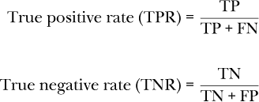

*真阳性率（TPR）* 是模型正确识别实际类别 1 实例的概率。TPR 经常有其他名称：*灵敏度*、*召回率* 和 *命中率*。在医学文献中，通常会称其为 *灵敏度*。

*真负率（TNR）* 是模型正确识别实际类别 0 实例的概率。TNR 也被称为 *特异性*，尤其在医学文献中如此。这两个量作为概率，其值介于 0 和 1 之间；值越高越好。完美的分类器将有 TPR = TNR = 1.0；这发生在它没有犯错时，即 FP = FN = 0，总是如此。

TPR 和 TNR 需要一起理解，以评估一个模型。例如，我们之前提到过，如果类别 1 很少，而模型总是预测类别 0，那么它的准确率会很高。如果我们在这种情况下查看 TPR 和 TNR，就会发现 TNR 为 1，因为模型从未将类别 0 的实例分配到类别 1（FP = 0）。然而，TPR 为 0，原因是一样的，所有实际的类别 1 实例都会被误识别为假阴性；它们会被分配到类别 0。因此，这两个指标一起立即表明该模型并不好。

那么，对于乳腺癌的情况，如果假阴性可能是致命的，我们希望 TPR 和 TNR 在这种情况下应该如何表现呢？理想情况下，当然是希望它们都尽可能高，但如果 TPR 很高而 TNR 较低，我们也可能愿意使用这个模型。在这种情况下，我们知道实际的乳腺癌，出现时几乎总能被检测到。为什么？因为假阴性数量（FN）几乎为 0，因此 TPR 的分母大约是 TP，这意味着 TPR 接近 1.0。然而，如果我们容忍假阳性（模型将实际负实例称为恶性），我们会看到 TNR 可能远低于 1.0，因为 TNR 的分母包括了 FP 数量。

TPR 和 TNR 告诉我们模型识别实际类别 1 和类别 0 实例的可能性。然而，它们并没有告诉我们，我们应该对模型输出的结果有多大的信心。例如，如果模型说“类别 1”，我们应该相信它吗？要做出这样的评估，我们需要从 2 × 2 表中直接得出的另外两个指标：

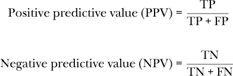

*阳性预测值（PPV）*通常称为*精度*。它是模型预测实例为类别 1 时，实际为类别 1 的概率。同样，*阴性预测值（NPV）*是当模型声明实例为类别 0 时，模型正确的概率。这两个值也是介于 0 和 1 之间的数字，越高越好。

TPR 和 PPV 之间唯一的区别是我们是否在分母中考虑了假阴性或假阳性。通过包括假阳性，即模型预测为类别 1 但实际为类别 0 的实例；我们得到的是模型输出正确的概率。

对于一个总是预测类别 0 的模型，PPV 是未定义的，因为 TP 和 FP 都是零。所有类别 1 的实例都被推入 FN 计数中，而 TN 计数包括所有实际的类别 0 实例。对于 TPR 很高，但 TNR 不高的情况，我们有一个非零的 FP 计数，因此 PPV 会下降。让我们举一个例子来看看为什么会这样，以及我们如何理解它。

假设我们的乳腺癌模型生成了以下 2 × 2 表格（表 11-4）。

**表 11-4：** 一个假设的 2 × 2 表格用于乳腺癌数据集

|  | **实际 1** | **实际 0** |
| --- | --- | --- |
| *模型预测为 1* | 312 | 133 |
| *模型预测为 0* | 6 | 645 |

在这个例子中，我们到目前为止覆盖的指标是

*TPR* = 0.9811

*TNR* = 0.8398

*PPV* = 0.7011

*NPV* = 0.9908

这意味着，模型将 98%的时间正确判断恶性病例为恶性，但只有 84%的时间正确判断良性病例为良性。70%的 PPV 意味着当模型说“恶性”时，只有 70%的概率该病例确实是恶性的；然而，由于较高的 TPR，我们知道在“恶性”输出中几乎包含了所有实际的乳腺癌病例。还要注意，这也意味着高 NPV，所以当模型说“良性”时，我们非常有信心该实例不是乳腺癌。这就是为什么即使 PPV 不到 100%，该模型仍然有用。在临床环境中，当模型说“恶性”时，可能需要进一步测试，但通常如果它说“良性”，则不太可能需要进一步测试。当然，哪些指标的可接受水平取决于模型的使用场景。有些人可能会认为，考虑到错过癌症检测的潜在高成本，仅 99.1%的 NPV 太低。像这样的想法可能也会推动推荐的筛查频率。

我们可以从 2 × 2 表格中轻松推导出两个额外的基本指标：

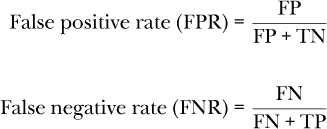

这些指标告诉我们，如果实际类别是类别 0，则样本为假阳性的可能性，或者如果实际类别是类别 1，则样本为假阴性的可能性。FPR 会在后续讨论使用曲线评估模型时再次出现。请注意，FPR = 1 – TNR，FNR = 1 – TPR。

计算这些基本指标是直接的，尤其是如果我们使用之前定义的 `tally_predictions` 函数的输出作为输入（清单 11-2）：

def basic_metrics(tally):

tp, tn, fp, fn, _ = tally

返回 {

"TPR"：tp / (tp + fn)，

"TNR"：tn / (tn + fp)，

"PPV"：tp / (tp + fp)，

"NPV"：tn / (tn + fn)，

(*\pagebreak*)

"FPR"：fp / (fp + tn)，

"FNR"：fn / (fn + tp)

}

*清单 11-2：计算基本指标*

我们将 `tally_predictions` 返回的列表拆分，忽略准确率，然后构建并返回一个包含我们描述的六个基本指标的字典。当然，健壮的代码应该检查分母为零的病态情况，但为了保持清晰度，我们在此省略了相关代码。

#### 使用我们的指标来解释模型

让我们使用 `tally_predictions` 和 `basic_metrics` 来解释一些模型。我们将使用 MNIST 数据的向量形式，但仅保留数字 3 和 5，从而得到一个二分类器。代码类似于我们在第七章中使用的 *mnist_experiments.py*。

仅保留数字 3 和 5 后，我们得到了 11,552 个训练样本（6,131 个 3；5,421 个 5），以及 1,902 个测试样本，其中 1,010 个是 3，892 个是 5。实际代码在 *mnist_2x2_tables.py* 中，选定输出见表 11-5。

**表 11-5：** 从 MNIST 3 vs. 5 模型及其相应的基本指标中选取的输出

| **模型** | **TP** | **TN** | **FP** | **FN** |
| --- | --- | --- | --- | --- |
| *Nearest Centroid* | 760 | 909 | 101 | 132 |
| *3-NN* | 878 | 994 | 16 | 14 |
| *Naïve Bayes* | 612 | 976 | 34 | 280 |
| *RF 500* | 884 | 1,003 | 7 | 8 |
| *LinearSVM* | 853 | 986 | 24 | 39 |
| **模型** | **TPR** | **TNR** | **PPV** | **NPV** | **FPR** | **FNR** |
| --- | --- | --- | --- | --- | --- | --- |
| *Nearest Centroid* | 0.8520 | 0.9000 | 0.8827 | 0.8732 | 0.1000 | 0.1480 |
| *3-NN* | 0.9843 | 0.9842 | 0.9821 | 0.9861 | 0.0158 | 0.0157 |
| *Naïve Bayes* | 0.6851 | 0.9663 | 0.9474 | 0.7771 | 0.0337 | 0.3139 |
| *RF 500* | 0.9910 | 0.9931 | 0.9921 | 0.9921 | 0.0069 | 0.0090 |
| *LinearSVM* | 0.9563 | 0.9762 | 0.9726 | 0.9620 | 0.0238 | 0.0437 |

在表 11-5 中，我们看到顶部是原始计数，底部是本节定义的指标。数据量很大！让我们稍作解析，看看发生了什么。我们将集中在表格底部的指标上。前两列显示了真正例率（敏感度，召回率）和真负例率（特异度）。这些值应该一起考察。

如果我们查看最近质心分类器的结果，可以看到 TPR = 0.8520 和 TNR = 0.9000。在这里，类 1 是五，类 0 是三。所以，最近质心分类器会把它看到的 85% 的五预测为“五”。类似地，它会把它看到的 90% 的三预测为“三”。虽然表现不错，但我们不必为此感到印象深刻。查看下方的列，我们可以看到有两个模型在这些指标上表现非常好：3-NN 和 500 棵树的随机森林。在这两种情况下，TPR 和 TNR 非常相近，并且都接近 1.0。这是模型表现良好的标志。绝对完美的情况是 TPR = TNR = PPV = NPV = 1.0，FPR = FNR = 0.0。我们越接近完美，表现就越好。如果要为这个分类器选择最好的模型，我们可能会选择随机森林，因为它在测试集上最接近完美。

我们简要看看朴素贝叶斯的结果。TNR（特异性）相当高，大约 97%。然而，TPR（灵敏度）只有 68.5%，表现差劲。大致来说，呈现给这个模型的每三个五中，只有两个能被正确分类。如果我们查看接下来的两列，即阳性预测值和阴性预测值，可以看到 PPV 为 94.7%，意味着当模型预测输入为五时，我们可以有一定的信心它是五。然而，负预测值表现不佳，为 77.7%。查看 表 11-5 的上方可以看到此时发生的情况。FP 数量只有 34 个假阳性，来自测试集中的 1010 个三，但 FN 数量很高：280 个五被标记为“三”。这就是该模型低 NPV 的原因。

这是这些指标的一个好经验法则：一个表现良好的模型，TPR、TNR、PPV 和 NPV 应该接近 1.0，而 FPR 和 FNR 应该接近 0.0。

再看一下 表 11-5，特别是随机森林的低指标。正如它们的名称所示，FPR 和 FNR 的值是比率。我们可以利用它们来估算使用该模型时，FP 和 FN 出现的频率。例如，如果我们向模型呈现 *N* = 1000 个实际是三（类 0）的案例，我们可以使用 FPR 来估算模型会将其中多少个判定为五（类 1）：

估计的 FP 数量 = FPR × N = 0.0069(1000) ≈ 7

类似的计算给出了 *N* = 1000 时的 FN 估计数量：真正是 5 的实例：

估计的 FN 数量 = FNR × N = 0.0090(1000) = 9

TPR 和 TNR 也是如此，它们的名称中也有“rate”字样（*N* = 1000 每个实际的三和五）：

估计的 TP 数量 = TPR × N = 0.9910(1000) = 991

估计的 FN 数量 = FNR × N = 0.9931(1000) = 993

这些计算展示了该模型在测试数据上的表现。

### 更高级的指标

在这一节中，让我们看看我随意称之为*更高级的指标*的内容。我之所以称它们为更高级的，是因为它们不是直接使用 2 × 2 表格中的数据，而是基于从表格本身计算出的值构建的。特别地，我们将讨论五个高级指标：知情度、标记度、F1 分数、科恩的卡帕（Cohen's kappa）和马修斯相关系数（MCC）。

#### 知情度和标记度

*知情度*和*标记度*是密切相关的。它们可能不像本节中的其他指标那么知名，但希望未来能更加广泛地被了解。我之前说过，TPR（灵敏度）和 TNR（特异度）应该一起解读。知情度（也称为尤登的*J*统计量）正是这么做的：

知情度 = TPR + TNR − 1

知情度是一个位于[*–*1,+1]范围内的数字，它将 TPR 和 TNR 结合在一起。知情度越高越好。知情度为 0 意味着随机猜测，而知情度为 1 意味着完美（在测试集上）。知情度小于 0 可能意味着模型比随机猜测还差。知情度为–1 表示所有真正的正实例都被标记为负，反之亦然。在这种情况下，我们可以交换模型希望分配给每个输入的标签，并得到一个相当好的模型。只有病态模型才会导致负的知情度值。

标记度将正向和负向预测值结合起来，就像知情度将 TPR 和 TNR 结合起来一样：

标记度 = PPV + NPV − 1

我们看到它与知情度有相同的范围。知情度表明模型在正确标记每个类别的输入方面表现如何。而标记度则表示模型在当它为特定输入分配特定标签时，是否准确无误，无论是类别 0 还是类别 1。随机猜测会得到接近 0 的标记度，完美则接近 1。

我喜欢知情度和标记度各自通过一个数字捕捉了模型表现的关键方面。有些人声称这些指标不受特定类别先验概率的影响。这意味着，如果类别 1 比类别 0 显著不常见，知情度和标记度不会受到影响。有关深入细节，请参见 David Martin Powers 的《评估：从精确度、召回率和 F 度量到 ROC、知情度、标记度和相关性》。

#### F1 分数

*F1 分数*，无论对与错，都被广泛使用，我们应该熟悉它。F1 分数将两个基本指标合并为一个。它的定义是通过精确度（PPV）和召回率（TPR）来直观表达的：

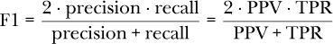

F1 分数是一个位于[0,1]之间的数字，越高越好。这个公式来自哪里？它的形式可能不太直观，但 F1 分数是精确度和召回率的调和平均数。*调和平均*是倒数的倒数的算术平均数。像这样，

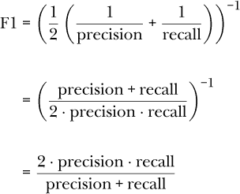

F1 分数的一个批评是，它没有像信息性那样考虑真正负类（通过 TNR）。如果我们看看 PPV 和 TPR 的定义，会发现这两个量完全依赖于 2 × 2 表格中的 TP、FP 和 FN 计数，而不依赖于 TN 计数。此外，F1 分数对精确度和召回率赋予了相同的权重。精确度受假阳性（FP）影响，而召回率受假阴性（FN）影响。从之前的乳腺癌模型中，我们看到假阴性的人工成本远高于假阳性。一些人认为，在评估模型表现时，必须考虑到这一点，实际上应该如此。然而，如果假阳性和假阴性的相对成本相同，F1 分数将更具意义。

#### Cohen’s Kappa

*Cohen’s kappa* 是机器学习中常见的另一项统计指标。它试图考虑到模型可能会因为偶然因素将输入误归到正确的类别。数学上，这个指标定义为：

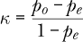

其中 *p*[*o*] 是观察到的准确率，*p*[*e*] 是由偶然性预期的准确率。对于 2 × 2 表格，这些值定义为：

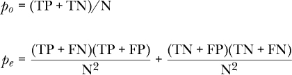

其中 N 是测试集中样本的总数。

Cohen’s kappa 通常介于 0 和 1 之间。0 表示分配的类别标签与给定的类别标签完全不一致。负值表示协议比偶然情况还差。接近 1 的值表示强一致性。

#### Matthews 相关系数

我们最终的指标是 *Matthews 相关系数 (MCC)*。它是信息性和标记性的几何平均数。从这个角度看，它像 F1 分数一样，是将两个指标合并成一个。

MCC 定义为：

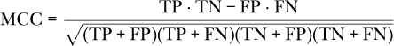

从数学角度看，这相当于信息性和标记性的几何平均数：


MCC 被许多人推崇，因为它考虑了整个 2 × 2 表格的内容，包括两个类别的相对频率（类别的先验概率）。这是 F1 分数没有做到的，因为它忽略了真正负类（TN）。

MCC 是一个介于 0 和 1 之间的数字，数值越高越好。如果只考虑一个指标来评估二分类模型，那么就选 MCC。注意，MCC 的分母中有四个和。如果这些和中有一个为 0，整个分母就会变为 0，这将是一个问题，因为我们无法除以 0。幸运的是，在这种情况下，分母可以用 1 来替代，从而得到一个仍然有意义的结果。表现良好的模型其 MCC 值接近 1.0。

#### 实现我们的指标

让我们写一个函数，从给定的 2 × 2 表格构造这些指标。代码见 Listing 11-3：

from math import sqrt

def advanced_metrics(tally, m):

tp, tn, fp, fn, _ = tally

n = tp+tn+fp+fn

po = (tp+tn)/n

pe = (tp+fn)*(tp+fp)/n**2 + (tn+fp)*(tn+fn)/n**2

return {

"F1"：2.0*m["PPV"]*m["TPR"] / (m["PPV"] + m["TPR"])，

"MCC"： (tp*tn - fp*fn) / sqrt((tp+fp)*(tp+fn)*(tn+fp)*(tn+fn))，

"kappa"： (po - pe) / (1.0 - pe)，

"informedness"：m["TPR"] + m["TNR"] - 1.0，

"markedness"：m["PPV"] + m["NPV"] - 1.0

}

*列表 11-3：计算高级指标*

为了简便起见，我们没有检查 MCC 分母是否为 0，完整实现会检查这一点。

这段代码将计数和基本指标作为参数，并返回一个包含更多高级指标的新字典。让我们来看一下在计算高级指标时，我们从表 11-5 中的 MNIST 示例会是什么样子。

表 11-6 显示了本节针对 MNIST 3 与 5 模型的指标。有几件事值得注意。首先，F1 得分始终高于 MCC 或 Cohen’s kappa。从某种意义上说，F1 得分过于乐观。如前所述，F1 得分没有考虑到真正的负样本，而 MCC 和 Cohen’s kappa 都考虑了。

**表 11-6：** 从 MNIST 3 与 5 模型中选择的输出及相应的高级指标

| **模型** | **F1** | **MCC** | **Cohen’s *κ*** | **知晓度** | **标记度** |
| --- | --- | --- | --- | --- | --- |
| *最近质心* | 0.8671 | 0.7540 | 0.7535 | 0.7520 | 0.7559 |
| *3-NN* | 0.9832 | 0.9683 | 0.9683 | 0.9685 | 0.9682 |
| *朴素贝叶斯* | 0.7958 | 0.6875 | 0.6631 | 0.6524 | 0.7244 |
| *RF 500* | 0.9916 | 0.9842 | 0.9842 | 0.9841 | 0.9842 |
| *线性支持向量机* | 0.9644 | 0.9335 | 0.9334 | 0.9325 | 0.9346 |

另一个需要注意的事情是，表现良好的模型，比如 3-NN 和随机森林，在所有这些指标上都得分很高。当模型表现良好时，F1 得分和 MCC 之间的差异比模型表现较差时要小（例如朴素贝叶斯）。还要注意，MCC 总是位于知晓度和标记度之间，就像几何平均数一样。最后，从表 11-5 和表 11-6 中的值可以看到，表现最佳的模型是随机森林，其 MCC 为 0.9842。

在本节以及前两节中，我们讨论了相当多的指标，并看到了它们如何计算和解释。一个表现良好的模型在所有这些指标上都会得分很高。这是好模型的标志。当我们评估的模型表现不如预期时，指标之间的相对差异，以及指标的含义，才真正发挥作用。那时我们需要考虑特定的指标值，以及模型所犯错误（假阳性和假阴性）所带来的成本。在这些情况下，我们必须根据判断和问题特定的因素来决定最终选择哪个模型。

现在，让我们换个角度，看一下评估模型性能的图形化方法。

### 接收者操作特征曲线（ROC 曲线）

他们说，一张图片胜过千言万语。在这一部分中，我们将了解到，一张图片——更准确地说，一条曲线——的价值可以超过一打数字。也就是说，我们将学习如何将模型的输出转化为一条曲线，从而捕捉到比前几节的度量指标更多的性能。具体来说，我们将了解广泛使用的*接收者操作特征（ROC）曲线*：它是什么，如何绘制，以及如何使用 sklearn 为我们绘制它。

#### 收集我们的模型

为了绘制曲线，我们需要一个能够输出属于类别 1 的概率的模型。在前几节中，我们使用了输出类别标签的模型，以便我们可以统计 TP、TN、FP 和 FN 数量。对于我们的 ROC 曲线，我们仍然需要这些计数，但我们不再使用类别标签作为模型输出，而是需要类别 1 的成员概率。我们将应用不同的阈值来决定给输入数据什么标签。

对我们来说幸运的是，传统的神经网络（以及我们将在第十二章中看到的深度网络）能够输出所需的概率。如果我们使用 sklearn，其他经典模型也可以输出概率估计，但为了简化起见，我们在这里忽略这一点。

我们的测试案例是一个训练好的神经网络系列，旨在区分偶数 MNIST 数字（类别 0）和奇数 MNIST 数字（类别 1）。我们的输入是到目前为止我们在书中使用的数字的向量形式。我们可以使用在第五章中创建的训练和测试数据——我们只需要重新编码标签，使得数字 0、2、4、6 和 8 为类别 0，而数字 1、3、5、7 和 9 为类别 1。通过几行代码就能轻松完成：

```py
old = np.load("mnist_train_labels.npy")

new = np.zeros(len(old), dtype="uint8")

new[np.where((old % 2) == 0)] = 0

new[np.where((old % 2) == 1)] = 1

np.save("mnist_train_even_odd_labels.npy", new)

old = np.load("mnist_test_labels.npy")

new = np.zeros(len(old), dtype="uint8")

new[np.where((old % 2) == 0)] = 0

new[np.where((old % 2) == 1)] = 1

np.save("mnist_test_even_odd_labels.npy", new)
```

目录路径指向存储其他 MNIST 数据的相同位置。我们利用一个事实：当一个偶数被 2 除时，余数总是 0 或 1，具体取决于该数是偶数还是奇数。

我们将测试哪些模型？为了突出各个模型之间的区别，我们将故意训练一些我们知道远非理想的模型。具体来说，我们将使用以下代码生成模型并输出概率估计：

```py
import numpy as np

from sklearn.neural_network import MLPClassifier

def run(x_train, y_train, x_test, y_test, clf):

    clf.fit(x_train, y_train)

    return clf.predict_proba(x_test)

def nn(layers):

    return MLPClassifier(solver="sgd", verbose=False, tol=1e-8,

            nesterovs_momentum=False, early_stopping=False, batch_size=64,

            learning_rate_init=0.001, momentum=0.9, max_iter=200,

            hidden_layer_sizes=layers, activation="relu")

def main():

    x_train = np.load("mnist_train_vectors.npy").astype("float64")/256.0

    y_train = np.load("mnist_train_even_odd_labels.npy")

    x_test = np.load("mnist_test_vectors.npy").astype("float64")/256.0

    y_test = np.load("mnist_test_even_odd_labels.npy")

    x_train = x_train[:1000]

    y_train = y_train[:1000]

    layers = [(2,), (100,), (100,50), (500,250)]

    mlayers = ["2", "100", "100x50", "500x250"]

    for i,layer in enumerate(layers):

        prob = run(x_train, y_train, x_test, y_test, nn(layer))

        np.save("mnist_even_odd_probs_%s.npy" % mlayers[i], prob)
```

代码可以在文件*mnist_even_odd.py*中找到。`run`和`nn`函数应该很熟悉。我们在第十章中使用了几乎相同的版本，其中 `nn` 返回一个配置好的 `MLPClassifier` 对象，`run` 训练分类器并返回测试集上的预测概率。`main` 函数加载训练和测试集，将训练集限制为前 1,000 个样本（大约 500 个偶数和 500 个奇数），然后循环遍历我们将要训练的隐藏层大小。前两个是单一隐藏层网络，分别有 2 个和 100 个节点。最后两个是双隐藏层网络，每层分别有 100 × 50 和 500 × 250 个节点。

#### 绘制我们的度量标准

`clf.predict_proba`的输出是一个矩阵，矩阵的行数与测试样本的数量相等（此处为一万）。矩阵的列数与类别的数量相等；由于我们使用的是二分类器，每个样本有两列。第一列是样本为偶数（类 0）的概率，第二列是样本为奇数（类 1）的概率。例如，某个模型的前 10 个输出如表 11-7 所示。

**表 11-7：** 显示按类别分配的概率及其实际原始类标签的示例模型输出

| **类 0** | **类 1** | **实际标签** |
| --- | --- | --- |
| 0.009678 | 0.990322 | 3 |
| 0.000318 | 0.999682 | 3 |
| 0.001531 | 0.998469 | 7 |
| 0.007464 | 0.992536 | 3 |
| 0.011103 | 0.988897 | 1 |
| 0.186362 | 0.813638 | 7 |
| 0.037229 | 0.962771 | 7 |
| 0.999412 | 0.000588 | 2 |
| 0.883890 | 0.116110 | 6 |
| 0.999981 | 0.000019 | 6 |

第一列是偶数的概率，第二列是奇数的概率。第三列是样本的实际类标签，显示预测是准确的。奇数样本的类 1 概率较高，类 0 概率较低，而偶数样本则正好相反。

当我们从模型在独立测试集上的表现中构建一个 2×2 表格时，我们得到一组 TP、TN、FP 和 FN 数值，从这些数值中我们可以计算出之前章节中提到的所有指标。这包括真正率（TPR，敏感性）和假正率（FPR，等于 1 减去特异性）。表格中隐含了我们用来决定何时将模型输出视为类 1 或类 0 的阈值。在前面的章节中，这个阈值是 0.5。如果输出值≥0.5，我们将样本分配给类 1；否则，将其分配给类 0。有时你会看到这个阈值作为下标形式出现，如 TPR[0.5]或 FPR[0.5]。

从数学角度看，我们可以将从 2×2 表格中计算出的 TPR 和 FPR 视为 FPR（横坐标）与 TPR（纵坐标）平面上的一个点，具体来说，是点(FPR, TPR)。由于 FPR 和 TPR 的值都在 0 到 1 之间，点(FPR, TPR)将位于一个边长为 1 的正方形内，正方形的左下角为(0,0)，右上角为(1,1)。每次我们更改决策阈值时，都会得到一个新的 2×2 表格，从而在 FPR 与 TPR 平面上得到一个新的点。例如，如果我们将决策阈值从 0.5 调整为 0.3，使得每个类 1 概率大于或等于 0.3 的输出被判定为类 1，我们将得到一个新的 2×2 表格和一个新的点(FPR[0.3], TPR[0.3])。当我们系统地将决策阈值从高到低调整时，就会生成一系列点，我们可以将这些点连接起来形成一条曲线。

通过这种方式改变参数生成的曲线称为*参数曲线*。这些点是阈值的函数。我们将阈值称为 *θ*（希腊字母 θ），并将其从接近 1 的值变化到接近 0 的值。这样做可以计算出一组点 (FPR[*θ*], TPR[*θ*])，这些点在绘制时会形成 FPR 与 TPR 平面上的曲线。如前所述，这条曲线有一个名字：接收者操作特征（ROC）曲线。让我们来看一下 ROC 曲线，并探讨这样的曲线能告诉我们什么。

#### 探索 ROC 曲线

图 11-1 显示了具有 100 个节点单隐层的 MNIST 奇偶模型的 ROC 曲线。

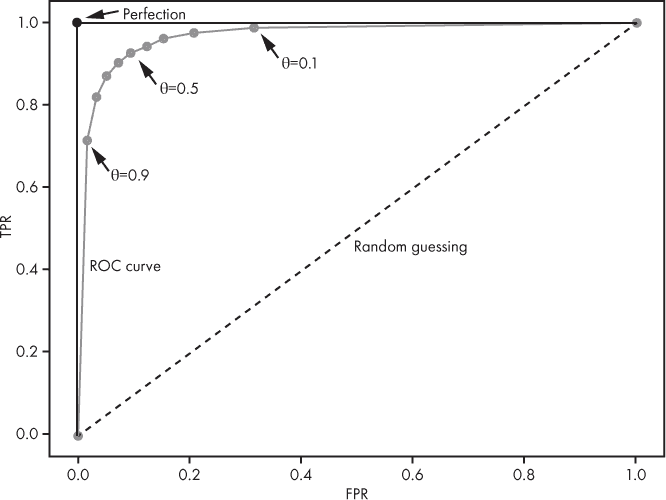

*图 11-1：带有关键元素标记的 ROC 曲线*

标记的点表示给定阈值下的 FPR 和 TPR。虚线是从 (0,0) 到 (1,1) 的对角线。该虚线表示一个随机猜测输出的分类器。我们的曲线越接近这条虚线，模型的表现就越差。如果你的曲线正好重合在这条线的上面，那你不如翻个硬币随机分配标签。任何位于虚线以下的曲线表现*比随机猜测更差*。如果模型完全错误，即它将所有类 1 实例错误地归为类 0，反之亦然，会发生一个奇怪的现象：我们可以通过将所有类 1 输出改为类 0，将所有类 0 输出改为类 1，将完全错误的模型变为一个完全正确的模型。你不太可能遇到这么糟糕的模型。

图 11-1 中的 ROC 曲线在图的左上角标有一个 *完美* 点。这是我们追求的理想。我们希望我们的 ROC 曲线向上并向左移动，朝着这个点靠近。曲线离这个点越近，模型在测试集上的表现就越好。一个完美的模型将有一条 ROC 曲线，先垂直跃升到这个点，然后水平延伸到 (1,1) 点。 图 11-1 中的 ROC 曲线朝着正确的方向前进，代表了一个表现相当不错的模型。

注意标记的*θ*值。我们可以通过调整*θ*选择模型的性能水平。在这种情况下，典型的默认值 0.5 为我们提供了最佳性能，因为该阈值返回的 TPR 和 FPR 具有最佳的平衡点，是图表中离左上角最近的点。然而，也有一些原因我们可能想使用不同的*θ*值。如果我们将*θ*设为较小的值，比如 0.1，我们会沿着曲线向右移动。会发生两件事。首先，TPR 上升到大约 0.99，意味着我们正确地将大约 99%的真实类 1 实例分配给类 1。其次，FPR 也会上升，达到大约 0.32，意味着我们会同时将大约 32%的真实负类（类 0）错误地预测为类 1。如果我们的问题是这样的：我们可以容忍将一些负实例错误地标为“正类”，同时知道我们几乎没有机会犯相反的错误，错误地将正类标为“负类”，那么我们可能会选择将阈值改为 0.1。想想之前的乳腺癌例子：我们绝不希望将一个正类实例误判为“负类”，因此我们容忍更多的假阳性，以确保我们不会误标任何实际的正类。

将阈值(*θ*)调整为 0.9 是什么意思？在这种情况下，我们沿着曲线向左移动，来到了一个具有非常低假阳性率的点。如果我们希望高可信度地知道模型在说“类 1”时，确实是类 1 的实例，我们可能会这样做。这意味着我们希望获得较高的阳性预测值（PPV，精度）。回顾 PPV 的定义：

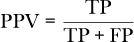

如果假阳性（FP）低，PPV 会很高。将*θ*设置为 0.9，对于任何给定的测试集，FP 都会较低。对于图 11-1 中的 ROC 曲线，将*θ*调整为 0.9 意味着 FPR 约为 0.02，TPR 约为 0.71，PPV 约为 0.97。在*θ* = 0.9 时，当模型输出“类 1”时，模型正确的概率为 97%。相比之下，在*θ* = 0.1 时，PPV 约为 76%。高阈值可以在我们希望肯定找到一个类 1 实例的情况下使用，而不关心是否可能未检测到所有类 1 实例。

改变阈值*θ*会使我们沿 ROC 曲线移动。在此过程中，我们应该期望前一部分的度量指标也会随着*θ*的变化而改变。图 11-2 展示了 MCC 和 PPV 如何随着*θ*的变化而变化。

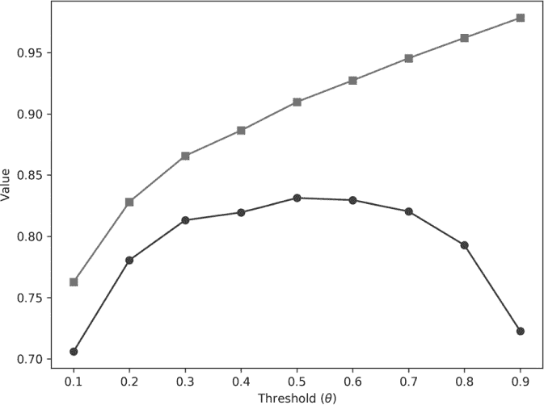

*图 11-2：随着决策阈值(*θ*)变化，MCC（圆圈）和 PPV（方块）如何变化，适用于图 11-1 中的 MNIST 奇偶模型*

在图中，我们看到随着阈值的增加，正预测值（PPV）也在增加。当模型将输入判定为类别 1 时，它变得更加自信。然而，这一变化受到 MCC（马修斯相关系数）变化的影响，正如我们之前所看到的，MCC 是衡量整体模型性能的一个优秀单一指标。在这种情况下，最高的 MCC 出现在 *θ* = 0.5 时，随着阈值的增大或减小，MCC 会下降。

#### 比较模型的 ROC 分析

ROC 曲线为我们提供了大量信息。它对于比较模型非常有用，即使这些模型在架构或方法上有显著差异。然而，在进行比较时，必须小心确保生成曲线的测试集理想情况下是相同的或非常接近的。

让我们使用 ROC 分析来比较我们之前训练的不同 MNIST 奇偶数字模型。我们将看看这是否有助于我们在它们之间做出选择。

图 11-3 显示了这些模型的 ROC 曲线，并附有一个插图，放大了图形的左上角，以便更容易区分不同的模型。每个隐藏层的节点数已标出，以便识别模型。

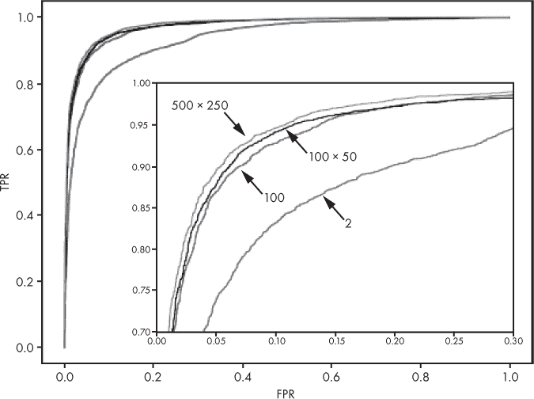

*图 11-3：MNIST 奇偶模型的 ROC 曲线。模型的隐藏层节点数已标出。*

我们立即看到，其中一条 ROC 曲线与其他三条有显著不同。这是具有两个节点的单一隐藏层模型的 ROC 曲线。所有其他的 ROC 曲线都位于它之上。作为一般规则，如果一条 ROC 曲线完全位于另一条曲线之上，则可以认为生成该曲线的模型更优。所有较大的 MNIST 奇偶模型都优于只有两个节点隐藏层的模型。

另外三种模型相互之间差距不大，那我们该如何选择呢？这个决策并不总是那么明确。根据我们关于 ROC 曲线的经验法则，我们应该选择具有 500 和 250 个节点的两层模型，因为它的 ROC 曲线位于其他模型之上。然而，依据具体的使用场景，我们可能会犹豫。这款模型有超过 500,000 个参数，运行它需要用到所有这些参数。而 100 × 50 的模型只有大约 80,000 个参数，少于较大模型的五分之一。我们可能会认为，处理速度的考虑胜过了较大模型在整体性能上的小幅提升，从而选择较小的模型。ROC 分析显示，这样做仅会导致轻微的性能损失。

在通过视觉比较 ROC 曲线时，另一个需要考虑的因素是当假阳性率（FPR）较小时曲线的斜率。一个完美的模型具有垂直斜率，因为它会立即从点 (0,0) 跳到 (0,1)。因此，更好的模型在低 FPR 区域会有更陡峭的 ROC 曲线。

从 ROC 曲线派生的常用指标是其下方的面积。这个面积通常缩写为 *AUC* 或在医学界称为 *Az*。完美的 ROC 曲线具有 AUC 为 1.0，因为该曲线从 (0,0) 跳跃到 (0,1)，然后到 (1,1)，形成一个边长为 1 的正方形，面积为 1。随机猜测的模型（ROC 图中的对角线）的 AUC 为 0.5，即由虚线对角线形成的三角形面积。要计算任意 ROC 曲线下的面积，需要进行数值积分。幸运的是，sklearn 知道如何做到这一点，因此我们不需要自己计算。稍后我们将看到这一点。

人们常常报告 AUC，但随着时间的推移，我越来越不喜欢这种做法。主要原因是 AUC 用一个单一的数字代替了信息量丰富的图形，但不同的 ROC 曲线可能会导致相同的 AUC。如果两条曲线的 AUC 相同，但其中一条曲线偏向右侧，而另一条曲线在低 FPR 区域有一个陡峭的斜率，我们可能会觉得这两个模型的性能大致相当，实际上，具有陡峭斜率的模型可能是我们想要的，因为它能在不过多增加假阳性的情况下达到合理的 TPR。

使用 AUC 时的另一个警告是，即使其他参数发生相当大的变化，AUC 也只会发生小幅变化。这使得人们很难根据 AUC 值做出准确判断，尤其是当 AUC 值仅相差很小的时候。例如，MNIST 偶数/奇数模型在其隐藏层有两个节点时的 AUC 为 0.9373，而包含 100 个节点的模型的 AUC 为 0.9722。两者都远高于 0.9（满分为 1.0），那么，它们是否大致相同呢？我们知道它们并不相同，因为 ROC 曲线清楚地显示出两个节点的模型明显低于另一个模型。

#### 生成 ROC 曲线

现在我们已经准备好学习如何创建 ROC 曲线。获取 ROC 曲线和 AUC 的简单方法是使用 `sklearn`：

```py
import os

import sys

import numpy as np

import matplotlib.pylab as plt

from sklearn.metrics import roc_auc_score, roc_curve

def main():

    labels = np.load(sys.argv[1])

    probs = np.load(sys.argv[2])

    pname = sys.argv[3]

    auc = roc_auc_score(labels, probs[:,1])

    roc = roc_curve(labels, probs[:,1])

    print("AUC = %0.6f" % auc)

    plt.plot(roc[0], roc[1], color='r')

    plt.plot([0,1],[0,1], color='k', linestyle=':')

    plt.xlabel("FPR")

    plt.ylabel("TPR")

    plt.tight_layout(pad=0, w_pad=0, h_pad=0)

    plt.savefig(pname, dpi=300)

    plt.show()
```

该程序读取一组标签及其相关的每类概率，例如上一节代码生成的输出。然后，它调用 sklearn 函数 `roc_auc_score` 和 `roc_curve`，分别返回 AUC 和 ROC 点。ROC 曲线被绘制、保存到磁盘，并显示出来。

我们不需要将 sklearn 作为黑盒使用。我们可以自己快速生成 ROC 曲线的点。我们加载相同的输入，即标签和每类概率，但不调用库函数，而是循环遍历感兴趣的阈值，并为每个阈值计算 TP、TN、FP 和 FN。根据这些值，我们可以直接计算 FPR 和 TPR，从而得到需要绘制的点集。实现这一点的代码很直接：

```py
def table(labels, probs, t):

    tp = tn = fp = fn = 0

    for i,l in enumerate(labels):

        c = 1 if (probs[i,1] >= t) else 0

        if (l == 0) and (c == 0):

            tn += 1

        if (l == 0) and (c == 1):

            fp += 1

        if (l == 1) and (c == 0):

            fn += 1

        if (l == 1) and (c == 1):

            tp += 1

    return [tp, tn, fp, fn]

def main():

    labels = np.load(sys.argv[1])

    probs = np.load(sys.argv[2])

    pname = sys.argv[3]

    th = [0.9, 0.8, 0.7, 0.6, 0.5, 0.4, 0.3, 0.2, 0.1]

    roc = []

    for t in th:

        tp, tn, fp, fn = table(labels, probs, t)

        tpr = tp / (tp + fn)

        fpr = fp / (tn + fp)

        roc.append([fpr, tpr])

    roc = np.array(roc)

    xy = np.zeros((roc.shape[0]+2, roc.shape[1]))

    xy[1:-1,:] = roc

    xy[0,:] = [0,0]

    xy[-1,:] = [1,1]

    plt.plot(xy[:,0], xy[:,1], color='r', marker='o')

    plt.plot([0,1],[0,1], color='k', linestyle=':')

    plt.xlabel("FPR")

    plt.ylabel("TPR")

    plt.savefig(pname)

    plt.show()
```

`main` 函数加载标签和概率。对 `th` 的循环应用不同的阈值，并通过调用 `table` 函数计算当前阈值的 TP、TN、FP 和 FN，将 ROC 点累积到 `roc` 中。

`table`函数遍历每个类别的概率，如果类别 1 的概率大于或等于当前阈值，就为该类别分配标签 1。然后将这个类别分配结果与实际类别标签进行比较，适当的计数器会被递增。

一旦 ROC 点被计算出来，图表就通过在点列表的开始位置添加点 (0,0)，在列表的末尾添加点 (1,1) 来绘制。这样做确保了图表能够覆盖 FPR 值的整个范围。点被绘制并保存到磁盘上。

#### 精确率-召回率曲线

在离开这一部分之前，我们应该提到机器学习中时常会遇到的另一条评估曲线。这就是*精确率-召回率（PR）曲线*。顾名思义，它描绘了 PPV（精确率）和 TPR（召回率，灵敏度）随着决策阈值的变化，就像 ROC 曲线一样。一个好的 PR 曲线应该朝着右上方移动，而不是像好的 ROC 曲线那样朝着左上方移动。这个曲线的点可以通过在 `metrics` 模块中的 `precision_recall_curve` 函数在 sklearn 中轻松生成。

我们不会花时间在这条曲线上，因为它没有考虑真正的负例。考虑一下 PPV 和 TPR 的定义，就可以看出这一点。我对 PR 曲线的偏见源于与我对 F1 分数的偏见相同的原因。由于没有考虑真正的负例，PR 曲线和 F1 分数给出了分类器质量的不完整图像。当真正的正类很少见或真正的负类表现不重要时，PR 曲线确实有用。然而，通常来说，在评估分类器性能时，我认为最好还是坚持使用 ROC 曲线和我们已经定义的度量标准。

### 处理多个类别

到目前为止，我们讨论的所有度量标准仅适用于二分类器。当然，我们知道许多分类器是多分类的：它们输出多个标签，而不仅仅是 0 或 1。为了评估这些模型，我们将把混淆矩阵的概念扩展到多类别情况，并看到我们也可以扩展一些我们已经熟悉的度量标准。

我们需要一些多类别模型的结果来进行工作。幸运的是，MNIST 数据已经是多类别的。回想一下，我们曾经费力地将标签重新编码成二分类数据。这里，我们将使用相同的架构训练模型，但这次我们将保持原始标签不变，这样模型就会输出十个标签中的一个：它为测试输入分配的数字，这是`MLPClassifier`类的`predict`方法的输出。我们不会展示代码，因为它与前一部分的代码相同，只是这次调用的是`predict`而不是`predict_proba`。

#### 扩展混淆矩阵

我们二进制度量的基础是 2×2 混淆矩阵。混淆矩阵可以很容易地扩展到多类别情况。为此，我们让矩阵的行表示实际类别标签，而矩阵的列表示模型的预测。该矩阵是方阵，行和列的数量与数据集中的类别数相同。因此，对于 MNIST 数据集，我们得到了一个 10×10 的混淆矩阵，因为有 10 个数字。

我们从实际的已知测试标签和模型的预测标签中计算混淆矩阵。`sklearn`的`metrics`模块中有一个函数`confusion_matrix`，我们可以使用它，但计算起来足够简单，自己实现也没问题：

```py
def confusion_matrix(y_test, y_predict, n=10):

    cmat = np.zeros((n,n), dtype="uint32")

    for i,y in enumerate(y_test):

        cmat[y, y_predict[i]] += 1

    return cmat
```

这里`n`表示类别的数量，对于 MNIST 数据集，固定为 10。如果需要，我们可以从提供的测试标签中确定它。

代码很简单。输入是实际标签（`y_test`）和预测标签（`y_predict`）的向量，混淆矩阵（`cmat`）通过递增实际标签和预测标签形成的每个可能的索引来填充。例如，如果实际标签是 3，预测标签是 8，那么我们就将 1 加到`cmat[3,8]`。

我们来看一下具有 100 个节点单层隐藏层的模型的混淆矩阵（表 11-8）。

**表 11-8：** 具有 100 个节点单层隐藏层的模型的混淆矩阵

|  | **0** | **1** | **2** | **3** | **4** | **5** | **6** | **7** | **8** | **9** |
| --- | --- | --- | --- | --- | --- | --- | --- | --- | --- | --- |
| **0** | 943 | 0 | 6 | 9 | 0 | 10 | 7 | 1 | 4 | 0 |
| **1** | 0 | 1102 | 14 | 5 | 1 | 1 | 3 | 1 | 8 | 0 |
| **2** | 16 | 15 | 862 | 36 | 18 | 1 | 17 | 24 | 41 | 2 |
| **3** | 3 | 1 | 10 | 937 | 0 | 20 | 3 | 13 | 17 | 6 |
| **4** | 2 | 8 | 4 | 2 | 879 | 0 | 14 | 1 | 6 | 66 |
| **5** | 19 | 3 | 3 | 53 | 13 | 719 | 17 | 3 | 44 | 18 |
| **6** | 14 | 3 | 4 | 2 | 21 | 15 | 894 | 1 | 4 | 0 |
| **7** | 3 | 21 | 32 | 7 | 10 | 1 | 0 | 902 | 1 | 51 |
| **8** | 17 | 14 | 11 | 72 | 11 | 46 | 21 | 9 | 749 | 24 |
| **9** | 10 | 11 | 1 | 13 | 42 | 5 | 2 | 31 | 10 | 884 |

行表示实际的测试样本标签，[0,9]。列是模型分配的标签。如果模型完美，实际标签和预测标签之间会有一一对应的匹配关系。这就是混淆矩阵的主对角线。因此，一个完美的模型会在主对角线处有条目，所有其他元素则为 0。表 11-8 并不完美，但最大数量的值位于主对角线附近。

看一下第 4 行和第 4 列。行和列交汇的地方有值 879。这意味着实际类别是 4 且模型正确预测为“4”的次数为 879 次。如果我们查看第 4 行，我们会看到其他非零数字。每个数字表示实际为 4 的情况被模型错误地标记为其他数字。例如，有 66 次 4 被标记为“9”，但只有一次 4 被标记为“7”。

第 4 列表示模型将输入识别为“4”的情况。如我们所见，它正确识别了 879 次。然而，也有一些其他数字被模型错误地标记为“4”，例如 6 被标记为“4”21 次，1 被错误标记为“4”1 次。没有任何 3 被标记为“4”。

混淆矩阵可以让我们一目了然地看到模型在测试集上的表现。我们可以迅速判断矩阵是否主要沿对角线排列。如果是，说明模型在测试集上表现良好。如果不是，我们需要仔细查看，看看哪些类别被混淆了。对矩阵做出简单调整可能有帮助。我们可以将每行的值除以该行的总和，而不是使用原始计数。这样做可以将计数转换为分数。然后，我们可以将这些分数乘以 100，转换为百分比。这就将混淆矩阵转化为我们称之为*准确度矩阵*的东西。转换过程非常简单：

```py
acc = 100.0*(cmat / cmat.sum(axis=1))
```

这里`cmat`是混淆矩阵。它生成一个准确度矩阵，见表 11-9。

**表 11-9：** 按类别准确度展示的混淆矩阵

|  | **0** | **1** | **2** | **3** | **4** | **5** | **6** | **7** | **8** | **9** |
| --- | --- | --- | --- | --- | --- | --- | --- | --- | --- | --- |
| **0** | **96.2** | 0. | 0.6 | 0.9 | 0. | 1.1 | 0.7 | 0.1 | 0.4 | 0. |
| **1** | 0. | **97.1** | 1.4 | 0.5 | 0.1 | 0.1 | 0.3 | 0.1 | 0.8 | 0. |
| **2** | 1.6 | 1.3 | **83.5** | 3.6 | 1.8 | 0.1 | 1.8 | 2.3 | 4.2 | 0.2 |
| **3** | 0.3 | 0.1 | 1. | **92.8** | 0. | 2.2 | 0.3 | 1.3 | 1.7 | 0.6 |
| **4** | 0.2 | 0.7 | 0.4 | 0.2 | **89.5** | 0. | 1.5 | 0.1 | 0.6 | 6.5 |
| **5** | 1.9 | 0.3 | 0.3 | 5.2 | 1.3 | **80.6** | 1.8 | 0.3 | 4.5 | 1.8 |
| **6** | 1.4 | 0.3 | 0.4 | 0.2 | 2.1 | 1.7 | **93.3** | 0.1 | 0.4 | 0. |
| **7** | 0.3 | 1.9 | 3.1 | 0.7 | 1. | 0.1 | 0. | **87.7** | 0.1 | 5.1 |
| **8** | 1.7 | 1.2 | 1.1 | 7.1 | 1.1 | 5.2 | 2.2 | 0.9 | **76.9** | 2.4 |
| **9** | 1. | 1. | 0.1 | 1.3 | 4.3 | 0.6 | 0.2 | 3. | 1. | **87.6** |

对角线显示了每个类别的准确率。表现最差的类别是 8，准确率为 76.9%，表现最好的类别是 1，准确率为 97.1%。非对角线的元素表示实际类别被模型错误标记为其他类别的百分比。对于类别 0，模型将真实的零类标记为“5”的概率为 1.1%。每行的百分比总和为 100%（四舍五入误差内）。

为什么类 8 表现如此糟糕？查看类 8 的行，我们看到模型将 7.1%的实际 8 实例误判为“3”，并将 5.2%的实例误判为“5”。将 8 与“3”混淆是模型犯的最大错误，尽管 6.5%的类 4 实例也被标记为“9”。稍微反思一下，这些错误就能理解。人们通常会将 8 和 3 或者 4 和 9 混淆吗？这个模型所犯的错误与人类常见的错误类似。

混淆矩阵还可以揭示病态的表现。考虑图 11-3 中的 MNIST 模型，它只有一个隐藏层，并且该层仅有两个节点。它所生成的准确率矩阵显示在表 11-10 中。

我们可以立即看到这是一个性能较差的模型。第五列完全为零，这意味着该模型在任何输入下都不会输出“5”。对于输出标签“8”和“9”也是如此。另一方面，模型倾向于将输入标记为“0”、“1”、“2”或“3”，因为这些列在各种输入数字中都被密集填充。观察对角线，我们看到只有“1”和“3”有较高的概率被正确识别，尽管这些数字中的许多会被标记为“7”。类 8 很少被正确标记（1.3%）。表现不佳的模型通常会有类似这样的混淆矩阵，输出结果奇怪且存在较大的非对角值。

**表 11-10：** 仅有两个节点的隐藏层模型的准确率矩阵

|  | **0** | **1** | **2** | **3** | **4** | **5** | **6** | **7** | **8** | **9** |
| --- | --- | --- | --- | --- | --- | --- | --- | --- | --- | --- |
| **0** | **51.0** | 1.0 | 10.3 | 0.7 | 1.8 | 0.0 | 34.1 | 0.7 | 0.0 | 0.4 |
| **1** | 0.4 | **88.3** | 0.4 | 1.1 | 0.8 | 0.0 | 0.0 | 9.3 | 1.0 | 0.0 |
| **2** | 8.6 | 2.8 | **75.2** | 6.9 | 1.7 | 0.0 | 1.4 | 3.0 | 0.3 | 0.6 |
| **3** | 0.2 | 1.0 | 4.9 | **79.4** | 0.3 | 0.0 | 0.0 | 13.5 | 0.0 | 0.2 |
| **4** | 28.4 | 31.3 | 7.3 | 2.1 | **9.7** | 0.0 | 0.3 | 13.6 | 1.0 | 0.5 |
| **5** | 11.4 | 42.5 | 2.2 | 4.9 | 4.4 | **0.0** | 0.1 | 16.5 | 0.9 | 0.3 |
| **6** | 35.4 | 1.0 | 5.4 | 0.2 | 1.4 | 0.0 | **55.0** | 0.0 | 0.0 | 0.1 |
| **7** | 0.4 | 5.2 | 2.0 | 66.2 | 0.8 | 0.0 | 0.0 | **25.5** | 0.2 | 0.3 |
| **8** | 10.5 | 41.9 | 2.8 | 8.0 | 4.1 | 0.0 | 0.1 | 22.1 | **1.3** | 0.4 |
| **9** | 4.7 | 9.1 | 5.8 | 26.2 | 5.8 | 0.0 | 0.2 | 41.2 | 2.2 | **3.1** |

#### 计算加权准确率

准确率矩阵的对角线元素告诉我们模型的每类准确率。我们可以通过对这些值求平均来计算总体准确率。然而，如果某一类或多类在测试数据中远比其他类更为常见，那么简单的平均可能会产生误导。此时，我们应使用加权平均。加权系数基于每类测试样本的总数与所有测试样本总数的比值。假设我们有三个类别，并且它们在测试集中的频率和每类准确率如表 11-11 所示：

**表 11-11：** 三类模型的假设每类准确率

| **类别** | **频率** | **准确率** |
| --- | --- | --- |
| 0 | 4,004 | 88.1 |
| 1 | 6,502 | 76.6 |
| 2 | 8,080 | 65.2 |

这里我们有 *N* = 4,004 + 6,502 + 8,080 = 18586 个测试样本。然后，每类的权重如表 11-12 所示。

**表 11-12：** 每类权重示例

| 类别 | 权重 |
| --- | --- |
| 0 | 4,004 / 18,586 = 0.2154 |
| 1 | 6,502 / 18,586 = 0.3498 |
| 2 | 8,080 / 18,586 = 0.4347 |

平均准确率可以计算为：

ACC = 0.2154 × 88.1 + 0.3498 × 76.6 + 0.4347 × 65.2 = 74.1

从哲学角度来看，如果我们知道每类的先验概率，应该用它们替代权重。这些概率是真正的类别出现的可能性。然而，如果我们假设测试集的构建较为合理，那么仅使用每类的频率应该是安全的。我们认为，一个合理构建的测试集能够很好地代表真实的先验类别概率。

在代码中，可以通过以下方式简洁地从混淆矩阵中计算加权平均准确率：

```py
def weighted_mean_acc(cmat):

    N = cmat.sum()

    C = cmat.sum(axis=1)

    return ((C/N)*(100*np.diag(cmat)/C)).sum()
```

*N* 是总共测试的样本数量，实际上就是混淆矩阵中所有条目的总和，因为测试集中的每个样本都会落在矩阵中的某个位置，而 *C* 是每类样本数量的向量。这只是混淆矩阵行的总和。每类的准确率（百分比）由混淆矩阵的对角线元素（`np.diag(cmat)`）除以该类在测试集中出现的次数 *C* 计算得到。乘以 100 即可得到百分比准确率。

如果我们将每类的值相加并除以类数，我们将得到（可能会误导的）未加权的平均准确率。相反，我们首先将每类的值乘以 *C*/*N*，即每类占总测试样本的比例（回想一下，*C* 是一个向量），然后求和得到加权准确率。此代码适用于任何大小的混淆矩阵。

对于上一节中的 MNIST 模型，我们计算出加权平均准确率，如表 11-13 所示。

**表 11-13：** MNIST 模型的加权平均准确率

| **架构** | **加权平均准确率** |
| --- | --- |
| 2 | 40.08% |
| 100 | 88.71% |
| 100 × 50 | 88.94% |
| 500 × 250 | 89.63% |

表 11-13 显示了我们之前所见的随着模型大小增加的收益递减现象。一个包含 100 个节点的单层隐藏层模型几乎与一个包含 100 和 50 个节点的双层隐藏层模型相同，而且仅比包含 500 和 250 个节点的更大模型差 1%。而仅有两个节点的隐藏层模型表现较差。由于有 10 个类别，随机猜测的准确率大致为 1/10 = 0.1 = 10%，因此即便是这个非常奇怪的模型，将 784 个输入值（28×28 像素）映射到仅两个节点，然后映射到 10 个输出节点的模型，也比随机猜测的准确率高出四倍。然而，仅凭这一点并不具有误导性，因为，正如我们在 表 11-10 中看到的，这个模型的混淆矩阵相当奇怪。我们显然不希望使用这个模型。对混淆矩阵的仔细考虑是无可替代的。

#### 多类 Matthews 相关系数

2 × 2 混淆矩阵导致了许多可能的度量。虽然可以将其中几个度量扩展到多类情况，但我们这里只考虑一个主要的度量：Matthews 相关系数（MCC）。对于二类情况，我们看到 MCC 是

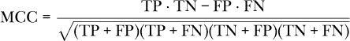

通过使用混淆矩阵中的项，可以将其扩展到多类情况，如下所示

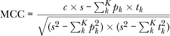

其中

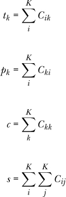

在这里，*K* 是类别的数量，*C* 是混淆矩阵。这个符号来自 sklearn 网站对 MCC 的描述，直接展示了它是如何实现的。我们不需要详细跟随方程式；我们只需知道，MCC 是由混淆矩阵在二类情况和多类情况中构建的。直观地说，这个解释是有道理的。二类 MCC 的值在 [*–*1,+1] 范围内。多类情况下，基于类别数会改变下限，但上限保持为 1.0，因此 MCC 越接近 1.0，模型表现越好。

计算 MNIST 模型的 MCC，正如我们计算加权平均准确率时所做的那样，结果见 表 11-14。

**表 11-14：** MNIST 模型的 MCC

| **架构** | **MCC** |
| --- | --- |
| 2 | 0.3440 |
| 100 | 0.8747 |
| 100 × 50 | 0.8773 |
| 500 × 250 | 0.8849 |

再次，这表明最小的模型性能较差，而其他三个模型在性能上非常相似。然而，进行 10,000 个测试样本预测的时间因模型而异。具有 100 个节点的单隐层模型需要 0.052 秒，而最大的模型需要 0.283 秒，时间是前者的五倍多。如果速度是关键因素，较小的模型可能更为合适。在决定使用哪种模型时，许多因素需要考虑。本章讨论的指标仅作为指南，但不应盲目遵循。最终，只有你自己最清楚什么对你所解决的问题最有意义。

### 总结

在本章中，我们学习了为什么准确率不是衡量模型性能的充分标准。我们学习了如何为二分类器生成 2 × 2 混淆矩阵，以及这个矩阵能告诉我们模型在保留的测试集上的表现。我们从 2 × 2 混淆矩阵中推导出了基本指标，并用这些基本指标推导出更高级的指标。我们讨论了各种指标的实用性，帮助我们建立直觉，理解如何以及何时使用它们。接着，我们了解了接收者操作特征（ROC）曲线，包括它能展示模型的哪些信息以及如何解读它来比较不同的模型。最后，我们介绍了多类混淆矩阵，并举例说明如何解读它，以及如何将一些二分类器指标扩展到多类问题。

在下一章，我们将达到机器学习模型的巅峰：卷积神经网络（CNN）。下一章将介绍 CNN 背后的基本概念；后续章节将通过大量实验使用这一深度学习架构。
