## 第十二章：卷积神经网络介绍**

在本章中，我们将介绍一种新的、有力的方法来处理多维信息。特别是，我们将详细讲解*卷积神经网络*（CNN）的理论及其高级操作，它是现代深度学习的基石。

我们将首先介绍 CNN 发展的动机。卷积是 CNN 的核心，因此它将是接下来的内容。我们将详细讨论卷积操作，特别是它在 CNN 中的应用。接下来，我们将介绍一个基本的 CNN，并解析其结构。我们将使用这个基本的 CNN 架构贯穿本章。在解析完 CNN 后，我们将讲解卷积层的工作原理。然后是池化层，我们将了解它们的作用、带来的好处以及它们需要付出的代价。为了完善对 CNN 基本组件的讨论，我们将介绍全连接层，实际上它们只是传统全连接前馈神经网络的层，就像第八章中所讲的那样。

本章将明显缺少一个话题：训练 CNN 的机制。部分原因是，卷积层引入后，训练过程变得复杂，但主要是因为我们已经在第九章讨论过反向传播，并且我们使用相同的算法来训练 CNN。我们通过训练小批量的平均损失来计算所有层的权重和偏置，并使用反向传播来确定更新权重和偏置所需的导数，以进行每次随机梯度下降步骤。

### 为什么选择卷积神经网络？

CNN 相比传统神经网络有多个优势。首先，CNN 的卷积层所需的参数远少于全连接神经网络，正如我们将在本章后续看到的那样。CNN 需要更少的参数，因为卷积操作在每一层中将参数应用于输入的小子集，而不是像传统神经网络那样一次性应用于整个输入。

其次，卷积神经网络（CNN）引入了*空间不变性*的概念，即能够检测输入中出现的空间关系，而不管它出现在哪里。例如，如果神经网络的输入是一张猫的图片，传统的神经网络会将图像作为一个单一的特征向量输入，这意味着如果猫出现在图像的左上角，网络会学习到猫可以出现在左上角，但不会学习到猫也可以出现在右下角（除非训练数据包含右下角有猫的例子）。然而，对于 CNN，卷积操作可以在图像的任何位置检测到猫的存在。

虽然 CNN 通常用于二维输入，但它们也可以用于一维输入，比如我们之前处理过的特征向量。然而，我们处理过的特征向量，如虹膜测量数据，并没有反映图像中各部分之间的空间关系。与猫的图像不同，它们没有提供卷积操作可以利用的空间信息。这并不意味着 CNN 无法工作，但它可能不是最合适的模型类型。正如往常一样，我们需要了解各种模型类型的工作原理，从而选择最适合当前任务的模型。

**注意** *根据不同的观点，CNN 要么是在 1980 年由福岛开发，用于实现 Neocognitron 模型，要么是在 1998 年由 LeCun 等人开发，并在他们著名的论文《基于梯度的学习应用于文档识别》中提出，截至目前，这篇论文已被引用超过 21,000 次。我的观点是，两者都值得称赞，尽管 LeCun 使用了卷积神经网络（convolutional neural network）或有时称为 convnet 这个词，论文中描述的正是我们在本书中将要使用的内容。Neocognitron 反映了 CNN 中的一些思想，但不是 CNN 本身。*

### 卷积

*卷积*涉及将一个东西滑动到另一个东西上。对我们来说，这意味着将一个*卷积核*，一个小的二维数组，滑过输入数据，这个输入数据可能是 CNN 的输入图像，或者是较低层卷积层的输出。卷积有一个正式的数学定义，但现在它对我们并没有太大帮助。幸运的是，我们的所有输入都是离散的，这意味着我们可以稍微“手动演示”一下。为了简化起见，我们将只关注二维的情况。

#### 使用卷积核进行扫描

*卷积核*是我们在训练过程中要求卷积层学习的内容。它是一个由小的二维数组组成的集合，我们将其在输入数据上滑动。最终，这些卷积核会成为 CNN 中卷积层的权重。

卷积的基本操作是：取输入数据的一个小部分，大小与卷积核相同，用卷积核覆盖它，对这组数字进行某种操作以产生一个输出数字，然后将卷积核移到输入数据的新位置后重复这一过程。卷积核的移动距离称为*步幅*。通常，步幅为 1，意味着卷积核在输入的每个元素上滑动一次。

图 12-1 展示了卷积对 MNIST 数字图像部分的影响。

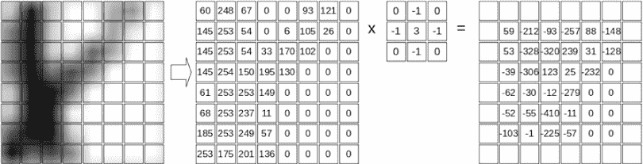

*图 12-1：卷积卷积核与图像*

图 12-1 左侧显示的是图像的一部分，您可以看到一个手写的 8。框表示像素强度，不过为了展示的目的，我们已经扩展了原始图像，因此每个“像素”框中可见多种灰度色调。卷积操作使用的实际像素值如下所示，箭头之后是对应的值。

这里，卷积核是

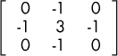

这是我们将滑动覆盖输入像素的一组数字。这是一个 3 × 3 的矩阵，因此我们需要覆盖输入图像的 3 × 3 区域。第一个 3 × 3 区域是左上角，

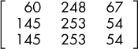

我们说过，卷积是通过卷积核和所覆盖区域作为输入进行操作的。操作非常简单：将对应的条目相乘并求和。寻找卷积的第一个输出值开始于

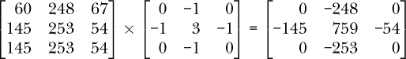

当前面的元素求和后，得到的输出值是

0 + (–248) + 0 + (–145) + 759 + (–54) + 0 + (–253) + 0 = 59

好的，第一次卷积操作的输出是 59。那么我们该如何处理这个数字呢？卷积核是 3 × 3，每边都是奇数。这意味着有一个中间元素，就是其中的 3。输出数组中该中间数字的位置将被替换为输出值，即 59。 图 12-1 展示了卷积的完整输出。果然，当卷积核覆盖左上角时，输出的第一个元素就是 59，位于卷积核的中心。

其余的输出值以完全相同的方式计算，但每次将卷积核移动 1 像素。当到达一行的末尾时，卷积核会移回左侧，但会下移 1 像素。通过这种方式，卷积核会滑过整个输入图像，生成图 12-1 中显示的输出，就像老式模拟电视的扫描线一样。

下一个输出值是

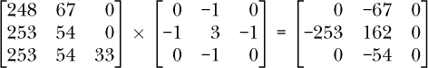

其和为*–* 212，正如我们在图 12-1 的右侧看到的那样。

重复卷积操作会生成图 12-1 中显示的输出。注意输出周围的空框。这些值为空，因为我们 3 × 3 的卷积核的中间部分没有覆盖输入数组的边缘。因此，输出矩阵在每个维度上比输入小两个单位。如果卷积核是 5 × 5，那么边界将是 2 像素宽，而不是 1 像素。

2D 卷积的实现需要对这些边界像素做出决策。这里有几种选择，大多数工具包都支持其中的几种。一种方法是简单地忽略这些像素，并使输出比输入小，正如我们在图 12-1 中所示。这种方法通常被称为*精确*或*有效*，因为我们仅保留实际由操作输出的值。

另一种方法是想象输入图像的周围有一个 0 值的边框。边框的厚度是根据需要的，以便卷积核能够对准输入图像的左上角像素。对于图 12-1 中的示例，这意味着一个 1 像素的边框，因为卷积核是 3×3 的，卷积核中心的两侧各有一个元素。如果卷积核是 5×5，那么边框将是 2 像素，因为卷积核中心的两侧各有两个元素。这种做法被称为*零填充*，它产生的输出与输入图像的大小相同。这样一来，卷积一个 28×28 像素的 MNIST 数字图像与一个 3×3 的卷积核时，输出仍然是 28×28 像素，而不是如图 12-1 中那样得到一个 26×26 像素的输出。

如果我们对图 12-1 中的示例图像进行零填充，我们可以像这样填充第一个空的输出方块。

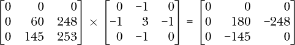

结果加和为*–* 213。这意味着在图 12-1 中输出矩阵的左上角（当前为空的方框）可以被*–* 213 替代。类似地，其余的空方框也将有相应的值，卷积操作的输出将是 28×28 像素。

#### 图像处理的卷积

当卷积应用于神经网络时，有时被视为一种神奇的操作，这使得卷积神经网络能够做出它们所能做到的精彩事情。这在某种程度上是正确的，但卷积操作绝对不是新鲜事物。即使我们完全忽略数学，单纯考虑二维图像的离散卷积，我们也会发现图像科学家在卷积被应用于机器学习之前几十年就已经在图像处理中使用卷积了。

卷积操作可以用于各种图像处理。例如，考虑图 12-2 中显示的图像。

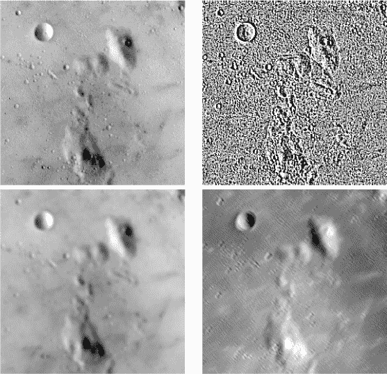

*图 12-2：应用于图像的 5×5 卷积核*

原始的月球图像位于左上角。其他三个图像是将月球图像与不同的 5×5 卷积核进行卷积后的输出。从右上角开始按顺时针方向移动，卷积核分别强调边缘、对角线结构（从左上到右下），或是模糊输入图像。所有这些都是通过改变卷积核中的值来实现的，但卷积操作保持不变。

从机器学习的角度来看，卷积方法的优势部分来自于参数的节省。如果一个模型能够学习一组卷积核，那么它需要学习的数字集合比全连接模型的权重集合要小。这本身就是一件好事。卷积可以提取图像中的其他信息，例如其缓慢变化的部分（图 12-2 的模糊）、其快速变化的部分（图 12-2 的边缘），甚至是沿特定方向的部分（图 12-2 的对角线），这意味着模型能够洞察输入内容。而且，由于我们将卷积核在图像上滑动，因此我们不依赖于这些结构在图像中出现的*位置*。

### 卷积神经网络的结构

医学生通过解剖尸体来学习解剖学，看看各个部分及其相互关系。类似地，虽然挑战性较小，我们将从 CNN 的主体开始，展示其基本架构，然后拆解它，学习每个组件是什么以及它的功能。

图 12-3 展示了我们的主体。这是 Keras 工具包用于训练一个分类 MNIST 数字模型的默认示例 CNN。我们将在本章余下部分以它作为标准。

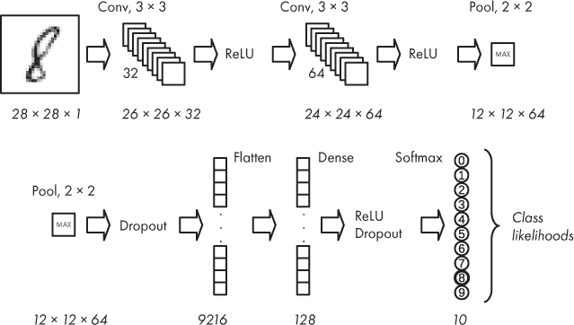

*图 12-3：基本卷积神经网络的架构*

我们如何解读这张图？像传统的神经网络一样，CNN 也有输入和输出。在这种情况下，输入是左上角的数字图像。然后网络从左到右流动，按照箭头的方向。顶部行结束时，网络继续进入下一行。请注意，为了展示的目的，我们将顶部行末尾的层复制并放置在下一行的开头。

数据流继续沿着底行，从左到右，直到到达输出。这里的输出是一个 softmax 层，用来给出每个可能数字的概率，正如我们在第十章的传统神经网络中看到的那样。

#### 不同类型的层

每个箭头之间是网络的一层。我们首先注意到，与传统的神经网络不同，CNN 有许多种类的层。我们在这里列出它们，我们将逐一讨论每一种：

+   卷积（*Conv*）

+   ReLU

+   池化（*Pool*）

+   Dropout

+   扁平化

+   密集层

我们应该注意到，我们使用的是 Keras 中层的命名方式。例如，Keras 使用 *Dense* 来表示许多其他工具包称为 *fully connected* 或甚至 *InnerProduct* 的层。

这些层中的几个应该已经很熟悉了。我们知道 ReLU 层实现了一个整流线性单元，它对每个输入进行判断，看看它是否大于或小于 0。如果输入小于 0，输出为 0；否则，输出就是输入值。我们可以用数学公式表示为

ReLU(*x*) = max(0, *x*)

其中，*max*函数返回其两个参数中的最大值。

同样，我们在第九章中提到过 dropout。Dropout 在训练过程中随机选择一定比例的输出，并将它们设置为 0。这为网络提供了一种强大的正则化形式，帮助网络学习输入数据的有意义表示。我们的基本 CNN 中有两个 dropout 层。第一个使用 25%的概率，这意味着在训练中的每次小批量传递时，大约 25%的输出将被设置为 0。第二个 dropout 层使用 50%的概率。

*Flatten*层和*Dense*层是老朋友，尽管我们通常不是将它们视为独立的实体，而是以其他名字来认识它们。我们传统的前馈神经网络使用全连接层来处理一维向量。在这里，Flatten 和 Dense 一起实现了一个全连接层。Flatten 层接收其输入——通常是一个四维数组（我们稍后会看到为什么）——并将其转换为一个向量。它的工作方式类似于我们在构建 MNIST 数据集的向量形式时所做的操作，我们将每一行的像素首尾相接，从而展开二维图像。Dense 层实现了一个传统的神经网络层，其中每个输入值映射到 Dense 层的每个节点。通常，Dense 层的输出会传递给另一个 Dense 层或 softmax 层，让网络进行预测。

在内部，许多 CNN 层期望四维数组作为输入，并产生四维数组作为输出。第一维是小批量中的输入数量。因此，如果我们有一个包含 24 个样本的小批量，那么四维数组的第一维将是 24。

第二维和第三维被称为*高度*和*宽度*。如果一层的输入是模型的输入（比如一张图像），那么这些维度实际上就是图像的高度和宽度。如果输入实际上是某一层的输出，比如一个（尚未描述的）卷积层的输出，*高度*和*宽度*指的是将卷积核应用于某个输入后的输出。例如，图 12-1 中的输出具有 26 的高度和宽度。

最后一维是通道的数量，如果是输入图像；或者如果是卷积层或池化层的输出，则是*特征图*的数量。图像中的通道数量就是带的数量，灰度图像有一个带，而彩色图像通常有三个带，分别代表红色、绿色和蓝色。有些彩色图像还包含一个 alpha 通道，用来指定像素的透明度，但这些通道通常在将图像输入 CNN 之前被丢弃。

图 12-1 中的输出被称为*特征图*，因为它是通过将一个卷积核作用于输入后得到的响应。正如我们在图 12-2 中看到的，将卷积核作用于图像可以提取图像中的特征，因此卷积层使用的卷积核的输出被称为*特征图*。

这剩下两个层需要研究：*卷积层*和*池化层*。这些层是新的。

在我们的基础卷积神经网络（CNN）中，卷积操作作用于二维输入的集合，*集合*指的是一堆二维数组，其中第三维是通道数或特征图的数量。这意味着，与本书中我们之前讨论的其他模型不同，这里的输入真的是完整的图像，而不是从图像中创建的向量。然而，就 CNN 而言，卷积操作不仅仅局限于二维输入。三维卷积存在，一维卷积也有，尽管这两者相比于二维卷积较少使用。

池化层用于通过根据某些规则组合输入值来减少其空间维度。最常见的规则是*最大池化*，即保留小块中最大值，其余值被丢弃。我们将在本章详细讨论池化层。

现代网络可以使用许多其他类型的层，其中许多层已经在 Keras 中得到直接支持，尽管你也可以添加自定义层。这种灵活性是 Keras 通常迅速支持新的深度学习发展的原因之一。与传统神经网络一样，为了让一个层具有可以学习的权重，该层需要在数学意义上可微分，以便链式法则能够继续应用，从而计算偏导数来学习如何在梯度下降过程中调整权重。如果上一句不清楚，是时候复习一下第九章的反向传播部分了。

#### 将数据通过 CNN 传递

我们再来看一下图 12-3。这里发生了很多事情，不仅仅是层的顺序和名称。许多层在底部有以斜体显示的数字，这些数字表示该层输出的维度，即高度、宽度和特征图的数量。如果层只有一个数字，则它输出一个包含该数字元素的向量。

CNN 的输入是一个 28 × 28 × 1 的图像。卷积层的输出是一组特征图。因此，第一个卷积层的输出是 26 × 26 × 32，意味着有 32 个特征图，每个特征图是从单一的 28 × 28 × 1 输入图像计算出来的 26 × 26 图像。类似地，第二个卷积层的输出是 24 × 24 × 64，这是从 26 × 26 × 32 的输入中衍生出来的 64 个特征图，而这个输入本身是第一个卷积层的输出。

我们看到第一行末尾的池化层，它将 24 × 24 × 64 的输入缩小为 12 × 12 × 64。“max”标签告诉我们池化操作的内容；它取输入中的一个 2 × 2 区域，并返回其中的最大值。由于输入是 2 × 2，并且返回一个值，这将每个 24 × 24 的输入缩小为 12 × 12 的输出。这个过程应用于每个特征图，因此输出是 12 × 12 × 64。

看图 12-3 底部一行，我们看到 Flatten 层将池化层的 12 × 12 × 64 的输出转化为一个 9,216 元素的向量。为什么是 9,216？因为 12 × 12 × 64 = 9,216。接下来，Dense 层有 128 个节点，最后，输出的 softmax 层有 10 个节点，因为有 10 个类别，即数字 0 到 9。

在图 12-3 中，ReLU 和 Dropout 层下方没有数字。这些层不会改变它们输入的形状。它们只是对每个元素执行某些操作，无论形状如何。

我们基本的卷积神经网络（CNN）中的卷积层有其他数字与之相关：“3 × 3”和“32”或“64”。3 × 3 表示卷积核的大小，而 32 或 64 则表示特征图的数量。

我们之前提到了池化层中的 2 × 2 部分。这表示池化核的大小，它类似于卷积核，滑动在输入上，一个特征图接一个特征图（或者逐通道滑动），以减少输入的大小。使用 2 × 2 池化核意味着通常输出的大小会在行和列维度上分别是输入的一半。

图 12-3 有一些熟悉的部分，但呈现方式对我们来说是新的，并且我们有一些神秘的新层需要思考，比如卷积层和池化层，因此我们现在的理解可能会有些模糊。这完全没问题。我们获得了新的想法和一些可视化的提示，帮助我们理解它们是如何联系在一起构成 CNN 的。现在，这些就是我们所需要的。本章的其余部分，希望能给你带来一系列的“啊哈！”时刻，当你回顾这张图及其各个部分时，你会发现每个部分的作用。理解了它们的功能后，你就会明白它们在处理链中，如何从图像输入到输出 softmax 预测的过程中，处于什么位置。

### 卷积层

如果我们关于卷积的讨论在前面的部分就结束了，我们虽然理解了基本的操作，但仍然不清楚一个 CNN 中的卷积层究竟是如何工作的。考虑到这一点，我们来看一下卷积思想是如何在 CNN 的卷积层的输入和输出之间进行推广的。

#### 卷积层的工作原理

卷积层的输入和输出都可以看作是二维数组（或矩阵）的堆叠。卷积层的操作最好通过一个简单的示例来说明，展示如何将输入数组堆栈映射到输出堆栈。

在我们展示示例之前，需要先介绍一些术语。我们之前用一个核对输入进行卷积操作，其中核和输入都是二维的。我们将继续使用*核*这一术语来指代这个单一的二维矩阵。然而，在实现卷积层时，我们很快会发现我们需要一堆核，这些通常在机器学习中被称为*滤波器*。滤波器是由多个核堆叠而成的。通过它的核，滤波器应用到输入堆栈上，产生输出堆栈。由于在训练过程中模型学习的是核，所以可以说模型也在学习滤波器。

对于我们的示例，输入是一个由两个 5 × 5 数组构成的堆栈，核的大小是 3 × 3，我们希望输出堆栈有三层。为什么是三层？因为作为 CNN 架构的设计者，我们认为学习三个输出将帮助网络更好地完成当前的任务。卷积操作决定了每个输出数组的宽度和高度；我们选择深度。我们将使用有效卷积，丢失输出边缘一像素的厚度，意味着输入的宽度和高度将分别减少 2。因此，一个 5 × 5 的输入经过一个 3 × 3 的核卷积后，会得到一个 3 × 3 的输出。

这解释了维度的变化，但我们如何从一个包含两个数组的堆栈变成一个包含三个数组的堆栈呢？将 5 × 5 × 2 的输入映射到所需的 3 × 3 × 3 的输出的关键在于训练过程中学习到的核集合，也就是滤波器。让我们看看这个滤波器是如何为我们提供所需的映射的。

我们假设此时已经知道滤波器，每个滤波器都是一个 3 × 3 × 2 的核堆栈。通常情况下，如果输入堆栈中有*M*个数组，并且我们希望输出堆栈有*N*个数组，使用一个*K* × *K*的核，那么我们需要一组*N*个滤波器，每个滤波器都是*M*深的*K* × *K*核的堆叠。让我们来探讨一下为什么。

如果我们将堆栈拆开，以便清楚地看到每个元素，我们的输入堆栈看起来是这样的：

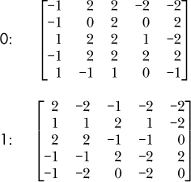

我们有两个 5 × 5 的矩阵，标记为 0 和 1。它们的值是随机选择的。

为了得到一个深度为三的输出堆栈，我们需要一组三个滤波器。每个滤波器中的核堆栈深度为二，以便与输入堆栈中的数组数量相匹配。核本身是 3 × 3 的，所以我们有三个 3 × 3 × 2 的滤波器，每个核与对应的输入数组进行卷积。这三个滤波器是：

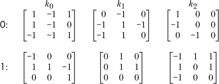

我们在这里添加了 0 和 1 标签，以显示哪些核应用于哪些输入堆栈数组。我们还添加了一个偏置向量，正如传统神经网络层一样。这个向量是每个核堆栈的一个值，我们在最后加上它，以帮助调整卷积层的输出与数据对齐，就像我们在传统神经网络层中所做的那样。偏置为层增加了一个自由度——它为学习提供了更多的东西，帮助层从数据中学习到尽可能多的信息。在我们的示例中，偏置向量是*b* = *{1,0,2}*，是随机选择的。

为了得到输出堆栈，我们将每个滤波器的每个核与相应的输入数组进行卷积，求得结果输出的元素和，并加上偏置值。对于滤波器*k*[0]，我们将第一个输入数组与第一个核卷积得到：

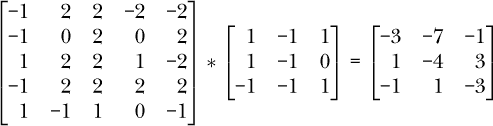

请注意，我们使用*来表示完整的卷积操作，这是一个相当标准的表示方法。我们对*k*[0]中的第二个核重复这一操作，将其应用到输入的第二个数组：

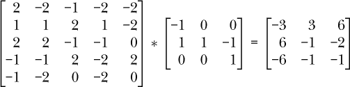

最后，我们将两个卷积输出相加，并加入偏置值：

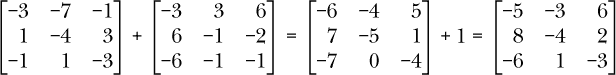

这给我们带来了第一个输出数组，即将滤波器*k*[0]应用于输入堆栈的结果。

我们对滤波器*k*[1]和*k*[2]重复这个过程，以获得它们的输出，从而得到给定输入的最终卷积层输出。

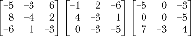

我们将堆叠的数组并排写出，得到一个 3 × 3 × 3 的输出，正如我们所期望的那样。

我们的卷积层示例将一个 5 × 5 × 2 的输入映射到一个 3 × 3 × 3 的输出。如果我们天真地使用一个全连接层，反而需要一个包含 50 × 27 = 1350 个权重的权重矩阵，这些权重需要被学习。相比之下，卷积层每个滤波器只用了 3 × 3 × 2 个权重，并且使用了三个滤波器，总共只有 54 个权重（不包括偏置值）。这是一种显著的减少。

#### 使用卷积层

上述示例向我们展示了卷积层是如何工作的。现在让我们看看一个卷积层的效果。假设我们已经训练了图 12-3 中显示的网络，因此我们已经有了运行未知图像所需的权重和偏置值。（你将在《Keras 与 MNIST 实验》章节中看到如何训练 CNN。）

网络的第一层在图 12-3 中是一个卷积层，它将一个 28 × 28 × 1 的输入——单通道灰度数字图像——映射到一个 26 × 26 × 32 的输出，使用的是具有 32 个 3 × 3 核的滤波器。因此，我们知道，输入图像和输出之间的权重适合于一个 3 × 3 × 1 × 32 的数组：3 × 3 是核的大小，1 是输入通道数，32 是滤波器中核的数量。

训练后，滤波器的 32 个 3 × 3 核实际长什么样？我们可以从训练好的模型中提取它们，并将它们作为 32 个 3 × 3 矩阵打印出来。以下是前两个：

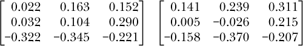

这很不错，但对于构建关于核的作用的直觉帮助不大。

我们还可以通过将矩阵转换为图像来可视化滤波器的核。为了将核转换为图像，我们首先注意到所有的核值恰好都在 [*–*0.5,+0.5] 范围内，因此，如果我们将每个核值加上 0.5，就将范围映射到 [0,1]。之后，乘以 255 将核值转换为字节值，这与灰度图像使用的值相同。此外，值为 0 时，变为 127，即中灰色值。

在完成此转换后，核可以作为灰度图像显示，其中负值核接近黑色，正值核接近白色。然而，还需要一个最后的步骤，因为映射后的核仍然仅是 3×3 像素。最后一步是将 3 × 3 的图像放大到 64×64 像素。我们将以两种不同的方式进行放大。第一种方式使用最近邻采样来显示核的块状效果。第二种方式使用 Lanczos 滤波器，这种方法平滑图像，使得核的方向更加清晰。图 12-4 显示了核图像，顶部是块状版本，底部是平滑后的版本。

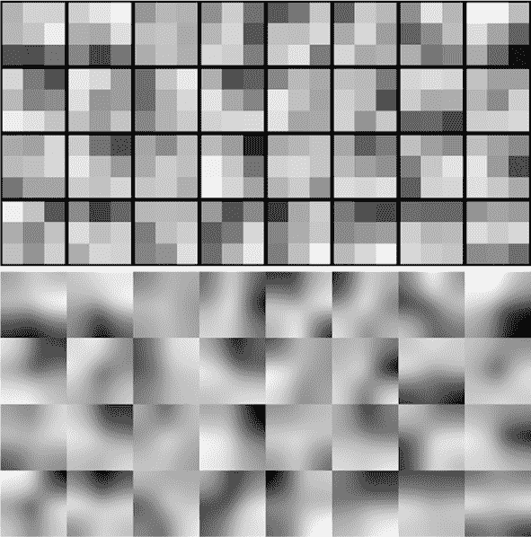

*图 12-4：第一卷积层的 32 个学习到的核（顶部）。平滑版本，以更清晰地显示方向（底部）。*

这些图像表示了模型中图 12-3 第一卷积层学习到的 32 个核。图像中包含了足够的细节，暗示这些核选择了特定方向上的结构，就像图 12-2 右下方图像中所示的核一样，它强调了对角线结构。

现在让我们将注意力转向核的效果。核对输入的 MNIST 图像有什么作用？我们可以通过对每个核与样本（这里是“3”）进行卷积，运行一个样本 MNIST 图像，并按照类似于生成前面核图像的过程进行。结果是 32 个 26 × 26 的图像，我们再次将它们放大到 64 × 64 后进行显示。图 12-5 显示了结果。

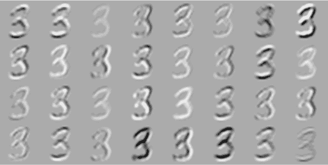

*图 12-5：应用于样本 MNIST 输入的 32 个核*

图 12-4 中显示的卷积核顺序与图 12-5 中的图像相匹配。例如，图 12-4 右上方的图像显示了一个卷积核，左上角是浅色，右下角是深色，这意味着它将检测沿从左下到右上的对角线的结构。将这个卷积核应用到样本中的输出是图 12-5 右上角的图像。我们可以看到，这个卷积核增强了主要沿从左下到右上的对角线的三个部分。请注意，这个例子很容易理解，因为输入是一个单通道的灰度图像。这意味着我们之前在更通用的操作中看到的，跨通道对卷积核输出的求和并不存在。

通常，CNN 的第一个卷积层学习的卷积核选择特定的方向、纹理，或者如果输入图像是 RGB 格式，则是颜色。对于灰度 MNIST 图像，方向最为重要。在 CNN 的更高卷积层中学习的卷积核也会选择某些特征，但卷积核选择*什么*特征的解释变得越来越抽象，也更难以理解。值得注意的是，CNN 第一个卷积层学习的卷积核与哺乳动物大脑中视觉处理的第一层非常相似。这一层是初级视觉皮层或 V1 层，用于检测线条和边缘。此外，请始终记住，卷积层和池化层的组合是为了学习一种新的特征表示：输入图像的新的表示方式。这种新的表示方式更好地分离了不同的类别，以便全连接层可以更容易地区分它们。

#### 多个卷积层

大多数 CNN 有多个卷积层。这样做的一个原因是，随着网络层级的加深，逐渐构建出受输入图像更大部分影响的特征。这引出了*感受野*和*有效感受野*的概念。这两个概念相似且常常被混淆。我们可以通过查看图 12-6 来解释这两个概念。

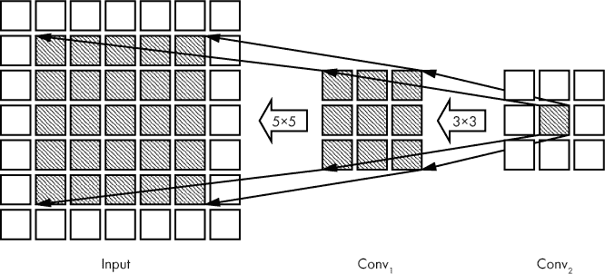

*图 12-6：感受野*

该图展示了两个卷积层的*输出*以及模型的输入。我们仅显示了输出的相关部分，使用的是 3 × 3 的卷积核。我们还忽略了滤波器的深度，因为感受野（定义如下）在卷积层输出的深度上是相同的。

图 12-6 应从右至左阅读，如箭头所示。这与数据通过网络的流动方向相反。这里，我们回顾早期的层，查看它们是如何影响高层的输出值的。方框表示输出值。最右边的阴影方框是 Conv[2]的输出之一。这是我们回顾并查找影响该值的起点。箭头指向 Conv[1]的输出，这些输出影响 Conv[2]中的阴影值。Conv[2]中的值具有一个 3 × 3 的*感受野*，因为它直接受到 Conv[1]中 3 × 3 阴影输出的影响。这就是我们定义*感受野*的方式：来自上一层的直接影响当前层输出的所有输出集合。

如果我们看一下直接影响 Conv[1]的 3 × 3 阴影区域的输入值集合，我们会看到一个 5 × 5 区域。这是合理的：Conv[1]的每个阴影输出都有一个 3 × 3 的感受野。感受野是 3 × 3，因为 Conv[1]的卷积核是 3 × 3 的。它们有重叠，因此阴影的 5 × 5 输入区域影响着所有 Conv[1]的阴影输出。

再次看看最右边的阴影输出值。如果我们追溯到输入，找到所有可能影响它的值，我们会看到输入的 5 × 5 区域能够影响该输出值。这个输入区域就是 Conv[2]最右边阴影输出的*有效感受野*。最终，这个输出值响应的是输入图像最左边阴影区域发生的情况。随着 CNN 层数的加深，添加了更多的卷积层，我们可以看到有效感受野如何变化，从而使得更深的卷积层处理的是来自输入的更大部分的值。

#### 初始化卷积层

在第九章中，我们看到传统神经网络的性能受学习权重和偏差的随机初始化方式的强烈影响。卷积神经网络（CNN）也同样如此。回想一下，卷积层的权重是卷积核的值，它们在反向传播过程中被学习，就像传统神经网络的权重一样。在我们设置网络时，需要一种智能的方式来初始化这些值。幸运的是，传统神经网络的最佳初始化方法同样适用于卷积层。例如，Keras 默认使用 Glorot 初始化，正如我们在第九章中看到的，这在其他工具包中有时被称为 Xavier 初始化。

现在让我们从卷积层转向池化层。这些层虽然较为简单，但它们执行着重要的（尽管有些争议的）功能。

### 池化层

我们最喜欢的图示，图 12-3，展示了在前两个卷积层之后的池化层。这个池化层输入的是一个 24 × 24 × 64 的栈，输出的是一个 12 × 12 × 64 的栈。池化部分标记为“2 × 2”。这里到底发生了什么？

关键在于“2 × 2”。这意味着，对于每个 64 个 24 × 24 的输入，我们将一个 2 × 2 的滑动窗口在输入上滑动，并执行类似于卷积的操作。图 12-3 中没有明确指出的是，步长也是 2，以使得滑动窗口每次跳跃两个位置，从而避免重叠。这通常是这样，但并非必须如此。由于池化操作是对栈中的每个输入执行的，输出保持栈的大小不变。这与卷积层的常见做法相反。

让我们来看一下应用于栈中单个输入的池化操作，这个输入是一个 24 × 24 的矩阵。图 12-7 展示了这里发生了什么。

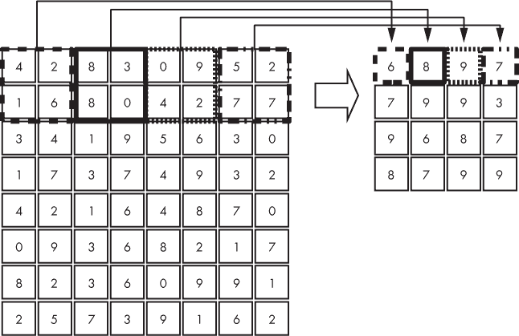

*图 12-7：对一个 8 × 8 输入应用 2 × 2 最大池化*

前两个 2 × 2 的值被映射到第一个输出值。然后我们向右移动两个位置，将下一个 2 × 2 区域映射到输出，依此类推，直到整个输入被映射。对每个 2 × 2 区域执行的操作由 CNN 的架构师决定。最常见的操作是“选择最大值”，也就是*最大池化*，这在图 12-7 中展示的就是这种操作。这也是图 12-3 中模型正在执行的操作。另一种相对常见的池化操作是对值进行平均。

从图 12-7 中我们可以看到，8 × 8 的输入矩阵被映射到一个 4 × 4 的输出矩阵。这解释了为什么图 12-3 中的池化层输出是 12 × 12；每个维度的大小是输入的一半。

池化操作很直接，但它会丢失信息。那么为什么还要做池化呢？池化的主要动机是减少网络中值的数量。通常，随着深度的增加，卷积层使用的滤波器数量也会增加，这是设计上的一种做法。即使是在图 12-3 这个简单的网络中，我们也可以看到，第一层卷积层有 32 个滤波器，而第二层有 64 个滤波器。因此，第二层卷积层输出的是 24 × 24 × 64 = 36,864 个值，但经过 2 × 2 池化后，只有 12 × 12 × 64 = 9,216 个值，减少了 75%。需要注意的是，我们这里讨论的是数据在网络中流动时的值的数量，而不是层中学习到的参数数量。图 12-3 中的第二个卷积层有 3 × 3 × 32 × 64 = 18,432 个学习参数（忽略偏置值），而池化层没有学习参数。

输出值数量的减少，也就是我们对输入的表示，加速了计算，并充当了正则化器，以防止过拟合。第九章中的正则化技术和原理对 CNN 同样适用。然而，由于池化会丢失信息，并选择代理来表示表示的整个区域（卷积层输出），它改变了输入部分之间的空间关系。这种空间关系的丧失对于某些应用可能至关重要，正是这个原因促使像 Geoffrey Hinton 这样的人通过引入其他类型的网络（搜索“胶囊网络”）来消除池化操作。

具体来说，Hinton 在 Reddit 上回答关于池化层的问题时，谈到了他对机器学习的最具争议的看法：

卷积神经网络中使用的池化操作是一个重大错误，池化操作之所以效果良好，实际上是一场灾难。如果池化不重叠，池化将丢失有关物体位置的宝贵信息。我们需要这些信息来检测物体各部分之间的精确关系。

他在回答中进一步阐述，指出允许池化操作重叠的确以一种粗略的方式保留了一些空间关系。一个重叠的池化操作可能是使用 2 × 2 的窗口，就像我们在图 12-7 中使用的那样，但步长使用 1 而不是 2。

尽管有这些顾虑，池化层仍然是目前 CNN 不可或缺的一部分，但在将它们添加到模型中时要小心。现在我们继续讨论 CNN 的顶层，即完全连接层。

### 完全连接层

在图 12-3 的第二行中，所有以*Flatten*开头的层构成了模型的完全连接层。图中使用的是 Keras 术语；许多人称*Dense*层为完全连接层，并假设它包含一个 Flatten 操作，以及激活（ReLU）和在 softmax 层之前的可选 Dropout 操作。因此，图 12-3 中的模型只有一个完全连接层。

我们之前已经说过，卷积层和池化层的总体效果是将输入特征（比如图像）的表示转化为一种更容易供模型推理的形式。在训练过程中，我们要求网络学习输入的另一种、通常是更紧凑的表示，以帮助模型在处理未见过的输入时表现得更好。对于图 12-3 中的模型，直到包括池化层（以及其后的 Dropout 层用于训练）的所有层，都是为了学习输入图像的新表示。在这种情况下，完全连接层就是模型：它将采用这种新表示，并最终基于它进行分类。

全连接层就是全连接的。对于图 12-3 的最终池化层（9,216 个元素，即 12 × 12 × 64 = 9,216）与具有 128 个元素的 Dense 层之间的权重，与构建传统神经网络时一样。这意味着在训练期间需要学习 9,216 × 128 = 1,179,648 个权重加上额外的 128 个偏置值。因此，在图 12-3 模型的 1,199,882 个参数（权重和偏置）中，98.3% 在最终池化层和全连接层之间的过渡中。这说明了一个重要的观点：全连接层在需要学习的参数方面是*昂贵*的，就像它们对于传统神经网络一样。理想情况下，如果特征学习层，即卷积和池化层，能够很好地完成它们的工作，我们可能只需要一个或两个全连接层。

全连接层除了内存使用之外，还有一个可能影响其效用的缺点。为了看清楚这个缺点是什么，请考虑以下情景：你希望能够在灰度图像中定位数字。简单起见，假设背景是黑色的。如果你使用在 MNIST 数字上训练的图 12-3 模型，你将得到一个非常擅长识别在 28×28 像素图像中居中的数字的模型，但是如果输入图像很大，并且你不知道图像中数字的位置，更不用说有多少个数字了，那么情况就变得更有趣了。图 12-3 的模型期望输入图像的尺寸为 28×28 像素，仅限于这个尺寸。在 第十三章 中，我们将详细讨论这个问题作为一个实验，但现在，让我们讨论全卷积层，这是在 CNN 中使用全连接层时的一个可能解决方案的不利之处。

### 完全卷积层

在上一节中，我说图 12-3 的模型期望输入图像的尺寸为 28×28 像素，仅限于这个尺寸。让我们看看为什么。

这个模型中有许多种类的层。像是 ReLU 和 dropout 层这样的层对通过网络流动的数据的维度没有影响。但是卷积、池化和全连接层则不同。让我们逐个看看这些层，看它们如何与输入图像的维度相关联。

卷积层实现卷积。根据定义，卷积涉及将一个固定大小的卷积核滑动到某个输入图像上（这里纯粹考虑二维情况）。在这个操作中没有任何东西指定输入图像的大小。图 12-3 中的第一层卷积输出是 26 × 26 × 32。32 来自架构选择的滤波器数量。26 × 26 来自在 28 × 28 输入上使用 3 × 3 卷积核且没有填充的结果。如果输入图像是 64×64 像素，那么这一层的输出将是 62 × 62 × 32，而且我们无需对网络架构做任何改变。CNN 的卷积层对输入的空间维度是无关的。

图 12-3 中的池化层接受一个 24 × 24 × 64 的输入，并生成一个 12 × 12 × 64 的输出。正如我们之前看到的，池化操作与卷积操作非常相似：它在空间上滑动一个固定大小的窗口，并生成一个输出；在这个例子中，输出的维度是输入的一半，同时深度保持不变。同样，这个操作中没有任何东西固定输入栈的空间维度。如果输入栈是 32 × 32 × 64，那么这个最大池化操作的输出将是 16 × 16 × 64，而不需要改变架构。

最后，我们有了全连接层，它将 12 × 12 × 64 = 9,216 的池化输出映射到一个 128 元素的全连接（Dense）层。如我们在第八章中看到的，全连接神经网络在其实现中使用了层之间的权重矩阵。池化层的输出中有 9,216 个元素，而全连接层中有固定的 128 个元素，因此我们需要一个 9,216 × 128 的矩阵。这个大小*是*固定的。如果我们使用一个更大的输入图像，比如 32 × 32，经过池化层后，输出大小将是 14 × 14 × 64 = 12,544，这将需要一个现有的 12,544 × 128 的权重矩阵来映射到全连接层。当然，这行不通；我们训练的网络使用的是 9,216 × 128 的矩阵。CNN 的全连接层固定了 CNN 的输入大小。如果我们能够绕过这一点，那么我们就可以对 CNN 应用任何大小的输入，前提是内存允许。

我们可以天真地做法是，简单地将一个 28 × 28 的窗口滑动到更大的输入图像上，将每个 28×28 像素的图像通过我们训练的模型进行处理，然后输出一个更大的映射，其中每个像素现在都有该数字存在的概率。数字有 10 个，因此我们将有 10 个输出映射。这个滑动窗口方法当然是有效的，但它非常计算密集，因为许多简单的算法实现通常都是如此。

幸运的是，通过将全连接层转换为等效的卷积层，我们可以将模型转换为*完全卷积网络*，从而获得更好的效果。在完全卷积网络中，没有全连接层，我们不再受限于使用固定的输入大小。当网络完全卷积时，输入大小与输出之间的关系将在第十三章中讨论，但基本操作是查看最后一个标准卷积或池化层的大小，并用相同大小的卷积核替换后续的全连接层。

在图 12-3 中，池化层的输出是 12 × 12 × 64。因此，与我们之前看到的将输入大小固定的 128 元素全连接层不同，我们可以通过将全连接层转换为 12 × 12 × 128 的卷积层来进行数学上的等效计算。将 12 × 12 的卷积核与 12 × 12 的输入进行卷积，最终会得到一个单一的数字。因此，12 × 12 × 128 的卷积层输出将是一个 1 × 1 × 128 的数组，在功能上与我们最初使用的 128 个全连接层输出相同。此外，12 × 12 的卷积核与 12 × 12 的输入进行卷积的操作，实际上就是将卷积核的值与输入的值逐元素相乘并求和。这正是全连接层在每个节点上所做的工作。

当以这种方式使用卷积层时，我们并没有在参数数量上节省任何东西。从图 12-3 中我们可以看到这一点。池化层输出的 9,216 个元素与全连接层的 128 个节点相乘，意味着我们需要 9,216 × 128 = 1,179,648 个权重和 128 个偏置项，这些是全连接层和完全卷积层都需要的参数。转向 12 × 12 × 128 的卷积层时，我们需要学习 12 × 12 × 64 × 128 = 1,179,648 个权重，和之前相同。然而，现在我们也可以自由地改变输入大小，因为 12 × 12 × 128 的卷积层将自动对更大的输入进行卷积，从而输出代表网络应用于输入 28 × 28 区域的结果，步幅由网络的具体架构决定。

完全卷积网络来源于 2014 年 Long、Shelhamer 和 Darrell 的论文《用于语义分割的完全卷积网络》（“Fully Convolutional Networks for Semantic Segmentation”），截至目前，这篇论文已被引用超过 19,000 次。术语*语义分割*指的是将一个类别标签分配给输入图像的每一个像素。目前，用于语义分割的常用架构是 U-Net（参见 Ronneberger、Fischer 和 Brox 的 2015 年论文《U-Net：用于生物医学图像分割的卷积网络》），该架构在医学领域取得了广泛的成功。

我们已经讨论了主要的 CNN 层，即图 12-3 中所示的层。虽然还有很多其他层我们可以介绍，但它们通常超出了我们在这个层次上所要呈现的内容，唯一的例外是批量归一化（batch normalization），我们将在第十五章中进行实验。新的层类型不断被加入，通常是响应于活跃的研究项目。然而，最终的核心层包含了我们在本章中讨论的层。现在让我们继续，看看一个训练好的 CNN 如何处理未知输入。

### 步骤解析

在前面的章节中，我们讨论了我们的示例 CNN 的架构和层次，见图 12-3。在这一节中，我们将演示网络的操作，看看它如何响应两个新输入，一个是“4”，另一个是“6”。我们假设网络已经完全训练好了；我们将在第十三章中真正进行训练。

输入图像通过模型逐层传递

输入 → 卷积[0] → 卷积[1] → 池化 → 全连接 → Softmax

使用训练好的权重和偏置来计算每一层的输出。我们将这些称为*激活值*。第一卷积层的输出是 32 个 26 × 26 的图像堆叠，这是输入图像对每个 32 个卷积核的响应。这个堆叠随后传递到第二卷积层，生成 64 个 24 × 24 的输出。注意，两层卷积层之间有一个 ReLU 操作，它会将输出中的负值裁剪为 0。这样做为数据流经网络时增加了非线性。如果没有这个非线性，两层卷积层的净效果就相当于一个单独的卷积层。通过 ReLU 强加的非线性，我们使得这两层卷积层能够学习到数据的不同特征。

第二个 ReLU 操作将 64 个 24 × 24 的输出转换为 0 或正值。接下来，2 × 2 的最大池化操作将 64 个输出的大小减少到 12 × 12。之后，一个标准的全连接层从 12 × 12 激活值的 9,216 个值中生成 128 个输出值作为一个向量。随后，通过 Softmax 计算出一组 10 个输出值，每个数字对应一个输出。这些输出值代表了网络对输入图像应分配哪个类别标签的信心。

我们可以通过显示输出图像来说明激活值：第一卷积层为 26 × 26，第二卷积层为 24 × 24，池化层为 12 × 12。为了展示全连接层的激活值，我们可以制作一个由 128 根条形图组成的图像，每根条形图的强度代表向量值。图 12-8 展示了我们两个样本数字的激活值。

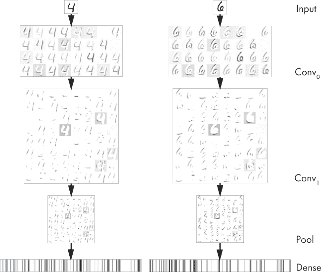

*图 12-8：每层模型激活值。输出是反转的：较暗表示激活值更强。*

请注意，图像已经反转，因此较暗的部分对应更强的激活值。我们没有显示 softmax 输出。这些值是

|  | 0 | 1 | 2 | 3 | 4 | 5 | 6 | 7 | 8 | 9 |
| --- | --- | --- | --- | --- | --- | --- | --- | --- | --- | --- |
| 4 | 0.00 | 0.00 | 0.00 | 0.00 | 0.99 | 0.00 | 0.00 | 0.00 | 0.00 | 0.00 |
| 6 | 0.00 | 0.00 | 0.00 | 0.00 | 0.00 | 0.00 | 0.99 | 0.00 | 0.00 | 0.00 |

表示在这两种情况下，模型对应该分配的类别标签非常有信心，且事实上它是正确的。

回顾图 12-8，我们看到第一个卷积层的输出仅仅是单个输入图像（灰度图）和该层卷积核的响应。这让我们想起了图 12-2，在那里我们看到卷积可以用来突出输入图像的某些特征。经过 ReLU 操作后，第二个卷积层的 64 个滤波器的响应，每个滤波器是 32 个卷积核的堆叠，似乎在从输入图像中选取不同的部分或笔划。这些可以看作是构成输入图像的小组件集。第二次 ReLU 和池化操作保留了第二卷积层输出的大部分结构，但将大小缩小至原来的四分之一。最后，全连接层的输出展示了从输入图像中派生的模式，这是我们期望比原始图像输入更容易分类的新表示。

图 12-8 中的全连接层输出是彼此不同的。这引出了一个问题：对于四个和六个数字的多个实例，这些输出是什么样的？即使在这些值中，我们是否可以看到某些共同点？我们可能会期待看到共同点，因为我们知道这个网络已经过训练，并且在测试集上取得了超过 99%的高准确率。让我们来看看将来自测试集的十个“4”和十个“6”图像输入网络，并比较全连接层的激活值。这给出了图 12-9。

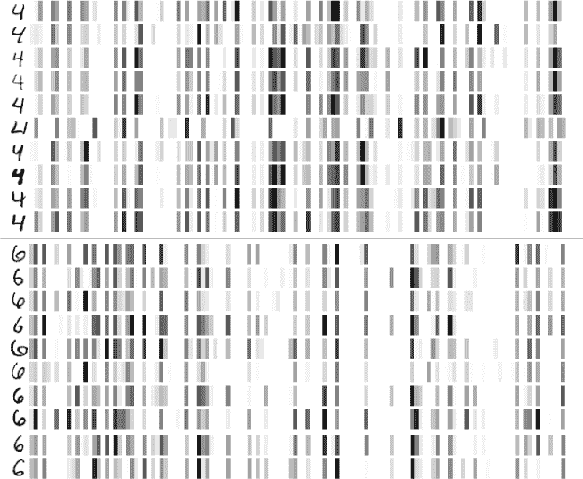

*图 12-9：4 和 6 的十个实例的全连接层激活值。输出被反转：较暗意味着更强的激活。*

左侧是模型的实际输入。右侧是全连接层中 128 个输出的表示，这些输出将输入 softmax 层。每个数字都有一个特定的模式，这个模式在每个数字中都是共同的。然而，也有一些变化。中间的“4”有一个非常短的笔画，我们看到它在全连接层中的表示与其他所有示例不同。尽管如此，模型仍然成功地将其识别为“4”，且置信度为 0.999936。

图 12-9 提供了证据，证明模型在输入表示方面学到了我们希望它学到的东西。softmax 层将稠密层的 128 个元素映射到 10 个输出节点，从这些输出节点计算 softmax 概率。实际上，这是一个没有隐藏层的简单传统神经网络。这个更简单的模型成功地正确标记了图像，因为输入的新表示在分离类别方面做得更好，甚至一个简单的模型也能做出可靠的预测。它之所以成功，还因为训练过程同时优化了这个顶层模型的权重和生成输入的低层模型的权重，从而相互强化。有时你会在文献中看到这个被称为*端到端*训练。

我们可以通过查看 MNIST 测试数据的稠密层激活的图来证明特征更好地分离这一说法。当然，我们不能查看实际的图形，因为我不知道如何可视化 128 维的图，但并非一切都失去了。机器学习社区创造了一个强大的可视化工具叫做*t-SNE*，幸运的是，它是 sklearn 的一部分。这个算法智能地将高维空间映射到低维空间，包括 2D。如果我们将一千张随机选择的 MNIST 测试图像输入模型，然后将结果的 128 维稠密层激活值通过 t-SNE 处理，我们可以生成一个 2D 图，其中类别之间的分离反映了在 128 维空间中的实际分离。图 12-10 是结果。

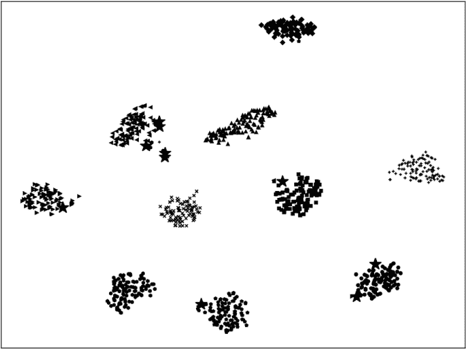

*图 12-10：模型如何按类别分离测试样本（t-SNE 图）*

在这个图中，每个类别使用不同的图形符号。如果模型没有正确分类样本，它会显示为更大的星号。在这种情况下，只有少数样本被错误分类。按类别类型的分离非常明显；模型已经学会了一个表示，使得在大多数情况下可以轻松决定正确的类别标签。我们可以很容易地在 t-SNE 图中数出 10 个不同的簇。

### 总结

在本章中，我们介绍了卷积神经网络的主要组成部分。由于能够从空间关系中学习，这些是现代深度学习的主力网络，特别是在视觉任务中。我们通过一个分类 MNIST 数字的模型，详细讲解了新的处理层，包括卷积层和池化层。然后，我们了解到 CNN 的全连接层是我们在前几章中学习的传统神经网络的类似物。

接下来，我们学习了如何修改全连接层，以便能够处理更大的输入。最后，我们观察了当一个样本图像通过网络时，网络生成的激活情况，并看到了卷积层和池化层如何协同工作，产生输入的新的表示，这有助于在特征空间中分离类别，从而实现高准确率。

在下一章，我们将继续探讨卷积神经网络（CNN），但不同于理论部分，我们将通过实际例子来展示网络的各个参数，以及训练过程中使用的超参数，如何影响模型的性能。这将帮助我们建立未来使用 CNN 时的直觉。
