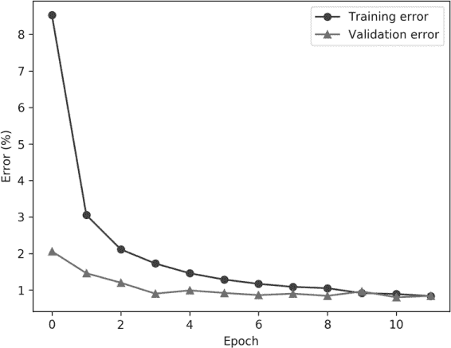
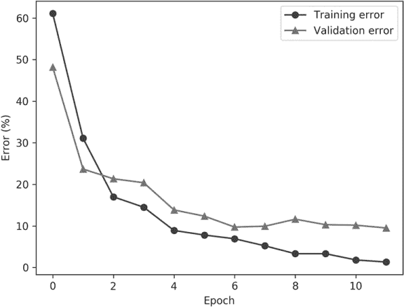
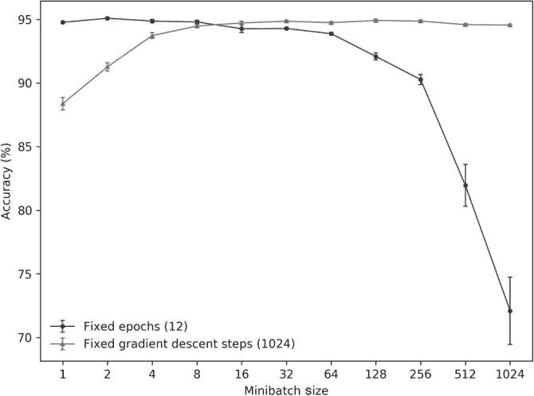
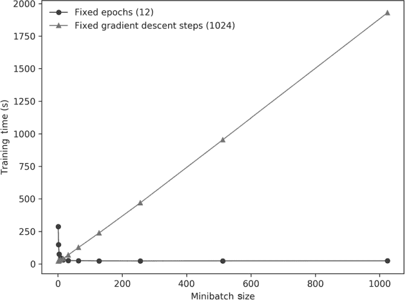
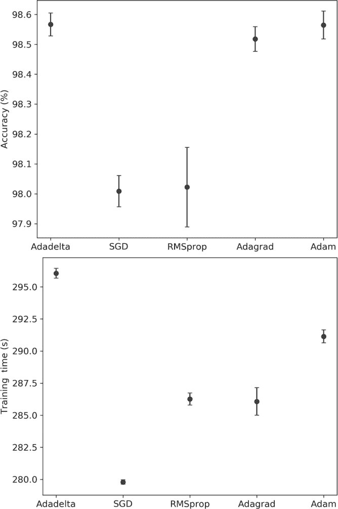
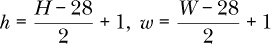
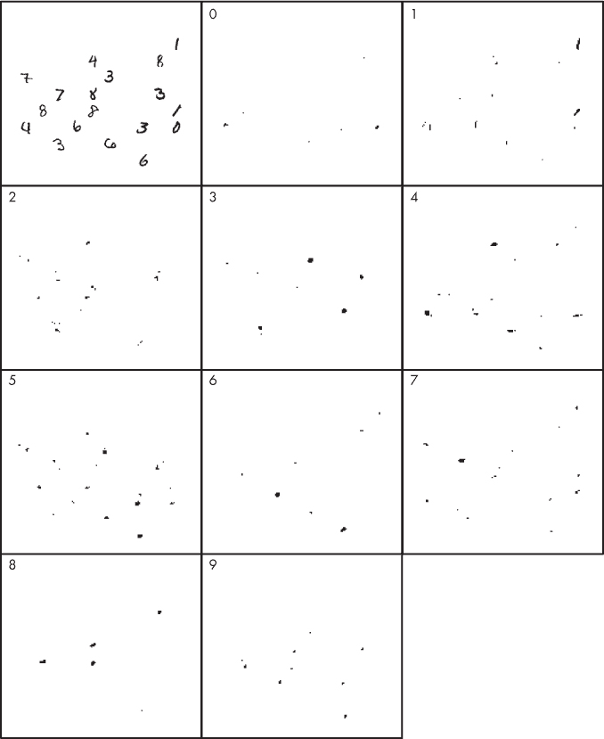
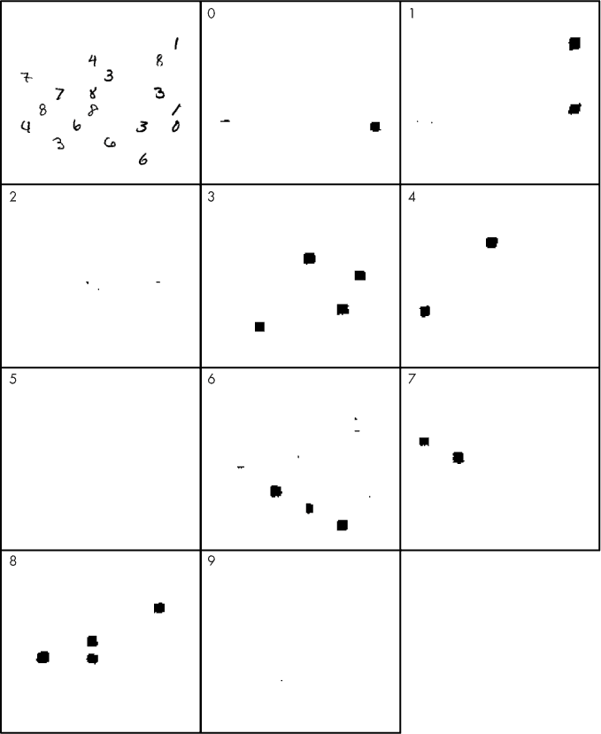
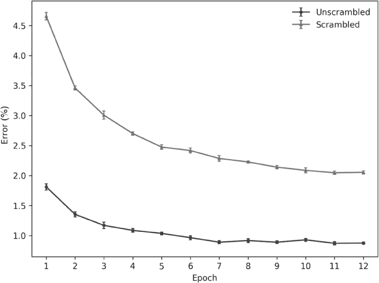

## 第十三章：在 Keras 和 MNIST 上的实验**


在上一章，我们介绍了卷积神经网络（CNN）的基本组件和功能。在本章中，我们将使用来自第十二章的测试模型。我们将首先学习如何在 Keras 中实现并训练该模型。然后，我们将进行一系列实验，以帮助我们直观理解不同的架构和学习参数选择如何影响模型的表现。

接下来，我们将超越简单输入图像的分类，将网络扩展为一个完全卷积的模型，能够处理任意输入并定位输入中出现的数字。

在完全卷积网络之后，我们将进一步深入深度学习的池塘，并履行在第七章中做出的承诺：我们将探索 CNN 在经过混乱处理的 MNIST 数字实验中的表现。我们在第十章中看到，打乱数字的像素使得我们几乎无法看清楚数字是什么，但对传统神经网络解读数字的能力几乎没有影响。CNN 是否也一样？我们将揭晓答案。

### 在 Keras 中构建 CNN

来自图 12-3 的模型可以使用 `keras` 库在 Python 中直接实现。我们将首先列出代码，解释它，然后运行代码查看输出结果。代码自然分为三部分。第一部分加载 MNIST 数据并将其配置为 Keras 使用；第二部分构建模型；第三部分训练模型并将其应用于测试数据。

#### 加载 MNIST 数据

清单 13-1 是我们代码的第一部分。

import keras

from keras.datasets import mnist

from keras.models import Sequential

from keras.layers import Dense, Dropout, Flatten

from keras.layers import Conv2D, MaxPooling2D

from keras import backend as K

batch_size = 128

num_classes = 10

epochs = 12

img_rows, img_cols = 28, 28

❶ (x_train, y_train), (x_test, y_test) = mnist.load_data()

❷ 如果 K.image_data_format() == 'channels_first':

x_train = x_train.reshape(x_train.shape[0], 1, img_rows, img_cols)

x_test = x_test.reshape(x_test.shape[0], 1, img_rows, img_cols)

input_shape = (1, img_rows, img_cols)

else:

x_train = x_train.reshape(x_train.shape[0], img_rows, img_cols, 1)

x_test = x_test.reshape(x_test.shape[0], img_rows, img_cols, 1)

input_shape = (img_rows, img_cols, 1)

❸ x_train = x_train.astype('float32')

x_test = x_test.astype('float32')

x_train /= 255

x_test /= 255

❹ y_train = keras.utils.to_categorical(y_train, num_classes)

y_test = keras.utils.to_categorical(y_test, num_classes)

*清单 13-1：加载和数据预处理*

Keras 是一个相当大的工具包，包含许多模块。我们首先导入库，然后从中导入特定的函数。`mnist` 模块让我们可以访问 Keras 中的 MNIST 数据；`Sequential` 模型类型用于实现卷积神经网络（CNN）。我们的 CNN 将需要一些特定的层，正是我们在图 12-3 中看到的层：Dense、Dropout、Flatten、Conv2D 和 MaxPool2D，所有这些都需要导入。Keras 支持许多其他层；我鼓励你花些时间深入阅读它们的文档页面：*[`keras.io/`](https://keras.io/)*。

接下来，我们设置学习参数，包括训练轮数、类别数和小批量大小。这里有 10 个类别，图像是 28×28 像素的灰度图像。像在 sklearn 中一样，在 Keras 中，你指定的是训练轮数（完整的训练集迭代次数），而不是应处理的小批量数量。Keras 会自动按每轮训练时的小批量大小处理整个训练集——这里是每次处理 128 个样本。回想一下，MNIST 的训练集包含 60,000 个样本，所以每轮至少有 60,000/128 = 468 个小批量，使用整数除法。如果 Keras 使用余数处理不完整的小批量，那么每轮将有 469 个小批量。记住，每个小批量处理都会导致一次梯度下降步骤：即网络参数的更新。

在加载 MNIST 训练和测试数据 ❶ 后，会有几行代码可能一开始看起来有点神秘 ❷。Keras 是一个高级工具包，可能使用不同的低级后端。在我们的案例中，后端是 TensorFlow，我们已经在第一章中安装了它。不同的后端期望以不同的形式接收模型输入。`image_data_format` 函数返回一个字符串，指示底层工具包期望看到卷积层的通道数或滤波器数的位置。TensorFlow 后端返回 `channels_last`，意味着它期望图像以 H × W × C 的 3D 数组表示，其中 H 是图像高度，W 是图像宽度，C 是通道数。对于像 MNIST 这样的灰度图像，通道数是 1。❷ 处的代码将输入图像重新格式化，以匹配 Keras 所期望的格式。

接下来的代码块将字节图像值转换为范围为 [0,1] 的浮动点数 ❸。这是对输入数据进行的唯一缩放，这种类型的缩放在处理图像的 CNN 中很常见。

最后，`to_categorical` 函数用于将 `y_test` 中的类别标签映射为独热编码（one-hot）向量表示 ❹，这是 Keras 所期望的标签格式。正如我们将看到的，模型有 10 个输出，所以映射到一个包含 10 个元素的向量；除了与 `y_test` 中标签对应的索引位置的元素为 1 之外，其他元素都为 0。例如，`y_test[333]` 是类别 6（数字“6”）。在调用 `to_categorical` 后，`y_test[333]` 会变成

```py
array([0.,0.,0.,0.,0.,0.,1.,0.,0.,0.], dtype=float32)
```

其中所有条目都是 0，除了索引 6 处是 1。

#### 构建我们的模型

在数据集预处理完成后，我们可以构建我们的模型。代码示例 Listing 13-2 构建了我们在 Figure 12-3 中以图形方式定义的完全相同的模型。

model = Sequential()

model.add(Conv2D(32, kernel_size=(3, 3),

activation='relu',

input_shape=input_shape))

model.add(Conv2D(64, (3, 3), activation='relu'))

model.add(MaxPooling2D(pool_size=(2, 2)))

model.add(Dropout(0.25))

model.add(Flatten())

model.add(Dense(128, activation='relu'))

model.add(Dropout(0.5))

model.add(Dense(num_classes, activation='softmax'))

model.compile(loss=keras.losses.categorical_crossentropy,

optimizer=keras.optimizers.Adadelta(),

metrics=['accuracy'])

print("Model parameters = %d" % model.count_params())

print(model.summary())

*Listing 13-2: 构建 MNIST 模型*

Keras 将模型定义为 `Sequential` 类的一个实例。通过向该实例添加层来构建模型，因此所有的 `add` 方法调用都是在添加新层。`add` 方法的参数是新添加的层。层是从输入端到输出端逐层添加的，因此我们需要首先添加使用 3 × 3 卷积核对输入图像进行卷积的 2D 卷积层。请注意，我们没有指定图像数量或小批量大小；Keras 会在模型构建并训练时处理这些。现在，我们正在定义模型的架构。

使用 Figure 12-3 中定义的架构，第一个层是 `Conv2D` 层。第一个参数是过滤器的数量，这里是 32。卷积核大小给出为元组 `(3,3)`。卷积核不一定是正方形的，因此它有宽度和高度。可能输入的各部分的空间关系更容易通过非正方形的卷积核来检测。如果是这样，Keras 允许使用非正方形卷积核。不过，几乎所有实际应用中的卷积核都是正方形的。在卷积核之后，我们定义一个激活函数应用于卷积层的输出，这里使用 ReLU。这个层的输入形状通过 `input_shape` 显式定义，我们之前看到过，在使用 TensorFlow 后端的 MNIST 模型中，形状是一个元组 `(28,28,1)`。

接下来，我们添加第二个卷积层。这个层有 64 个过滤器，使用 3 × 3 的卷积核，并在输出上应用 ReLU 激活函数。请注意，我们不需要在此指定输入形状：Keras 知道输入形状，因为它知道前一个卷积层的输出形状。

接下来是最大池化层。我们明确声明池化大小为 2 × 2，步幅为 2。如果我们想在这里使用平均池化，我们将把 `MaxPooling2D` 替换为 `AveragePooling2D`。

池化之后是我们的第一个 dropout 层，它使用 25% 的概率丢弃输出，这里是最大池化层的输出。

我们之前讨论了 Keras 如何将全连接层的操作分为 Flatten 和 Dense 层。这允许对架构进行更精细的控制。我们添加了一个 `Flatten` 层，将池化输出映射为向量，然后将这个向量传递给一个 `Dense` 层，以实现经典的全连接层。这个密集层有 128 个节点，并使用 ReLU 作为激活函数。如果我们希望在密集层的输出上进行 dropout，我们需要显式地添加它，所以我们添加了一个丢弃概率为 50% 的 dropout。

最后的密集层有 10 个节点，每个节点对应一个可能的类别标签。激活函数设置为 `softmax`，以便对该层的输入进行 softmax 输出。由于这是我们定义的最后一层，因此该层的输出，即每个类别的 softmax 概率，是整个模型的输出。

为了配置模型进行训练，我们需要调用 `compile` 方法。这会设置训练过程中使用的损失函数（`loss`）和要使用的具体优化算法（`optimizer`）。`metrics` 关键字用于定义在训练过程中报告哪些指标。在我们的示例中，我们使用了类别交叉熵损失，这是二元交叉熵损失的多类版本。我们在第九章中描述了这个损失函数；它是许多 CNN 模型的常用损失函数。

我们需要更深入地讨论优化器（optimizer）关键字。在第九章中，我们介绍了梯度下降法及其更常见的版本——随机梯度下降法。正如你所预期的那样，机器学习社区并不满足于仅仅使用这个算法；许多研究致力于探索如何改进它以训练神经网络。这导致了多种梯度下降变体的出现，其中许多是 Keras 支持的。

如果我们愿意，我们可以在这里使用经典的随机梯度下降法。不过，示例中使用的是一个变体，称为 *Adadelta*。这本身是 Adagrad 算法的一种变体，旨在智能地调整训练过程中的学习率（步长）。从实际角度来看，我们应该把 Adadelta 看作是随机梯度下降法的改进版本。Keras 还支持其他优化方法，这些方法我们在这里不打算覆盖，但你可以在 Keras 文档中阅读，特别是 Adam 和 RMSprop。

在调用 `compile` 之后，我们的模型就定义好了。便利方法 `count_params` 和 `summary` 可以输出描述模型本身的信息。当我们运行代码时，我们会看到它们输出的内容。

#### 训练和评估模型

最后，在数据和模型都定义好之后，我们可以训练并评估模型在测试数据上的表现。相关代码在清单 13-3 中。

history = model.fit(x_train, y_train,

batch_size=batch_size,

epochs=epochs,

verbose=1,

validation_data=(x_test, y_test))

score = model.evaluate(x_test, y_test, verbose=0)

print('测试损失:', score[0])

print('测试准确度:', score[1])

model.save("mnist_cnn_model.h5")

*清单 13-3: 训练和测试 MNIST 模型*

`fit` 方法使用提供的训练样本（`x_train`）和关联类标签的独热向量版本（`y_test`）来训练网络。我们还传入了训练的轮数和小批量大小。将 `verbose` 设置为 1 会生成清单 13-4 中显示的输出。最后，我们有 `validation` `_data`。在这个例子中，我们有点马虎，将所有测试数据传入，而没有留一些数据供最终测试使用。（毕竟，这是一个简单的例子。）通常，我们会保留一些测试数据，在模型训练完成后使用。这确保了在这个保留的测试数据上的结果代表我们在实际应用中使用模型时可能遇到的情况。

请注意，`fit` 方法会返回一个值。这是一个 `History` 对象，它的 `history` 属性保存了每个轮次的训练和验证损失及准确度的汇总。我们可以使用这些数据来绘制汇总图表。

一旦模型训练完成，我们可以通过调用 `evaluate` 方法并传入测试数据，获取类似于 sklearn 中 `score` 的得分。该方法返回一个包含模型在提供数据上损失和准确度的列表，我们只需打印出来。

我们可以使用 `save` 方法将模型本身保存到磁盘，以备后用。请注意文件扩展名。Keras 将模型保存为 HDF5 文件。*HDF5* 是一种通用的层次数据格式，广泛应用于科学领域。在这种情况下，该文件包含了模型的所有权重、偏置和层结构。

运行此代码会生成清单 13-4 中显示的输出：

使用 TensorFlow 后端。

模型参数 = 1199882

层 (类型)                 输出形状             参数数量

==============================================================

conv2d_1 (Conv2D)            (None, 26, 26, 32)        320

conv2d_2 (Conv2D)            (None, 24, 24, 64)        18496

max_pooling2d_1 (MaxPooling2 (None, 12, 12, 64)        0

dropout_1 (Dropout)          (None, 12, 12, 64)        0

flatten_1 (Flatten)          (None, 9216)              0

dense_1 (Dense)              (None, 128)               1179776

dropout_2 (Dropout)          (None, 128)               0

dense_2 (Dense)              (None, 10)                1290

==============================================================

总参数: 1,199,882

可训练参数: 1,199,882

非训练参数: 0

在 60000 个样本上训练，在 10000 个样本上验证

Epoch  1/12-loss:0.2800 acc:0.9147 val_loss:0.0624 val_acc:0.9794

Epoch  2/12-loss:0.1003 acc:0.9695 val_loss:0.0422 val_acc:0.9854

Epoch  3/12-loss:0.0697 acc:0.9789 val_loss:0.0356 val_acc:0.9880

Epoch  4/12-loss:0.0573 acc:0.9827 val_loss:0.0282 val_acc:0.9910

Epoch  5/12-loss:0.0478 acc:0.9854 val_loss:0.0311 val_acc:0.9901

Epoch 6/12-loss:0.0419 acc:0.9871 val_loss:0.0279 val_acc:0.9908

Epoch 7/12-loss:0.0397 acc:0.9883 val_loss:0.0250 val_acc:0.9914

Epoch 8/12-loss:0.0344 acc:0.9891 val_loss:0.0288 val_acc:0.9910

Epoch 9/12-loss:0.0329 acc:0.9895 val_loss:0.0273 val_acc:0.9916

Epoch 10/12-loss:0.0305 acc:0.9909 val_loss:0.0296 val_acc:0.9904

Epoch 11/12-loss:0.0291 acc:0.9911 val_loss:0.0275 val_acc:0.9920

Epoch 12/12-loss:0.0274 acc:0.9916 val_loss:0.0245 val_acc:0.9916

测试损失: 0.02452171179684301

测试准确率：0.9916

*列表 13-4：MNIST 训练输出*

我们已经从低级 TensorFlow 工具包中排除了一些信息性和警告信息，并且简化了输出，以便在文本中更容易跟随。

在运行开始时，Keras 会告知我们 TensorFlow 是我们的后端。它还展示了训练数据的形状，现在熟悉的 60,000 个样本，形状为 28 × 28 × 1（×1 是因为图像是灰度图）。我们还有通常的 10,000 个测试样本。

接下来是关于模型的报告。此报告展示了每层的类型、层输出的形状以及该层的参数数量。例如，第一层卷积使用了 32 个滤波器和 3 × 3 的卷积核，因此，输入为 28 × 28 的输出将是 26 × 26 × 32。每层中列出的 `None` 表示通常应该出现的批次大小位置。打印输出仅显示了层之间的关系；因为模型架构没有改变小批量元素的数量，所以不需要显式地提到小批量元素（因此显示为 `None`）。这些参数包括 3 × 3 × 32 个滤波器加上额外的 32 个偏置项，总共 320 个参数。

如第十二章中所述，模型中的大部分参数位于 Flatten 层和 Dense 层之间。名为 `dense_2` 的层是 softmax 层，将 Dense 层的 128 个元素映射到 softmax 的 10 个元素：128 × 10 + 10 = 1290，其中额外的 10 是偏置项。请注意，Dropout 和 Pooling 层没有参数，因为这些层没有需要学习的内容。

在报告模型结构之后，我们看到了`fit`训练调用的详细输出。我们请求了 12 个周期——即 12 次完整的训练数据传递——使用了 128 个样本的小批量。输出列出了每次传递的统计数据。我们看到损失随着训练的进行而下降，这是预期的，因为如果模型在学习，训练数据上的准确率（`acc`）也在上升。验证数据在训练过程中用于测试模型，但不会用于更新模型的权重和偏置。验证数据上的损失也在随着每个周期的训练而下降，但下降得较慢。我们不希望看到的是验证损失上升，尽管它会有所波动，特别是当验证集不大的时候。如果模型开始过拟合，我们会看到验证准确率（`val_acc`）在某个时刻开始下降。这就是验证数据的价值：告诉我们何时停止训练。

输出的最后两行是模型在传递给`evaluate`方法的测试样本上的损失和准确度。由于在这个例子中验证集和测试集是相同的，这些行与第 12 个周期的输出相匹配。该模型的最终准确率为 99.16%，这无疑是一个非常好的准确率。

#### 绘制误差图

我们可以利用保存的历史数据绘制损失或误差（1 - 准确率）与训练周期的关系。这些图形形状相似，因此我们只显示图 13-1 中的误差图。



*图 13-1：MNIST 训练和验证误差与周期的关系*

训练数据上的误差下降很快，正如我们之前看到的，随着训练的继续，它趋向于 0。在这种情况下，验证误差稍微下降，然后趋于与训练误差相似的值。在本书的这一部分，当你看到图 13-1 时，可能会警觉到某些问题。初始训练误差*大于*初始验证误差！

造成这种情况的原因很难确定，但其中一个因素是网络中使用了 Dropout。Dropout 仅在训练期间使用，由于在各层中丢弃节点，Dropout 实际上是在同时训练多个模型，这最初会导致较大的误差，直到模型“稳定下来”，误差逐步下降。我们可以看到，这可能就是这里的情况，因为如果我们简单地注释掉 Listing 13-4 中的`Dropout`层并重新训练，我们会得到一个新的误差图，图 13-2。



*图 13-2：MNIST 训练和验证误差与周期的关系，当没有 Dropout 层时*

在图 13-2 中，我们看到验证误差很快大于训练误差，这是我们预期的结果。此外，我们还看到最终的验证误差远大于图 13-1 的最终验证误差，约为 10%对比 1%。如果 Dropout 确实是一个合理的使用策略，这也是我们所预期的情况。还需要注意的是，到了第 12 个周期，无论是否存在 Dropout 层，训练集的误差大致相同。

最后，我们在图 13-1 和图 13-2 中看到的一些现象是由于 Keras 报告训练和验证准确度的方式。报告的训练准确度（和损失）是在一个周期结束时的平均值，当然，随着模型的学习，这个值是会变化并倾向于增加的。然而，报告的验证准确度是模型在周期结束时的状态，因此有时训练准确度会报告低于验证准确度。

现在我们已经看到了如何构建一个简单的 CNN 并在数据集上运行它，我们已经可以开始实验 CNN 了。当然，我们可以进行无数次实验——只要看看深度学习相关论文在[arxiv.org](http://arxiv.org)等网站的发布速度，或者机器学习会议的参与人数爆炸性增长——因此我们需要限制在一些基本的探索中。希望这些能够激励你进行更多的自主探索。

### 基本实验

当我们移除 Dropout 层时，我们已经进行了一些实验。我们所有的实验都遵循相同的一般模式：稍微修改模型的版本，训练它，并在测试集上评估它。我们将尝试三种不同类型的实验。第一种类型修改模型的架构；移除 Dropout 层属于这一类别。第二种类型探索训练集大小、最小批量大小和周期数之间的相互作用。最后一种类型改变训练过程中使用的优化器。

在这三种情况下，为了避免过多的代码列出，我们只会评论与上一节代码的不同之处，假设剩余的代码在各个实验中是相同的。我们将给实验编号，您可以根据编号匹配结果，找到实验的实际 Python 源代码。代码可以从本书相关网站获取：*[`nostarch.com/practical-deep-learning-python/`](https://nostarch.com/practical-deep-learning-python/)*。

在上一节中，我们使用了包含 60,000 个样本的整个训练集进行训练，且用包含 10,000 个样本的整个测试集进行验证并作为最终测试集。这里，我们将限制只使用前 1,000 或 1,024 个训练样本作为整个训练集。此外，我们将使用测试集的前 1,000 个样本作为验证集，并保留最后的 9,000 个样本，作为训练完成后进行测试的最终测试集。我们将报告这些 9,000 张在训练过程中未见过的图像的准确率。结果将包括基准模型的准确率和参数数量，供对比使用。

请记住，除非另有说明，否则我们展示的准确率代表每个实验的单次训练结果。如果你自己运行这些实验，可能会得到略微不同的结果，但这些小的差异不应超过由于更改模型和/或训练过程所带来的更大差异。

最后，本节中的模型是多类别的，因此我们可以检查混淆矩阵，了解模型的错误。然而，为每个实验做这一分析将非常繁琐。相反，我们将使用整体准确率作为衡量标准，相信它在这种情况下是一个足够的指标。

#### 架构实验

架构修改意味着删除或添加新层，或改变某层的参数。我们做了若干架构修改，并将结果的准确率汇总在表 13-1 中。

**表 13-1：** 修改模型架构后的结果

| **实验** | **修改** | **测试准确率** | **参数数量** |
| --- | --- | --- | --- |
| 0 | 基准模型 | 92.70% | 1,199,882 |
| 1 | 在池化层前添加 Conv3，3 × 3 × 64 | 94.30% | 2,076,554 |
| 2 | 复制 Conv2 和池化层 | 94.11% | 261,962 |
| 3 | 将 Conv1, 3 × 3 × 32 改为 5 × 5 × 32 | 93.56% | 1,011,978 |
| 4 | 稠密层增加到 1,024 个节点 | 92.76% | 9,467,274 |
| 5 | Conv1, Conv2，滤波器数量减半 | 92.38% | 596,042 |
| 6 | 第二个稠密层，128 个节点 | 91.90% | 1,216,394 |
| 7 | 稠密层增加到 32 个节点 | 91.43% | 314,090 |
| 8 | 移除池化层 | 90.68% | 4,738,826 |
| 9 | 卷积层后不使用 ReLU | 90.48% | 1,199,882 |
| 10 | 移除 Conv2 | 89.39% | 693,962 |

在表 13-1 中，首先列出了基准结果和模型大小，接着按准确率从高到低给出了各种实验的结果。我们来看一下表格并解释结果。

首先，我们看到，在第二个卷积层后添加第三个卷积层（实验 1）可以提高模型的性能，但也增加了 876,672 个参数。增加网络的深度似乎能提高模型的性能，但代价是增加了参数的数量。

然而，在实验 2 中，我们通过复制第二个卷积层和随后的池化层来增加网络的深度，但由于第二个池化层的加入，网络中的总参数数量减少了 937,920。这对于几乎相同的性能来说是一个显著的节省。这表明，深度是有益的，但合理使用池化层以保持参数数量较小同样重要。对于这个数据集来说，实验 2 是一个稳健的架构选择。

接下来，我们看到对第一个卷积层的核大小进行调整（实验 3）相对于基准模型有所改进。第一个卷积层中的参数更多（832 与 320），但由于在进行精确卷积时存在边缘效应，当我们到达 Flatten 层的输出时，值的数量从基准模型的 9216 个减少到 7744 个。这意味着 Flatten 层和 Dense 层之间的大矩阵从 1,179,776 个参数减少到 991,360 个参数，最终结果是该模型整体减少了 187,904 个参数。

这是好事：更好的性能和更少的参数需要学习。实验 3 的变化有什么缺点吗？实际上没有。相反，有人可能会认为，调整第一个卷积层的核大小使得模型更适合数字图像中的空间信息，从而使卷积层和池化层所学到的新表示在分离类别时更有效。一般来说，第一个卷积层似乎有一个最佳的核大小，这一层处理模型的输入。这个核大小与输入的空间结构有关：某些大小更适合检测有助于分离类别的输入特征。这个普遍规律似乎不适用于更高的卷积层，对于这些层，普遍的做法是除第一个卷积层外，其他大多数卷积层使用 3 × 3 的核。

我们能将实验 3 和实验 2 结合起来吗？当然可以。我们只需将实验 2 中第一个卷积层的 3 × 3 核替换为 5 × 5 核。这样做后，我们得到了一个总体准确度为 94.23% 的模型，且只需 188,746 个参数。通过这一微小的调整，我们用不到 9% 的参数就实现了实验 10 的性能。

你可能会想简单地增大 Dense 层的大小，这一层可以看作是利用卷积层和池化层所发现的新特征表示。然而，做这样做（实验 4）并不会显著提升整体准确性，反而会大幅增加参数数量。我们知道原因：Flatten 层和 Dense 层之间的 9,216 × 128 权重矩阵现在变成了 9,216 × 1,024 的矩阵。显然，对于 CNN 来说，我们希望创建最佳的特征表示，以便可以使用一个更简单的上层。

通过实验 5，我们发现可以显著减小模型，减少了 603,840 个参数，同时仍然达到相同的整体准确性，只需将每个卷积层学习的滤波器数量减半：Conv1 从 32 减少到 16，Conv2 从 64 减少到 32。再次强调，这是一个良好的优化，前提是可以接受准确性上的轻微（也许在这种情况下是无意义的）差异。如果我们再次查看图 12-8，特别是第二个卷积层的 64 个滤波器，我们会发现许多滤波器的响应非常相似。这意味着存在冗余的滤波器，它们并未为向密集层呈现的新特征表示增加太多信息。尽管减少了学习的滤波器数量，仍然有滤波器学习捕捉输入数据的重要方面，用于区分类别。

实验 7 调整了密集层节点，实验 6 增加了第二个密集层。两者都没有带来真正的好处。对于实验 7，由于 9,216 × 128 的矩阵权重变成了 9,216 × 32 的矩阵，模型参数数量的变化是显著的。然而，32 个节点似乎不是利用新特征表示的理想数量。实验 6 的第二个密集层在增加要学习的参数数量方面并不算太糟糕，但也没有带来太多好处。如果我们使用更大的训练集，可能会有所改善，但这留给读者作为练习。

在前一章中，我们阅读了针对池化层的批评。如果我们完全移除池化层（实验 8）呢？首先，我们看到相对于基准模型，准确率下降了。更糟糕的是，我们看到网络的大小大幅增加，从 1,199,882 个参数增加到 4,738,826 个，几乎增加了四倍。这是由于展平层输出中元素数量的增加所致，从 9,216 增加到 36,864，导致一个包含 36,864 × 128 + 128 = 4,718,720 个元素的权重矩阵。这个例子说明了为什么即使会带来信息损失，我们仍然使用池化层来处理物体部件相对位置的问题。

基准模型中的每个卷积层在其输出上使用 ReLU。去除这些 ReLU 操作（实验 9），在测试集上导致准确率下降了 2%。显然，ReLU 起到了一定的帮助作用。它可能在做什么呢？ReLU 保留正值并将负值设为 0。当与卷积层的输出一起使用时，ReLU 保持更强烈的对滤波器的响应（即正响应），同时抑制负响应。这似乎有助于整个学习输入新表示的过程。

最后，实验 10 完全移除了 Conv2。这对整体准确率产生了最大的影响，因为传递给密集层的特征仅基于第一个卷积层滤波器的输出。模型没有机会从这些输出中学习，并根据第二个卷积层看到的更大有效接受野开发滤波器响应。

然而，根据我们在实验 3 结果中看到的内容，第一个卷积层使用的核大小增加，我们可能会想知道，从 3 × 3 核变为 5 × 5 核是否可以在一定程度上弥补第二个卷积层的损失。幸运的是，这个测试非常容易。我们只需将 Conv1 的 3 × 3 核参数改为 5 × 5 然后重新训练即可。这样做验证了我们的直觉：最终的整体准确率提高到 92.39%，几乎与基线模型相同。此外，这个 5 × 5 模型只有 592,074 个参数，从模型参数数量的角度来看，这个改变是经济的。

从所有这些结果来看，我们是否有一个优胜者，一个既精简又高效的架构？我们有——就是实验 2，第一个卷积层使用 5 × 5 核。在 Keras 中，要构建这个架构，我们需要参考清单 13-5 中的代码。

model = Sequential()

model.add(Conv2D(32, kernel_size=(5, 5),

activation='relu',

input_shape=input_shape))

model.add(Conv2D(64, (3, 3), activation='relu'))

model.add(MaxPooling2D(pool_size=(2, 2)))

model.add(Dropout(0.25))

model.add(Conv2D(64, (3, 3), activation='relu'))

model.add(MaxPooling2D(pool_size=(2, 2)))

model.add(Dropout(0.25))

model.add(Flatten())

model.add(Dense(128, activation='relu'))

model.add(Dropout(0.5))

model.add(Dense(num_classes, activation='softmax'))

*清单 13-5：构建实验 2 的架构*

我们简单地复制了`Conv2D`，`MaxPooling2D`和`Dropout`层，并将第一层的核大小设置为`(5,5)`。

如果我们使用 MNIST 训练集的所有 60,000 个样本来训练这个模型，我们得到一个最终的测试集准确率为 99.51%，误差为 0.49%。这使用了所有 10,000 个样本。根据[benchmarks.ai](http://benchmarks.ai)，一个追踪不同机器学习数据集当前最佳性能的网站显示，MNIST 的最新错误率为 0.21%，所以我们虽然不是最先进的，但比我们在清单 13-4 中默认架构的 99.16%准确率要好。

#### 训练集大小、小批量和周期

这些实验研究了训练集大小、小批量大小和周期数之间的相互作用。我们的模型将是之前使用的默认模型，即实验 0，但这次我们将使用 1,024 个样本作为训练集。我们将使用二的幂作为小批量大小；这是一个方便的大小，因为所有小批量大小都可以被它整除。

回想一下，Keras 像 sklearn 一样，经过给定数量的 epoch，即训练集的完整遍历。此外，迷你批量大小（`batch` `_size`）指定每次迭代中使用的样本数量，之后会使用平均误差（交叉熵损失）来更新参数。因此，每处理一个迷你批量就会进行一次梯度下降步骤，而训练集的大小除以迷你批量大小就是每个 epoch 中进行的梯度下降步骤数。

在我们的实验中，我们将使用以下迷你批量大小：

```py
1, 2, 4, 8, 16, 32, 64, 128, 256, 512, 1024
```

对于一个包含 1,024 个样本的训练集（每个数字大约 100 个样本），每个 epoch 中的梯度下降步骤数是这个列表的倒数：对于批量大小为 1 时，梯度下降步骤为 1,024，直到批量大小为 1,024 时，步骤数为 1。

让我们生成两个图表。第一个将绘制两种情况下的最终测试集准确率：固定梯度下降步数而不考虑迷你批量大小，和固定 epoch 数而不考虑迷你批量大小。第二个图表将展示每种情况下训练模型所需的时钟时间。生成这些图表的代码位于实验 26 到 31（固定梯度下降步数）和实验 32 到 42（固定 epoch 数）中。

测试集准确率与迷你批量大小的关系在图 13-3 中给出，平均值是五次运行的均值，误差条给出了均值的标准误差。让我们看看无论迷你批量大小如何固定的梯度下降步数（三角形）。在一些工具包中，这被称为使用固定次数的迭代，其中*迭代*表示一次更新，导致一次梯度下降步骤。



*图 13-3：MNIST 测试集准确率与迷你批量大小以及固定梯度下降步数或固定 epoch 数的关系*

梯度下降步数固定为 1,024。这意味着我们需要根据训练集中有多少个迷你批量来调整 epoch 的数量。对于每次更新使用一个样本的情况（`batch_size=1`），我们在一个 epoch 中就能得到所需的 1,024 步，因此我们将 epoch 数量设置为 1。对于迷你批量大小为 2 时，我们每个 epoch 得到 512 步，所以我们在代码中将 epoch 数量设置为 2，以便获得 1,024 步。这个模式继续下去：为了获得每个迷你批量大小对应的 1,024 个梯度下降步骤，我们需要将 epoch 的数量设置为迷你批量大小。

我们可以看到，除了最小的迷你批量大小之外，当我们固定梯度下降步数时，整体准确率非常一致。在约 16 的迷你批量大小之后，结果变化不大。对于卷积神经网络（CNN），一般规则是使用较小的批量大小。这似乎有助于对比 MNIST 更复杂的数据集进行模型泛化，正如我们接下来会看到的，它显著减少了训练时间。

图 13-3 的第二条曲线显示了在固定训练轮次下的准确度（圆圈）。如果我们改变小批量大小，但不增加训练轮次以保持梯度下降步数不变，我们将使用更大、更好的梯度估计，但同时也会减少步数。我们可以看到，快速这样做会导致准确度大幅下降。我们不应该感到惊讶。对于小批量为 1 的情况，训练 12 轮给我们一个模型，该模型经历了 12 × 1,024 = 12,288 次梯度下降步数。诚然，由于我们只使用一个训练样本来估算梯度，梯度估计特别嘈杂，但经过大量步骤后，我们仍然得到了一个表现良好的模型。等到我们使用 1,024 个样本的小批量时，整个训练集的大小，我们只用了 12 次梯度下降步数就结束了训练。难怪结果如此糟糕。

本节的第二个图是图 13-4。



*图 13-4：模型训练时间与小批量大小及固定梯度下降步数或固定训练轮次的关系*

和之前一样，我们从固定的梯度下降步数（三角形）开始。我们立即看到，训练时间与小批量大小成线性关系。这是合理的，因为我们刚刚看到，当增加小批量大小时，为了保持梯度下降步数不变，我们需要增加训练轮次。因此，传递到网络的数据量也在按比例增加，因此前向和反向训练的时间也会按比例增加。从这一点可以看出，大的小批量大小会增加时钟时间。

对于固定的训练轮次，我们看到的是另一个故事。对于非常小的小批量大小，训练时间增加是由于前向和反向传递的次数增多。对于一个样本的小批量，我们需要进行 12,288 次这样的传递，正如我们刚才所看到的。然而，当小批量大小增至每次 32 个样本时，我们每轮只需要进行 1024/32 = 32 次传递，总共进行 384 次传递（整个训练过程）。这比最小的小批量大小少得多，因此我们可以预期，对于这个大小或更大的小批量，训练时间会大致保持不变，正如我们在图 13-4 中看到的。

从这两个图中，我们可以得出什么结论？以下是结论：为了平衡运行时间和准确率，我们希望使用足够大的小批量大小来合理估计梯度，但又要足够小，以便在固定数量的模型更新（梯度下降步骤）下，可以快速训练。一般来说，这要求小批量大小在 16 到 128 之间。事实上，深度学习文献回顾几乎所有应用中都看到小批量大小处于这一范围内。对于这个例子，基于 图 13-3（三角形），小批量大小大于 16 的模型在准确率上基本相同，但根据 图 13-4（三角形），使用 16 的小批量训练时间与使用 1,024 的小批量训练时间相比，前者只有几秒钟，而后者大约需要 30 分钟。

#### 优化器

到目前为止，我们的所有实验都使用了相同的梯度下降算法或优化器：Adadelta。让我们看看如果改变优化器，但保持其他条件不变，我们的 MNIST 模型表现如何。我们的模型是实验 0，即本章中一直使用的模型。我们将继续使用 1,000 个测试样本进行验证，并使用 9,000 个样本来确定最终的准确率。然而，我们将训练样本的数量从前 1,000 或 1,024 个增加到前 16,384 个样本。我们将小批量大小固定为 128，训练的轮数（epochs）为 12，与之前相同。我们将报告五次运行的平均值和标准误差。

Keras 当前支持以下优化器：随机梯度下降（SGD）、RMSprop、Adagrad、Adadelta 和 Adam。我们将依次使用这些优化器进行训练。对于 Adagrad、Adadelta 和 Adam，我们将参数保持在 Keras 文档推荐的默认设置。对于 RMSprop，Keras 文档建议调整的唯一参数是学习率（`lr`），我们将其设置为 0.01，这是一个典型值。对于 SGD，我们也将学习率设置为 0.01，并将标准动量设置为 0.9，这也是一个非常典型的值。相关代码可在实验 43 到 47 中找到。

图 13-5 显示了每种优化器的测试集准确率（上）和训练时间（下）。



*图 13-5：按优化算法划分的测试集准确率（上）和训练时间（下）*

首先，注意到每个优化器产生的结果之间没有太大差异。这是个好消息。然而，通过观察误差条，似乎可以清楚地看出，Adadelta、Adagrad 和 Adam 的表现略优于 SGD 或 RMSprop。深度学习文献也证实了这一点，尽管每个数据集都应独立分析。

就训练时间而言，不同的优化器大致相当，尽管 SGD 是最快的，并且始终如此。对于非常大的数据集，这种性能差异可能很重要。Adam 的速度始终快于 Adadelta，且两者的性能基本相同。同样，这些结果在文献中也有体现，其中 SGD 和 Adam 被广泛使用。

本节已经详细介绍了与改变模型架构和训练参数相关的细节。希望它能帮助你培养如何配置 CNN 模型以及如何训练它的直觉。在这个领域，很难提出通用的经验法则，但我提供了一些基本的指导。然而，这些规则有很多例外，你需要亲自尝试，观察结果，并在遇到新数据集时进行调整。

现在让我们从分类简单的输入数据转向如何构建一个能够在任意图像中定位目标的模型。

### 全卷积网络

我们在第十二章中介绍了全卷积网络。让我们将基本的 MNIST CNN 模型转换为一个完全卷积的版本，并看看我们如何使用它在更大的图像中定位数字。我们的基本方法是先像以前一样使用全连接层训练模型，然后创建一个完全卷积的版本，并将权重更新为来自全连接模型的权重。之后，我们可以将新模型应用于任意大小的输入，以定位数字（希望如此）。

#### 构建和训练模型

首先，我们在完整的 MNIST 数据集上训练我们的基础模型。唯一的改变是训练 24 个 epoch，而不是 12 个 epoch。这个过程的输出是一个包含训练权重和偏置的 HDF5 文件。接下来，我们只需通过更改全连接层来创建完全卷积版本，并将旧模型中的权重和偏置复制到新模型中。这个代码很简单，如 Listing 13-6 所示。

from keras.models import Sequential, load_model

from keras.layers import Dense, Dropout, Flatten

from keras.layers import Conv2D, MaxPooling2D

❶ weights = load_model('mnist_cnn_base_model.h5').get_weights()

model = Sequential()

model.add(Conv2D(32, kernel_size=(3, 3),

activation='relu',

❷ input_shape=(None,None,1)))

model.add(Conv2D(64, (3, 3), activation='relu'))

model.add(MaxPooling2D(pool_size=(2, 2)))

model.add(Dropout(0.25))

❸ model.add(Conv2D(128, (12,12), activation='relu'))

model.add(Dropout(0.5))

❹ model.add(Conv2D(10, (1,1), activation='softmax'))

❺ model.layers[0].set_weights([weights[0], weights[1]])

model.layers[1].set_weights([weights[2], weights[3]])

model.layers[4].set_weights([weights[4].reshape([12,12,64,128]), weights[5]])

model.layers[6].set_weights([weights[6].reshape([1,1,128,10]), weights[7]])

model.save('mnist_cnn_fcn_model.h5')

*Listing 13-6: 创建训练好的全连接模型*

在导入必要的 Keras 模块后，我们从完全连接的模型中加载训练好的权重❶。接着，我们构建与完全连接版本类似的完全卷积版本。但其中存在一些关键的区别。第一个区别与输入卷积层❷有关。在完全连接模型中，我们在这里指定了输入图像的大小，即 28×28 像素，且为单通道（灰度图像）。对于完全卷积情况，我们不知道输入的大小，因此我们使用`None`代替宽度和高度。我们知道输入将是单通道图像，所以保持 1。

由于 Dense 层是我们需要使用固定大小输入的原因，我们用等效的卷积层替换它们❸。我们替换

```py
model.add(Flatten())

model.add(Dense(128, activation='relu'))
```

与

```py
model.add(Conv2D(128, (12,12), activation='relu'))
```

`(12,12)`是上方最大池化层的输出大小，而 128 是需要学习的过滤器数量，代表了我们之前拥有的 128 个节点。再次强调，这里的关键点是该卷积层的输出是 1 × 1 × 128，因为将一个 12 × 12 的输入与 12 × 12 的卷积核进行卷积会产生一个单一的输出值。区别在于，卷积层不像 Flatten 和 Dense 的组合那样固定绑定到任何特定的输入大小。

最后的 softmax 层也需要做成完全卷积形式❹。该层有十个输出，每个数字一个，激活函数保持不变。然而，卷积核的大小是 1 × 1\。此层的输入是 1 × 1 × 128，所以它的卷积核大小是 1 × 1\。再次提醒，如果我们通过数学运算来推导，就会发现一个 1 × 1 × 128 的输入通过 1 × 1 × 10 的卷积层，就和一个 128 个节点的完全连接层映射到下一个层的 10 个节点是相同的。区别在于，如果输入大于 1 × 1，我们仍然可以进行卷积操作。

现在我们已经构建了完全卷积版本的模型，我们需要将训练好的完全连接模型的权重复制到新的模型中❺。我们将训练好的权重加载到`weights`中。这是一个包含权重和偏差的 NumPy 数组列表，按层存储。因此，`weights[0]`表示第一个`Conv2D`层的权重，`weights[1]`是偏差。同样，`weights[2]`和`weights[3]`分别是第二个卷积层的权重和偏差。我们通过`set_weights`方法在新的完全卷积模型中更新这些权重。第 0 层和第 1 层是两个卷积层。

第 4 层是新的`Conv2D`层，它替代了原始模型中的 Flatten 和 Dense 层。在这里，当我们设置权重时，需要将它们重新调整形状，以匹配卷积层的形式：12 × 12 × 64 × 128\。这是为 12 × 12 的卷积核应用于 64 个输入，最终得到 128 个输出。64 是来自上方池化层的 12 × 12 输出的数量。

最后，我们设置输出层的权重。再次，我们需要将它们调整为 1 × 1 × 128 × 10，以适应 1 × 1 × 128 的输入和 10 个输出。两个新 `Conv2D` 层的偏置分别在 `weights[5]` 和 `weights[7]` 中，因此我们也将它们添加进去。

完全卷积模型现在已经定义，并且完全填充了来自全连接模型的权重和偏置。图 13-6 显示了模型之间的映射，左边是原始架构，右边是完全卷积架构。方框代表层，顶部的一组数字是输入，底部的是输出。对于完全卷积模型，输入的高度和宽度是任意的，并标记为“`--`”。


*图 13-6：将全连接模型（左）映射到完全卷积模型（右）*

剩下的工作就是将新的完全卷积模型写入磁盘，然后它就可以使用了。我们来看看怎么做。

#### 制作测试图像

为了测试完全卷积模型，我们首先需要包含数字的图像。与我们的训练图像不同，训练图像较小且中心有一个数字，我们现在需要的是较大的测试图像，其中包含任意位置的多个数字。MNIST 数据集是黑色背景上的灰度阴影；因此，我们的测试图像也应该有黑色背景。这将使得测试图像来自与训练图像相同的“领域”，正如我们之前强调过的，这一点至关重要。使模型适应不同数据领域是一个活跃的研究领域。搜索 *领域适应*。

使用 Python 和 MNIST 测试集中的数字制作测试图像非常简单。我们没有使用测试集的图像进行训练，因此使用它们来制作更大的测试图像并不算作弊。代码在 列表 13-7 中展示。

import os

import sys

import numpy as np

import random

from PIL import Image

os.system("rm -rf images; mkdir images")

if (len(sys.argv) > 1):

N = int(sys.argv[1])

else:

N = 10

x_test = np.load("data/mnist/mnist_test_images.npy")

for i in range(N):

❶ r,c = random.randint(6,12), random.randint(6,12)

g = np.zeros(r*c)

❷ for j in range(r*c):

if (random.random() < 0.15):

g[j] = 1

g = g.reshape((r,c))

g[:,0] = g[0,:] = g[:,-1] = g[-1,:] = 0

❸ img = np.zeros((28*r,28*c), dtype="uint8")

for x in range(r):

for y in range(c):

if (g[x,y] == 1):

❹ n = random.randint(0, x_test.shape[0])

im = x_test[n]

img[28*x:(28*x+28), 28*y:(28*y+28)] = im

Image.fromarray(img).save("images/image_%04d.png" % i)

*列表 13-7：构建大型 MNIST 测试集图像*

我们正在利用在 第五章 中创建的 MNIST 测试集文件。我们也可以像早前对基本 CNN 实验一样通过 Keras 加载测试图像。代码本身会创建一个输出目录 *images*，并从命令行获取要构建的图像数量（如果有的话，`N`）。

这些图像的大小是随机的 ❶。这里，`r` 和 `c` 是大图像中的行数和列数，以 28 × 28 的 MNIST 数字为单位。为了确定如何放置我们的数字而不发生重叠，我们创建了一个网格 `g`，在每个可能的数字位置（`r*c` 个位置）中放置 0 或 1 ❷。每个网格位置有 15% 的概率为 1。然后我们将这个网格重塑为一个实际的二维数组，并将网格的边界位置设置为 0，以确保数字不出现在图像的边缘。

实际的输出图像 ❸ 定义为行数和列数乘以 28，这是 MNIST 数字的宽度和高度。我们遍历每个数字位置（`x` 和 `y`），如果该行列位置的网格值为 1，那么我们随机选择一个数字并将其复制到输出图像（`img`）中相应的行列位置 ❹。当所有网格位置都被检查完毕后，图像会被写入磁盘，以便我们可以用全卷积网络进行处理。

#### 测试模型

让我们先测试单个 MNIST 数字，然后再测试随机生成的大数字图像。全卷积模型在单个 MNIST 数字上的表现应该与全连接模型一样好。测试这一断言的代码在清单 13-8 中。

import numpy as np

from keras.models import load_model

x_test = np.load("data/mnist/mnist_test_images.npy")/255.0

y_test = np.load("data/mnist/mnist_test_labels.npy")

model = load_model("mnist_cnn_fcn_model.h5")

N = y_test.shape[0]

nc = nw = 0.0

for i in range(N):

❶ p = model.predict(x_test[i][np.newaxis,:,:,np.newaxis])

c = np.argmax(p)

if (c == y_test[i]):

nc += 1

else:

nw += 1

print("单个 MNIST 数字，n=%d，准确率 = %0.2f%%" % (N, 100*nc/N))

*清单 13-8：验证全卷积模型是否适用于单个 MNIST 数字*

我们加载 MNIST 测试图像和标签，以及全卷积模型，然后遍历每个测试图像，要求模型进行预测 ❶。注意，图像是二维的，但我们必须传递一个四维数组给 `predict` 方法，因此使用 `np.newaxis` 来创建缺失的维度。数字的预测结果以每类概率的向量形式存储在 `p` 中。与最大概率对应的标签即为模型赋给输入数字的标签 `c`。如果 `c` 与实际的测试标签匹配，我们就增加正确预测的数量（`nc`）；否则，增加错误预测的数量（`nw`）。一旦所有 10,000 张测试图像处理完毕，我们就可以输出整体准确率，对于我训练的全卷积模型，准确率为 99.25%。

好的，完全卷积模型非常准确，但这又有什么意义呢？我们将单个数字图像作为输入并获得一个单一的输出值。之前，完全连接模型也有这种能力。为了展示完全卷积模型的实用性，我们现在将大尺寸的 MNIST 数字图像作为输入。代码如下所示，见列表 13-9。

import os

import numpy as np

from keras.models import load_model

from PIL import Image

model = load_model("mnist_cnn_fcn_model.h5")

os.system("rm -rf results; mkdir results")

n = len(os.listdir("images"))

for i in range(n):

f = "images/image_%04d.png" % i

❶ im = np.array(Image.open(f))/255.0

p = model.predict(im[np.newaxis,:,:,np.newaxis])

np.save("results/results_%04d.npy" % i, p[0,:,:,:])

*列表 13-9：在大尺寸测试图像上运行完全卷积模型*

我们导入必要的模块，然后加载完全卷积模型。接着，我们创建一个新的输出目录，*results*，并找到大尺寸数字图像的数量（`n`）。然后，我们遍历每一张大尺寸数字图像。

加载图像后，我们需要小心地将其转换为 NumPy 数组并按 255 进行缩放，因为训练数据也进行了 255 的缩放 ❶。然后，我们进行预测，并将模型输出存储在 `p` 中。注意，我们为 `predict` 创建了一个四维输入，就像之前为单个数字做的那样，但这次，`im` 的大小超过了 28 × 28 并包含多个数字。由于模型是完全卷积的，因此这不是问题；我们不会遇到错误。相反，`p` 是一个四维数组，第一维是 1，表示输入图像的数量，最后一维是 10，表示数字的数量。`p` 的中间两维是 `predict` 方法传入的输入大小的函数。由于输入大于 28×28 像素，整个模型会像使用 28 × 28 卷积核一样对输入图像进行卷积。具体来说，这次卷积的输出的高度和宽度是



其中，*H*、*W* 是输入图像的高度和宽度，*h*、*w* 是 `predict` 输出数组的高度和宽度。公式中的 28 是我们最初训练时使用的输入尺寸，即 28 × 28 的数字图像。那么，分母中的神秘数字 2 从哪里来？这是 28 × 28 卷积核在输入图像上滑动的步幅。之所以是 2，是因为在完全卷积输出层时，输入图像的大小会按 2 的倍数缩小。输入是 28 × 28，但经过两次卷积层和池化层后，输入被映射为 12 × 12，且⌊28/12⌋ = 2。

我们已经说明了`p`中的数组是 4D 的；现在我们知道，基于以步幅 2 卷积 28 × 28 区域输入图像，我们得到一个特定大小的输出。那么在每个*h*, *w*输出数组位置，我们会得到什么？4D 输出的最后一个元素的大小为 10；这些是对应于特定*h*, *w*输出位置的每个类别的预测，这些位置对应于 28 × 28 的内核。

让我们将这个抽象描述具体化。图 13-7 左上角显示了一个大型输入图像，我们将其反转，使其在白色背景上为黑色，并加上边框，以便您能够看到图像的完整大小。



*图 13-7：完全卷积模型对左上方输入图像的每个数字的热图输出。该模型在标准 MNIST 数据集上进行了训练。*

图 13-7 左上角的图像宽度为 336 像素，高度为 308 像素，这意味着将此图像输入模型后的输出将是一个 1 × 141 × 155 × 10 的数组，这正是我们从第 744 页的方程中预期的输出数组维度。该输出数组表示在使用步幅为 2 的情况下，模型在输入图像的每个 28 × 28 区域的预测结果。每个数字都会有一个预测。例如，如果`p`是图 13-7 左侧图像的`predict`方法的 4D 输出，那么`p[0,77,88,:]`将返回一个包含 10 个元素的向量，表示图像输入区域 77 × 88 对应的每个数字类别的概率。在这种情况下，我们得到如下结果：

```py
array([0.10930195, 0.12363277, 0.131005  , 0.10506018, 0.05257199,

       0.07958104, 0.0947836 , 0.11399861, 0.08733559, 0.10272926],

      dtype=float32)
```

这告诉我们，根据模型的判断，在此位置没有强烈的可能性出现任何特定数字。我们知道这一点，因为所有输出概率都远低于甚至最低的 0.5 阈值。`predict`的输出可以被看作是一个概率图，通常称为*热图*，它表示在该位置存在数字的概率。模型输出可以被看作是 10 个热图，每个数字对应一个热图。

图 13-7 的其余图像显示了每个数字的热图，再次反转，使得较高的概率显示为较暗的颜色。热图经过阈值处理，设置为 0.98，这意味着任何低于 0.98 的概率值都会被设置为 0。这样就去除了我们刚才看到的较弱输出。我们只关心模型对每个数字的最强响应。为了生成热图，我们将模型输出的大小加倍，并设置输出图像的位置偏移，以便考虑卷积输出的位置。这类似于我们在图 12-1 中看到的情况，在没有使用零填充时，卷积操作返回的输出比输入小。具体来说，生成数字热图的代码位于清单 13-10 中。

import os

import sys

import numpy as np

from PIL import Image

❶ threshold = float(sys.argv[1])

iname = sys.argv[2]

rname = sys.argv[3]

outdir = sys.argv[4]

os.system("rm -rf %s; mkdir %s" % (outdir, outdir))

❷ img = Image.open(iname)

c,r = img.size

hmap = np.zeros((r,c,10))

res = np.load(rname)

x,y,_ = res.shape

xoff = (r - 2*x) // 2

yoff = (c - 2*y) // 2

❸ for j in range(10):

h = np.array(Image.fromarray(res[:,:,j]).resize((2*y,2*x)))

hmap[xoff:(xoff+x*2), yoff:(yoff+y*2), j] = h

np.save("%s/graymaps.npy" % outdir, hmap)

❹ hmap[np.where(hmap < threshold)] = 0.0

for j in range(10):

img = np.zeros((r,c), dtype="uint8")

for x in range(r):

for y in range(c):

❺ img[x,y] = int(255.0*hmap[x,y,j])

img = 255-img

Image.fromarray(img).save("%s/graymap_digit_%d.png" % (outdir, j))

*列表 13-10：构建热图图像*

这里我们将输出图像称为*灰度图*，因为它们是表示模型对输入图像中不同位置响应的灰度图像。我们首先传入阈值、源图像名称、模型对该源图像的响应和输出目录，其中灰度图像将被写入 ❶。该目录每次都会被覆盖。接下来，加载源图像以获取其尺寸 ❷。这些尺寸将用于创建输出热图（`hmap`）。我们还加载了相关的模型响应（`res`），并计算偏移量。请注意，`hmap`的大小与图像相同。然后，我们将每个数字的灰度图填充到`hmap`中，并将完整的灰度图集合存储在输出目录中。

为了生成像图 13-7 中所示的输出灰度图像，我们首先对热图进行阈值处理，将任何小于给定阈值的值设为 0 ❹。然后，对于每个数字，我们创建一个输出图像，并简单地将剩余的热图值按 255 缩放，因为它们是 0,1)范围内的概率值 ❺。接着，在将图像写入磁盘之前，我们通过从 255 中减去值来反转图像。这会使较强的激活变暗，较弱的激活变亮。由于应用了强阈值（0.98），我们的输出灰度图基本上是二值的；这正是我们想要的，用来表示模型最确定数字所在的位置。

我们回顾一下[F 图 13-7，看看是否能解释这些响应。源图像的右下角有一个 0。如果我们查看数字 0 的灰度图，我们会看到该位置有一个黑色的斑点。这意味着模型在该位置强烈响应，表示那里是一个 0 数字。到目前为止，一切正常。然而，我们还看到模型在输入图像左侧靠近 4 的位置也有强烈响应。模型犯了一个错误。输入中包含两个 4。如果我们查看数字 4 的灰度图，我们会看到两个黑色斑点与这两个数字相对应，但我们也看到其他很多强烈激活的小区域，靠近其他不是 4 的数字。我们训练的模型在单一的 MNIST 测试数字上准确率超过 99%，那么为什么这个全卷积模型的响应这么嘈杂呢？看看所有在没有 2 的输入中强烈响应的 2 的区域就知道了。有时，模型表现很好，比如对于 8，灰度图显示输入中所有 8 的强烈响应，但对于其他数字，如 7，模型表现不好。而且根本没有 5，但模型却返回了很多命中结果。

这里是一个拓展我们思维和直觉的机会。我们在标准 MNIST 数字数据集上训练了模型。这个数据集中的所有数字在图像中都很好地居中。然而，当模型对大型输入图像进行卷积时，模型的输入往往不是一个居中的数字，而是一个数字的部分。模型从未见过部分数字，并且由于它必须给出一个答案，有时它会给出没有意义的答案——它看到的数字部分可能是 6 的一部分，例如，但模型却“认为”它是 5。

一种可能的解决方案是教会模型识别部分 MNIST 数字。我们可以通过将标准 MNIST 数据集与其数字的移位版本进行增强来实现这一点。想象一下将数字 4 移到右下角，只显示其中的一部分。它仍然会被标记为 4，因此模型将有机会学习移位后的 4 数字长什么样。生成这个移位数据集的代码在文件*make_shifted_mnist_dataset.py*中，但这里我们只展示创建输入 MNIST 数字移位副本的函数。这个函数对每个训练和测试图像调用四次（用于创建移位的测试数据集）。我们保留原始居中的数字和四个随机移位的副本，构建一个比原始数据集大五倍的数据集。随机移位函数是：

```py
def shifted(im):

    r,c = im.shape

    x = random.randint(-r//4, r//4)

    y = random.randint(-c//4, c//4)

    img = np.zeros((2*r,2*c), dtype="uint8")

    xoff = r//2 + x

    yoff = c//2 + y

    img[xoff:(xoff+r), yoff:(yoff+c)] = im

    img = img[r//2:(r//2+r),c//2:(c//2+c)]

    return img
```

其中`im`是作为 NumPy 数组提供的输入图像。根据输入图像的大小，我们随机选择 x 和 y 偏移量，偏移量可以是正值或负值，最大为图像大小的四分之一。将这个限制改为三分之一或一半，可能会是一个值得实验的选择。创建一个新的图像（`img`），其尺寸是原图的两倍。然后，将原图放入较大的图像中，偏移位置基于选定的位移，最后返回与输入图像尺寸匹配的较大图像的中心部分，作为输入图像的偏移版本。

要使用增强数据集，首先需要重新训练完全连接的 MNIST 模型，然后使用新的权重和偏差重建完全卷积模型，最后像之前一样将大尺寸测试图像通过模型进行处理。完成所有这些步骤后，会得到新的灰度图（图 13-8）。



*图 13-8：完全卷积模型对左上角输入图像的每个数字的热力图输出。该模型是通过对数字进行位移增强训练的 MNIST 数据集训练的。*

我们看到了显著的改进，因此我们有充分的证据证明我们的直觉是正确的：最初的模型无法有效处理部分数字，但当我们用包含部分数字的数据训练它时，得到的响应对实际数字非常强，而对其他数字则非常弱，甚至几乎没有响应。我们不应该对这些结果感到惊讶。我们的第一个模型没有代表模型在实际应用中会遇到的输入空间，它对部分 MNIST 数字一无所知。而第二个模型是在一个更能代表可能输入空间的数据集上训练的，因此它的表现明显更好。

近年来，使用这种方式的完全卷积网络已被其他更先进的技术所取代，因篇幅和计算能力的限制，我们在本书中无法深入探讨这些技术。许多能够定位图像中物体的模型输出的不是热力图，而是覆盖整个图像的边界框。例如，YOLO 模型（* [`pjreddie.com/darknet/yolo/`](https://pjreddie.com/darknet/yolo/) *）能够实时进行物体检测，并在物体周围使用边界框标注物体的标签。在第十二章中，我们提到语义分割和 U-Net 作为当前最先进的模型，它们将类别标签分配给输入的每个像素。这两种方法都很有用，从某种意义上说，它们是我们刚才展示的完全卷积模型方法的扩展。

### 混乱的 MNIST 数字

在第十章中，我们展示了将 MNIST 数字中的像素顺序打乱（图 7-3），前提是对每个图像应用确定性像素重映射，对于传统神经网络来说不会有问题。即使是打乱的数字，神经网络也能有效地进行训练并分配类别标签。请参见图 10-9。

让我们看看 CNN 是否仍然适用。我们在第五章中创建了打乱的 MNIST 数字数据集。我们所要做的，就是用这个打乱的数据集替换掉我们基准 CNN 模型中的标准 MNIST 数据集，也就是我们在本章开始时使用的那个模型。如果我们用打乱的数据来训练该模型，并重复训练以获得误差条，我们会得到图 13-9。



*图 13-9：训练在打乱和未打乱的 MNIST 数字数据集上的模型，每个 epoch 的测试误差。六次训练会话的均值和标准误差（SE）。*

在这里我们看到，与传统神经网络不同，CNN 确实遇到了一些问题：打乱数字的测试误差比未打乱数字要高。为什么？回想一下，CNN 使用卷积并学习卷积核，这些卷积核帮助创建输入的新表示，使得简单的模型——顶部层——能够轻松区分不同的类别。

卷积生成的是空间相关的响应。在打乱数字的情况下，空间相关性大部分被消除；只有将数字图像作为整体来看待，像传统的神经网络一样，才能进行类别判定。这意味着 CNN 的低层次部分学习的内容很少。当然，CNN 仍然在学习，并且最终在打乱数字的任务上表现得比传统模型更好，错误率大约是 2%对比 4.4%，但打乱和未打乱之间的区别更为显著。

### 摘要

在本章中，我们通过使用 MNIST 数据集来构建对 CNN 的直觉。我们探讨了基本架构变化的影响；了解了训练集大小、小批量大小和训练周期数之间的相互作用；并探讨了优化算法的影响。

我们看到如何将使用全连接层的模型转换为全卷积模型。然后我们学会了如何将该模型应用于搜索任意大小输入图像中的数字。我们还了解到，为了更好地表示模型在使用时看到的输入分布，我们需要增加数据集的表达能力。

最后，我们通过打乱的 MNIST 数字实验看到，CNN 的优势——它们学习数据中空间关系的能力——有时在空间关系较弱或不存在时帮助不大。

在下一章中，我们将继续探讨基本的 CNN，使用一个新的数据集——实际图像数据集：CIFAR-10。
