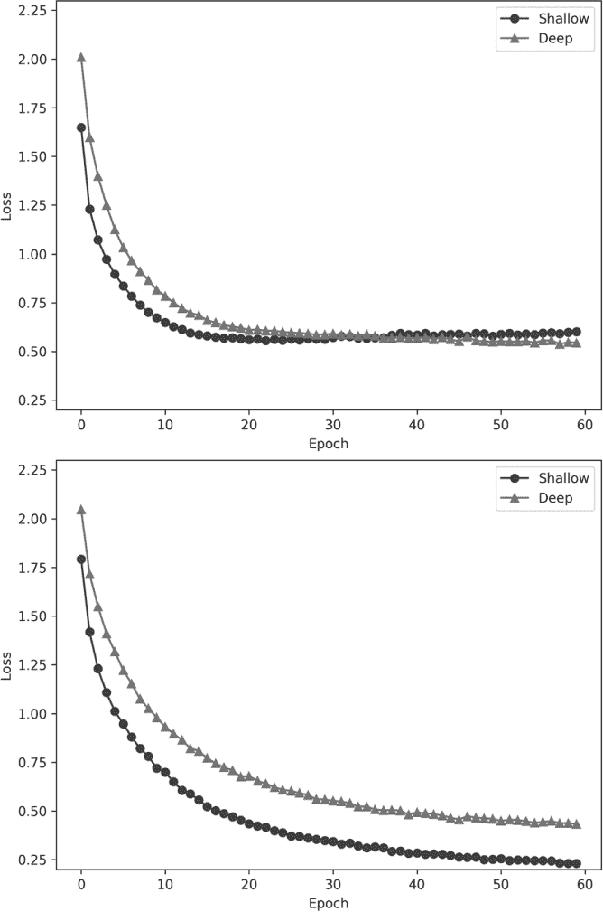
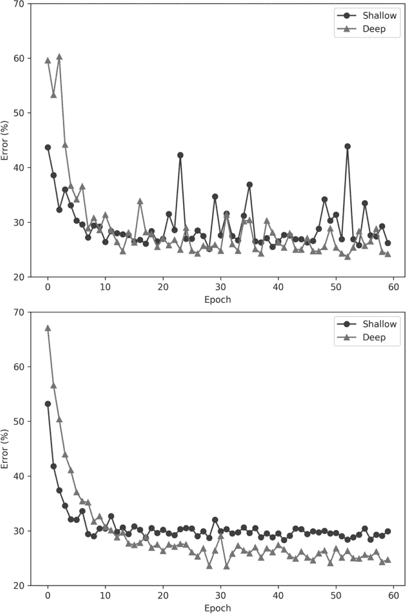
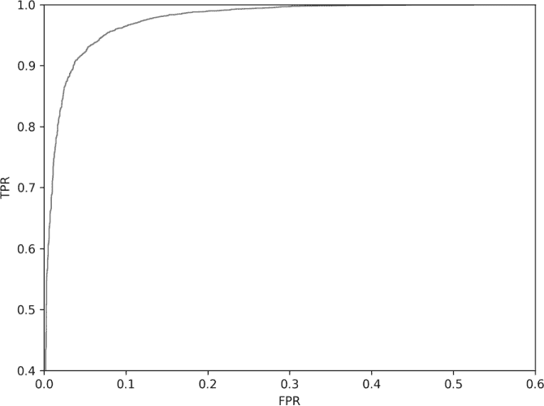
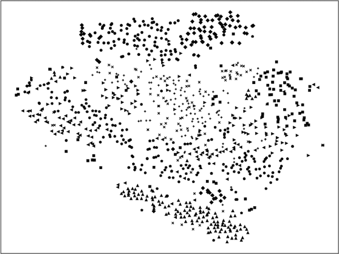
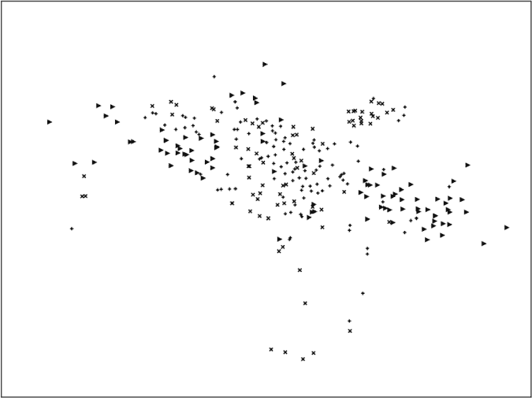

## 第十四章：对 CIFAR-10 的实验**


在本章中，我们将对我们在第五章中构建的 CIFAR-10 数据集进行一系列实验。首先，我们将看看两个模型，一个浅层模型，另一个较深的模型，在完整数据集上的表现。之后，我们将使用整个数据集的分组子集，看看能否区分动物和交通工具。接下来，我们将回答一个问题：对于 CIFAR-10 数据集，是单一的多分类模型更好，还是一组二分类模型，每个类别一个。

我们将在本章结束时介绍迁移学习和微调。这些是重要的概念，通常会混淆，且在机器学习社区中广泛使用，因此我们应该培养对它们如何工作的直觉理解。

### CIFAR-10 复习

在深入实验之前，让我们重新熟悉一下我们正在使用的数据集。CIFAR-10 是一个来自加拿大高级研究院（CIFAR）的 10 类数据集。我们在第五章中构建了这个数据集，但直到现在才开始使用它。CIFAR-10 包含 32×32 像素的 RGB 图像，其中有动物（六个类别）和交通工具（四个类别）。可以查看图 5-4 来查看一些样本图像。训练集有 50,000 张图像，每个类别有 5,000 张，因此它是一个平衡数据集。测试集包含 10,000 张图像，每个类别有 1,000 张。CIFAR-10 可能是继 MNIST 之后，机器学习中第二个最广泛使用的标准数据集。还有一个 100 类版本 CIFAR-100，我们在本书中不会使用它，但你会在文献中经常看到它。

截至目前，最佳的未经增强的 CIFAR-10 模型在测试集上的错误率已达 1% ([benchmarks.ai](http://benchmarks.ai))。这个模型拥有 5.57 亿个参数。我们将使用的模型会小得多，且测试误差会大得多。然而，这是一个真实的图像数据集，不像 MNIST 那样非常干净，并且每个数字的背景都是统一的黑色。由于自然图像，特别是其背景的变化，我们可以预期模型在学习 CIFAR-10 类时会比在 MNIST 上更加困难。

本章参考的 CIFAR-10 类别如下：

| **标签** | **类别** | **标签** | **类别** |
| --- | --- | --- | --- |
| 0 | 飞机 | 5 | 狗 |
| 1 | 汽车 | 6 | 蛙 |
| 2 | 鸟 | 7 | 马 |
| 3 | 猫 | 8 | 船 |
| 4 | 鹿 | 9 | 卡车 |

### 使用完整的 CIFAR-10 数据集

让我们在整个 CIFAR-10 数据集上训练两个不同的模型。第一个模型与我们在第十三章中用于 MNIST 数据集的模型相同。我们将这个模型称为*浅层模型*，因为它只有两个卷积层。我们需要稍微调整一下，以适应 32 × 32 的 RGB 输入，但这非常容易实现。第二个模型，我们称之为*深层模型*，在池化层和全连接层之前使用了多个卷积层。

此外，我们将尝试使用随机梯度下降（SGD）和 Adadelta 作为优化算法。我们将批量大小固定为 64，并训练 60 个周期，总共进行 46,875 次梯度下降步骤。对于 SGD，我们将使用学习率 0.01 和动量 0.9。请记住，Adadelta 是自适应的，会动态调整学习率。我们可以随着训练的进行降低 SGD 的学习率，但由于 0.01 已经比较小，而且梯度下降的步骤很多，所以我们将保持其不变。

浅层模型有 1,626,442 个参数，而深层模型只有 1,139,338 个。深层模型之所以“深”是因为它有更多的层，但由于每个卷积层使用的是精确卷积，每次输出都会减少 2（对于 3 × 3 的卷积核）。因此，池化层后的 flatten 层只有 7,744 个值，而浅层模型则有 12,544 个值。flatten 层和 128 节点的全连接层之间的权重矩阵包含了大多数的参数，7,744 × 128 = 991,232，而浅层模型为 12,544 × 128 = 1,605,632。因此，增加层数实际上减少了需要学习的参数数量。这个略显反直觉的结果提醒我们，全连接层的开销很大，这也是卷积神经网络（CNN）最初被提出的动机之一。

#### 构建模型

你可以在*cifar10_cnn.py*（Adadelta）和*cifar10_cnn_SGD.py*（SGD）中找到浅层模型的代码。我们将分步讲解这些代码。浅层模型的构建方式与 MNIST 数据集的方式类似，如 Listing 14-1 所示。

import keras

from keras.models import Sequential

from keras.layers import Dense, Dropout, Flatten

from keras.layers import Conv2D, MaxPooling2D

from keras import backend as K

import numpy as np

batch_size = 64

num_classes = 10

epochs = 60

img_rows, img_cols = 32, 32

x_train = np.load("cifar10_train_images.npy")

y_train = np.load("cifar10_train_labels.npy")

x_test = np.load("cifar10_test_images.npy")

y_test = np.load("cifar10_test_labels.npy")

如果 K.image_data_format() == 'channels_first'：

x_train = x_train.reshape(x_train.shape[0], 3, img_rows, img_cols)

x_test = x_test.reshape(x_test.shape[0], 3, img_rows, img_cols)

input_shape = (3, img_rows, img_cols)

否则：

x_train = x_train.reshape(x_train.shape[0], img_rows, img_cols, 3)

x_test = x_test.reshape(x_test.shape[0], img_rows, img_cols, 3)

input_shape = (img_rows, img_cols, 3)

x_train = x_train.astype('float32')

x_test = x_test.astype('float32')

(*\newpage*)

x_train /= 255

x_test /= 255

y_train = keras.utils.to_categorical(y_train, num_classes)

y_test = keras.utils.to_categorical(y_test, num_classes)

*Listing 14-1: 准备 CIFAR-10 数据集*

我们导入必要的模块，并从 第五章 中创建的 NumPy 文件加载 CIFAR-10 数据集。注意，图像的尺寸现在是 32 × 32，而不是 28 × 28，并且通道数是 3（RGB），而不是 1（灰度）。像之前一样，我们将输入数据缩放为 255，以将图像映射到 [0,1]，并使用 `to_categorical` 将标签数字转换为 one-hot 向量。

接下来，我们定义模型架构（Listing 14-2）。

model = Sequential()

model.add(Conv2D(32, kernel_size=(3, 3),

activation='relu',

input_shape=input_shape))

model.add(Conv2D(64, (3, 3), activation='relu'))

model.add(MaxPooling2D(pool_size=(2, 2)))

model.add(Dropout(0.25))

model.add(Flatten())

model.add(Dense(128, activation='relu'))

model.add(Dropout(0.5))

model.add(Dense(num_classes, activation='softmax'))

model.compile(loss=keras.losses.categorical_crossentropy,

optimizer=keras.optimizers.Adadelta(),

metrics=['accuracy'])

*Listing 14-2: 构建浅层 CIFAR-10 模型*

这一步与浅层模型的 MNIST 版本相同（参见 Listing 13-1）。对于深度模型，我们添加了更多的卷积层，如 Listing 14-3 中所示。

model = Sequential()

model.add(Conv2D(32, kernel_size=(3, 3),

activation='relu',

input_shape=input_shape))

model.add(Conv2D(64, (3,3), activation='relu'))

model.add(Conv2D(64, (3,3), activation='relu'))

model.add(Conv2D(64, (3,3), activation='relu'))

model.add(Conv2D(64, (3,3), activation='relu'))

model.add(MaxPooling2D(pool_size=(2,2)))

model.add(Dropout(0.25))

model.add(Flatten())

model.add(Dense(128, activation='relu'))

model.add(Dropout(0.5))

model.add(Dense(128, activation='relu'))

model.add(Dropout(0.5))

model.add(Dense(num_classes, activation='softmax'))

model.compile(loss=keras.losses.categorical_crossentropy,

optimizer=keras.optimizers.Adadelta(),

metrics=['accuracy'])

*Listing 14-3: 构建深度 CIFAR-10 模型*

额外的卷积层为模型提供了更好地学习输入数据表示的机会，而对于 CIFAR-10 来说，这比简单的 MNIST 图像要复杂得多。表示可能会更好，因为深度网络可以学习更抽象的表示，涵盖输入数据中的更大结构。

Listings 14-2 和 14-3 中的代码片段使用 Adadelta 作为优化算法编译模型。我们还想要一个使用 SGD 的版本。如果我们将 `compile` 方法中的 `Adadelta()` 替换为以下内容

```py
optimizer=keras.optimizers.SGD(lr=0.01, momentum=0.9)
```

我们将使用之前提到的学习率和动量值来进行 SGD 优化。为完整起见，浅层和深层模型的其余代码请参见清单 14-4。

print("模型参数 = %d" % model.count_params())

print(model.summary())

history = model.fit(x_train, y_train,

batch_size=batch_size,

epochs=epochs,

verbose=1,

validation_data=(x_test[:1000], y_test[:1000]))

score = model.evaluate(x_test[1000:], y_test[1000:], verbose=0)

print('测试损失:', score[0])

print('测试准确率:', score[1])

model.save("cifar10_cnn_model.h5")

*清单 14-4：训练和测试 CIFAR-10 模型*

这段代码总结了模型架构和参数数量，通过调用`fit`方法，使用前 1,000 个测试样本进行验证训练，然后通过调用`evaluate`方法在剩余的 9,000 个测试样本上评估训练好的模型。我们报告测试损失和准确率。接着，我们将模型保存到磁盘（`save`），并存储显示每个训练周期的损失和准确率的历史记录。我们将使用这些历史记录文件生成图表，展示损失和错误（1 – 准确率）随训练周期变化的情况。

清单 14-4 给我们提供了四个文件：浅层模型 + Adadelta，浅层模型 + SGD，深层模型 + Adadelta，以及深层模型 + SGD。让我们运行这些文件，查看最终的测试准确率，并查看训练过程的图表，看看我们能从中学到什么。

运行代码将训练并评估模型。在我们的仅限 CPU 的系统上，这需要一些时间，总共大约八个小时。Keras 使用的随机初始化意味着，当你自己运行代码时，你可能会得到稍有不同的结果。当我运行这段代码时，我得到了表 14-1。

**表 14-1：根据模型大小和优化器的测试集准确率**

|  | **浅层** | **深层** |
| --- | --- | --- |
| Adadelta | 71.9% | 74.8% |
| SGD | 70.0% | 72.8% |

这张表告诉我们，使用 Adadelta 比 SGD 为浅层和深层模型提供了更精确的模型。我们还可以看到，不论优化器是什么，深层模型都优于浅层模型。由于这个原因，像 Adadelta 和 Adam（也在 Keras 中）这样的自适应优化器通常优于传统的 SGD。然而，我也看到有人声称，一旦学习率设置得当，并随着训练过程的进行逐渐降低，SGD 最终和 Adadelta 一样好，甚至更好。当然，没什么能阻止我们在某个时期使用自适应优化器，然后在训练进行若干周期后切换为 SGD。这里的想法是，自适应优化器“接近”损失函数的最小值，而 SGD 在这一点上进行精细调整。

#### 分析模型

让我们看看训练过程中损失的变化。图 14-1 展示了使用 Adadelta（上图）和 SGD（下图）时浅层和深层模型每个周期的损失。



*图 14-1：使用 Adadelta（上图）和 SGD（下图）训练浅层和深层模型的损失*

从 Adadelta 的损失图开始，我们可以看到与 SGD 相比，损失并没有那么低。我们还看到浅层模型的损失在每个 epoch 中略微增加。这是一个反直觉的结果，似乎与传统的观念相悖——即训练损失应该只会下降。有报告称在 Adam（另一种自适应优化器）中也会出现这种情况，因此这很可能是自适应算法的产物。无论如何，正如我们在表 14-1 中看到的，Adadelta 在浅层和深层模型上都能带来更高的准确性。

在图 14-1 的底部，我们看到 SGD 使得浅层模型的损失比深层模型更小。这通常被解读为可能出现过拟合的提示。当损失趋向 0 时，模型正在学习训练集的细节。根据表 14-1，使用 SGD 的浅层模型是表现最差的模型。使用 SGD 的深层模型并没有出现如此小的损失，至少在训练了 60 个 epochs 之前没有。

那么，训练过程中验证集的准确性如何呢？图 14-2 按 epoch 绘制了*误差*。误差在视觉上更容易理解；它应该随着准确性的提高而趋近于 0。同样，Adadelta 模型在上方，SGD 模型在下方。

正如预期的那样，无论使用什么优化器，深层模型表现更好，并且在训练过程中验证集的误差较低。请注意，验证集的误差不是最终的、保留的测试集误差，而是训练过程中使用的测试集部分，在这个例子中是前 1,000 个样本。

在图 14-2 底部的 SGD 曲线符合我们的直觉：随着模型训练的进行，它变得更好，导致误差变小。深层模型很快超越了浅层模型——这也是直观的结果。同时，随着模型的不断改进，曲线变得相对平滑。

图 14-2 顶部的 Adadelta 误差图呈现出不同的情况。在前几个 epoch 之后，误差显著下降。然而，之后验证集的误差出现了些许混乱的波动，尽管仍然符合我们直觉的判断，即深层模型的误差应该小于浅层模型。这个混乱的结果是由于 Adadelta 算法的自适应特性，它在调整学习率时试图寻找更好的最小值。从表 14-1 的结果可以看出，Adadelta 找到了表现更好的模型。



*图 14-2：使用 Adadelta（上图）和 SGD（下图）的浅层和深层模型的验证集误差*

这些实验告诉我们，自适应优化算法和更深的网络（到一定程度）倾向于产生更好的模型。虽然在尝试提供此领域建议时存在风险，但可以放心地说，应该从自适应优化算法开始，并使用一个足够大的模型。为了了解什么是*足够大*，我建议从一个适中的模型开始，训练后再让模型变得更深，看看是否能改善结果。最终，模型会变得太大，以至于无法适应训练集，所以会有一个临界点，超过这个点后，增加模型的大小不再有帮助。在这种情况下，如果可能的话，获取更多的训练数据。

现在让我们把注意力转向处理 CIFAR-10 的子集。

### 动物还是车辆？

CIFAR-10 中的十个类别中有四个是车辆，其余六个是动物。让我们构建一个模型来区分这两者，看看我们能从中学到什么。我们已经有了图像；我们需要做的就是重新编码标签，将所有车辆标记为类别 0，所有动物标记为类别 1。这样做很简单，如 Listing 14-5 所示。

import numpy as np

y_train = np.load("cifar10_train_labels.npy")

y_test = np.load("cifar10_test_labels.npy")

for i in range(len(y_train)):

if (y_train[i] in [0,1,8,9]):

y_train[i] = 0

else:

y_train[i] = 1

for i in range(len(y_test)):

if (y_test[i] in [0,1,8,9]):

y_test[i] = 0

else:

y_test[i] = 1

np.save("cifar10_train_animal_vehicle_labels.npy", y_train)

np.save("cifar10_test_animal_vehicle_labels.npy", y_test)

*Listing 14-5: 将 CIFAR-10 的标签调整为车辆（类别 0）和动物（类别 1）*

我们加载现有的训练和测试标签文件，这些文件已与训练和测试图像文件按顺序匹配，并构建新的标签向量，将车辆类别——类别 0、1、8 和 9——映射为 0，将其他所有类别映射为 1。

前一节中构建和训练模型的代码保持不变，除了模型架构的定义和我们加载的训练与测试标签文件。类别数量（`num_classes`）设置为 2，迷你批量大小为 128，我们将训练 12 个周期。训练集并不完全平衡——有 20,000 辆车和 30,000 只动物——但这种不平衡并不严重，所以我们应该没问题。记住，当某一类别较为稀缺时，模型很难很好地学习它。我们将继续使用 Adadelta 作为优化器，并用前 1,000 个测试样本进行验证，剩下的 9,000 个用于最终测试。我们将使用前一节中使用的相同的浅层架构。

在 CIFAR-10 图像上训练此模型，并使用重新编码的标签，最终测试准确率为 93.6%。让我们稍微细致一点，从 第十一章 中计算所有性能指标。为此，我们更新了该章中定义的 `tally_predictions` 函数（第 11-1 节），使其能够与 Keras 模型一起使用。我们还将使用 第十一章 中的 `basic_metrics`（第 11-2 节）和 `advanced_metrics`（第 11-3 节）。更新后的 `tally_predictions` 代码显示在 第 14-6 节 中。

def tally_predictions(model, x, y):

pp = model.predict(x)

p = np.zeros(pp.shape[0], dtype="uint8")

❶ for i in range(pp.shape[0]):

p[i] = 0 if (pp[i,0] > pp[i,1]) else 1

tp = tn = fp = fn = 0

for i in range(len(y)):

if (p[i] == 0) and (y[i] == 0):

tn += 1

elif (p[i] == 0) and (y[i] == 1):

fn += 1

elif (p[i] == 1) and (y[i] == 0):

fp += 1

else:

tp += 1

score = float(tp+tn) / float(tp+tn+fp+fn)

return [tp, tn, fp, fn, score]

*第 14-6 节：为 Keras 模型计算基本指标*

我们传入模型、测试样本（`x`）和测试标签（`y`）。与 sklearn 版本的 `tally_predictions` 不同，在这里我们首先使用模型来预测每个类别的概率（`pp`）。这会返回一个二维数组，每行对应一个 `x` 中的样本，列表示每个类别的概率。这里有两列，因为只有两种类别：车辆或动物。

在我们能够统计真正例、真负例、假正例（将车辆分类为动物）和假负例（将动物分类为车辆）之前，我们需要为每个测试样本分配一个类别标签。我们通过逐行遍历预测结果，并询问类别 0 的概率是否大于类别 1 的概率 ❶ 来实现这一点。一旦我们分配了预测的类别标签（`p`），就可以计算统计值并返回它们以及整体得分（准确率）。我们将 `tally_predictions` 返回的列表传递给 `basic_metrics`，然后将这两个函数的输出传递给 `advanced_metrics`，如 第十一章 中所述。

二元分类器的完整指标集为我们提供了以下结果：

| **指标** | **结果** |
| --- | --- |
| TP | 5,841 |
| FP | 4,80 |
| TN | 3,520 |
| FN | 159 |
| TPR（敏感性，召回率） | 0.9735 |
| TNR（特异性） | 0.8800 |
| PPV（精度） | 0.9241 |
| NPV | 0.9568 |
| FPR | 0.1200 |
| FNR | 0.0265 |
| F1 | 0.9481 |
| MCC | 0.8671 |
| *κ* | 0.8651 |
| 信息度 | 0.8535 |
| 标度度 | 0.8808 |
| 准确率 | 0.9361 |

我们看到，这是一个表现良好的模型，尽管特异性为 88%，有些偏低。正如 第十一章 所论述的，马修斯相关系数（MCC）可能是描述二元分类器最好的单一指标。这里我们得到了 0.8671 的 MCC，接近 1.0，表明模型表现良好。

记住，*敏感度*是模型将动物识别为“动物”的概率，*特异度*是模型将车辆识别为“车辆”的概率。*精度*是模型标记为“动物”时正确的概率，而*NPV（负预测值）*是模型将标签为“车辆”时正确的概率。还需注意，假阳性率（FPR）为 1 – 特异度，假阴性率（FNR）为 1 – 敏感度。

多一些代码将计算 ROC 曲线及其面积：

```py
from sklearn.metrics import roc_auc_score, roc_curve

def roc_curve_area(model, x, y):

    pp = model.predict(x)

    p = np.zeros(pp.shape[0], dtype="uint8")

    for i in range(pp.shape[0]):

        p[i] = 0 if (pp[i,0] > pp[i,1]) else 1

    auc = roc_auc_score(y,p)

    roc = roc_curve(y,pp[:,1])

    return [auc, roc]
```

再次，我们传入训练好的模型、测试样本（`x`）和动物或车辆标签（`y`）。我们还将输出的概率转换为类别预测，就像在示例 14-6 中所做的那样。AUC 为 0.9267，图 14-3 显示了 ROC 曲线（请注意缩放后的坐标轴）。这条曲线陡峭且靠近图的左上角——这是一个表现良好的模型的所有好迹象。



*图 14-3: 动物或车辆模型的 ROC 曲线*

我们将动物和车辆分组，并让一个模型学习它们之间的区别。显然，一些特征区分了这两个类别，模型成功地学会了使用这些特征。然而，与大多数二分类器不同，我们知道测试数据的更精细的标签分配。例如，我们知道哪些动物是鸟、鹿或青蛙。同样，我们也知道哪些样本是飞机、船或卡车。

当模型犯错时，错误要么是假阳性（将车辆误认为是动物），要么是假阴性（将动物误认为是车辆）。我们将动物设为类别 1，因此假阳性是将车辆误判为动物的情况。假阴性的反面情况亦然。我们可以使用完整的类别标签来告诉我们有多少假阳性是由哪些车辆类别组成的，我们也可以对假阴性做同样的事情，以告诉我们哪些动物类别被分配给了车辆类别。几行代码在示例 14-7 中展示了我们所需要的内容。

import numpy as np

from keras.models import load_model

x_test = np.load("cifar10_test_images.npy")/255.0

y_label= np.load("cifar10_test_labels.npy")

y_test = np.load("cifar10_test_animal_vehicle_labels.npy")

model = load_model("cifar10_cnn_animal_vehicle_model.h5")

pp = model.predict(x_test)

p = np.zeros(pp.shape[0], dtype="uint8")

for i in range(pp.shape[0]):

p[i] = 0 if (pp[i,0] > pp[i,1]) else 1

hp = []; hn = []

❶ for i in range(len(y_test)):

if (p[i] == 0) and (y_test[i] == 1):

hn.append(y_label[i])

elif (p[i] == 1) and (y_test[i] == 0):

hp.append(y_label[i])

hp = np.array(hp)

hn = np.array(hn)

a = np.histogram(hp, bins=10, range=[0,9])[0]

b = np.histogram(hn, bins=10, range=[0,9])[0]

print("将车辆识别为动物: %s" % np.array2string(a))

print("将动物识别为车辆: %s" % np.array2string(b))

*示例 14-7：使用精细的类别标签确定哪些类别导致假阳性和假阴性*

首先，我们加载测试集图像、实际标签（`y_label`）和动物或车辆标签（`y_test`）。然后，和之前一样，我们加载模型并得到模型预测（`p`）。我们希望追踪每个假阳性和假阴性的实际类别标签，即分类器所犯的错误。我们通过遍历预测结果，并将其与动物或车辆标签进行比较来做到这一点❶。当发生错误时，我们保存样本的实际标签，无论是假阴性（`hn`）还是假阳性（`hp`）。注意，这样做之所以有效，是因为我们在定义动物或车辆标签时，确保了它们的顺序与原始标签集一致。

一旦我们有了所有假阳性（FP）和假阴性（FN）案例的实际标签，我们使用`histogram`来为我们统计。共有 10 个实际类别标签，因此我们告诉`histogram`我们希望使用 10 个区间。我们还需要指定区间的范围（`range=[0,9]`）。我们只需要计数值本身，所以我们只保留`histogram`返回的第一个数组，因此调用的最后加上了`[0]`。最后，我们打印数组得到：

```py
vehicles as animals: [189  69   0   0   0   0   0   0 105 117]

animals as vehicles: [ 0  0 64 34 23 11 12 15  0  0]
```

这意味着模型将 189 个“动物”识别为类别 0，飞机。最不可能被误识为动物的车辆类别是类别 1，汽车。船和卡车同样容易被误识为动物。反过来，我们看到类别 2，鸟类，最容易被误识为车辆，而类别 5，狗类，最不容易被误分类，尽管青蛙紧随其后。

该如何理解这些结果呢？最常被误分类的车辆是飞机，而最常被误分类的动物是鸟类。这是有道理的：飞机和飞行中的鸟类的图片确实看起来很相似。其他类别的关系就留给你去思考吧。

### 二分类还是多分类？

在机器学习中，传统的观点认为，多分类模型通常比多个二分类模型更具优势。虽然对于大数据集、大模型以及有很多类别的情况，比如包含 1,000 个类别的 ImageNet 数据集，这几乎是肯定成立的，但对于我们在本章中使用的小模型来说，这种情况如何呢？让我们来探讨一下。

CIFAR-10 数据集中每个类别有 5,000 个实例，共有 10 个类别。这意味着我们可以训练 10 个二分类模型，其中目标类别（类别 1）是 10 个类别之一，而其他类别则归为“其他”。这种方法被称为*一对多*方法。为了对未知样本进行分类，我们将其分别输入每个分类器，并根据返回的最有信心的答案来分配标签。所有数据集都是不平衡的，类别 1 有 5,000 个实例，类别 0 有 45,000 个实例，但正如我们所看到的，依然有足够的数据来学习类别之间的差异。

我们需要一些代码来训练 10 个一对多模型。我们将使用之前使用过的浅层架构，批量大小为 128，并训练 12 个 epochs。但是，在训练之前，我们需要重新分配训练集和测试集的类别标签，以便目标类别的所有实例都是 1，其他所有实例都是 0。为了构建每个类别的标签，我们将使用 Listing 14-8。

import sys

import numpy as np

❶ class1 = eval("["+sys.argv[1]+"]")

y_train = np.load("cifar10_train_labels.npy")

y_test = np.load("cifar10_test_labels.npy")

for i in range(len(y_train)):

if (y_train[i] in class1):

y_train[i] = 1

else:

y_train[i] = 0

for i in range(len(y_test)):

if (y_test[i] in class1):

y_test[i] = 1

else:

y_test[i] = 0

np.save(sys.argv[2], y_train)

np.save(sys.argv[3], y_test)

*Listing 14-8: 构建每个类别的标签*

这段代码利用了命令行。要调用它，可以使用类似下面的命令：

```py
$ python3 make_label_files.py 1 train_1.npy test_1.npy
```

第一个参数是所需的目标类别标签，这里是 1（表示汽车），接下来的两个参数是存储训练集和测试集新标签分配的文件名。代码本身会遍历实际的训练集和测试集标签，如果标签是目标类别，则对应的输出标签为 1；否则，输出标签为 0。

这段代码比映射单一类别更灵活。通过使用`eval` ❶，我们可以传入一个以逗号分隔的字符串，表示我们希望作为目标类别的所有 CIFAR-10 标签。例如，要使用此代码为上一节中的动物与车辆示例生成标签，我们会将第一个参数设为`2,3,4,5,6,7`。

一旦我们为每个 10 个类别分配了新的标签，就可以用它们训练 10 个模型。我们需要做的就是将`num_classes`改为 2，并加载分别为`y_train`和`y_test`重新分配标签的文件。在文件底部，我们需要更改`model.save`的调用，以便存储每个类别的模型。我们假设模型的文件名为*cifar10_cnn_<X>_model.h5*，其中*<X>*是一个数字，表示 CIFAR-10 的类别标签。我们的多类模型是基于完整的 CIFAR-10 数据集训练的浅层架构，训练了 12 个 epochs（*cifar10_cnn_model.h5*）。要训练二分类模型，可以使用`train_single_models`脚本。该脚本调用*cifar10_cnn_arbitrary.py*，使用指定的二分类数据集训练模型。

测试模型时，我们首先需要从磁盘加载所有模型以及测试集数据。然后，我们需要通过多类模型和每个单独的类别模型运行所有数据，并保存预测结果。通过预测结果，我们可以分配类别标签并构建混淆矩阵，查看每种方法的效果如何。首先，让我们加载测试集和模型：

```py
x_test = np.load("cifar10_test_images.npy")/255.0

y_test = np.load("cifar10_test_labels.npy")

mm = load_model("cifar10_cnn_model.h5")

m = []

for i in range(10):

    m.append(load_model("cifar10_cnn_%d_model.h5" % i))
```

请注意，我们对测试集进行了 255 的缩放，就像对训练数据所做的那样。我们将保持多类模型在`mm`中，并将 10 个单类别模型加载到列表`m`中。

接下来，我们将模型应用于每个测试集样本：

```py
mp = np.argmax(mm.predict(x_test), axis=1)

p = np.zeros((10,10000), dtype="float32")

for i in range(10):

    p[i,:] = m[i].predict(x_test)[:,1]

bp = np.argmax(p, axis=0)
```

使用`predict`调用 10,000 个测试样本返回一个 10,000 × 10 的矩阵用于多分类模型，或者一个 10,000 × 2 的矩阵用于单独的模型。每一行对应一个测试样本，每一列是模型对每个类的输出。对于多分类情况，我们将`mp`设置为按列（`axis=1`）的最大值，从而得到一个包含 10,000 个值的向量，每个值对应一个预测的类标签。

我们遍历各个单独的模型并调用`predict`，只保留类 1 的概率。这些概率被存入`p`，其中行表示该类标签的单个模型输出，列表示每个 10,000 个测试样本的类 1 预测概率。如果我们通过使用`argmax`和`axis=0`返回行之间的最大值，我们就能得到每个测试样本的模型预测类标签。这就是`bp`中的内容。

拿到我们的预测结果后，我们可以生成混淆矩阵：

```py
cm = np.zeros((10,10), dtype="uint16")

cb = np.zeros((10,10), dtype="uint16")

for i in range(10000):

    cm[y_test[i],mp[i]] += 1

    cb[y_test[i],bp[i]] += 1

np.save("cifar10_multiclass_conf_mat.npy", cm)

np.save("cifar10_binary_conf_mat.npy", cb)
```

这里行表示真实的类标签，列表示模型预测的标签。我们还会将混淆矩阵存储以便以后使用。

我们可以使用列表 14-9 中的代码来显示混淆矩阵：

print("一对多混淆矩阵（行是真实值，列是预测值）：")

print("%s" % np.array2string(100*(cb/1000.0), precision=1))

print()

print("多分类混淆矩阵：")

print("%s"  % np.array2string(100*(cm/1000.0), precision=1))

*列表 14-9：显示混淆矩阵。参见* cifar10_one_vs_many.py

我们将`cb`和`cm`中的计数除以 1,000，因为每个类在测试集中都有那么多样本。这将混淆矩阵条目转换为分数，再通过乘以 100 转换为百分比。

那么，我们做得怎么样？多个一对多分类器产生了

| **类** | **0** | **1** | **2** | **3** | **4** | **5** | **6** | **7** | **8** | **9** |
| --- | --- | --- | --- | --- | --- | --- | --- | --- | --- | --- |
| **0** | **75.0** | 2.8 | 3.4 | 2.1 | 1.7 | 0.4 | 2.3 | 0.2 | 4.1 | 8.0 |
| **1** | 0.8 | **84.0** | 0.2 | 0.9 | 0.3 | 0.3 | 1.1 | 0.0 | 1.2 | 11.2 |
| **2** | 6.5 | 1.6 | **54.0** | 6.3 | 9.5 | 5.3 | 9.1 | 2.3 | 0.8 | 4.6 |
| **3** | 1.6 | 3.6 | 3.8 | **52.1** | 7.1 | 12.9 | 10.6 | 2.2 | 0.9 | 5.2 |
| **4** | 1.8 | 0.8 | 3.6 | 6.5 | **67.6** | 2.3 | 8.6 | 5.3 | 1.3 | 2.2 |
| **5** | 1.4 | 1.4 | 3.5 | 16.9 | 4.7 | **61.8** | 4.0 | 2.6 | 0.5 | 3.2 |
| **6** | 0.8 | 0.7 | 1.4 | 3.4 | 2.8 | 1.0 | **86.4** | 0.2 | 0.3 | 3.0 |
| **7** | 1.5 | 1.3 | 1.7 | 4.9 | 5.2 | 5.2 | 1.5 | **71.5** | 0.1 | 7.1 |
| **8** | 5.3 | 4.4 | 0.1 | 1.1 | 0.5 | 0.6 | 1.1 | 0.5 | **79.1** | 7.3 |
| **9** | 1.7 | 4.0 | 0.2 | 0.8 | 0.1 | 0.4 | 0.5 | 0.3 | 0.8 | **91.2** |

而多分类分类器的结果是

| **类** | **0** | **1** | **2** | **3** | **4** | **5** | **6** | **7** | **8** | **9** |
| --- | --- | --- | --- | --- | --- | --- | --- | --- | --- | --- |
| **0** | **70.2** | 1.6 | 6.0 | 2.6 | 3.3 | 0.5 | 1.8 | 0.9 | 9.8 | 3.3 |
| **1** | 2.0 | **79.4** | 1.0 | 1.3 | 0.5 | 0.5 | 1.3 | 0.4 | 2.8 | 10.8 |
| **2** | 5.2 | 0.6 | **56.2** | 6.6 | 13.5 | 6.1 | 7.3 | 2.6 | 1.4 | 0.5 |
| **3** | 1.2 | 1.1 | 7.2 | **57.7** | 10.2 | 11.5 | 7.3 | 1.7 | 1.2 | 0.9 |
| **4** | 1.9 | 0.2 | 5.2 | 4.6 | **77.4** | 1.6 | 4.8 | 2.7 | 1.5 | 0.1 |
| **5** | 1.0 | 0.2 | 6.4 | 20.7 | 7.7 | **56.8** | 2.7 | 3.5 | 0.8 | 0.2 |
| **6** | 0.3 | 0.1 | 4.5 | 5.2 | 5.7 | 1.5 | **82.4** | 0.0 | 0.0 | 0.3 |
| **7** | 1.4 | 0.2 | 4.0 | 6.3 | 10.1 | 4.1 | 0.9 | **71.7** | 0.1 | 1.2 |
| **8** | 4.7 | 3.0 | 0.8 | 2.0 | 1.3 | 0.6 | 1.0 | 0.6 | **82.6** | 3.4 |
| **9** | 2.4 | 6.1 | 0.7 | 2.6 | 1.2 | 0.7 | 1.2 | 1.6 | 3.2 | **80.3** |

对角线上的元素是正确的类别分配。理想情况下，矩阵应仅包含对角线元素。其他所有元素都是错误的，表示模型或模型选择了错误的标签。由于每个类别在测试集中的表示相同，我们可以通过使用对角线元素的无权平均值来计算两个模型的总体准确率。如果我们这样做，得到如下结果：

一对多模型：72.3%

多类模型：71.5%

在这种情况下，一对多分类器略微占优，尽管差异不到 1%。当然，我们需要做 10 倍的工作才能得到一对多的混淆矩阵——使用了十个分类器，而不是一个。多类模型在类别 4（鹿）上的表现比一对多模型好约 10%，但在类别 9（卡车）上的表现则差约 11%。这些是每个类别的最大准确度差异。多类模型将卡车与类别 8（船）(3.2%)和类别 1（汽车）(6.1%)混淆的频率高于一对多模型。我们可以看到这可能发生的原因。卡车和汽车都有轮子，卡车和船（尤其是在 CIFAR-10 的低分辨率下）都是方形的。

我们是否得出了关于一对多（one-vs-rest）与多类（multiclass）模型的明确答案？没有，一般来说我们也无法得出。尽管如此，客观上，通过使用多个模型，我们确实获得了略微更好的性能。

一个反对使用多个模型的论点是，除了额外的计算开销外，使用单一模型处理多个类别会让模型有机会看到与某一特定类别相似的样本，但这些样本并不是该类别的实例。这些难样本（hard negatives）通过强迫模型（间接地）关注类别之间的不同特征，而不是可能与某一类别强相关但也出现在其他类别中的特征，从而对模型进行正则化。我们首次在第四章遇到难样本。

然而，在这种情况下，很难说这个论点成立。对于多类模型，类别 9（卡车）更容易与类别 1（汽车，6.1%）混淆，而不是一对多（one-vs-rest）模型（4.0%）。一个可能的解释是，多类模型在有限的训练数据下被迫尝试学习卡车、汽车和其他车辆之间的区别，而一对多模型则单独地尝试学习卡车与其他任何车辆之间的区别。

### 迁移学习

我们将使用*迁移学习*这个术语，指的是采用一个预训练的深度网络，并将其用于为另一个机器学习模型生成新的特征。我们的迁移学习示例将是一个小型模型，旨在展示这一过程，但许多模型已经使用了由大型预训练网络生成的特征，这些网络使用了庞大的数据集。特别是，许多模型已经使用了由 AlexNet 和各种 ResNet 架构生成的特征，而这些网络是在 ImageNet 数据集上进行预训练的。

我们将使用预训练模型将输入图像转换为输出特征向量，然后我们将用这些特征向量来训练经典的机器学习模型。当一个模型被用来将输入转换为另一个特征表示，通常是新的特征向量时，输出通常被称为*嵌入*：我们正在使用预训练的网络将我们想要分类的输入嵌入到另一个空间——我们希望这个空间能帮助我们构建一个有用的模型。当我们想要开发的模型有太少的训练样本，无法单独生成一个好的模型时，我们可以使用迁移学习。

在使用迁移学习时，了解或相信两个模型是使用相似的数据进行训练的，会非常有帮助。如果你阅读文献，你会发现许多典型的迁移学习示例确实如此。输入是某一类别的自然图像，而嵌入模型是在自然图像上训练的。这里的“自然图像”指的是世界上某物的照片，而不是 X 光或其他医学影像。显然，CIFAR-10 图像和 MNIST 图像之间有很大的差异，所以我们不应该指望在迁移学习上取得太大的成功。我们只是用现有的条件来展示这一技术。

我们将使用一个浅层的 CIFAR-10 模型，就像我们刚刚看到的那些模型，用来生成嵌入向量。这个模型在完整的 CIFAR-10 数据集上训练了 12 个 epoch。我们将通过将 MNIST 数字图像传递给预训练模型，并保持 Dense 层的输出，即用于生成 10 类 softmax 预测的 128 节点向量，来嵌入 MNIST 数据集。

在进行嵌入之前，我们需要考虑一些问题。首先，CIFAR-10 模型是基于 32 × 32 RGB 图像训练的。因此，我们需要调整 MNIST 数字图像以适应这一输入要求。其次，尽管 CIFAR-10 和 MNIST 都有 10 个类别，但这只是巧合；实际上，这两个数据集之间的类别数不需要匹配。

我们应该如何将 28 × 28 的 MNIST 图像输入到一个期望 32 × 32 RGB 图像的模型中呢？通常，在处理图像数据和迁移学习时，我们会调整图像大小以适应模型。在这里，由于 MNIST 数字图像比 CIFAR-10 图像小，我们可以将 28 × 28 的数字图像居中放置在 32 × 32 的输入图像中。此外，我们可以通过将每个通道（红色、绿色和蓝色）设置为单一的灰度输入，将灰度图像转换为 RGB 图像。

以下所有代码都在 *transfer_learning.py* 文件中。设置嵌入过程如下所示：

```py
import numpy as np

from keras.models import load_model

from keras import backend as K

from keras.datasets import mnist

(x_train, y_train), (x_test, y_test) = mnist.load_data()

x_train = x_train/255.0

x_test = x_test/255.0

model = load_model("cifar10_cnn_model.h5")
```

我们首先从 Keras 中加载所需的模块。然后，我们加载 Keras 模型文件，*cifar10_cnn_model.h5*，该文件包含本章第一部分训练了 12 轮的浅层模型，训练使用了完整的 CIFAR-10 数据集。

一旦数据加载并缩放完成，我们就可以将每张 MNIST 训练和测试图像传递给 Keras 模型，并从 Dense 层提取 128 节点的向量。这样，每张 MNIST 图像就变成了一个 128 元素的向量；请参见 列表 14-10。

train = np.zeros((60000,128))

k = 0

for i in range(600):

t = np.zeros((100,32,32,3))

❶ t[:,2:30,2:30,0] = x_train[k:(k+100)]

t[:,2:30,2:30,1] = x_train[k:(k+100)]

t[:,2:30,2:30,2] = x_train[k:(k+100)]

_ = model.predict(t)

❷ out = [model.layers[5].output]

func = K.function([model.input, K.learning_phase()], out)

(*\newpage*)

train[k:(k+100),:] = func([t, 1.])[0]

k += 100

np.save("mnist_train_embedded.npy", train)

test = np.zeros((10000,128))

k = 0

for i in range(100):

t = np.zeros((100,32,32,3))

t[:,2:30,2:30,0] = x_test[k:(k+100)]

t[:,2:30,2:30,1] = x_test[k:(k+100)]

t[:,2:30,2:30,2] = x_test[k:(k+100)]

_ = model.predict(t)

out = [model.layers[5].output]

func = K.function([model.input, K.learning_phase()], out)

test[k:(k+100),:] = func([t, 1.])[0]

k += 100

np.save("mnist_test_embedded.npy", test)

*列表 14-10：通过预训练的 CIFAR-10 模型运行 MNIST 图像*

MNIST 训练集有 60,000 张图像。我们将每 100 张图像一组地传递给 Keras 模型，以提高效率，而不是单独处理每张图像；这意味着我们需要处理 600 组 100 张图像。同样，测试集有 10,000 张图像，因此我们处理 100 组 100 张图像。我们会将输出向量存储在 `train` 和 `test` 中。

对于训练和测试图像的处理循环，首先创建一个临时数组` t`来存储当前的 100 张图像。为了使用 Keras 模型的 `predict` 方法，我们需要一个四维输入：图像的数量、高度、宽度和通道数。我们通过将当前的 100 张训练或测试图像（由 `k` 索引）复制到 `t` 中来加载 `t`；我们这样做三次，每次处理一个通道 ❶。加载完 `t` 后，我们调用模型的 `predict` 方法。我们抛弃输出，因为我们关心的是 Keras 模型的 Dense 层输出的值。这是浅层架构的第 5 层 ❷。`func` 的输出是通过网络传递输入后，Dense 层的 100 个输出向量。我们将这些向量分配到当前的 100 个 `train` 样本块中，然后转到下一组 100 个样本。当我们处理完整个 MNIST 数据集后，我们将嵌入向量保存在一个 NumPy 文件中。然后我们重复处理训练集的每个步骤来处理测试集。

在这一点上，我们已经得到了嵌入向量，因此自然而然地会问嵌入是否有助于分离类。我们可以通过使用按类标签绘制的 t-SNE 向量图（图 14-4）来验证这一点。



*图 14-4：t-SNE 图显示了按类分离的嵌入 MNIST 数字向量*

将此图与图 12-10 进行比较，该图显示了一个显式在 MNIST 数字上训练的模型的分离情况。该模型显示了类之间明确无误的分离，但图 14-4 则远不如此清晰。然而，尽管存在重叠，图中不同部分仍然有类的集中分布，所以我们有理由相信，某个模型可能能够利用这些向量学习如何对数字进行分类。

让我们使用嵌入向量训练一些模型。为此，我们将回到经典机器学习的世界。我们将使用 MNIST 数字图像的向量形式训练在第七章中训练过的一些模型。

训练和测试模型的代码是直接的。我们将训练一个最近质心模型、一个 3 最近邻模型、一个具有 50 棵树的随机森林和一个线性 SVM（*C* = 0.1），如清单 14-11 所示。

from sklearn.neighbors import KNeighborsClassifier

from sklearn.ensemble import RandomForestClassifier

from sklearn.neighbors import NearestCentroid

from sklearn.svm import LinearSVC

clf0 = NearestCentroid()

clf0.fit(train, y_train)

nscore = clf0.score(test, y_test)

clf1 = KNeighborsClassifier(n_neighbors=3)

clf1.fit(train, y_train)

kscore = clf1.score(test, y_test)

clf2 = RandomForestClassifier(n_estimators=50)

clf2.fit(train, y_train)

rscore = clf2.score(test, y_test)

clf3 = LinearSVC(C=0.1)

clf3.fit(train, y_train)

sscore = clf3.score(test, y_test)

print("Nearest Centroid    : %0.2f" % nscore)

print("3-NN                : %0.2f" % kscore)

print("随机森林       : %0.2f" % rscore)

print("SVM                 : %0.2f" % sscore)

*清单 14-11：使用 MNIST 嵌入向量训练经典模型*

我们加载相关的 sklearn 模块，创建特定的模型实例，并调用`fit`，传入 128 维的训练向量和相应的类别标签。`score`方法返回当前已训练模型在测试集上的整体准确度。

运行这段代码可以得到以下分数：

| **模型** | **得分** |
| --- | --- |
| 最近质心（Nearest Centroid） | 0.6799 |
| 3-最近邻（3-Nearest Neighbors） | 0.9010 |
| 随机森林 (50) | 0.8837 |
| SVM (C=0.1) | 0.8983 |

我们可以将其与同一模型在表 7-10 中缩放后的得分进行比较：

| **模型** | **得分** |
| --- | --- |
| 最近质心（Nearest Centroid） | 0.8203 |
| 3-最近邻（3-Nearest Neighbors） | 0.9705 |
| 随机森林 (50) | 0.9661 |
| SVM (C =0.1) | 0.9181 |

显然，在这种情况下，我们的嵌入方式并没有给我们带来比原始数据更多的优势。对此我们不应该感到惊讶：我们知道我们的两个数据集是相当不同的，并且 t-SNE 图表显示预训练的 CIFAR-10 模型并不适合在嵌入空间中区分 MNIST 图像。图 14-4 中类别的分离效果差解释了最近质心模型表现不佳的原因：68%的准确率与在手写数字图像上训练时的 82%相比差距明显。而且，从本质上来说，数字图像本身就已经是彼此区分开的，尤其是在统一背景下，因为这些数字是由人类设计的，目的是让视觉上容易区分。

一段代码可以为我们提供任何这些模型的混淆矩阵：

```py
def conf_mat(clf,x,y):

    p = clf.predict(x)

    c = np.zeros((10,10))

    for i in range(p.shape[0]):

        c[y[i],p[i]] += 1

    return c

cs = conf_mat(clf, test, y_test)

cs = 100.0*cs / cs.sum(axis=1)

np.set_printoptions(suppress=True)

print(np.array2string(cs, precision=1, floatmode="fixed"))
```

这里`clf`是任何一个模型，`test`是嵌入后的测试集，`y_test`是标签。我们返回包含每个元素计数的混淆矩阵，所以我们按行的总和进行除法操作，因为每一行代表真实标签，然后乘以 100 来得到百分比。接着，我们使用 NumPy 命令打印数组，获得单一数字的准确率，且不会使用科学记数法。

我们已经知道为什么最近质心（Nearest Centroid）结果这么差。那么随机森林（Random Forest）和支持向量机（SVM）怎么样呢？下面是随机森林模型的混淆矩阵：

| **类别** | **0** | **1** | **2** | **3** | **4** | **5** | **6** | **7** | **8** | **9** |
| --- | --- | --- | --- | --- | --- | --- | --- | --- | --- | --- |
| **0** | 96.7 | 0.0 | 0.5 | 0.5 | 0.4 | 0.2 | 0.9 | 0.0 | 0.4 | 0.3 |
| **1** | 0.0 | 98.6 | 0.5 | 0.0 | 0.4 | 0.1 | 0.4 | 0.0 | 0.1 | 0.1 |
| **2** | 1.8 | 0.2 | 87.0 | 2.5 | 1.0 | 1.0 | 1.7 | 0.8 | 4.1 | 0.6 |
| **3** | 1.1 | 0.1 | 2.5 | **80.8** | 0.2 | **6.7** | 0.9 | 1.1 | **6.0** | 1.6 |
| **4** | 0.3 | 0.4 | 1.3 | 0.0 | 88.3 | 0.1 | 1.9 | 1.7 | 0.6 | 5.2 |
| **5** | 0.6 | 0.8 | 0.7 | **9.8** | 1.6 | **78.8** | **1.8** | 1.1 | 1.6 | 0.8 |
| **6** | 3.0 | 0.4 | 0.6 | 0.0 | 0.7 | 1.0 | 93.5 | 0.2 | 0.4 | 0.0 |
| **7** | 0.2 | 1.0 | 2.9 | 0.1 | 2.7 | 0.4 | 0.0 | 87.7 | 0.7 | 4.4 |
| **8** | 1.4 | 0.1 | 2.7 | 5.0 | 1.5 | 1.6 | 0.6 | 0.8 | 84.0 | 2.0 |
| **9** | 2.2 | 0.2 | 1.3 | 1.6 | 2.9 | 0.6 | 0.3 | 3.4 | 1.5 | 86.2 |

我们已经突出了表现最差的两个类别，3 和 5，并标出了它们最常混淆的两个数字。我们看到模型将 3 与 5 和 8 混淆。SVM 的混淆矩阵也显示了相同的效果。如果我们查看图 14-4，并只显示类别 3、5 和 8，那么我们会得到图 14-5。这三者之间有显著的混淆。



*图 14-5：t-SNE 图，显示类别 3（加号）、类别 5（叉号）和类别 8（右三角形）*

本节的目的是通过一个使用我们手头数据集的示例介绍迁移学习的概念。正如你所看到的，这个实验并不成功。我们使用的数据集彼此差异很大，因此我们本来就可能预料到这种情况，但通过验证这一点，我们还是获得了有用的信息。在下一节中，我们将看到如何在迁移学习的基础上更进一步。

### 微调模型

在前一节中，我们将迁移学习定义为使用一个在某个数据集上训练过的模型的权重，并将这些权重应用于一个（希望非常相似的）新数据集。我们利用这些权重将输入映射到一个新的空间，并在映射后的数据上训练模型。在这一节中，我们将做类似的事情，但与其保持权重不变，我们将在继续训练模型的过程中，让权重随着新的、更小的数据集而变化。我们称之为*微调*。

在微调中，我们正在训练一个神经网络，但不是将权重初始化为随机值（这些随机值是根据智能初始化方案选择的），而是从一个在相似但不同数据集上训练的模型开始。我们可能在没有大量训练数据的情况下使用微调，但我们相信我们的数据来自于与我们已有大量数据或训练模型的数据分布非常相似的情况。例如，我们可能能够访问一个使用大数据集训练的大型模型的权重，就像我们之前提到的 ImageNet 数据集。下载这样的预训练模型非常简单。此外，我们可能拥有一个小数据集，包含 ImageNet 中没有的类别的图像；比如说，孔雀鱼、天使鱼和四线鱼的照片。这些是流行的淡水观赏鱼，ImageNet 中没有。我们可以从一个在 ImageNet 上预训练的大模型开始，并利用这个小型鱼类数据集进行微调。这样，我们就能够利用模型已经很好地适应此类输入的事实，并希望通过小数据集获得一个好的模型。

我们的实验将使用 CIFAR-10 数据集。我们的目标是训练一个模型，利用本章第一节中的深度架构区分狗和猫的图像。然而，我们的数据集较小；每个类别大约有 500 张图片。我们还拥有一个更大的数据集，包含 CIFAR-10 中的所有车辆图像。

因此，我们将使用这些数据训练以下模型：

1.  使用小型狗猫数据集的浅层架构。

1.  使用小型狗猫数据集的深度架构。

1.  在车辆数据上预训练并在小型狗猫数据集上微调的深度架构。

对于最后的情况，我们将使用不同的冻结权重组合训练几个变体。

#### 构建我们的数据集

在进行微调之前，我们需要构建我们的数据集。我们将使用未增强的 CIFAR-10 来构建小型狗猫数据集。我们将使用*增强过的* CIFAR-10 来构建车辆数据集。我们在第五章中增强了 CIFAR-10。

构建小型狗猫数据集是直接的，如清单 14-12 所示。

x_train = np.load("cifar10_train_images.npy")[:,2:30,2:30,:]

y_train = np.load("cifar10_train_labels.npy")

x_test = np.load("cifar10_test_images.npy")[:,2:30,2:30,:]

y_test = np.load("cifar10_test_labels.npy")

xtrn = []; ytrn = []

xtst = []; ytst = []

for i in range(y_train.shape[0]):

if (y_train[i]==3):

xtrn.append(x_train[i])

ytrn.append(0)

if (y_train[i]==5):

xtrn.append(x_train[i])

ytrn.append(1)

for i in range(y_test.shape[0]):

if (y_test[i]==3):

xtst.append(x_test[i])

ytst.append(0)

if (y_test[i]==5):

xtst.append(x_test[i])

ytst.append(1)

np.save("cifar10_train_cat_dog_small_images.npy", np.array(xtrn)[:1000])

np.save("cifar10_train_cat_dog_small_labels.npy", np.array(ytrn)[:1000])

np.save("cifar10_test_cat_dog_small_images.npy", np.array(xtst)[:1000])

np.save("cifar10_test_cat_dog_small_labels.npy", np.array(ytst)[:1000])

*清单 14-12：构建小型狗猫数据集*

我们加载完整的 CIFAR-10 数据，进行训练和测试，然后遍历每个样本。如果类别是 3（猫）或 5（狗），我们将图像和标签添加到我们的列表中，并确保重新编码类别标签，使 0 表示猫，1 表示狗。当所有样本都添加完毕后，我们保留前 1000 个并写入磁盘，作为我们的小型狗猫训练和测试集。保留前 1000 个样本让我们得到一个大约 50/50 分配的类别数据集。

请注意，在加载 CIFAR-10 图像后，我们通过`[:,2:30,2:30,:]`进行下标切片。回想一下，增强版本的数据集包括图像的微小偏移，因此当我们在第五章中构建它时，将尺寸从 32×32 减少到 28×28。因此，当我们构建车辆数据集时，我们将处理 28×28 像素的图像。下标提取了每张图像的中心 28×28 区域。第一个维度是训练集或测试集中的图像数量。最后一个维度是通道数——由于这些是 RGB 图像，因此为三个通道。

构建车辆数据集同样简单直接（列表 14-13）。

x_train = np.load("cifar10_aug_train_images.npy")

y_train = np.load("cifar10_aug_train_labels.npy")

x_test = np.load("cifar10_aug_test_images.npy")

y_test = np.load("cifar10_test_labels.npy")

vehicles= [0,1,8,9]

xv_train = []; xv_test = []

yv_train = []; yv_test = []

for i in range(y_train.shape[0]):

if (y_train[i] in vehicles):

xv_train.append(x_train[i])

yv_train.append(vehicles.index(y_train[i]))

for i in range(y_test.shape[0]):

if (y_test[i] in vehicles):

xv_test.append(x_test[i])

yv_test.append(vehicles.index(y_test[i]))

np.save("cifar10_train_vehicles_images.npy", np.array(xv_train))

np.save("cifar10_train_vehicles_labels.npy", np.array(yv_train))

np.save("cifar10_test_vehicles_images.npy", np.array(xv_test))

np.save("cifar10_test_vehicles_labels.npy", np.array(yv_test))

*列表 14-13：构建车辆数据集*

在这里，我们使用增强后的版本。增强后的测试集每张图像为 28×28 像素，使用原始测试集的中心区域。此外，当我们遍历训练集和测试集，寻找属于某一车辆类别的样本时，可以通过索引车辆类别列表来重新编码类别标签，因此使用`index`来查找`vehicles`中的当前样本的类别标签。车辆数据集在训练集中的样本数为 200,000，其中每个类别有 50,000 个样本。

接下来，我们需要进行以下操作：（1）在车辆数据集上训练深度模型；（2）将模型调整到狗和猫数据集；（3）使用车辆模型的权重初始化深度模型并进行训练。我们还将从头开始训练浅层和深度模型，使用狗和猫数据集进行对比。

我们在本章的第一节中提供了深度模型的代码，因此这里不再重复。具体请参见列表 14-3。代码本身位于文件 *cifar10_cnn_vehicles.py* 中。与车辆模型相关的更改如下所示：

```py
batch_size = 64

num_classes = 4

epochs = 12

img_rows, img_cols = 28,28

x_train = np.load("cifar10_train_vehicles_images.npy")

y_train = np.load("cifar10_train_vehicles_labels.npy")

x_test = np.load("cifar10_test_vehicles_images.npy")

y_test = np.load("cifar10_test_vehicles_labels.npy")
```

我们使用 64 的迷你批次大小。共有四个类别（飞机、汽车、船、卡车），我们将训练 12 个 epoch。训练完成后，我们将把模型存储在*cifar10_cnn_vehicles_model.h5*文件中，以便我们可以使用它的权重和偏差来微调狗和猫的模型。这个模型的训练在我们的 CPU 系统上需要几个小时。最终的测试准确率为 88.2%，因此它的表现足以满足我们的需求。

#### 调整我们的模型以进行微调

现在，我们需要调整车辆模型以适应狗和猫数据集并进行微调。具体来说，我们需要将期望四个类别的顶部 softmax 层替换为期望两个类别的层。我们还需要决定在训练过程中冻结哪些层的权重，更新哪些层的权重。这个步骤至关重要，我们将看到我们的选择如何影响微调的结果。

在微调时，通常的做法是冻结低层权重；它们在训练过程中完全不会更新。这里的想法是，如果我们的新数据与预训练步骤中使用的数据相似，那么模型的低层已经适应了这些数据，我们不应该去改变它们。我们只允许高层网络进行调整，因为这些层需要学习新数据的表示。我们冻结哪些层，允许训练哪些层，取决于模型的大小和数据本身。这需要实验。请注意，上一节中的迁移学习可以看作是将所有权重冻结的微调。

请注意，如果我们在微调时使用 SGD，通常会将学习率降低一个数量级，比如 10。这样做的原因与冻结低层权重时的思路相同：模型已经“接近”误差函数的理想最小值，因此我们不需要大的步长来找到它。我们的实验将使用 Adadelta，它会自动调整学习率的步长。

深度模型有多个卷积层。我们将尝试冻结前两个层；它们是最底层的，可能已经调整为适应 CIFAR-10 数据集中的低层特征，至少是车辆部分。当然，由于我们的狗和猫图像也来自 CIFAR-10，因此我们知道它们与车辆图像来自相同的父分布或领域。我们还将尝试一个冻结所有卷积层，只允许密集层在训练期间进行调整的模型。这样做类似于迁移学习，尽管我们允许密集层更新它们的权重。

让我们通过使用我们之前训练的车辆模型来创建微调的代码（Listing 14-14）。

import keras

from keras.models import load_model

from keras.layers import Dense

from keras import backend as K

import numpy as np

batch_size = 64

num_classes = 2

epochs = 36

img_rows, img_cols = 28,28

x_train = np.load("cifar10_train_cat_dog_small_images.npy")

y_train = np.load("cifar10_train_cat_dog_small_labels.npy")

x_test = np.load("cifar10_test_cat_dog_small_images.npy")

y_test = np.load("cifar10_test_cat_dog_small_labels.npy")

if K.image_data_format() == 'channels_first':

x_train = x_train.reshape(x_train.shape[0], 3, img_rows, img_cols)

x_test = x_test.reshape(x_test.shape[0], 3, img_rows, img_cols)

input_shape = (3, img_rows, img_cols)

else:

x_train = x_train.reshape(x_train.shape[0], img_rows, img_cols, 3)

x_test = x_test.reshape(x_test.shape[0], img_rows, img_cols, 3)

input_shape = (img_rows, img_cols, 3)

x_train = x_train.astype('float32')

x_test = x_test.astype('float32')

x_train /= 255

x_test /= 255

y_train = keras.utils.to_categorical(y_train, num_classes)

y_test = keras.utils.to_categorical(y_test, num_classes)

*示例 14-14：微调车辆模型。参见* cifar10_cnn_cat_dog_fine_tune_3.py。

这些行现在应该很熟悉了。首先我们加载并预处理小型的猫狗数据集。注意，我们使用的批量大小为 64，类别为两个（0 = 猫，1 = 狗），并且设置为 36 个训练周期。

接下来，我们需要加载车辆模型，移除其顶部层，并用一个两类的 softmax 层替代（示例 14-15）。这里也是我们冻结前两个卷积层某些组合的地方。

model = load_model("cifar10_cnn_vehicles_model.h5")

❶ model.layers.pop()

❷ model.outputs = [model.layers[-1].output]

model.layers[-1].outbound_nodes = []

❸ model.add(Dense(num_classes, name="softmax", activation='softmax'))

❹ model.layers[0].trainable = False

model.layers[1].trainable = False

model.compile(loss=keras.losses.categorical_crossentropy,

optimizer=keras.optimizers.Adadelta(),

metrics=['accuracy'])

*示例 14-15：调整车辆模型以适应猫狗数据集*

加载模型后，我们使用 Keras 移除顶部层 ❶。我们需要修改模型，使得倒数第二层看起来像顶部层；这样可以确保`add`方法正确工作 ❷。接着，我们为两个类别添加一个新的 softmax 层 ❸。本例设置冻结前两个卷积层的权重 ❹。我们将测试涉及前两个卷积层的每种可能组合。最后，我们编译更新后的模型，并指定 Adadelta 优化器。

我们通过调用`fit`方法来训练模型，正如之前在示例 14-16 中所示。

score = model.evaluate(x_test[100:], y_test[100:], verbose=0)

print('初始测试损失：', score[0])

print('初始测试准确率：', score[1])

history = model.fit(x_train, y_train,

batch_size=batch_size,

epochs=epochs,

verbose=0,

validation_data=(x_test[:100], y_test[:100]))

score = model.evaluate(x_test[100:], y_test[100:], verbose=0)

print('测试损失：', score[0])

print('测试准确率：', score[1])

model.save("cifar10_cnn_cat_dog_fine_tune_3_model.h5")

*示例 14-16：训练和测试猫狗模型*

我们在调用 `fit` 之前，使用最后 90% 的测试数据调用 `evaluate`。这将给我们一个关于狗与猫模型在使用车辆权重时表现如何的指示。然后我们第二次调用 `fit` 和 `evaluate`。最后，我们保存模型和训练历史。这些模型冻结了前两个卷积层。其他模型将在剩余的三种可能性中冻结或解冻这些层。

我们之前提到过，我们还会训练一个冻结所有卷积层的模型。本质上，这就是说我们希望保留车辆模型所学习的所有新表示，并直接将其应用于狗与猫模型，只允许顶部的全连接层自我调整。这几乎与上一节的迁移学习方法相同。为了冻结所有卷积层，我们用一个循环替换了对特定层 `trainable` 属性的直接赋值：

```py
for i in range(5):

    model.layers[i].trainable = False
```

#### 测试我们的模型

让我们进行微调测试。我们将训练每种可能的组合六次，以便获得均值准确度的统计数据。这考虑到了初始化过程的随机性。尽管我们使用预训练权重初始化了模型，但我们增加了一个新的顶部 softmax 层，具有两个输出。其下方的全连接层有 128 个节点，因此每个模型需要随机初始化 128 × 2 + 2 = 258 个权重和偏置，这就是差异的来源。

在未经过训练的情况下，初始模型的准确度大约在 50 到 51 百分之间，每个模型略有不同，因为我们刚才提到的初始化过程。这是一个二分类模型，这意味着在没有任何训练的情况下，它随机地在狗和猫之间进行猜测。

在训练完所有模型并统计每个模型的准确度后，我们得到 表 14-2，其中呈现了准确度的均值 ± 标准误差。

**表 14-2：** 浅层、深层和微调深层模型在狗与猫测试集上的准确度

| **模型** | **冻结 Conv0** | **冻结 Conv1** | **准确度 (%)** |
| --- | --- | --- | --- |
| 浅层 | – | – | 64.375 ± 0.388 |
| 深层 | – | – | 61.142 ± 0.509 |
| 微调 0 | 假 | 假 | 62.683 ± 3.689 |
| 微调 1 | 真 | 假 | 69.142 ± 0.934 |
| 微调 2 | 假 | 真 | 68.842 ± 0.715 |
| 微调 3 | 真 | 真 | 70.050 ± 0.297 |
| 冻结所有 | – | – | 57.042 ± 0.518 |

如何理解这些结果？首先，我们看到用小型狗猫数据集从头训练深度架构并不是特别有效：准确率只有大约 61%。从头训练浅层架构效果更好，准确率约为 64%。这些是我们的基准。微调在不同数据上训练的模型是否有帮助？从微调结果来看，答案是“是的”，但显然并非所有微调选项都是同样有效的：有两个甚至比最好的从零开始的结果更差（“微调 0”和“冻结所有”）。因此，我们不想冻结所有的卷积层，也不想让它们都可以自由更新。

这使得我们需要考虑微调模型 1、2 和 3。“微调 3”模型表现最佳，尽管这些模型之间的差异在统计上并不显著。那么，我们选择冻结前两个卷积层吧。那么，是什么使得这种方法比其他模型更好呢？通过冻结这两个最底层，我们将它们固定住，防止它们在训练过程中被改变。这些层是在一个包含标准数据增强（如平移和旋转）的更大车辆数据集上训练的。而且，正如我们在图 12-4 中看到的，这些低层学到的卷积核是边缘和纹理检测器。它们已经被训练来学习 CIFAR-10 图像中存在的各种结构，鉴于我们的狗猫数据集也是来自 CIFAR-10，因此可以合理地认为相同的卷积核在这些图像中也会很有用。

然而，当我们冻结了深度架构的所有卷积层时，我们看到了性能的显著下降。这意味着高层卷积层并没有很好地适应狗和猫的结构，这也完全合理。由于它们的有效感受野，高层学习的是输入图像中的更大结构；这些也是区分狗和猫的较大结构。如果我们不能修改这些层，就没有机会让它们专门学习我们需要它们学习的东西。

这个微调示例展示了当该技术适用时的强大功能。然而，像大多数机器学习中的事情一样，对于为何以及何时成功，只有直觉。最近的研究表明，有时候，微调一个在与目标数据集相差较大的数据集上训练的大模型，可能导致的表现并不比训练一个较浅的模型好，前提是数据足够充足。例如，请参阅 Maithra Raghu 等人撰写的“Transfusion: Understanding Transfer Learning for Medical Imaging”。这篇论文在预训练的 ImageNet 模型和医学影像之间使用迁移学习/微调，并表明从零开始训练的浅层模型往往效果相当好。

### 总结

本章探讨了卷积神经网络在 CIFAR-10 数据集上的应用。我们首先在完整的数据集上训练了两个架构，一个较浅，另一个较深。接着，我们提出了一个问题：我们是否能训练出一个模型来区分动物和交通工具。然后，我们回答了是否单一的多分类模型或多个二分类模型在 CIFAR-10 上表现更好。之后，我们介绍了两种基础技术，迁移学习和微调，并展示了如何在 Keras 中实现这些技术。今后，这些技术应该是你深度学习技能库中的一部分。

在下一章，我们将呈现一个案例研究，使用一个我们尚未处理过的数据集。我们将扮演数据科学家的角色，任务是为该数据集构建一个模型，并从初步的数据处理到模型探索，再到最终的模型构建，一步步进行。
