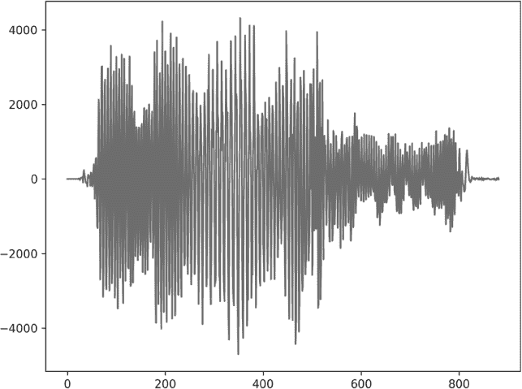
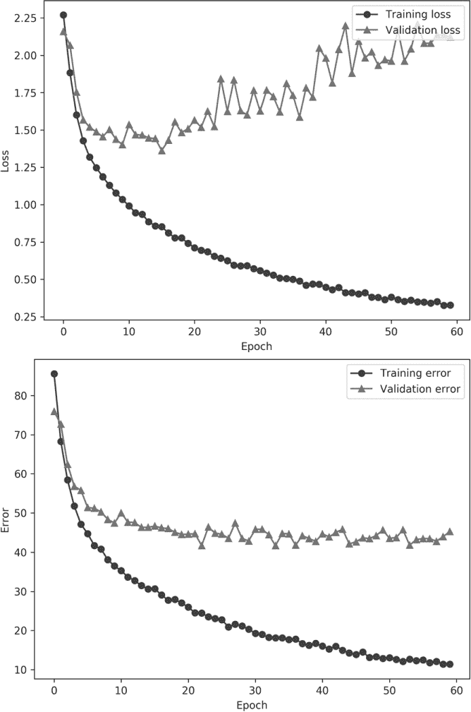
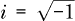
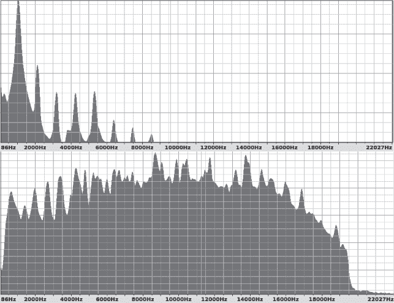
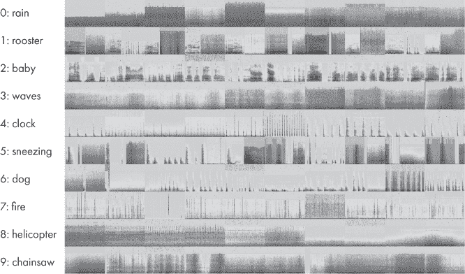
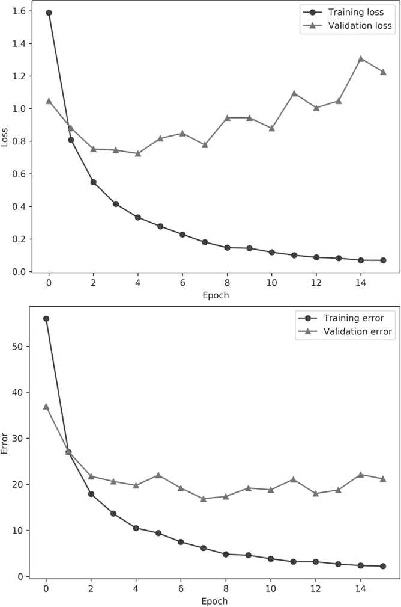

## 第十五章：一个案例研究：分类音频样本**


让我们将整本书中学到的内容汇总在一起。我们将通过一个单一的案例研究来进行。场景是这样的：我们是数据科学家，老板要求我们为存储为*.wav*文件的音频样本构建一个分类器。我们将从数据本身开始。首先，我们希望构建一些基本的直觉，了解数据是如何结构化的。从这里开始，我们将构建可以用于训练模型的增强数据集。第一个数据集使用的是音频样本本身，这是一个一维的数据集。我们会发现，这种方法并不像我们希望的那样成功。

然后，我们将把音频数据转化为图像，以便我们可以探索二维卷积神经网络（CNN）。这种表示方式的变化将大大改善模型的表现。最后，我们将通过集成多个模型，看看如何利用单个模型的相对优势和劣势来进一步提升整体表现。

### 构建数据集

数据集中有 10 个类别，总共 400 个样本，每个类别 40 个样本，每个样本时长为 5 秒。我们假设我们不能再获得更多的数据，因为录制样本并进行标注是费时且昂贵的。我们必须使用我们已经得到的数据，不能再增加其他数据。

在本书中，我们始终强调拥有良好数据集的重要性。我们假设我们得到的数据集是完整的，也就是说，我们的系统将只会遇到数据集中已存在的音频样本类型，不会有未知的类别。此外，我们还假设数据集的平衡性是真实的，所有类别的样本都是等可能的。

我们将使用的音频数据集叫做 ESC-10。有关完整的描述，请参阅 Karol J. Piczal（2015 年）的《ESC: Dataset for Environmental Sound Classification》。数据集可以在[`github.com/karoldvl/ESC-50/`](https://github.com/karoldvl/ESC-50/)找到。但它需要从更大的 ESC-50 数据集中提取，而该数据集没有我们可以使用的许可证。ESC-10 子集是有许可证的。

让我们进行一些预处理，从更大的 ESC-50 数据集中提取 ESC-10 *.wav*文件。从上面的 URL 下载数据集的单个 ZIP 文件版本并解压。这将创建一个名为*ESC-50-master*的目录。然后，使用 Listing 15-1 中的代码从中构建 ESC-10 数据集。

import sys

import os

import shutil

classes = {

"rain":0,

"rooster":1,

"crying_baby":2,

"sea_waves":3,

"clock_tick":4,

"sneezing":5,

"dog":6,

"crackling_fire":7,

"helicopter":8,

"chainsaw":9,

}

with open("ESC-50-master/meta/esc50.csv") as f:

lines = [i[:-1] for i in f.readlines()]

lines = lines[1:]

os.system("rm -rf ESC-10")

os.system("mkdir ESC-10")

os.system("mkdir ESC-10/audio")

meta = []

for line in lines:

t = line.split(",")

if (t[-3] == 'True'):

meta.append("ESC-10/audio/%s %d" % (t[0], classes[t[3]]))

src = "ESC-50-master/audio/"+t[0]

dst = "ESC-10/audio/"+t[0]

shutil.copy(src,dst)

with open("ESC-10/filelist.txt","w") as f:

for m in meta:

f.write(m+"\n")

*Listing 15-1: 构建 ESC-10 数据集*

这段代码使用 ESC-50 的元数据来识别属于 ESC-10 数据集 10 个类别的声音样本，然后将它们复制到 *ESC-10/audio* 目录。它还将音频文件的列表写入 *filelist.txt*。运行这段代码后，我们将只使用 ESC-10 文件。

如果一切顺利，我们现在应该拥有 400 个 5 秒钟的 *.wav* 文件，每个类别 40 个：雨声、雄鸡叫、婴儿哭声、海浪声、时钟滴答声、打喷嚏声、狗叫、火焰噼啪声、直升机声和链锯声。我们会有礼貌地避免问老板她为什么想区分这些特定类别的声音。

#### 数据集增强

我们的第一直觉应该是数据集太小了。毕竟，我们每种声音只有 40 个样本，而且我们知道其中一些将需要保留用于测试，这样每个类别用于训练的数据就更少了。

我们可以采用 *k* 折交叉验证，但在这种情况下，我们将选择数据增强。那么，如何增强音频数据呢？

记住，数据增强的目标是创建新的数据样本，这些样本看起来应该来自数据集中的某个类别。对于图像，我们可以进行明显的变化，比如平移、左右翻转等。对于连续向量，我们已经看到如何使用 PCA 来增强数据（参见 第五章）。为了增强音频文件，我们需要考虑一些方法来生成新文件，同时保持它们听起来像原始类别。这里有四个思路。

首先，我们可以在时间上平移样本，就像我们可以将图像平移几像素一样。第二，我们可以通过在声音中添加少量随机噪声来模拟嘈杂的环境。第三，我们可以改变声音的音高，使其升高或降低一些。毫不奇怪，这就是 *音高变化*。最后，我们可以在时间上延长或压缩声音，这被称为 *时间变化*。

做这一切听起来很复杂，尤其是如果我们之前没有处理过音频数据。我应该指出，实际上，面对陌生的数据是一个非常真实的可能性；我们不总是能选择需要处理的数据。

幸运的是，我们正在使用 Python，而且 Python 社区非常庞大且充满才华。事实证明，向我们的系统中添加一个库就可以轻松实现时间拉伸和音高变化。让我们安装 `librosa` 库。这应该能解决我们的需求：

```py
$ sudo pip3 install librosa
```

安装了必要的库后，我们可以使用 Listing 15-2 中的代码来增强 ESC-10 数据集。

import os

import random

import numpy as np

from scipy.io.wavfile import read, write

import librosa as rosa

N = 8

os.system("rm -rf augmented; mkdir augmented")

os.system("mkdir augmented/train augmented/test")

❶ src_list = [i[:-1] for i in open("ESC-10/filelist.txt")]

z = [[] for i in range(10)]

for s in src_list:

_,c = s.split()

z[int(c)].append(s)

❷ train = []

test = []

for i in range(10):

p = z[i]

random.shuffle(p)

test += p[:8]

train += p[8:]

random.shuffle(train)

random.shuffle(test)

augment_audio(train, "train")

augment_audio(test, "test")

*列表 15-2：增强 ESC-10 数据集，第一部分*

该代码加载了必要的模块，包括`librosa`模块（我们将其简称为`rosa`），以及来自 SciPy `wavfile`模块的两个函数，允许我们将 NumPy 数组读写为*.wav*文件。

我们设置每个类别的测试样本数（`N=8`），并创建输出目录（即增强后的声音文件所在的目录，命名为`augmented`）。然后，我们读取通过列表 15-1 创建的文件列表❶。接下来，我们创建一个嵌套列表（`z`），用于存储与 10 个类别相关联的音频文件名。

使用每个类别的文件列表，我们将其拆分并创建`train`和`test`文件列表❷。注意，我们对每个类别的文件列表和最终的`train`与`test`列表进行了随机打乱。该代码遵循了我们在第四章中讨论的先分离训练集和测试集，再进行增强的惯例。

我们可以通过调用`augment_audio`来增强训练和测试文件。这个函数在列表 15-3 中。

def augment_audio(src_list, typ):

flist = []

for i,s in enumerate(src_list):

f,c = s.split()

❶ wav = read(f) # (采样率, 数据)

base = os.path.abspath("augmented/%s/%s" %

(typ, os.path.basename(f)[:-4]))

fname = base+".wav"

❷ write(fname, wav[0], wav[1])

flist.append("%s %s" % (fname,c))

for j in range(19):

d = augment(wav)

fname = base+("_%04d.wav" % j)

❸ write(fname, wav[0], d.astype(wav[1].dtype))

flist.append("%s %s" % (fname,c))

random.shuffle(flist)

with open("augmented_%s_filelist.txt" % typ,"w") as f:

for z in flist:

f.write("%s\n" % z)

*列表 15-3：增强 ESC-10 数据集，第二部分*

这个函数遍历给定列表中的所有文件名（`src_list`），该列表可以是训练集或测试集。文件名与类别标签分开，然后从磁盘读取文件❶。如注释所示，`wav`是一个包含两个元素的列表。第一个是采样率（单位：Hz，每秒周期数），即模拟波形被数字化生成*.wav*文件的频率。对于 ESC-10 数据集，采样率始终为 44,100 Hz，这是 CD 的标准采样率。第二个元素是一个 NumPy 数组，包含实际的数字化声音样本。这些值将被增强以生成新的数据文件。

在设置一些输出路径后，我们将原始声音样本写入增强目录❷。然后，我们开始一个循环，生成当前声音样本的另外 19 个增强版本。增强后的数据集整体上会变大 20 倍，总共有 8,000 个声音文件，其中 6,400 个用于训练，1,600 个用于测试。请注意，增强源文件的声音样本分配给`d`。新声音文件以 44,100 Hz 的采样率写入磁盘，并且增强数据与源数据的类型相匹配❸。

在创建增强声音文件时，我们还会跟踪文件名和类别，并将其写入一个新的文件列表。这里`typ`是一个字符串，表示训练（train）或测试（test）。

这个函数调用了另一个函数`augment`。这个函数通过随机应用先前提到的四种增强策略中的某些子集（包括移位、噪声、音高移位或时间移位），生成单个声音文件的增强版本。任何对`augment`的调用可能会使用这些策略中的某些或全部。`augment`函数本身见于清单 15-4。

def augment(wav):

sr = wav[0]

d = wav[1].astype("float32")

❶ 如果 (random.random() < 0.5):

s = int(sr/4.0*(np.random.random()-0.5))

d = np.roll(d,s)

if (s < 0):

d[s:] = 0

else:

d[:s] = 0

❷ 如果 (random.random() < 0.5):

d += 0.1*(d.max()-d.min())*np.random.random(d.shape[0])

❸ 如果 (random.random() < 0.5):

pf = 20.0*(np.random.random()-0.5)

d = rosa.effects.pitch_shift(d, sr, pf)

❹ 如果 (random.random() < 0.5):

rate = 1.0 + (np.random.random()-0.5)

d = rosa.effects.time_stretch(d,rate)

if (d.shape[0] > wav[1].shape[0]):

d = d[:wav[1].shape[0]]

else:

w = np.zeros(wav[1].shape[0], dtype="float32")

w[:d.shape[0]] = d

d = w.copy()

return d

*清单 15-4: 增强 ESC-10 数据集，第三部分*

这个函数将样本（`d`）与采样率（`sr`）分开，并确保样本是浮动点数。对于 ESC-10，源样本都是`int16`类型（有符号 16 位整数）。接下来是四个`if`语句。每个语句会生成一个随机浮动数，如果该浮动数小于 0.5，我们就会执行`if`的主体。这意味着我们以 50%的概率应用每种可能的增强。

第一个`if`通过滚动 NumPy 数组（向量）`d`，按一定数量的样本`s`来移位声音样本❶。这个值最多为八分之一秒，即`sr/4.0`。注意，移位可以是正向或负向。`sr/4.0`表示四分之一秒的样本数。然而，随机浮动数的范围是[*–*0.5, +0.5]，因此最终的移位最大为八分之一秒。如果移位为负，我们需要将数据末尾的样本置零；否则，我们将数据开始的样本置零。

随机噪声是通过将一个随机值（最大为音频信号范围的十分之一）加回去来添加的❷。播放时，这会产生嘶嘶声，类似于老式卡带录音带上的噪声。

接下来使用`librosa`进行音高移位。音高移位以音符步进或其分数表示。我们在范围[*–*10,+10]内随机选取一个浮动值（`pf`），并将其与数据（`d`）和采样率（`sr`）一起传递给`librosa`的`pitch_shift`效果函数 ❸。

最后的增强操作使用`librosa`函数进行时间拉伸或压缩（`time_stretch`）❹。我们使用一个在[*–*0.5,+0.5]范围内的时间量（`rate`）来进行调整。如果时间被拉伸，我们需要截断多余的样本，以确保样本长度保持不变。如果时间被压缩，我们需要在末尾添加零样本。

最后，我们返回新的、增强后的样本。

运行 Listing 15-2 中的代码会创建一个新的*增强*数据目录，包含子目录*train*和*test*。这些是我们接下来要使用的原始音频文件。我鼓励你听听其中的一些文件，以了解增强操作所做的修改。文件名应该能帮助你快速区分原始文件和增强文件。

#### 数据预处理

我们准备好开始构建模型了吗？还没有。我们的经验告诉我们，数据集太小了，因此我们进行了增强。但我们还没有将原始数据转化成可以传递给模型的格式。

一个初步的想法是使用原始音频样本。这些样本已经是代表音频信号的向量，样本之间的时间间隔由采样率 44,100 Hz 确定。但我们不想直接使用这些样本。每个样本都是精确的五秒钟长。以每秒 44,100 个样本计算，这意味着每个样本是一个包含 44,100 × 5 = 220,500 个样本的向量。这个长度对于我们有效处理来说太长了。

经过进一步思考，我们或许能够说服自己，区分哭泣的婴儿和叫喊的狗可能不需要如此高的采样率。如果我们不保留所有样本，而是仅保留每第 100 个样本呢？此外，我们真的需要五秒钟的音频数据来识别声音吗？如果我们只保留前两秒钟的数据呢？

让我们只保留每个音频文件的前两秒钟，即 88,200 个样本。而且我们只保留每第 100 个样本，这样每个音频文件现在就变成了一个包含 882 个元素的向量。这几乎与解开的 MNIST 数字图像一样，我们知道我们可以有效地处理这些数据。

Listing 15-5 包含了构建我们将用来建立模型的实际数据集初始版本的代码。

import os

import random

import numpy as np

from scipy.io.wavfile import read

sr = 44100 # Hz

N = 2*sr    # 保留的样本数

w = 100    # 每隔 100

afiles = [i[:-1] for i in open("augmented_train_filelist.txt")]

trn = np.zeros((len(afiles),N//w,1), dtype="int16")

lbl = np.zeros(len(afiles), dtype="uint8")

for i,t in enumerate(afiles):

❶ f,c = t.split()

trn[i,:,0] = read(f)[1][:N:w]

lbl[i] = int(c)

np.save("esc10_raw_train_audio.npy", trn)

np.save("esc10_raw_train_labels.npy", lbl)

afiles = [i[:-1] for i in open("augmented_test_filelist.txt")]

tst = np.zeros((len(afiles),N//w,1), dtype="int16")

lbl = np.zeros(len(afiles), dtype="uint8")

for i,t in enumerate(afiles):

f,c = t.split()

tst[i,:,0] = read(f)[1][:N:w]

lbl[i] = int(c)

np.save("esc10_raw_test_audio.npy", tst)

np.save("esc10_raw_test_labels.npy", lbl)

*示例 15-5：构建减少样本数据集*

这段代码构建了包含原始数据的训练和测试 NumPy 文件。这些数据来自我们在示例 15-2 中构建的增强音频文件。文件列表包含文件位置和类别标签❶。我们加载列表中的每个文件，并将其放入数组中，分别是训练数组或测试数组。

我们有一个一维特征向量和一些训练或测试文件，因此我们可能需要一个二维数组来存储数据，训练集为 6400 × 882 或测试集为 1600 × 882。然而，我们知道最终会使用 Keras，而且 Keras 需要一个表示通道数的维度，因此我们将数组定义为 6400 × 882 × 1 和 1600 × 882 × 1。此代码中最重要的一行是：

```py
trn[i,:,0] = read(f)[1][:N:w]
```

它读取当前的音频文件，仅保留音频样本（`[1]`），并从音频样本中仅保留前两秒，每隔第 100 个样本提取一次，`[:N:w]`。花些时间理解这段代码。如果你感到困惑，我建议在交互式 Python 环境中尝试使用 NumPy 来理解它的作用。

最终，我们得到了训练和测试文件，这些文件包含 882 元素的向量和相关标签。我们将使用这些数据构建我们的第一个模型。图 15-1 显示了哭泣婴儿的特征向量。



*图 15-1：哭泣婴儿的特征向量*

x 轴是样本编号（可以理解为“时间”），y 轴是样本值。

### 分类音频特征

我们已经有了训练集和测试集。让我们构建一些模型，看看它们的表现如何。由于我们有特征向量，可以很快地开始使用经典模型。之后，我们可以构建一些一维卷积神经网络，看看它们是否表现得更好。

#### 使用经典模型

我们可以使用在第七章中使用的同一组经典模型来测试乳腺癌数据集。示例 15-6 包含了设置代码。

import numpy as np

from sklearn.neighbors import NearestCentroid

from sklearn.neighbors import KNeighborsClassifier

from sklearn.naive_bayes import GaussianNB

from sklearn.ensemble import RandomForestClassifier

from sklearn.svm import LinearSVC

x_train = np.load("esc10_raw_train_audio.npy")[:,:,0]

y_train = np.load("esc10_raw_train_labels.npy")

(*\pagebreak*)

x_test = np.load("esc10_raw_test_audio.npy")[:,:,0]

y_test = np.load("esc10_raw_test_labels.npy")

❶ x_train = (x_train.astype('float32') + 32768) / 65536

x_test = (x_test.astype('float32') + 32768) / 65536

train(x_train, y_train, x_test, y_test)

*示例 15-6：使用经典模型对音频特征进行分类，第一部分*

在这里，我们导入必要的模型类型，加载数据集，进行缩放，然后调用一个`train`函数，我们稍后会介绍。

缩放在这里至关重要。考虑图 15-1 的 y 轴范围。它从大约–4000 到 4000。我们需要对数据进行缩放，以便范围更小，且数值更接近于围绕 0 中心。回想一下，对于 MNIST 和 CIFAR-10 数据集，我们通过最大值进行除法，将数据缩放到[0,1]。

声音样本是 16 位带符号整数。这意味着它们可以取的值的完整范围是[*–*32,768,+32,767]。如果我们将样本转换为浮点数，添加 32,768，然后除以 65,536（即两倍的最小值）❶，我们将得到范围在 0,1)之间的样本，这正是我们所需要的。

训练和评估经典模型是直观的，如[示例 15-7 所示。

def run(x_train, y_train, x_test, y_test, clf):

clf.fit(x_train, y_train)

score = 100.0*clf.score(x_test, y_test)

print("score = %0.2f%%" % score)

def train(x_train, y_train, x_test, y_test):

print("最近质心          : ", end='')

run(x_train, y_train, x_test, y_test, NearestCentroid())

print("k-NN 分类器（k=3）     : ", end='')

run(x_train, y_train, x_test, y_test, KNeighborsClassifier(n_neighbors=3))

print("k-NN 分类器（k=7）     : ", end='')

run(x_train, y_train, x_test, y_test, KNeighborsClassifier(n_neighbors=7))

print("朴素贝叶斯（高斯）    : ", end='')

run(x_train, y_train, x_test, y_test, GaussianNB())

print("随机森林 (树木= 5) : ", end='')

run(x_train, y_train, x_test, y_test,

RandomForestClassifier(n_estimators=5))

print("随机森林 (树木= 50) : ", end='')

run(x_train, y_train, x_test, y_test,

RandomForestClassifier(n_estimators=50))

print("随机森林 (树木=500) : ", end='')

run(x_train, y_train, x_test, y_test,

RandomForestClassifier(n_estimators=500))

print("随机森林 (树木=1000): ", end='')

run(x_train, y_train, x_test, y_test,

RandomForestClassifier(n_estimators=1000))

print("LinearSVM (C=0.01)        : ", end='')

run(x_train, y_train, x_test, y_test, LinearSVC(C=0.01))

print("LinearSVM (C=0.1)         : ", end='')

run(x_train, y_train, x_test, y_test, LinearSVC(C=0.1))

print("LinearSVM (C=1.0)         : ", end='')

run(x_train, y_train, x_test, y_test, LinearSVC(C=1.0))

print("LinearSVM (C=10.0)        : ", end='')

run(x_train, y_train, x_test, y_test, LinearSVC(C=10.0))

*示例 15-7：使用经典模型对音频特征进行分类，第二部分*

`train`函数创建特定的模型实例，然后调用`run`。我们在第七章中看到过这种相同的代码结构。`run`函数使用`fit`来训练模型，并使用`score`来在测试集上评估模型。暂时，我们将仅根据模型的总体准确度（得分）来评估这些模型。运行这段代码会产生类似如下的输出：

```py
Nearest Centroid          : score = 11.9%

k-NN classifier (k=3)     : score = 12.1%

k-NN classifier (k=7)     : score = 10.5%

Naive Bayes (Gaussian)    : score = 28.1%

Random Forest (trees=  5) : score = 22.6%

Random Forest (trees= 50) : score = 30.8%

Random Forest (trees=500) : score = 32.8%

Random Forest (trees=1000): score = 34.4%

LinearSVM (C=0.01)        : score = 16.5%

LinearSVM (C=0.1)         : score = 17.5%

LinearSVM (C=1.0)         : score = 13.4%

LinearSVM (C=10.0)        : score = 10.2%
```

我们很快就能看到经典模型表现得非常糟糕。其中许多模型基本上是在猜测类别标签。总共有 10 个类别，所以随机猜测的准确率应该大约为 10%。表现最好的经典模型是一个拥有 1,000 棵树的随机森林，但即使如此，它的表现也仅为 34.44%——总体准确率远远不足以使该模型在大多数情况下可用。数据集并不简单，至少对于老式方法来说并非如此。有些令人惊讶的是，高斯朴素贝叶斯模型的准确率达到了 28%。请回忆，高斯朴素贝叶斯模型期望样本彼此独立。在这里，特定测试输入的声音样本之间的独立性假设是不成立的。在这种情况下，特征向量表示的是随时间演变的信号，而不是彼此独立的特征集合。

失败最多的模型是最近质心、*k*-NN 和线性 SVM。我们有一个相当高维的输入，882 个元素，但训练集中只有 6,400 个元素。这对于最近邻分类器来说可能是太少的样本，因为特征空间的稀疏性太高。再次，维度灾难的问题又出现了。线性 SVM 失败是因为特征似乎不是线性可分的。我们没有尝试 RBF（高斯核）SVM，但我们将其留给读者作为一个练习。如果你尝试了它，请记住现在有两个超参数要调整：*C*和*γ*。

#### 使用传统神经网络

我们还没有尝试传统的神经网络。我们可以像之前那样使用 sklearn 的`MLPClassifier`类，但现在是展示如何在 Keras 中实现传统网络的好时机。列表 15-8 包含了代码。

import keras

from keras.models import Sequential

from keras.layers import Dense, Dropout, Flatten

from keras import backend as K

import numpy as np

batch_size = 32

num_classes = 10

epochs = 16

nsamp = (882,1)

x_train = np.load("esc10_raw_train_audio.npy")

y_train = np.load("esc10_raw_train_labels.npy")

x_test  = np.load("esc10_raw_test_audio.npy")

y_test  = np.load("esc10_raw_test_labels.npy")

x_train = (x_train.astype('float32') + 32768) / 65536

x_test = (x_test.astype('float32') + 32768) / 65536

y_train = keras.utils.to_categorical(y_train, num_classes)

y_test = keras.utils.to_categorical(y_test, num_classes)

model = Sequential()

model.add(Dense(1024, activation='relu', input_shape=nsamp))

model.add(Dropout(0.5))

model.add(Dense(512, activation='relu'))

model.add(Dropout(0.5))

model.add(Flatten())

model.add(Dense(num_classes, activation='softmax'))

model.compile(loss=keras.losses.categorical_crossentropy,

optimizer=keras.optimizers.Adam(),

metrics=['accuracy'])

model.fit(x_train, y_train,

batch_size=batch_size,

epochs=epochs,

verbose=0,

validation_data=(x_test, y_test))

(*\pagebreak*)

score = model.evaluate(x_test, y_test, verbose=0)

print('测试准确率:', score[1])

*清单 15-8：Keras 中的传统神经网络*

在加载必要的模块后，我们加载数据并像处理经典模型时一样进行缩放。接下来，我们构建模型架构。我们只需要`Dense`层和`Dropout`层。为了消除额外的维度（注意`nsamp`的形状），我们在最终的 softmax 输出之前加了一个`Flatten`层。不幸的是，这个模型对我们没有改善效果：我们只得到了 27.6%的准确率。

#### 使用卷积神经网络

经典模型和传统神经网络无法胜任。我们不应感到太惊讶，但尝试它们也很简单。接下来，我们将应用一维卷积神经网络（CNN）来看看它是否表现得更好。

我们还没有使用过一维的 CNN。除了输入数据的结构外，唯一的区别是我们将`Conv2D`和`MaxPooling2D`的调用替换为`Conv1D`和`MaxPooling1D`的调用。

我们将尝试的第一个模型的代码显示在清单 15-9 中。

import keras

from keras.models import Sequential

from keras.layers import Dense, Dropout, Flatten

from keras.layers import Conv1D, MaxPooling1D

import numpy as np

batch_size = 32

num_classes = 10

epochs = 16

nsamp = (882,1)

x_train = np.load("esc10_raw_train_audio.npy")

y_train = np.load("esc10_raw_train_labels.npy")

x_test = np.load("esc10_raw_test_audio.npy")

y_test = np.load("esc10_raw_test_labels.npy")

x_train = (x_train.astype('float32') + 32768) / 65536

x_test = (x_test.astype('float32') + 32768) / 65536

y_train = keras.utils.to_categorical(y_train, num_classes)

y_test = keras.utils.to_categorical(y_test, num_classes)

model = Sequential()

model.add(Conv1D(32, kernel_size=3, activation='relu',

input_shape=nsamp))

model.add(MaxPooling1D(pool_size=3))

model.add(Dropout(0.25))

model.add(Flatten())

model.add(Dense(512, activation='relu'))

model.add(Dropout(0.5))

model.add(Dense(num_classes, activation='softmax'))

model.compile(loss=keras.losses.categorical_crossentropy,

optimizer=keras.optimizers.Adam(),

metrics=['accuracy'])

history = model.fit(x_train, y_train,

batch_size=batch_size,

epochs=epochs,

verbose=1,

validation_data=(x_test[:160], y_test[:160]))

score = model.evaluate(x_test[160:], y_test[160:], verbose=0)

print('测试准确率:', score[1])

*清单 15-9：Keras 中的 1D CNN*

这个模型和之前一样加载并预处理数据集。这个架构，我们称之为*浅层*架构，只有一个卷积层，包含 32 个大小为 3 的滤波器。我们会像尝试不同的 2D 卷积核大小一样，变化这个卷积核大小。`Conv1D`层之后是一个大小为 3 的最大池化层。接下来是`Dropout`层和`Flatten`层，最后是一个包含 512 个节点的`Dense`层，并添加了 dropout。最后是一个 softmax 层来完成架构。

我们将训练 16 个周期，使用批量大小 32。我们会保留训练历史，以便能够查看每个周期的损失和验证性能。共有 1,600 个测试样本。我们将使用 10%的数据作为训练验证，剩余的 90%用于整体准确度。最后，我们将尝试将`Conv1D`的内核大小从 3 到 33 进行变化，以寻找一个与训练数据配合良好的大小。  

让我们定义另外四种架构。我们将它们分别称为*medium*、*deep0*、*deep1*和*deep2*。由于没有处理过这些数据的经验，尝试多种架构是有意义的。目前，我们无法提前知道对于新数据集来说，最好的架构是什么。我们唯一能依靠的就是之前的经验。  

Listing 15-10 列出了具体的架构，并用注释分隔开。  

# medium  

model = Sequential()  

model.add(Conv1D(32, kernel_size=3, activation='relu',  

input_shape=nsamp))  

model.add(Conv1D(64, kernel_size=3, activation='relu'))  

model.add(Conv1D(64, kernel_size=3, activation='relu'))

model.add(MaxPooling1D(pool_size=3))  

model.add(Dropout(0.25))  

model.add(Flatten())  

model.add(Dense(512, activation='relu'))  

model.add(Dropout(0.5))  

model.add(Dense(num_classes, activation='softmax'))  

# deep0  

model = Sequential()  

model.add(Conv1D(32, kernel_size=3, activation='relu',  

input_shape=nsamp))  

model.add(Conv1D(64, kernel_size=3, activation='relu'))  

model.add(Conv1D(64, kernel_size=3, activation='relu'))  

model.add(MaxPooling1D(pool_size=3))  

model.add(Dropout(0.25))  

model.add(Conv1D(64, kernel_size=3, activation='relu'))  

model.add(Conv1D(64, kernel_size=3, activation='relu'))  

model.add(MaxPooling1D(pool_size=3))  

model.add(Dropout(0.25))  

model.add(Flatten())  

model.add(Dense(512, activation='relu'))  

model.add(Dropout(0.5))  

model.add(Dense(num_classes, activation='softmax'))  

# deep1  

model = Sequential()  

model.add(Conv1D(32, kernel_size=3, activation='relu',  

input_shape=nsamp))  

model.add(Conv1D(64, kernel_size=3, activation='relu'))  

model.add(Conv1D(64, kernel_size=3, activation='relu'))  

model.add(MaxPooling1D(pool_size=3))  

model.add(Dropout(0.25))  

model.add(Conv1D(64, kernel_size=3, activation='relu'))  

model.add(Conv1D(64, kernel_size=3, activation='relu'))  

model.add(MaxPooling1D(pool_size=3))  

model.add(Dropout(0.25))  

model.add(Conv1D(64, kernel_size=3, activation='relu'))  

model.add(Conv1D(64, kernel_size=3, activation='relu'))  

model.add(MaxPooling1D(pool_size=3))  

model.add(Dropout(0.25))  

model.add(Flatten())  

model.add(Dense(512, activation='relu'))  

model.add(Dropout(0.5))  

model.add(Dense(num_classes, activation='softmax'))  

# deep2  

model = Sequential()  

model.add(Conv1D(32, kernel_size=3, activation='relu',  

input_shape=nsamp))  

model.add(Conv1D(64, kernel_size=3, activation='relu'))  

model.add(Conv1D(64, kernel_size=3, activation='relu'))  

model.add(MaxPooling1D(pool_size=3))  

model.add(Dropout(0.25))  

model.add(Conv1D(64, kernel_size=3, activation='relu'))  

model.add(Conv1D(64, kernel_size=3, activation='relu'))

model.add(MaxPooling1D(pool_size=3))

model.add(Dropout(0.25))

model.add(Conv1D(64, kernel_size=3, activation='relu'))

model.add(Conv1D(64, kernel_size=3, activation='relu'))

model.add(MaxPooling1D(pool_size=3))

model.add(Dropout(0.25))

model.add(Conv1D(64, kernel_size=3, activation='relu'))

model.add(Conv1D(64, kernel_size=3, activation='relu'))

model.add(MaxPooling1D(pool_size=3))

model.add(Dropout(0.25))

model.add(Flatten())

model.add(Dense(512, activation='relu'))

model.add(Dropout(0.5))

model.add(Dense(num_classes, activation='softmax'))

*列表 15-10：不同的 1D CNN 架构*

如果我们训练多个模型，每次改变第一个`Conv1D`卷积核的大小，就能得到表 15-1 中的结果。我们已经标出每种架构下表现最好的模型。

**表 15-1：** 通过卷积核大小和模型架构测试集准确率

| **核大小** | **浅层** | **中层** | **深层 0** | **深层 1** | **深层 2** |
| --- | --- | --- | --- | --- | --- |
| 3 | **44.51** | 41.39 | **48.75** | **54.03** | 9.93 |
| 5 | 43.47 | 41.74 | 44.72 | 53.96 | 48.47 |
| 7 | 38.47 | 40.97 | 46.18 | 52.64 | 49.31 |
| 9 | 41.46 | **43.06** | 46.88 | 48.96 | 9.72 |
| 11 | 39.65 | 40.21 | 45.21 | 52.99 | 10.07 |
| 13 | 42.71 | 41.67 | 46.53 | 50.56 | **52.57** |
| 15 | 40.00 | 42.78 | 46.53 | 50.14 | 47.08 |
| 33 | 27.57 | 42.22 | 41.39 | 48.75 | 9.86 |

看表 15-1，我们可以看到一个普遍的趋势，即随着模型深度的增加，准确率逐渐提高。然而，在深层 2 模型下，情况开始变差。部分模型未能收敛，显示出与随机猜测相当的准确率。深层 1 模型在所有卷积核大小下表现最佳。在不同的卷积核大小下，宽度为 3 的卷积核在五种架构中有三种表现最好。所有这些都表明，对于 1D 卷积神经网络，最佳的组合是使用宽度为 3 的初始卷积核和深层 1 架构。

我们只训练了这个架构 16 个周期。如果我们训练更多周期，结果会有所改善吗？让我们训练深层 1 模型 60 个周期，并绘制训练和验证的损失及错误，看看它们是否收敛（或者没有）。这样做会产生图 15-2，我们可以看到训练和验证损失（顶部）以及错误（底部）随着周期数变化的情况。



*图 15-2：深层 1 架构的训练和验证损失（顶部）以及错误（底部）*

立即，我们应该注意到验证集的损失突然爆炸。训练损失持续减少，直到大约第 18 个周期左右，然后验证损失开始上升并变得波动。这是过拟合的明显例子。导致这种过拟合的可能原因是我们的训练集规模有限，只有 6400 个样本，即使经过了数据增强。验证误差在最初下降后保持大致恒定。结论是，我们不能指望在使用一维向量的情况下，对这个数据集的总体准确率做得更好，最多大约是 54%。

如果我们想要改进，我们需要对我们的数据集进行更具表现力的处理。幸运的是，我们还有另一个预处理技巧可以使用。

### 声谱图

让我们回到扩充后的音频文件集。为了构建数据集，我们提取了声音样本，只保留了 2 秒钟的样本，并且只选取每 100 个样本中的一个。我们能做到的最好结果是准确率略高于 50%。

然而，如果我们仅使用输入音频文件中的一小段声音样本，例如 200 毫秒的样本，我们可以使用这些样本的向量来计算*傅里叶变换*。在规则时间间隔内测量的信号的傅里叶变换告诉我们构建该信号所使用的频率。任何信号都可以看作是许多不同的正弦波和余弦波的和。如果信号只由少数几个波形组成，比如你可能从短笛等乐器中听到的声音，那么傅里叶变换将会在这些频率上有几个峰值。如果信号很复杂，比如语音或音乐，那么傅里叶变换将包含许多不同的频率，导致多个不同的峰值。

傅里叶变换本身是复值的：每个元素都有实部和虚部。你可以将其写成 *a* + *bi*，其中 *a* 和 *b* 是实数，且。如果我们使用这些量的绝对值，我们将得到一个实数，表示某一特定频率的能量。这被称为信号的*功率谱*。一个简单的音调可能只有几个频率上的能量，而像钹撞击声或白噪声之类的声音将在所有频率之间更均匀地分布能量。图 15-3 展示了两个功率谱。



*图 15-3：短笛（上）和钹（下）的功率谱*

上面是短笛的频谱，下面是钹的撞击声。正如预期，短笛仅在少数几个频率上有能量，而钹则使用了所有频率。对我们来说，重要的一点是，*从视觉上看*，这两个频谱差异非常大。（这些频谱是用 Audacity 制作的，Audacity 是一个出色的开源音频处理工具。）

我们可以使用这些功率谱作为特征向量，但它们仅代表极短时间片段的谱。声音样本的时长为五秒钟。我们将使用*谱图*而不是使用频谱。谱图是由表示单个频谱的列组成的图像。这意味着 x 轴代表时间，y 轴代表频率。像素的颜色与该时间点该频率的能量成正比。

换句话说，**谱图**是我们将功率谱垂直排列并使用颜色来表示给定频率下的强度时得到的结果。通过这种方法，我们可以将整个声音样本转化为一幅图像。例如，图 15-4 展示了一个哭泣婴儿的谱图。可以将其与图 15-1 中的特征向量进行对比。


*图 15-4：哭泣婴儿的谱图*

为了创建增强音频文件的谱图，我们需要一个新的工具和一些代码。我们需要的工具叫做`sox`。它不是 Python 库，而是一个命令行工具。如果你正在使用我们的标准 Ubuntu Linux 发行版，它很可能已经安装。如果没有，你可以安装它：

```py
$ sudo apt-get install sox
```

我们将在 Python 脚本中使用`sox`来生成我们想要的谱图图像。每个声音文件都会变成一张新的谱图图像。

处理训练图像的源代码在清单 15-11 中。

import os

import numpy as np

from PIL import Image

rows = 100

cols = 160

❶ flist = [i[:-1] for i in open("augmented_train_filelist.txt")]

N = len(flist)

img = np.zeros((N,rows,cols,3), dtype="uint8")

lbl = np.zeros(N, dtype="uint8")

p = []

for i,f in enumerate(flist):

src, c = f.split()

❷ os.system("sox %s -n spectrogram" % src)

im = np.array(Image.open("spectrogram.png").convert("RGB"))

❸ im = im[42:542,58:858,:]

im = Image.fromarray(im).resize((cols,rows))

img[i,:,:,:] = np.array(im)

lbl[i] = int(c)

p.append(os.path.abspath(src))

os.system("rm -rf spectrogram.png")

p = np.array(p)

❹ idx = np.argsort(np.random.random(N))

img = img[idx]

lbl = lbl[idx]

p = p[idx]

np.save("esc10_spect_train_images.npy", img)

np.save("esc10_spect_train_labels.npy", lbl)

np.save("esc10_spect_train_paths.npy", p)

*清单 15-11：构建谱图*

我们首先定义谱图的大小。这是模型的输入，我们不希望它太大，因为我们处理输入的大小是有限制的。我们决定将其设为 100×160 像素。然后我们加载训练文件列表❶，并创建 NumPy 数组来存储谱图图像和相关标签。列表`p`将保存每个谱图源的路径，以便我们在某个时候需要回到原始声音文件时使用。一般来说，保存返回源数据集的信息是个好主意。

然后，我们遍历文件列表。获取文件名和类别标签，然后调用 `sox`，传入源声音文件名❷。`sox` 应用程序非常复杂。此处的语法将给定的声音文件转换为名为 *spectrogram.png* 的频谱图图像。我们立即将输出的频谱图加载到 `im` 中，并确保它是一个没有透明层的 RGB 文件（因此调用 `convert("RGB")`）。

`sox` 创建的频谱图有一个包含频率和时间信息的边框。我们只需要频谱图的图像部分，因此我们对图像进行子集化❸。我们使用的索引是通过经验确定的。虽然不太可能，但新版的 `sox` 可能需要调整这些索引，以避免包含任何边框像素。

接下来，我们将频谱图调整大小，使其适应我们的 100×160 像素数组。这是下采样，没错，但希望足够的特征信息仍然保留，可以让模型学习类别之间的差异。我们保留下采样后的频谱图以及相关的类别标签和声音文件路径。

当我们生成了所有的频谱图后，循环结束，我们删除最后一个多余的频谱图 PNG 文件。我们将声音文件路径的列表转换为 NumPy 数组，以便可以像存储图像和标签一样存储它。最后，为了防止任何可能按顺序排序而将同类归为一组的隐式排序，我们随机打乱图像的顺序❹。这样，顺序提取的小批量数据就能代表所有类别的混合。最后，我们将图像、标签和路径名写入磁盘。我们为测试集重复整个过程。

我们是否能够从视觉上区分不同类别的频谱图？如果我们能轻松做到这一点，那么我们就有很好的机会让模型也能区分它们。图 15-5 显示了每一行来自同一类别的 10 个频谱图。



*图 15-5：ESC-10 中每个类别的样本频谱图。每一行展示了来自同一类别的 10 个示例。*

从视觉上来看，我们通常能够区分不同的频谱图，这令人鼓舞。有了这些频谱图，我们可以尝试一些 2D CNN，看看它们是否比 1D CNN 更有效。

### 频谱图分类

为了处理频谱图数据集，我们需要 2D CNN。一个可能的起点是将浅层的 1D CNN 架构转化为 2D，通过将 `Conv1D` 改为 `Conv2D`，将 `MaxPooling1D` 改为 `MaxPooling2D`。然而，如果我们这么做，得到的模型将有 3070 万个参数，这比我们想要处理的要多得多。因此，我们选择一种参数较少的更深层架构，并探索不同的第一个卷积层内核大小的效果。代码见清单 15-12。

import keras

from keras.models import Sequential

from keras.layers import Dense, Dropout, Flatten

from keras.layers import Conv2D, MaxPooling2D

import numpy as np

batch_size = 16

num_classes = 10

epochs = 16

img_rows, img_cols = 100, 160

input_shape = (img_rows, img_cols, 3)

x_train = np.load("esc10_spect_train_images.npy")

y_train = np.load("esc10_spect_train_labels.npy")

x_test = np.load("esc10_spect_test_images.npy")

y_test = np.load("esc10_spect_test_labels.npy")

x_train = x_train.astype('float32') / 255

x_test = x_test.astype('float32') / 255

y_train = keras.utils.to_categorical(y_train, num_classes)

y_test = keras.utils.to_categorical(y_test, num_classes)

model = Sequential()

model.add(Conv2D(32, kernel_size=(3,3), activation='relu',

input_shape=input_shape))

model.add(Conv2D(64, (3, 3), activation='relu'))

model.add(MaxPooling2D(pool_size=(2, 2)))

model.add(Dropout(0.25))

model.add(Conv2D(64, (3, 3), activation='relu'))

model.add(MaxPooling2D(pool_size=(2, 2)))

model.add(Dropout(0.25))

model.add(Flatten())

model.add(Dense(128, activation='relu'))

model.add(Dropout(0.5))

model.add(Dense(num_classes, activation='softmax'))

model.compile(loss=keras.losses.categorical_crossentropy,

optimizer=keras.optimizers.Adam(),

metrics=['accuracy'])

history = model.fit(x_train, y_train,

batch_size=batch_size, epochs=epochs,

verbose=0, validation_data=(x_test, y_test))

score = model.evaluate(x_test, y_test, verbose=0)

print('测试准确率:', score[1])

model.save("esc10_cnn_deep_3x3_model.h5")

*Listing 15-12: 分类声谱图*

在这里，我们使用了大小为 16 的迷你批次，训练 16 个周期，并使用 Adam 优化器。模型架构包含两个卷积层，一个带有丢弃的最大池化层，再一个卷积层，和第二个带丢弃的最大池化层。在 softmax 输出层之前，有一个 128 节点的全连接层。

我们将测试第一卷积层的两种卷积核大小：3 × 3 和 7 × 7。3 × 3 配置示于 Listing 15-12。要更改大小，只需将 `(3,3)` 替换为 `(7,7)`。所有最初的 1D 卷积运行都使用了模型的单次训练进行评估。我们知道，由于随机初始化，即使其他条件不变，训练结果也会略有不同。对于 2D 卷积神经网络，我们将每个模型训练六次，并呈现整体准确率的均值 ± 标准误差。仅此操作，我们得到以下的整体准确率：

| **卷积核大小** | **准确率** |
| --- | --- |
| 3 × 3 | 78.78 ± 0.60% |
| 7 × 7 | 78.44 ± 0.72% |

这表明使用 3 × 3 的初始卷积核大小与 7 × 7 之间没有显著差异。因此，我们将在接下来的训练中继续使用 3 × 3。

Figure 15-6 显示了一个 2D CNN 在声谱图上训练和验证的损失（顶部）和错误（底部）。正如我们在 1D CNN 的情况下所看到的，经过几个周期后，验证错误开始增加。

2D CNN 的表现明显优于 1D CNN：79% 的准确率，而 1D CNN 仅为 54%。对于许多应用来说，这个准确率水平仍然不是特别有用，但对于其他应用可能完全可以接受。尽管如此，我们仍希望能够做得更好。值得注意的是，我们的数据和硬件都有一些限制，因为我们限制在仅使用 CPU 的方法上，这限制了我们愿意等待模型训练的时间。这正是 GPU 性能可以有 25 倍增长的情况有所帮助的地方，假设我们的使用情况允许使用 GPU。例如，如果我们计划在嵌入式系统上运行模型，可能没有 GPU 可用，因此无论如何我们都希望坚持使用较小的模型。



*图 15-6：2D CNN 架构的训练和验证损失（顶部）和错误（底部）*

#### 初始化、正则化和批量归一化

文献告诉我们还有其他一些可以尝试的方法。我们已经增加了数据集，这是一种强大的技术，我们正在使用的是 dropout，另一种强大的技术。我们可以尝试使用新的初始化策略，He 初始化，据称通常比 Glorot 初始化效果更好，后者是 Keras 的默认设置。我们还可以尝试应用 L2 正则化，Keras 将其实现为每层的权重衰减。有关这些技术的刷新，请参阅第十章。

要设置层初始化算法，我们需要向`Conv2D`和第一个`Dense`层添加以下关键字：

```py
kernel_initializer="he_normal"
```

要添加 L2 正则化，我们需要向`Conv2D`和第一个`Dense`层添加以下关键字：

```py
kernel_regularizer=keras.regularizers.l2(0.001)
```

在这里 *λ* = 0.001\. 请记住，*λ* 是 L2 正则化的比例因子。

我们可以测试这些方法的联合效果，但我们选择单独测试它们，以查看它们是否对该数据集有任何影响。与以前相同，训练六个模型得到以下总体准确率：

| **正则化器** | **得分** |
| --- | --- |
| He 初始化 | 78.5 ± 0.5% |
| L2 正则化 | 78.3 ± 0.4% |

从统计上讲，这与先前的结果没有什么不同。在这种情况下，这些方法既不有利也不有害。

批量归一化是另一种经过充分验证的、广泛应用于机器学习社区的技术。我们在第十二章中简要提到了批量归一化。批量归一化正如其名称所示：它对网络层的输入进行归一化，减去每个特征的均值，并除以每个特征的标准差。该层的输出将归一化后的输入乘以一个常数并加上一个偏移量。最终效果是：通过两步过程将输入值映射到新的输出值：首先归一化输入，然后应用线性变换得到输出。线性变换的参数在反向传播过程中学习得到。在推理时，来自数据集学习到的均值和标准差会应用到未知的输入上。

批量归一化一次又一次地证明了其有效性，尤其是在加速训练方面。机器学习研究人员仍在讨论它为什么会如此有效的具体原因。要在 Keras 中使用批量归一化，您只需在网络的卷积层和全连接层之后（以及这些层使用的任何激活函数，如 ReLU 之后）插入批量归一化。已知批量归一化与丢弃法配合使用效果不佳，因此我们也将移除丢弃层。模型代码的相关架构部分显示在列表 15-13 中。

from keras.layers import BatchNormalization

model = Sequential()

model.add(Conv2D(32, kernel_size=(3, 3),

activation='relu', input_shape=input_shape))

model.add(BatchNormalization())

model.add(Conv2D(64, (3, 3), activation='relu'))

model.add(BatchNormalization())

model.add(MaxPooling2D(pool_size=(2, 2)))

model.add(Conv2D(64, (3, 3), activation='relu'))

model.add(BatchNormalization())

model.add(MaxPooling2D(pool_size=(2, 2)))

model.add(Flatten())

model.add(Dense(128, activation='relu'))

model.add(BatchNormalization())

model.add(Dense(num_classes, activation='softmax'))

*列表 15-13：添加批量归一化*

如果我们重复我们的训练过程，六个模型的整体准确率的均值和标准误差报告如下：

批量归一化     75.56 ± 0.59%

这明显低于没有批量归一化，但包括丢弃法时的平均准确率。

#### 检查混淆矩阵

我们在这一节中看到，我们的数据集是一个比较棘手的。数据增强和丢弃法已经有效，但像 ReLU 特定初始化、L2 正则化（权重衰减）甚至批量归一化等其他技术，并没有改善我们的结果。这并不意味着这些技术无效，只是它们对于这个特定的小数据集没有效果。

让我们快速查看使用我们选择的架构生成的某个模型的混淆矩阵。我们之前已经看到如何计算混淆矩阵；我们将在这里展示它，以便进行讨论，并与接下来我们将制作的混淆矩阵进行对比。表 15-2 显示了该矩阵；一如既往，行是实际类别标签，列是模型分配的标签。

**表 15-2：** 声谱图模型的混淆矩阵

| **类别** | **0** | **1** | **2** | **3** | **4** | **5** | **6** | **7** | **8** | **9** |
| --- | --- | --- | --- | --- | --- | --- | --- | --- | --- | --- |
| **0** | **85.6** | 0.0 | 0.0 | 5.6 | 0.0 | 0.0 | 0.0 | 5.0 | 0.6 | 3.1 |
| **1** | 0.0 | **97.5** | 1.2 | 0.0 | 0.6 | 0.6 | 0.0 | 0.0 | 0.0 | 0.0 |
| **2** | 0.0 | 13.8 | **72.5** | 0.6 | 0.6 | 3.8 | 6.2 | 0.0 | 0.6 | 1.9 |
| **3** | 25.0 | 0.0 | 0.0 | **68.1** | 0.0 | 2.5 | 0.6 | 0.0 | 2.5 | 1.2 |
| **4** | 0.6 | 0.0 | 0.0 | 0.0 | **84.4** | 6.2 | 5.0 | 3.8 | 0.0 | 0.0 |
| **5** | 0.0 | 0.0 | 0.6 | 0.0 | 0.0 | **94.4** | 4.4 | 0.6 | 0.0 | 0.0 |
| **6** | 0.0 | 0.0 | 1.2 | 0.0 | 0.0 | 10.6 | **88.1** | 0.0 | 0.0 | 0.0 |
| **7** | 9.4 | 0.0 | 0.6 | 0.0 | 15.6 | 1.9 | 0.0 | **63.8** | 7.5 | 1.2 |
| **8** | 18.1 | 1.9 | 0.0 | 5.6 | 0.0 | 1.2 | 2.5 | 6.9 | **55.6** | 8.1 |
| **9** | 7.5 | 0.0 | 8.1 | 0.6 | 0.0 | 0.6 | 0.0 | 1.9 | 10.0 | **71.2** |

表现最差的三个类别是直升机（8）、火灾（7）和波浪（3）。波浪和直升机最常被误识别为雨（0），而火灾则最常被误识别为时钟（4）和雨。表现最好的类别是公鸡（1）和打喷嚏（5）。这些结果是有道理的。公鸡的打鸣和人类打喷嚏是截然不同的声音，没有什么声音能像它们一样。但很容易理解，波浪和直升机可能会与雨声混淆，或者火灾的噼啪声可能会与时钟的滴答声混淆。

这是否意味着我们只能停留在 78.8% 的准确率上？不，我们还有一个方法可以尝试。我们一直在训练和评估单个模型的性能。没有什么阻止我们训练多个模型并将它们的结果结合起来。这就是 *集成学习*。我们在第六章和第九章讨论丢弃法时简要介绍了集成学习。现在，让我们直接使用这个思想，看看能否提高我们的声音样本分类器的性能。

### 集成学习

集成学习的核心思想是利用多个在相同或极其相似的数据集上训练的模型的输出并将它们结合起来。它体现了“群体智慧”这一概念：一个模型可能在某些类别或某类输入上比另一个模型表现更好，因此如果它们合作，可能得到比单独模型更好的最终结果。

在这里，我们将使用上一节中使用的相同机器学习架构。我们的不同模型将是使用 spectrogram 作为输入的这个架构的不同训练。这是集成方法的一种较弱形式。通常，集成中的模型彼此差异较大，要么是神经网络的不同架构，要么是完全不同类型的模型，如随机森林和 *k* 最近邻。在这里，模型之间的变化来自于网络的随机初始化以及训练停止时网络所处的不同损失景观区域。

我们的方法是这样的：

1.  使用 spectrogram 数据集训练多个模型 (*n* = 6)。

1.  以某种方式将这些模型在测试集上的 softmax 输出结合起来。

1.  使用组合结果输出进行预测，分配类别标签。

我们希望，在结合单个模型输出后分配的类别标签集，比仅使用单一模型架构分配的标签集要优越。直观上，我们认为这种方法应该带来一些好处。这是有道理的。

然而，一个问题立即出现了：我们如何最好地结合单个网络的输出？对于这个问题，我们有完全的自由度。我们寻找的是一个 *f* ()，使得

*y*[predict] = *f*(*y*[0], *y*[1], *y*[2], … , *y[n]*)

其中 *y*[*i*], *i* = 0, 1, …, *n* 是集成中 *n* 个模型的输出，*f* () 是某个函数、操作或算法，用于最好地将它们结合成一个新的预测结果 *y*[predict]。

一些组合方法显而易见：我们可以对输出进行平均并选择最大的，保持每个类别的最大输出，然后从中选择最大的，或者使用投票来决定应该分配哪个类别标签。我们将尝试这三种方法。

让我们从前三种方法开始。我们已经有了六个集成模型：它们是我们在上一节中训练的模型，用于提供测试集上的平均准确率。这个模型架构使用了 dropout，但没有使用替代初始化、L2 正则化或批归一化。

运行测试集通过每个在上一节中训练的模型是相当直接的（列表 15-14）：

import sys

import numpy as np

from keras.models import load_model

model = load_model(sys.argv[1])

x_test = np.load("esc10_spect_test_images.npy")/255.0

y_test = np.load("esc10_spect_test_labels.npy")

❶ prob = model.predict(x_test)

❷ p = np.argmax(prob, axis=1)

cc = np.zeros((10,10))

for i in range(len(y_test)):

cc[y_test[i],p[i]] += 1

❸ print(np.array2string(cc.astype("uint32")))

cp = 100.0 * cc / cc.sum(axis=1)

❹ print(np.array2string(cp, precision=1))

print("总体准确率 = %0.2f%%" % (100.0*np.diag(cc).sum()/cc.sum(),))

np.save(sys.argv[2], prob)

*列表 15-14：将多个模型应用于测试集*

这段代码需要将训练好的模型文件名作为第一个参数，将用于存储模型预测的输出文件名作为第二个参数。然后，它加载模型和谱图测试数据，将模型应用于测试数据❶，并通过选择最大输出值来预测类别标签❷。

这段代码还计算了混淆矩阵并将其显示两次，第一次显示为实际计数❸，第二次则显示为实际类别的百分比❹。最后，它会显示整体准确率并将概率写入磁盘。通过这段代码，我们可以存储每个模型的预测结果。

现在我们已经得到了预测结果，让我们按照之前提到的三种方式中的第一种将它们组合起来。为了计算模型预测的平均值，我们首先加载每个模型的预测结果，然后对每个样本进行平均并选择最大值，如列表 15-15 所示。

p0 = np.load("prob_run0.npy")

p1 = np.load("prob_run1.npy")

p2 = np.load("prob_run2.npy")

p3 = np.load("prob_run3.npy")

p4 = np.load("prob_run4.npy")

p5 = np.load("prob_run5.npy")

y_test = np.load("esc10_spect_test_labels.npy")

prob = (p0+p1+p2+p3+p4+p5)/6.0

p = np.argmax(prob, axis=1)

*列表 15-15：对测试集结果取平均*

结果百分比混淆矩阵是：

| **类别** | **0** | **1** | **2** | **3** | **4** | **5** | **6** | **7** | **8** | **9** |
| --- | --- | --- | --- | --- | --- | --- | --- | --- | --- | --- |
| **0** | **83.8** | 0.0 | 0.0 | 7.5 | 0.0 | 0.0 | 0.0 | 4.4 | 0.0 | 4.4 |
| **1** | 0.0 | **97.5** | 1.9 | 0.0 | 0.0 | 0.6 | 0.0 | 0.0 | 0.0 | 0.0 |
| **2** | 0.0 | 10.0 | **78.1** | 0.0 | 0.0 | 3.1 | 6.2 | 0.0 | 0.0 | 2.5 |
| **3** | 9.4 | 0.0 | 0.0 | **86.2** | 0.0 | 3.1 | 0.6 | 0.0 | 0.0 | 0.6 |
| **4** | 0.6 | 0.0 | 0.0 | 0.0 | **83.1** | 5.6 | 5.0 | 5.6 | 0.0 | 0.0 |
| **5** | 0.0 | 0.0 | 0.0 | 0.0 | 0.6 | **93.8** | 5.6 | 0.0 | 0.0 | 0.0 |
| **6** | 0.0 | 0.0 | 0.6 | 0.0 | 0.0 | 8.8 | **90.6** | 0.0 | 0.0 | 0.0 |
| **7** | 8.1 | 0.0 | 0.0 | 0.0 | 17.5 | 1.9 | 0.0 | **64.4** | 7.5 | 0.6 |
| **8** | 6.2 | 0.0 | 0.0 | 7.5 | 0.0 | 1.9 | 4.4 | 8.8 | **66.2** | 5.0 |
| **9** | 5.0 | 0.0 | 5.0 | 1.2 | 0.0 | 0.6 | 0.0 | 1.9 | 10.6 | **75.6** |

总体准确率为 82.0%。

这种方法非常有效：我们从 79%的准确率提升到了 82%。最显著的提升发生在类别 3（波形）和类别 8（直升机）上。

我们的下一个方法，如列表 15-16 所示，保持每个类别在六个模型中的最大概率，然后选择最大的概率来分配类别标签。

p = np.zeros(len(y_test), dtype="uint8")

for i in range(len(y_test)):

t = np.array([p0[i],p1[i],p2[i],p3[i],p4[i],p5[i]])

p[i] = np.argmax(t.reshape(60)) % 10

*列表 15-16：保持测试集最大值*

这段代码定义了一个与实际标签向量`y_test`长度相同的向量`p`。然后，对于每个测试样本，我们形成`t`，它是所有六个模型对每个类别的预测结果的拼接。我们将`t`重塑为一个包含 60 个元素的一维向量。为什么是 60？因为我们有 10 个类别的预测结果，乘以 6 个模型。这个向量的最大值是最大值，其索引由`argmax`返回。我们实际上并不需要这个索引；相反，我们需要的是这个索引映射到的类别标签。因此，如果我们对该索引取模 10，就会得到正确的类别标签，我们将其分配给`p`。通过`p`和`y_test`，我们可以计算混淆矩阵：

| **Class** | **0** | **1** | **2** | **3** | **4** | **5** | **6** | **7** | **8** | **9** |
| --- | --- | --- | --- | --- | --- | --- | --- | --- | --- | --- |
| **0** | **82.5** | 0.0 | 0.0 | 9.4 | 0.0 | 0.0 | 0.0 | 4.4 | 0.6 | 3.1 |
| **1** | 0.0 | **95.0** | 4.4 | 0.0 | 0.0 | 0.0 | 0.0 | 0.6 | 0.0 | 0.0 |
| **2** | 0.0 | 10.0 | **78.8** | 0.0 | 0.0 | 3.1 | 5.6 | 0.0 | 0.0 | 2.5 |
| **3** | 5.0 | 0.0 | 0.0 | **90.6** | 0.0 | 2.5 | 0.6 | 0.0 | 0.6 | 0.6 |
| **4** | 1.2 | 0.0 | 0.0 | 0.0 | **81.2** | 6.2 | 5.0 | 6.2 | 0.0 | 0.0 |
| **5** | 0.0 | 0.0 | 0.0 | 0.0 | 0.6 | **93.8** | 5.6 | 0.0 | 0.0 | 0.0 |
| **6** | 0.0 | 0.0 | 0.6 | 0.0 | 0.6 | 8.8 | **90.0** | 0.0 | 0.0 | 0.0 |
| **7** | 8.8 | 0.0 | 0.0 | 0.0 | 16.2 | 2.5 | 0.0 | **65.0** | 6.9 | 0.6 |
| **8** | 8.1 | 0.0 | 0.0 | 6.2 | 0.0 | 1.9 | 4.4 | 9.4 | **63.1** | 6.9 |
| **9** | 3.8 | 0.0 | 4.4 | 3.1 | 0.0 | 0.0 | 0.0 | 1.9 | 10.6 | **76.2** |

这给我们带来了整体的准确率为 81.6%。

投票是结合多个模型输出的典型方法。为了在本例中实现投票，我们将使用 Listing 15-17。

t = np.zeros((6,len(y_test)), dtype="uint32")

❶ t[0,:] = np.argmax(p0, axis=1)

t[1,:] = np.argmax(p1, axis=1)

t[2,:] = np.argmax(p2, axis=1)

t[3,:] = np.argmax(p3, axis=1)

t[4,:] = np.argmax(p4, axis=1)

t[5,:] = np.argmax(p5, axis=1)

p = np.zeros(len(y_test), dtype="uint8")

for i in range(len(y_test)):

q = np.bincount(t[:,i])

p[i] = np.argmax(q)

*Listing 15-17: 投票选择最佳类别标签*

我们首先对六个模型的预测结果应用`argmax`，得到关联的标签❶，并将其存储在一个组合矩阵`t`中。然后，我们像之前一样定义`p`来保存最终分配的类别标签。我们对每个测试样本进行循环，在循环中，我们使用一个新的 NumPy 函数`bincount`，它会给出当前测试样本中每个类别标签出现的次数。最大的计数值是最常被选择的标签，因此我们再次使用`argmax`为`p`分配正确的输出标签。请注意，这段代码之所以有效，是因为我们的类别标签是从 0 到 9 连续递增的整数。仅此一点，就足以说明使用如此简单且有序的类别标签是合理的。

这是通过此投票程序产生的混淆矩阵：

| **类别** | **0** | **1** | **2** | **3** | **4** | **5** | **6** | **7** | **8** | **9** |
| --- | --- | --- | --- | --- | --- | --- | --- | --- | --- | --- |
| **0** | **86.2** | 0.0 | 0.0 | 8.8 | 0.0 | 0.0 | 0.0 | 3.8 | 0.0 | 1.2 |
| **1** | 0.0 | **98.1** | 1.2 | 0.0 | 0.0 | 0.6 | 0.0 | 0.0 | 0.0 | 0.0 |
| **2** | 0.0 | 10.6 | **78.1** | 0.0 | 0.0 | 3.1 | 5.6 | 0.0 | 0.0 | 2.5 |
| **3** | 14.4 | 0.0 | 0.0 | **81.2** | 0.0 | 3.1 | 0.6 | 0.0 | 0.0 | 0.6 |
| **4** | 0.6 | 0.0 | 0.0 | 0.0 | **83.8** | 5.6 | 5.0 | 5.0 | 0.0 | 0.0 |
| **5** | 0.0 | 0.0 | 0.0 | 0.0 | 0.6 | **94.4** | 5.0 | 0.0 | 0.0 | 0.0 |
| **6** | 0.0 | 0.0 | 1.2 | 0.0 | 0.6 | 9.4 | **88.8** | 0.0 | 0.0 | 0.0 |
| **7** | 8.8 | 0.0 | 0.0 | 0.0 | 18.1 | 1.9 | 0.0 | **65.6** | 5.0 | 0.6 |
| **8** | 7.5 | 0.0 | 0.0 | 6.9 | 0.0 | 3.1 | 3.8 | 8.8 | **67.5** | 2.5 |
| **9** | 5.6 | 0.0 | 6.2 | 1.2 | 0.0 | 0.6 | 0.0 | 1.9 | 11.2 | **73.1** |

这为我们提供了一个总体准确率为 81.7% 的结果。

这三种集成方法都提高了我们的结果，几乎是相同的。通过简单地组合模型输出，我们基本上比单一模型提高了 3% 的准确率，从而证明了集成技术的有效性。

### 摘要

本章介绍了一个案例研究，一个新的数据集，以及我们为构建一个有用模型所需要采取的步骤。我们从处理原始音频样本数据集开始，并成功地进行了数据增强。我们注意到我们有一个特征向量，并尝试使用经典模型。接着，我们转向了 1D 卷积神经网络，但这两种方法都没有特别成功。

幸运的是，我们的数据集允许一种新的表示方式，这种方式能更有效地展示数据的组成，特别是对我们来说，它引入了空间元素，使我们能够使用 2D 卷积网络。通过这些网络，我们在最好的 1D 结果上有了相当大的提升，但我们仍然没有达到一个可能有用的水平。

在耗尽了我们所有的 CNN 训练技巧后，我们转向了分类器的集成方法。通过这些方法，我们发现通过简单的模型输出组合方式（例如，取平均值）可以取得一定的改进。

我们可以展示模型的进展及其总体准确率，以查看我们的案例研究是如何发展的：

| **模型** | **数据源** | **准确率** |
| --- | --- | --- |
| 高斯朴素贝叶斯 | 1D 音频样本 | 28.1% |
| 随机森林（1,000 棵树） | 1D 音频样本 | 34.4% |
| 1D CNN | 1D 音频样本 | 54.0% |
| 2D CNN | 声谱图 | 78.8% |
| 集成（平均值） | 声谱图 | 82.0% |

这张表格展示了现代深度学习的强大功能，以及将其与经典的集成方法结合使用的实用性。

本章结束了我们对机器学习的探索。我们从最基础的部分开始，讲解了数据和数据集。接着，我们介绍了经典的机器学习模型，随后深入探讨了传统神经网络，以便为理解现代卷积神经网络打下坚实的基础。我们详细研究了卷积神经网络（CNN），并通过一个案例研究来说明如何处理一个新数据集并构建一个成功的模型。在这个过程中，我们学习了如何评估模型，并熟悉了社区中使用的各种评估指标，以便能够理解人们在论文中讨论和呈现的内容。

当然，本书的内容一直以来都是一个引导，我们仅仅触及了机器学习这一日益扩展的领域的表面。我们的最后一章将作为一个起点——一份指南，指引你接下来可能想要探索的方向，帮助你在我们在本书中所设限的框架之外，拓展自己的机器学习知识。
